# Film Packaging Archive (Sorted by PROCESS TYPE)

[Home Page](../README.md) | [GitHub Repo](https://github.com/dekuNukem/Film-Packaging)

-----

Find this useful? Please [credit the project page](../README.md)!

Want to contribute? [Check out the guidelines!](../contribution_guide.md)

👇👇👇👇👇👇👇👇👇👇👇👇👇👇👇👇👇👇👇👇👇👇

🔎🔎 **CLICK IMAGE FOR FULL SIZE** 🔍🔍

☝️☝️☝️☝️☝️☝️☝️☝️☝️☝️☝️☝️☝️☝️☝️☝️☝️☝️☝️☝️☝️☝️

```
Last Updated: Jul 16 2026
Unique items: 662
Total scans : 1231
```

-----

- [[AP41] Agfa AgfaChrome 50 S (ref: eb28)](#ap41-agfa-agfachrome-50-s-ref-eb28)
- [[AP41] Agfa AgfaChrome 50 S (ref: 71a8)](#ap41-agfa-agfachrome-50-s-ref-71a8)
- [[AR-1] GAF Color Slide Film (ref: dea6)](#ar-1-gaf-color-slide-film-ref-dea6)
- [[BW] ADOX CHS 100 II (ref: 8adf)](#bw-adox-chs-100-ii-ref-8adf)
- [[BW] ADOX CMS 20 II Pro (ref: 0bea)](#bw-adox-cms-20-ii-pro-ref-0bea)
- [[BW] ADOX HR 50 (ref: 4da7)](#bw-adox-hr-50-ref-4da7)
- [[BW] ADOX KB 17 (ref: 88a5)](#bw-adox-kb-17-ref-88a5)
- [[BW] ADOX KB17 (ref: 2c95)](#bw-adox-kb17-ref-2c95)
- [[BW] Agfa APX (ref: 12c7)](#bw-agfa-apx-ref-12c7)
- [[BW] Agfa APX (ref: 5276)](#bw-agfa-apx-ref-5276)
- [[BW] Agfa Agfapan  APX 25 (ref: 805f)](#bw-agfa-agfapan-apx-25-ref-805f)
- [[BW] Agfa Agfapan APX 100 (ref: e271)](#bw-agfa-agfapan-apx-100-ref-e271)
- [[BW] Agfa Agfapan APX 400 (ref: 5855)](#bw-agfa-agfapan-apx-400-ref-5855)
- [[BW] Agfa Agfapan APX 400 (ref: 19bc)](#bw-agfa-agfapan-apx-400-ref-19bc)
- [[BW] Agfa Agfapan Rapid (ref: 5e7b)](#bw-agfa-agfapan-rapid-ref-5e7b)
- [[BW] Agfa Autolith Repo (ref: 8e68)](#bw-agfa-autolith-repo-ref-8e68)
- [[BW] Agfa Extra Rapid Platten (ref: 7418)](#bw-agfa-extra-rapid-platten-ref-7418)
- [[BW] Agfa Fine-Grain Plenachrome (ref: e5d4)](#bw-agfa-fine-grain-plenachrome-ref-e5d4)
- [[BW] Agfa Isochrom Portrait (ref: 4c56)](#bw-agfa-isochrom-portrait-ref-4c56)
- [[BW] Agfa Isopan FF (ref: 3700)](#bw-agfa-isopan-ff-ref-3700)
- [[BW] Agfa Isopan IF Rapid (ref: 5962)](#bw-agfa-isopan-if-rapid-ref-5962)
- [[BW] Agfa Isopan IF Rapid (ref: 2b99)](#bw-agfa-isopan-if-rapid-ref-2b99)
- [[BW] Agfa Isopan ISS (ref: 75fa)](#bw-agfa-isopan-iss-ref-75fa)
- [[BW] Agfa Isopan ISS (ref: 5ba6)](#bw-agfa-isopan-iss-ref-5ba6)
- [[BW] Agfa Isopan ISS (ref: b9d7)](#bw-agfa-isopan-iss-ref-b9d7)
- [[BW] Agfa Isopan ISS Rapid (ref: 9799)](#bw-agfa-isopan-iss-rapid-ref-9799)
- [[BW] Agfa Isopan ISS Rapid (ref: 3aee)](#bw-agfa-isopan-iss-rapid-ref-3aee)
- [[BW] Agfa Isopan Portrait (ref: b974)](#bw-agfa-isopan-portrait-ref-b974)
- [[BW] Agfa Isopan Portrait (ref: 19b5)](#bw-agfa-isopan-portrait-ref-19b5)
- [[BW] Agfa Trockenplatten (ref: 0937)](#bw-agfa-trockenplatten-ref-0937)
- [[BW] Agfa Trockenplatten (ref: 41a8)](#bw-agfa-trockenplatten-ref-41a8)
- [[BW] Alien Film 5222/XX (ref: 3e49)](#bw-alien-film-5222xx-ref-3e49)
- [[BW] Ansco Plenachrome (ref: 3c6c)](#bw-ansco-plenachrome-ref-3c6c)
- [[BW] Arista.EDU Ultra (ref: d78b)](#bw-aristaedu-ultra-ref-d78b)
- [[BW] Arista.EDU Ultra (ref: d319)](#bw-aristaedu-ultra-ref-d319)
- [[BW] Bergger Pancro400 (ref: ad7b)](#bw-bergger-pancro400-ref-ad7b)
- [[BW] Bergger Pancro400 (ref: f619)](#bw-bergger-pancro400-ref-f619)
- [[BW] Camera Film Photo Limited Kiki Pan 320 (ref: 3937)](#bw-camera-film-photo-limited-kiki-pan-320-ref-3937)
- [[BW] CatLABS X Film 320 Pro (ref: 1c69)](#bw-catlabs-x-film-320-pro-ref-1c69)
- [[BW] CatLABS X Film 80 MKII (ref: bcd1)](#bw-catlabs-x-film-80-mkii-ref-bcd1)
- [[BW] Defender Extra Fast Panchromatic (ref: 348b)](#bw-defender-extra-fast-panchromatic-ref-348b)
- [[BW] Defender Extra Special Fast Panchromatic (ref: afcf)](#bw-defender-extra-special-fast-panchromatic-ref-afcf)
- [[BW] Defender Portrait HGS (ref: d69c)](#bw-defender-portrait-hgs-ref-d69c)
- [[BW] Efke IR 820 Aura (ref: 43c9)](#bw-efke-ir-820-aura-ref-43c9)
- [[BW] Efke R14 (ref: 27f5)](#bw-efke-r14-ref-27f5)
- [[BW] Film Photography Project FPP 620 Black & White Panchromatic Negative Film (ref: 60ce)](#bw-film-photography-project-fpp-620-black-white-panchromatic-negative-film-ref-60ce)
- [[BW] Filmfabrik Köpenick Dekopan Feinkorn (ref: 1bb7)](#bw-filmfabrik-köpenick-dekopan-feinkorn-ref-1bb7)
- [[BW] Foma Fomapan 200 (ref: 60ee)](#bw-foma-fomapan-200-ref-60ee)
- [[BW] Foma Fomapan 400 Set (ref: 189e)](#bw-foma-fomapan-400-set-ref-189e)
- [[BW] Foma Fomapan Classic 100 (ref: 4eb6)](#bw-foma-fomapan-classic-100-ref-4eb6)
- [[BW] Foma Fomapan Classic 100 (ref: 1731)](#bw-foma-fomapan-classic-100-ref-1731)
- [[BW] Foma Fomapan Classic 100 (ref: 65ad)](#bw-foma-fomapan-classic-100-ref-65ad)
- [[BW] Foma Fomapan Classic 100 (ref: 0030)](#bw-foma-fomapan-classic-100-ref-0030)
- [[BW] Foma Fomapan Creative 200 (ref: 3e4f)](#bw-foma-fomapan-creative-200-ref-3e4f)
- [[BW] Foma Fomapan Creative 200 (ref: 84a5)](#bw-foma-fomapan-creative-200-ref-84a5)
- [[BW] Foma Fomapan F17 (ref: a10e)](#bw-foma-fomapan-f17-ref-a10e)
- [[BW] Foma Fomapan classic 100 (ref: 5e7b)](#bw-foma-fomapan-classic-100-ref-5e7b)
- [[BW] Foma Fomapan21 (ref: 75d9)](#bw-foma-fomapan21-ref-75d9)
- [[BW] Foma Ortho 400 (ref: 89e7)](#bw-foma-ortho-400-ref-89e7)
- [[BW] Foma Ortho 400 (ref: c559)](#bw-foma-ortho-400-ref-c559)
- [[BW] Foton Fotopan (ref: 6ba7)](#bw-foton-fotopan-ref-6ba7)
- [[BW] Foton Fotopan F (ref: 0ad6)](#bw-foton-fotopan-f-ref-0ad6)
- [[BW] Foton Mikrofilm Negatywowy Super Orto (ref: 003e)](#bw-foton-mikrofilm-negatywowy-super-orto-ref-003e)
- [[BW] Foton Super Orto (ref: 050b)](#bw-foton-super-orto-ref-050b)
- [[BW] Fujifilm Neopan 400 (ref: c088)](#bw-fujifilm-neopan-400-ref-c088)
- [[BW] Fujifilm Neopan 400 Presto (ref: 21a7)](#bw-fujifilm-neopan-400-presto-ref-21a7)
- [[BW] Fujifilm Neopan Acros 100 II (ref: 4027)](#bw-fujifilm-neopan-acros-100-ii-ref-4027)
- [[BW] Fujifilm Neopan Acros 100 II (ref: 9ea9)](#bw-fujifilm-neopan-acros-100-ii-ref-9ea9)
- [[BW] Fujifilm Neopan SS (ref: d848)](#bw-fujifilm-neopan-ss-ref-d848)
- [[BW] Fujifilm Neopan SS Rapid (ref: 9db3)](#bw-fujifilm-neopan-ss-rapid-ref-9db3)
- [[BW] Gevaert Gevachrome 30 (ref: c0e3)](#bw-gevaert-gevachrome-30-ref-c0e3)
- [[BW] Gevaert Infra-R (ref: fc88)](#bw-gevaert-infra-r-ref-fc88)
- [[BW] Gevaert Panchro Super (ref: fd4c)](#bw-gevaert-panchro-super-ref-fd4c)
- [[BW] Gevaert Studio Film (ref: 75f9)](#bw-gevaert-studio-film-ref-75f9)
- [[BW] Gevaert Superchrom (ref: 0217)](#bw-gevaert-superchrom-ref-0217)
- [[BW] Gevaert Superchrome (ref: af27)](#bw-gevaert-superchrome-ref-af27)
- [[BW] Gevaert Ultra Panchro Normal (ref: 1ff6)](#bw-gevaert-ultra-panchro-normal-ref-1ff6)
- [[BW] Hasselblad Hassel-plåtar E.R.Orto (ref: ec67)](#bw-hasselblad-hassel-plåtar-erorto-ref-ec67)
- [[BW] Herzog Duxopan (ref: a9ad)](#bw-herzog-duxopan-ref-a9ad)
- [[BW] Ilford Delta 100 Professional (ref: 93b9)](#bw-ilford-delta-100-professional-ref-93b9)
- [[BW] Ilford Delta 100 Professional (ref: eb8d)](#bw-ilford-delta-100-professional-ref-eb8d)
- [[BW] Ilford Delta 100 Professional (ref: bf01)](#bw-ilford-delta-100-professional-ref-bf01)
- [[BW] Ilford Delta 3200 Professional (ref: 920f)](#bw-ilford-delta-3200-professional-ref-920f)
- [[BW] Ilford Delta 3200 Professional (ref: 9b54)](#bw-ilford-delta-3200-professional-ref-9b54)
- [[BW] Ilford Delta 400 Professional (ref: 8f8b)](#bw-ilford-delta-400-professional-ref-8f8b)
- [[BW] Ilford Delta 400 Professional (ref: f3da)](#bw-ilford-delta-400-professional-ref-f3da)
- [[BW] Ilford FP3 (ref: 84f7)](#bw-ilford-fp3-ref-84f7)
- [[BW] Ilford FP3 Series 2 (ref: 03e7)](#bw-ilford-fp3-series-2-ref-03e7)
- [[BW] Ilford FP4 (ref: b2f0)](#bw-ilford-fp4-ref-b2f0)
- [[BW] Ilford FP4 Plus (ref: 5b36)](#bw-ilford-fp4-plus-ref-5b36)
- [[BW] Ilford FP4 Plus (ref: 76e7)](#bw-ilford-fp4-plus-ref-76e7)
- [[BW] Ilford FP4 Plus (ref: fe9b)](#bw-ilford-fp4-plus-ref-fe9b)
- [[BW] Ilford FP4 Plus (ref: 3bc0)](#bw-ilford-fp4-plus-ref-3bc0)
- [[BW] Ilford FP4 Plus (ref: a431)](#bw-ilford-fp4-plus-ref-a431)
- [[BW] Ilford HP3 (ref: 6d94)](#bw-ilford-hp3-ref-6d94)
- [[BW] Ilford HP3 (ref: 1afc)](#bw-ilford-hp3-ref-1afc)
- [[BW] Ilford HP3 (ref: ae35)](#bw-ilford-hp3-ref-ae35)
- [[BW] Ilford HP5 Plus (ref: 11a8)](#bw-ilford-hp5-plus-ref-11a8)
- [[BW] Ilford HP5 Plus (ref: 072e)](#bw-ilford-hp5-plus-ref-072e)
- [[BW] Ilford HP5 Plus (ref: c725)](#bw-ilford-hp5-plus-ref-c725)
- [[BW] Ilford HP5 Plus (ref: efad)](#bw-ilford-hp5-plus-ref-efad)
- [[BW] Ilford HP5 Plus (ref: 1a5d)](#bw-ilford-hp5-plus-ref-1a5d)
- [[BW] Ilford HP5 Plus (ref: df49)](#bw-ilford-hp5-plus-ref-df49)
- [[BW] Ilford Ortho Plus (ref: 1952)](#bw-ilford-ortho-plus-ref-1952)
- [[BW] Ilford Pan F 50 (ref: c977)](#bw-ilford-pan-f-50-ref-c977)
- [[BW] Ilford R.25 F.P Special (ref: ec05)](#bw-ilford-r25-fp-special-ref-ec05)
- [[BW] Ilford SFX 200 (ref: 6057)](#bw-ilford-sfx-200-ref-6057)
- [[BW] Ilford Selochrome (ref: f534)](#bw-ilford-selochrome-ref-f534)
- [[BW] Illingworth's Fleet H&D (ref: 54fe)](#bw-illingworths-fleet-h-d-ref-54fe)
- [[BW] JCH Streetpan (ref: 6e58)](#bw-jch-streetpan-ref-6e58)
- [[BW] JCH Streetpan (ref: 5c70)](#bw-jch-streetpan-ref-5c70)
- [[BW] Kentmere PAN (ref: 3ec0)](#bw-kentmere-pan-ref-3ec0)
- [[BW] Kentmere PAN 100 (ref: c907)](#bw-kentmere-pan-100-ref-c907)
- [[BW] Kentmere PAN 200 (ref: 0e32)](#bw-kentmere-pan-200-ref-0e32)
- [[BW] Kentmere PAN 400 (ref: d223)](#bw-kentmere-pan-400-ref-d223)
- [[BW] Kentmere PAN 400 (ref: 827e)](#bw-kentmere-pan-400-ref-827e)
- [[BW] Kentmere PAN 400 (ref: a327)](#bw-kentmere-pan-400-ref-a327)
- [[BW] Kodak Eastman Tri-X Reversal Film 7278 (ref: 8468)](#bw-kodak-eastman-tri-x-reversal-film-7278-ref-8468)
- [[BW] Kodak Ektagraphic HC Slide Film (ref: d2a2)](#bw-kodak-ektagraphic-hc-slide-film-ref-d2a2)
- [[BW] Kodak Hawkeye 2485 Surveillance Film (ref: 0037)](#bw-kodak-hawkeye-2485-surveillance-film-ref-0037)
- [[BW] Kodak High Contrast Copy Film (ref: db52)](#bw-kodak-high-contrast-copy-film-ref-db52)
- [[BW] Kodak High Speed Infrared (ref: 4294)](#bw-kodak-high-speed-infrared-ref-4294)
- [[BW] Kodak High Speed Infrared (ref: 883e)](#bw-kodak-high-speed-infrared-ref-883e)
- [[BW] Kodak High Speed Infrared Film 2481 (ref: aa7a)](#bw-kodak-high-speed-infrared-film-2481-ref-aa7a)
- [[BW] Kodak Kodalith ortho film type 3 (ref: e5fd)](#bw-kodak-kodalith-ortho-film-type-3-ref-e5fd)
- [[BW] Kodak Panatomic-X (ref: 7ed1)](#bw-kodak-panatomic-x-ref-7ed1)
- [[BW] Kodak Panatomic-X (ref: 8d69)](#bw-kodak-panatomic-x-ref-8d69)
- [[BW] Kodak Panatomic-X (ref: 35f6)](#bw-kodak-panatomic-x-ref-35f6)
- [[BW] Kodak Plus-X (ref: 99a6)](#bw-kodak-plus-x-ref-99a6)
- [[BW] Kodak Plus-X (ref: 4b73)](#bw-kodak-plus-x-ref-4b73)
- [[BW] Kodak Plus-X (ref: b867)](#bw-kodak-plus-x-ref-b867)
- [[BW] Kodak Plus-X (ref: 7958)](#bw-kodak-plus-x-ref-7958)
- [[BW] Kodak Plus-X Pan (ref: f5cc)](#bw-kodak-plus-x-pan-ref-f5cc)
- [[BW] Kodak Professional Microfilm Type I (ref: a444)](#bw-kodak-professional-microfilm-type-i-ref-a444)
- [[BW] Kodak Rapid Process Copy Film (ref: e66e)](#bw-kodak-rapid-process-copy-film-ref-e66e)
- [[BW] Kodak Super Speed Ortho Portrait (ref: b625)](#bw-kodak-super-speed-ortho-portrait-ref-b625)
- [[BW] Kodak Super-XX (ref: 07c8)](#bw-kodak-super-xx-ref-07c8)
- [[BW] Kodak Super-XX (ref: e684)](#bw-kodak-super-xx-ref-e684)
- [[BW] Kodak Super-sensitive Panchromatic Films (ref: 21a0)](#bw-kodak-super-sensitive-panchromatic-films-ref-21a0)
- [[BW] Kodak T-MAX 100 (ref: 2fbc)](#bw-kodak-t-max-100-ref-2fbc)
- [[BW] Kodak T-MAX 100 (ref: b3b1)](#bw-kodak-t-max-100-ref-b3b1)
- [[BW] Kodak T-MAX 400 (ref: a34d)](#bw-kodak-t-max-400-ref-a34d)
- [[BW] Kodak T-MAX 400 (ref: 0a2e)](#bw-kodak-t-max-400-ref-0a2e)
- [[BW] Kodak T-MAX P3200 (ref: 1dff)](#bw-kodak-t-max-p3200-ref-1dff)
- [[BW] Kodak T-MAX P3200 (ref: 521a)](#bw-kodak-t-max-p3200-ref-521a)
- [[BW] Kodak T-MAX P3200 (ref: 43a2)](#bw-kodak-t-max-p3200-ref-43a2)
- [[BW] Kodak T-MAX P3200 (ref: e727)](#bw-kodak-t-max-p3200-ref-e727)
- [[BW] Kodak Technical Pan (ref: f4cf)](#bw-kodak-technical-pan-ref-f4cf)
- [[BW] Kodak Technical Pan 6415 (ref: 03be)](#bw-kodak-technical-pan-6415-ref-03be)
- [[BW] Kodak Tri-X (ref: d9af)](#bw-kodak-tri-x-ref-d9af)
- [[BW] Kodak Tri-X 400 (ref: 7145)](#bw-kodak-tri-x-400-ref-7145)
- [[BW] Kodak Tri-X 400 (ref: 88c5)](#bw-kodak-tri-x-400-ref-88c5)
- [[BW] Kodak Tri-X 400 (ref: c671)](#bw-kodak-tri-x-400-ref-c671)
- [[BW] Kodak Tri-X 400 (ref: cba7)](#bw-kodak-tri-x-400-ref-cba7)
- [[BW] Kodak Tri-X 400 Pro (ref: f05c)](#bw-kodak-tri-x-400-pro-ref-f05c)
- [[BW] Kodak Tri-X Pan (ref: 6608)](#bw-kodak-tri-x-pan-ref-6608)
- [[BW] Kodak Tri-X Pan (ref: 4a3b)](#bw-kodak-tri-x-pan-ref-4a3b)
- [[BW] Kodak Tri-X Pan (ref: 9a93)](#bw-kodak-tri-x-pan-ref-9a93)
- [[BW] Kodak Tri-X Pan (ref: 85e9)](#bw-kodak-tri-x-pan-ref-85e9)
- [[BW] Kodak Tri-X Pan (ref: f201)](#bw-kodak-tri-x-pan-ref-f201)
- [[BW] Kodak Verichrome (ref: e465)](#bw-kodak-verichrome-ref-e465)
- [[BW] Kodak Verichrome (ref: c9c2)](#bw-kodak-verichrome-ref-c9c2)
- [[BW] Kodak Verichrome Pan (ref: 7984)](#bw-kodak-verichrome-pan-ref-7984)
- [[BW] Kodak Verichrome Pan (ref: 0195)](#bw-kodak-verichrome-pan-ref-0195)
- [[BW] Konica Infrared 750nm (ref: e696)](#bw-konica-infrared-750nm-ref-e696)
- [[BW] Konica Infrared 750nm (ref: 6b0e)](#bw-konica-infrared-750nm-ref-6b0e)
- [[BW] Konica Infrared 750nm (ref: 2d93)](#bw-konica-infrared-750nm-ref-2d93)
- [[BW] Kosmo Foto Mono (ref: b74f)](#bw-kosmo-foto-mono-ref-b74f)
- [[BW] Lomography Babylon (ref: 7afa)](#bw-lomography-babylon-ref-7afa)
- [[BW] Lomography Berlin (ref: 246a)](#bw-lomography-berlin-ref-246a)
- [[BW] Lomography Berlin (ref: d3df)](#bw-lomography-berlin-ref-d3df)
- [[BW] Lomography Fantome (ref: 4340)](#bw-lomography-fantome-ref-4340)
- [[BW] Lomography Orca (ref: d506)](#bw-lomography-orca-ref-d506)
- [[BW] Lomography Postdam (ref: 2769)](#bw-lomography-postdam-ref-2769)
- [[BW] Lomography Postdam (ref: d0c6)](#bw-lomography-postdam-ref-d0c6)
- [[BW] Lucky SHD 100 (ref: 7feb)](#bw-lucky-shd-100-ref-7feb)
- [[BW] Lucky SHD 100 New Generation (ref: 23f6)](#bw-lucky-shd-100-new-generation-ref-23f6)
- [[BW] Lucky SHD400 (ref: 15b5)](#bw-lucky-shd400-ref-15b5)
- [[BW] Mr. Negative Black Cat (ref: cc7d)](#bw-mr-negative-black-cat-ref-cc7d)
- [[BW] ORWO DK5 (ref: e815)](#bw-orwo-dk5-ref-e815)
- [[BW] ORWO DK5 (ref: a2dd)](#bw-orwo-dk5-ref-a2dd)
- [[BW] ORWO NP 20 SL (ref: b16c)](#bw-orwo-np-20-sl-ref-b16c)
- [[BW] ORWO NP 22 (ref: 6b7f)](#bw-orwo-np-22-ref-6b7f)
- [[BW] ORWO NP15 (ref: 9a20)](#bw-orwo-np15-ref-9a20)
- [[BW] ORWO NP22 (ref: 5437)](#bw-orwo-np22-ref-5437)
- [[BW] ORWO UK18 (ref: c92d)](#bw-orwo-uk18-ref-c92d)
- [[BW] Perfect Photo Inc. Perfect-Pan Film (ref: c214)](#bw-perfect-photo-inc-perfect-pan-film-ref-c214)
- [[BW] Perutz Peromnia 21 (ref: fa4a)](#bw-perutz-peromnia-21-ref-fa4a)
- [[BW] Perutz Peromnia 21 (ref: bf2a)](#bw-perutz-peromnia-21-ref-bf2a)
- [[BW] Perutz Perpantic Film (ref: 58b1)](#bw-perutz-perpantic-film-ref-58b1)
- [[BW] Perutz Superomnia (ref: c90d)](#bw-perutz-superomnia-ref-c90d)
- [[BW] Phöbus-Platten Sheet Film (ref: d505)](#bw-phöbus-platten-sheet-film-ref-d505)
- [[BW] Ricoh Golden "16" (ref: c02c)](#bw-ricoh-golden-16-ref-c02c)
- [[BW] Rollei Infrared (ref: eae2)](#bw-rollei-infrared-ref-eae2)
- [[BW] Rollei Infrared (ref: 4f54)](#bw-rollei-infrared-ref-4f54)
- [[BW] Rollei RPX 100 (ref: 7cd1)](#bw-rollei-rpx-100-ref-7cd1)
- [[BW] Rollei RPX 25 (ref: b14c)](#bw-rollei-rpx-25-ref-b14c)
- [[BW] Rollei RPX 400 (ref: c097)](#bw-rollei-rpx-400-ref-c097)
- [[BW] Rollei RPX 400 (ref: 2155)](#bw-rollei-rpx-400-ref-2155)
- [[BW] Rollei Retro 400S (ref: f2cf)](#bw-rollei-retro-400s-ref-f2cf)
- [[BW] Rollei Retro 400S (ref: f345)](#bw-rollei-retro-400s-ref-f345)
- [[BW] Rollei Retro 80S (ref: e23d)](#bw-rollei-retro-80s-ref-e23d)
- [[BW] Rollei Retro 80S (ref: e6c0)](#bw-rollei-retro-80s-ref-e6c0)
- [[BW] Rollei SUPERPAN 200 (ref: ee8f)](#bw-rollei-superpan-200-ref-ee8f)
- [[BW] Shanghai GP3 (ref: 52aa)](#bw-shanghai-gp3-ref-52aa)
- [[BW] Sharan Black-and-white Negative Film (ref: a884)](#bw-sharan-black-and-white-negative-film-ref-a884)
- [[BW] Street Candy Film ATM400 (ref: 4380)](#bw-street-candy-film-atm400-ref-4380)
- [[BW] Svema FN 64 (ref: 600a)](#bw-svema-fn-64-ref-600a)
- [[BW] Svema Foto 200 (ref: 6991)](#bw-svema-foto-200-ref-6991)
- [[BW] Svema Foto 32 (ref: 8b44)](#bw-svema-foto-32-ref-8b44)
- [[BW] Svema Foto 32 (ref: d1fd)](#bw-svema-foto-32-ref-d1fd)
- [[BW] Svema Foto 400 (ref: 26ad)](#bw-svema-foto-400-ref-26ad)
- [[BW] Svema Foto 64 (ref: 18f8)](#bw-svema-foto-64-ref-18f8)
- [[BW] Svema Foto 64 (ref: 481f)](#bw-svema-foto-64-ref-481f)
- [[BW] Svema Foto 64 (ref: 10cb)](#bw-svema-foto-64-ref-10cb)
- [[BW] Tasma OCh 50 (ref: 5c43)](#bw-tasma-och-50-ref-5c43)
- [[BW] VEB Fotochemische Werke Berlin Dekopan Feinkorn (ref: dba0)](#bw-veb-fotochemische-werke-berlin-dekopan-feinkorn-ref-dba0)
- [[BW] VEB Fotochemische Werke Berlin Dekopan Super S (ref: 1620)](#bw-veb-fotochemische-werke-berlin-dekopan-super-s-ref-1620)
- [[BW] Walgreen All Purpose Film (ref: 541b)](#bw-walgreen-all-purpose-film-ref-541b)
- [[BW] Wolfen NP100 (ref: 71a6)](#bw-wolfen-np100-ref-71a6)
- [[BW] efke KB-25 (ref: 4d17)](#bw-efke-kb-25-ref-4d17)
- [[BW] efke R100 (ref: 10ad)](#bw-efke-r100-ref-10ad)
- [[BW] efke R100 (ref: 100d)](#bw-efke-r100-ref-100d)
- [[C-22] Kodak Kodacolor (ref: 5d25)](#c-22-kodak-kodacolor-ref-5d25)
- [[C-22] Kodak Kodacolor II (ref: 4108)](#c-22-kodak-kodacolor-ii-ref-4108)
- [[C-22] Kodak Kodacolor-X (ref: a4b1)](#c-22-kodak-kodacolor-x-ref-a4b1)
- [[C-22] Kodak Kodacolor-X (ref: 0ce5)](#c-22-kodak-kodacolor-x-ref-0ce5)
- [[C-22] Kodak Kodacolor-X (ref: 5302)](#c-22-kodak-kodacolor-x-ref-5302)
- [[C-22] Porst Color N21 (ref: 494a)](#c-22-porst-color-n21-ref-494a)
- [[C-41] 1Shot Color Print Film (ref: 8cf0)](#c-41-1shot-color-print-film-ref-8cf0)
- [[C-41] A Girl Has Film Tetris 200 (ref: b309)](#c-41-a-girl-has-film-tetris-200-ref-b309)
- [[C-41] Agfa AgfaColor HDC Plus (ref: 016b)](#c-41-agfa-agfacolor-hdc-plus-ref-016b)
- [[C-41] Agfa AgfaColor HDC Plus (ref: d22b)](#c-41-agfa-agfacolor-hdc-plus-ref-d22b)
- [[C-41] Agfa AgfaColor Optima 200 (ref: 393d)](#c-41-agfa-agfacolor-optima-200-ref-393d)
- [[C-41] Agfa AgfaColor ULTRA 50 (ref: 4faa)](#c-41-agfa-agfacolor-ultra-50-ref-4faa)
- [[C-41] Agfa AgfaColor Vista (ref: 2f14)](#c-41-agfa-agfacolor-vista-ref-2f14)
- [[C-41] Agfa AgfaColor Vista (ref: d3af)](#c-41-agfa-agfacolor-vista-ref-d3af)
- [[C-41] Agfa AgfaColor XRG 200 (ref: 689e)](#c-41-agfa-agfacolor-xrg-200-ref-689e)
- [[C-41] Agfa Optima II 400 (ref: fdf0)](#c-41-agfa-optima-ii-400-ref-fdf0)
- [[C-41] Agfa Vista Plus 200 (ref: f5f7)](#c-41-agfa-vista-plus-200-ref-f5f7)
- [[C-41] Agfa Vista Plus 200 (ref: f08a)](#c-41-agfa-vista-plus-200-ref-f08a)
- [[C-41] Agfa Vista Spider-Pack (ref: c0cc)](#c-41-agfa-vista-spider-pack-ref-c0cc)
- [[C-41] Alfo ALFOcolor PR-G (ref: 94b9)](#c-41-alfo-alfocolor-pr-g-ref-94b9)
- [[C-41] Alien Film Aeronega (ref: d1c5)](#c-41-alien-film-aeronega-ref-d1c5)
- [[C-41] Boots Colour Print Film (ref: a30f)](#c-41-boots-colour-print-film-ref-a30f)
- [[C-41] Candido Colour Negative Film (ref: 6cd2)](#c-41-candido-colour-negative-film-ref-6cd2)
- [[C-41] CineStill 400Dynamic (ref: 88dc)](#c-41-cinestill-400dynamic-ref-88dc)
- [[C-41] CineStill 400Dynamic (ref: fccd)](#c-41-cinestill-400dynamic-ref-fccd)
- [[C-41] CineStill 50D (ref: 3452)](#c-41-cinestill-50d-ref-3452)
- [[C-41] CineStill 800T (ref: c86a)](#c-41-cinestill-800t-ref-c86a)
- [[C-41] CineStill 800T (ref: b3ff)](#c-41-cinestill-800t-ref-b3ff)
- [[C-41] CineStill 800T (ref: c96e)](#c-41-cinestill-800t-ref-c96e)
- [[C-41] CineStill 800T (ref: 44c4)](#c-41-cinestill-800t-ref-44c4)
- [[C-41] Cinemot Lisboa 1999 (ref: 6a4f)](#c-41-cinemot-lisboa-1999-ref-6a4f)
- [[C-41] Club Color Natural Color System (ref: 813a)](#c-41-club-color-natural-color-system-ref-813a)
- [[C-41] Efiniti UXi Super 200 (ref: 471a)](#c-41-efiniti-uxi-super-200-ref-471a)
- [[C-41] Escura EDO ukiyo-e (ref: 5faa)](#c-41-escura-edo-ukiyo-e-ref-5faa)
- [[C-41] Escura Showa Camera Film (ref: 826b)](#c-41-escura-showa-camera-film-ref-826b)
- [[C-41] Ferrania Solaris (ref: a929)](#c-41-ferrania-solaris-ref-a929)
- [[C-41] Ferrania Solaris FG Plus (ref: 78b7)](#c-41-ferrania-solaris-fg-plus-ref-78b7)
- [[C-41] Film Never Die IRO (ref: 2a22)](#c-41-film-never-die-iro-ref-2a22)
- [[C-41] Film Never Die Kiro (ref: 796d)](#c-41-film-never-die-kiro-ref-796d)
- [[C-41] Fujifilm 200 (ref: 5b41)](#c-41-fujifilm-200-ref-5b41)
- [[C-41] Fujifilm 200 (ref: 6286)](#c-41-fujifilm-200-ref-6286)
- [[C-41] Fujifilm 400 (ref: 82be)](#c-41-fujifilm-400-ref-82be)
- [[C-41] Fujifilm 400 (ref: 1f1d)](#c-41-fujifilm-400-ref-1f1d)
- [[C-41] Fujifilm 400 Speed Film (ref: 7f19)](#c-41-fujifilm-400-speed-film-ref-7f19)
- [[C-41] Fujifilm Fujichrome Sensia 100 (ref: a859)](#c-41-fujifilm-fujichrome-sensia-100-ref-a859)
- [[C-41] Fujifilm Fujicolor 100 (ref: 013b)](#c-41-fujifilm-fujicolor-100-ref-013b)
- [[C-41] Fujifilm Fujicolor 100 (ref: b3c9)](#c-41-fujifilm-fujicolor-100-ref-b3c9)
- [[C-41] Fujifilm Fujicolor 100 (ref: ac71)](#c-41-fujifilm-fujicolor-100-ref-ac71)
- [[C-41] Fujifilm Fujicolor C200 (ref: 2585)](#c-41-fujifilm-fujicolor-c200-ref-2585)
- [[C-41] Fujifilm Fujicolor C200 (ref: 2ff8)](#c-41-fujifilm-fujicolor-c200-ref-2ff8)
- [[C-41] Fujifilm Fujicolor C200 (ref: a0de)](#c-41-fujifilm-fujicolor-c200-ref-a0de)
- [[C-41] Fujifilm Fujicolor HR 1600 (ref: 1d39)](#c-41-fujifilm-fujicolor-hr-1600-ref-1d39)
- [[C-41] Fujifilm Fujicolor HR100 (ref: 23c5)](#c-41-fujifilm-fujicolor-hr100-ref-23c5)
- [[C-41] Fujifilm Fujicolor HR100 (ref: 2335)](#c-41-fujifilm-fujicolor-hr100-ref-2335)
- [[C-41] Fujifilm Fujicolor NPL 160 (ref: d10b)](#c-41-fujifilm-fujicolor-npl-160-ref-d10b)
- [[C-41] Fujifilm Fujicolor NPS 160 (ref: 5e85)](#c-41-fujifilm-fujicolor-nps-160-ref-5e85)
- [[C-41] Fujifilm Fujicolor Natura 1600 (ref: 2e06)](#c-41-fujifilm-fujicolor-natura-1600-ref-2e06)
- [[C-41] Fujifilm Fujicolor Natura 1600 (ref: 52aa)](#c-41-fujifilm-fujicolor-natura-1600-ref-52aa)
- [[C-41] Fujifilm Fujicolor Natura 1600 (ref: c8ed)](#c-41-fujifilm-fujicolor-natura-1600-ref-c8ed)
- [[C-41] Fujifilm Fujicolor Pro 400H (ref: 48ed)](#c-41-fujifilm-fujicolor-pro-400h-ref-48ed)
- [[C-41] Fujifilm Fujicolor Pro 400H (ref: dc37)](#c-41-fujifilm-fujicolor-pro-400h-ref-dc37)
- [[C-41] Fujifilm Fujicolor Pro 400H (ref: 29e0)](#c-41-fujifilm-fujicolor-pro-400h-ref-29e0)
- [[C-41] Fujifilm Fujicolor Pro 400H (ref: fb3a)](#c-41-fujifilm-fujicolor-pro-400h-ref-fb3a)
- [[C-41] Fujifilm Fujicolor Pro 400H (ref: 4be2)](#c-41-fujifilm-fujicolor-pro-400h-ref-4be2)
- [[C-41] Fujifilm Fujicolor Pro 400H (ref: 66e3)](#c-41-fujifilm-fujicolor-pro-400h-ref-66e3)
- [[C-41] Fujifilm Fujicolor Pro 400H (ref: ff20)](#c-41-fujifilm-fujicolor-pro-400h-ref-ff20)
- [[C-41] Fujifilm Fujicolor Pro400 (ref: 1b8d)](#c-41-fujifilm-fujicolor-pro400-ref-1b8d)
- [[C-41] Fujifilm Fujicolor Professional (ref: 28da)](#c-41-fujifilm-fujicolor-professional-ref-28da)
- [[C-41] Fujifilm Fujicolor Professional (ref: 02f7)](#c-41-fujifilm-fujicolor-professional-ref-02f7)
- [[C-41] Fujifilm Fujicolor QuickSnap Jeans (ref: 081a)](#c-41-fujifilm-fujicolor-quicksnap-jeans-ref-081a)
- [[C-41] Fujifilm Fujicolor Super G (ref: 55ff)](#c-41-fujifilm-fujicolor-super-g-ref-55ff)
- [[C-41] Fujifilm Fujicolor Super HG (ref: 1b30)](#c-41-fujifilm-fujicolor-super-hg-ref-1b30)
- [[C-41] Fujifilm Fujicolor Super HG (ref: feb7)](#c-41-fujifilm-fujicolor-super-hg-ref-feb7)
- [[C-41] Fujifilm Fujicolor Super HG (ref: 9942)](#c-41-fujifilm-fujicolor-super-hg-ref-9942)
- [[C-41] Fujifilm Fujicolor Super HG (ref: ee94)](#c-41-fujifilm-fujicolor-super-hg-ref-ee94)
- [[C-41] Fujifilm Fujicolor Super HR (ref: 7fd2)](#c-41-fujifilm-fujicolor-super-hr-ref-7fd2)
- [[C-41] Fujifilm Fujicolor Super HR (ref: aaa0)](#c-41-fujifilm-fujicolor-super-hr-ref-aaa0)
- [[C-41] Fujifilm Fujicolor Superia (ref: d1b7)](#c-41-fujifilm-fujicolor-superia-ref-d1b7)
- [[C-41] Fujifilm Fujicolor Superia (ref: 0683)](#c-41-fujifilm-fujicolor-superia-ref-0683)
- [[C-41] Fujifilm Fujicolor Superia (ref: 9272)](#c-41-fujifilm-fujicolor-superia-ref-9272)
- [[C-41] Fujifilm Fujicolor Superia (ref: 0d8e)](#c-41-fujifilm-fujicolor-superia-ref-0d8e)
- [[C-41] Fujifilm Fujicolor Superia 100 (ref: 30bf)](#c-41-fujifilm-fujicolor-superia-100-ref-30bf)
- [[C-41] Fujifilm Fujicolor Superia Multi400 (ref: 69f7)](#c-41-fujifilm-fujicolor-superia-multi400-ref-69f7)
- [[C-41] Fujifilm Fujicolor Superia Reala (ref: a7de)](#c-41-fujifilm-fujicolor-superia-reala-ref-a7de)
- [[C-41] Fujifilm Fujicolor Superia Reala (ref: a624)](#c-41-fujifilm-fujicolor-superia-reala-ref-a624)
- [[C-41] Fujifilm Fujicolor Superia X-TRA (ref: 713b)](#c-41-fujifilm-fujicolor-superia-x-tra-ref-713b)
- [[C-41] Fujifilm Fujicolor Superia X-TRA (ref: 7980)](#c-41-fujifilm-fujicolor-superia-x-tra-ref-7980)
- [[C-41] Fujifilm Fujicolor Superia X-TRA (ref: 0446)](#c-41-fujifilm-fujicolor-superia-x-tra-ref-0446)
- [[C-41] Fujifilm Fujicolor Superia X-TRA (ref: 8923)](#c-41-fujifilm-fujicolor-superia-x-tra-ref-8923)
- [[C-41] Fujifilm Fujicolor Superia X-TRA (ref: 6b8a)](#c-41-fujifilm-fujicolor-superia-x-tra-ref-6b8a)
- [[C-41] Fujifilm Fujicolor Superia X-TRA 400 (ref: da37)](#c-41-fujifilm-fujicolor-superia-x-tra-400-ref-da37)
- [[C-41] Fujifilm Hi-Speed 1600 (ref: 8a6f)](#c-41-fujifilm-hi-speed-1600-ref-8a6f)
- [[C-41] Fujifilm Nexia A200 (ref: 43c0)](#c-41-fujifilm-nexia-a200-ref-43c0)
- [[C-41] Fujifilm Simple Ace (ref: 17e6)](#c-41-fujifilm-simple-ace-ref-17e6)
- [[C-41] Fujifilm Superia 100 (ref: 0f0c)](#c-41-fujifilm-superia-100-ref-0f0c)
- [[C-41] Fujifilm Superia 200 (ref: fd36)](#c-41-fujifilm-superia-200-ref-fd36)
- [[C-41] Fujifilm Superia Premium 400 (ref: ef1f)](#c-41-fujifilm-superia-premium-400-ref-ef1f)
- [[C-41] Fukkatsu Color Print Film (ref: 3213)](#c-41-fukkatsu-color-print-film-ref-3213)
- [[C-41] GT Photo GT24 (ref: 92c2)](#c-41-gt-photo-gt24-ref-92c2)
- [[C-41] Hands On Film Midnight 1600 (ref: 4411)](#c-41-hands-on-film-midnight-1600-ref-4411)
- [[C-41] Harman Phoenix (ref: 8eb4)](#c-41-harman-phoenix-ref-8eb4)
- [[C-41] Harman Phoenix (ref: 637f)](#c-41-harman-phoenix-ref-637f)
- [[C-41] Harman Phoenix II (ref: f686)](#c-41-harman-phoenix-ii-ref-f686)
- [[C-41] Harman Phoenix II (ref: 40df)](#c-41-harman-phoenix-ii-ref-40df)
- [[C-41] Harman Phoenix II (ref: 37c7)](#c-41-harman-phoenix-ii-ref-37c7)
- [[C-41] Harman Phoenix II (ref: 41d4)](#c-41-harman-phoenix-ii-ref-41d4)
- [[C-41] Harman Red (ref: da3a)](#c-41-harman-red-ref-da3a)
- [[C-41] Harman Switch Azure (ref: df9c)](#c-41-harman-switch-azure-ref-df9c)
- [[C-41] Harman Switch Azure (ref: 31bb)](#c-41-harman-switch-azure-ref-31bb)
- [[C-41] Hope Film Bubble (ref: 41f4)](#c-41-hope-film-bubble-ref-41f4)
- [[C-41] Ificolor SHR 100 (ref: 0198)](#c-41-ificolor-shr-100-ref-0198)
- [[C-41] Ificolor Super FG HQ 200 (ref: ff86)](#c-41-ificolor-super-fg-hq-200-ref-ff86)
- [[C-41] Ilford Ilfocolor 400 Plus (ref: 3930)](#c-41-ilford-ilfocolor-400-plus-ref-3930)
- [[C-41] Ilford XP2 (ref: 7d94)](#c-41-ilford-xp2-ref-7d94)
- [[C-41] Ilford XP2 Super (ref: 484f)](#c-41-ilford-xp2-super-ref-484f)
- [[C-41] Ilford XP2 Super (ref: 622a)](#c-41-ilford-xp2-super-ref-622a)
- [[C-41] Jessops Diamond Everyday (ref: 6d5a)](#c-41-jessops-diamond-everyday-ref-6d5a)
- [[C-41] Jessops Diamond Everyday (ref: 67d3)](#c-41-jessops-diamond-everyday-ref-67d3)
- [[C-41] Kirkland Signature Color Print Film (ref: 0441)](#c-41-kirkland-signature-color-print-film-ref-0441)
- [[C-41] Klick 400ASA (ref: 8779)](#c-41-klick-400asa-ref-8779)
- [[C-41] Klick APS Film (ref: 4b88)](#c-41-klick-aps-film-ref-4b88)
- [[C-41] Klick Max Extra Definition Multi Purpose Film (ref: 8ae4)](#c-41-klick-max-extra-definition-multi-purpose-film-ref-8ae4)
- [[C-41] Klick XD200 (ref: 44d7)](#c-41-klick-xd200-ref-44d7)
- [[C-41] Kodak 110 Film (ref: 8cca)](#c-41-kodak-110-film-ref-8cca)
- [[C-41] Kodak Advantix Ultra (ref: 030a)](#c-41-kodak-advantix-ultra-ref-030a)
- [[C-41] Kodak Advantix Ultra (ref: 566b)](#c-41-kodak-advantix-ultra-ref-566b)
- [[C-41] Kodak Advantix Ultra Max (ref: 1ca2)](#c-41-kodak-advantix-ultra-max-ref-1ca2)
- [[C-41] Kodak Black & White + (ref: 2ff3)](#c-41-kodak-black-white-ref-2ff3)
- [[C-41] Kodak ColorPlus (ref: 79ca)](#c-41-kodak-colorplus-ref-79ca)
- [[C-41] Kodak ColorPlus (ref: 6637)](#c-41-kodak-colorplus-ref-6637)
- [[C-41] Kodak Ektacolor Pro Gold (ref: c3f8)](#c-41-kodak-ektacolor-pro-gold-ref-c3f8)
- [[C-41] Kodak Ektar 100 (ref: 4631)](#c-41-kodak-ektar-100-ref-4631)
- [[C-41] Kodak Ektar 100 (ref: 95ec)](#c-41-kodak-ektar-100-ref-95ec)
- [[C-41] Kodak Ektar 100 (ref: 3498)](#c-41-kodak-ektar-100-ref-3498)
- [[C-41] Kodak FarbWelt 400 (ref: e9b6)](#c-41-kodak-farbwelt-400-ref-e9b6)
- [[C-41] Kodak Gold (ref: 1962)](#c-41-kodak-gold-ref-1962)
- [[C-41] Kodak Gold (ref: 2f8d)](#c-41-kodak-gold-ref-2f8d)
- [[C-41] Kodak Gold (ref: ea58)](#c-41-kodak-gold-ref-ea58)
- [[C-41] Kodak Gold (ref: bdd5)](#c-41-kodak-gold-ref-bdd5)
- [[C-41] Kodak Gold (ref: d48d)](#c-41-kodak-gold-ref-d48d)
- [[C-41] Kodak Gold (ref: 6587)](#c-41-kodak-gold-ref-6587)
- [[C-41] Kodak Gold (ref: 3e7f)](#c-41-kodak-gold-ref-3e7f)
- [[C-41] Kodak Gold (ref: 855e)](#c-41-kodak-gold-ref-855e)
- [[C-41] Kodak Gold 200 (ref: 442d)](#c-41-kodak-gold-200-ref-442d)
- [[C-41] Kodak Gold 200 (ref: 795c)](#c-41-kodak-gold-200-ref-795c)
- [[C-41] Kodak Gold 200 (ref: 933f)](#c-41-kodak-gold-200-ref-933f)
- [[C-41] Kodak Gold 200 (ref: 7d4b)](#c-41-kodak-gold-200-ref-7d4b)
- [[C-41] Kodak Gold 200 (ref: 3e0b)](#c-41-kodak-gold-200-ref-3e0b)
- [[C-41] Kodak Gold II (ref: 61d0)](#c-41-kodak-gold-ii-ref-61d0)
- [[C-41] Kodak Gold III (ref: cd39)](#c-41-kodak-gold-iii-ref-cd39)
- [[C-41] Kodak Gold Plus (ref: 114f)](#c-41-kodak-gold-plus-ref-114f)
- [[C-41] Kodak Gold Ultra 400 (ref: 1358)](#c-41-kodak-gold-ultra-400-ref-1358)
- [[C-41] Kodak Kodacolor 100 (ref: 73e0)](#c-41-kodak-kodacolor-100-ref-73e0)
- [[C-41] Kodak Kodacolor 200 (ref: ba30)](#c-41-kodak-kodacolor-200-ref-ba30)
- [[C-41] Kodak Kodacolor 400 (ref: 9e4c)](#c-41-kodak-kodacolor-400-ref-9e4c)
- [[C-41] Kodak Kodacolor Gold (ref: 4ccd)](#c-41-kodak-kodacolor-gold-ref-4ccd)
- [[C-41] Kodak Kodacolor Gold 200 (ref: f368)](#c-41-kodak-kodacolor-gold-200-ref-f368)
- [[C-41] Kodak Kodacolor Gold 400 (ref: 473d)](#c-41-kodak-kodacolor-gold-400-ref-473d)
- [[C-41] Kodak Kodacolor II (ref: f435)](#c-41-kodak-kodacolor-ii-ref-f435)
- [[C-41] Kodak Kodacolor II (ref: b19e)](#c-41-kodak-kodacolor-ii-ref-b19e)
- [[C-41] Kodak Kodacolor II (ref: 7310)](#c-41-kodak-kodacolor-ii-ref-7310)
- [[C-41] Kodak Kodacolor II (ref: 8dcf)](#c-41-kodak-kodacolor-ii-ref-8dcf)
- [[C-41] Kodak Kodacolor VR (ref: 035f)](#c-41-kodak-kodacolor-vr-ref-035f)
- [[C-41] Kodak Kodacolor VR Plus (ref: f8bf)](#c-41-kodak-kodacolor-vr-plus-ref-f8bf)
- [[C-41] Kodak Kodacolor VR Plus 400 (ref: 5e5d)](#c-41-kodak-kodacolor-vr-plus-400-ref-5e5d)
- [[C-41] Kodak MAX (ref: 2361)](#c-41-kodak-max-ref-2361)
- [[C-41] Kodak Portra 160 (ref: ce56)](#c-41-kodak-portra-160-ref-ce56)
- [[C-41] Kodak Portra 160 (ref: 6b0a)](#c-41-kodak-portra-160-ref-6b0a)
- [[C-41] Kodak Portra 400 (ref: cf9c)](#c-41-kodak-portra-400-ref-cf9c)
- [[C-41] Kodak Portra 400 (ref: f4af)](#c-41-kodak-portra-400-ref-f4af)
- [[C-41] Kodak Portra 400 (ref: 9f18)](#c-41-kodak-portra-400-ref-9f18)
- [[C-41] Kodak Portra 400 (ref: 8b1c)](#c-41-kodak-portra-400-ref-8b1c)
- [[C-41] Kodak Portra 400 (ref: c869)](#c-41-kodak-portra-400-ref-c869)
- [[C-41] Kodak Portra 400NC (ref: b8de)](#c-41-kodak-portra-400nc-ref-b8de)
- [[C-41] Kodak Portra 400UC (ref: 5b9e)](#c-41-kodak-portra-400uc-ref-5b9e)
- [[C-41] Kodak Portra 400VC (ref: b67b)](#c-41-kodak-portra-400vc-ref-b67b)
- [[C-41] Kodak Portra 400VC (ref: 7669)](#c-41-kodak-portra-400vc-ref-7669)
- [[C-41] Kodak Portra 800 (ref: 21f9)](#c-41-kodak-portra-800-ref-21f9)
- [[C-41] Kodak Portra 800 (ref: 7d65)](#c-41-kodak-portra-800-ref-7d65)
- [[C-41] Kodak Portra 800 (ref: 3c94)](#c-41-kodak-portra-800-ref-3c94)
- [[C-41] Kodak ProImage 100 (ref: fe32)](#c-41-kodak-proimage-100-ref-fe32)
- [[C-41] Kodak Sport Single Use Camera (ref: 4618)](#c-41-kodak-sport-single-use-camera-ref-4618)
- [[C-41] Kodak Ultra (ref: 69a1)](#c-41-kodak-ultra-ref-69a1)
- [[C-41] Kodak Ultra (ref: 5701)](#c-41-kodak-ultra-ref-5701)
- [[C-41] Kodak UltraMax (ref: 3b23)](#c-41-kodak-ultramax-ref-3b23)
- [[C-41] Kodak UltraMax (ref: 3c02)](#c-41-kodak-ultramax-ref-3c02)
- [[C-41] Kodak UltraMax (ref: e3ba)](#c-41-kodak-ultramax-ref-e3ba)
- [[C-41] Kodak UltraMax (ref: e4ad)](#c-41-kodak-ultramax-ref-e4ad)
- [[C-41] Kodak UltraMax (ref: aaa6)](#c-41-kodak-ultramax-ref-aaa6)
- [[C-41] Kodak Vericolor 400 (ref: d8e3)](#c-41-kodak-vericolor-400-ref-d8e3)
- [[C-41] Kodak Vericolor 400 Plus (ref: bd88)](#c-41-kodak-vericolor-400-plus-ref-bd88)
- [[C-41] Kodak Vericolor III (ref: 4b3e)](#c-41-kodak-vericolor-iii-ref-4b3e)
- [[C-41] Kodak Värikuvafilmi (ref: f9ff)](#c-41-kodak-värikuvafilmi-ref-f9ff)
- [[C-41] Konica Centuria 200 (ref: e155)](#c-41-konica-centuria-200-ref-e155)
- [[C-41] Konica Konica Color II (ref: fb5b)](#c-41-konica-konica-color-ii-ref-fb5b)
- [[C-41] Konica Konica Color SR-G 160 (ref: 64c5)](#c-41-konica-konica-color-sr-g-160-ref-64c5)
- [[C-41] Konica KonicaColor VX 100 (ref: 8350)](#c-41-konica-konicacolor-vx-100-ref-8350)
- [[C-41] Konica KonicaColor VX 200 (ref: fe53)](#c-41-konica-konicacolor-vx-200-ref-fe53)
- [[C-41] Konica Sepia Professional (ref: 0b40)](#c-41-konica-sepia-professional-ref-0b40)
- [[C-41] Konica VX 100 Super (ref: 90b4)](#c-41-konica-vx-100-super-ref-90b4)
- [[C-41] Konica Minolta Commercial Color Film (ref: e903)](#c-41-konica-minolta-commercial-color-film-ref-e903)
- [[C-41] Lloyds Pharmacy APS Film (ref: c7cf)](#c-41-lloyds-pharmacy-aps-film-ref-c7cf)
- [[C-41] Lloyds Pharmacy Colour Film (ref: 074c)](#c-41-lloyds-pharmacy-colour-film-ref-074c)
- [[C-41] Lloyds Pharmacy Colour Film (ref: 77d9)](#c-41-lloyds-pharmacy-colour-film-ref-77d9)
- [[C-41] Lomography Color Negative 120 Film 100 (ref: 42fc)](#c-41-lomography-color-negative-120-film-100-ref-42fc)
- [[C-41] Lomography Color Negative 800 (ref: 7796)](#c-41-lomography-color-negative-800-ref-7796)
- [[C-41] Lomography Color Negative Film (ref: d986)](#c-41-lomography-color-negative-film-ref-d986)
- [[C-41] Lomography Color Negative Film (ref: 1529)](#c-41-lomography-color-negative-film-ref-1529)
- [[C-41] Lomography Lobster Redscale Negative (ref: 4dcd)](#c-41-lomography-lobster-redscale-negative-ref-4dcd)
- [[C-41] Lomography Lomochrome Color'92 (ref: 12b4)](#c-41-lomography-lomochrome-color92-ref-12b4)
- [[C-41] Lomography Lomochrome Color'92 (ref: 9fdb)](#c-41-lomography-lomochrome-color92-ref-9fdb)
- [[C-41] Lomography Lomochrome Color’92 (ref: 0960)](#c-41-lomography-lomochrome-color-92-ref-0960)
- [[C-41] Lomography Lomochrome Metropolis (ref: 5546)](#c-41-lomography-lomochrome-metropolis-ref-5546)
- [[C-41] Lomography Lomochrome Purple (ref: 8b00)](#c-41-lomography-lomochrome-purple-ref-8b00)
- [[C-41] Lomography Lomochrome Purple (ref: 068f)](#c-41-lomography-lomochrome-purple-ref-068f)
- [[C-41] Lomography Lomochrome Turquoise (ref: 0d90)](#c-41-lomography-lomochrome-turquoise-ref-0d90)
- [[C-41] Lomography Tiger (ref: 5b62)](#c-41-lomography-tiger-ref-5b62)
- [[C-41] Lomography Tiger (ref: 26dd)](#c-41-lomography-tiger-ref-26dd)
- [[C-41] Lucky C200 (ref: f727)](#c-41-lucky-c200-ref-f727)
- [[C-41] Lucky C200 (ref: e6f8)](#c-41-lucky-c200-ref-e6f8)
- [[C-41] Lucky C200 (ref: 9c6c)](#c-41-lucky-c200-ref-9c6c)
- [[C-41] Lucky C200 (ref: b0cc)](#c-41-lucky-c200-ref-b0cc)
- [[C-41] Lucky Super New 200 (ref: e0a7)](#c-41-lucky-super-new-200-ref-e0a7)
- [[C-41] Marix Professional Negative Movie Color Film (ref: c457)](#c-41-marix-professional-negative-movie-color-film-ref-c457)
- [[C-41] Max Spielmann Maxi Color (ref: bf60)](#c-41-max-spielmann-maxi-color-ref-bf60)
- [[C-41] Max Spielmann Pro-Zoom MX 400 (ref: 38c5)](#c-41-max-spielmann-pro-zoom-mx-400-ref-38c5)
- [[C-41] Minolta Minolta 16 Color Film For Prints (ref: a2ff)](#c-41-minolta-minolta-16-color-film-for-prints-ref-a2ff)
- [[C-41] Minox MinoColor 100 Pro (ref: 5338)](#c-41-minox-minocolor-100-pro-ref-5338)
- [[C-41] Minox MinoColor 3 (ref: d209)](#c-41-minox-minocolor-3-ref-d209)
- [[C-41] Minox Minocolor 2 (ref: fadd)](#c-41-minox-minocolor-2-ref-fadd)
- [[C-41] Mira Films 800 Color Film (ref: 32e1)](#c-41-mira-films-800-color-film-ref-32e1)
- [[C-41] Mr. Negative Arcade (ref: a6e5)](#c-41-mr-negative-arcade-ref-a6e5)
- [[C-41] Nishika Color Print Film (ref: baeb)](#c-41-nishika-color-print-film-ref-baeb)
- [[C-41] Optik Oldschool OptiColour 200 (ref: 099e)](#c-41-optik-oldschool-opticolour-200-ref-099e)
- [[C-41] Optik Oldschool OptiColour 200 (ref: 3617)](#c-41-optik-oldschool-opticolour-200-ref-3617)
- [[C-41] Optik Oldschool OptiColour 200 (ref: 80d7)](#c-41-optik-oldschool-opticolour-200-ref-80d7)
- [[C-41] Optik Oldschool OptiColour 200 (ref: a7c9)](#c-41-optik-oldschool-opticolour-200-ref-a7c9)
- [[C-41] Optik Oldschool SantaColor (ref: dd85)](#c-41-optik-oldschool-santacolor-ref-dd85)
- [[C-41] Perutz Primera (ref: cbfb)](#c-41-perutz-primera-ref-cbfb)
- [[C-41] Photocité 400 ISO (ref: e370)](#c-41-photocité-400-iso-ref-e370)
- [[C-41] Polaroid High Definition (ref: deb6)](#c-41-polaroid-high-definition-ref-deb6)
- [[C-41] Polaroid High Definition (ref: ac7c)](#c-41-polaroid-high-definition-ref-ac7c)
- [[C-41] Premium Super XG (ref: 8ccd)](#c-41-premium-super-xg-ref-8ccd)
- [[C-41] Reflx Lab 320D AHU (ref: 0bd5)](#c-41-reflx-lab-320d-ahu-ref-0bd5)
- [[C-41] Reflx Lab 400D (ref: 5801)](#c-41-reflx-lab-400d-ref-5801)
- [[C-41] Reflx Lab 640T AHU (ref: 2ce9)](#c-41-reflx-lab-640t-ahu-ref-2ce9)
- [[C-41] Reflx Lab 800T (ref: 6b6b)](#c-41-reflx-lab-800t-ref-6b6b)
- [[C-41] Reflx Lab Pro 100 (ref: 8bec)](#c-41-reflx-lab-pro-100-ref-8bec)
- [[C-41] Reflx Lab Pro 100 (ref: 1311)](#c-41-reflx-lab-pro-100-ref-1311)
- [[C-41] Reto Amber D400 (ref: 08ad)](#c-41-reto-amber-d400-ref-08ad)
- [[C-41] Rossmann Jahreszeiten Pack (ref: 7670)](#c-41-rossmann-jahreszeiten-pack-ref-7670)
- [[C-41] Sakura Sakuracolor II (ref: 4f7d)](#c-41-sakura-sakuracolor-ii-ref-4f7d)
- [[C-41] SantaColor SantaColor (ref: cb58)](#c-41-santacolor-santacolor-ref-cb58)
- [[C-41] SantaColor SantaColor (ref: f3a7)](#c-41-santacolor-santacolor-ref-f3a7)
- [[C-41] Schlecker Fotoland AS Color 200 (ref: 2bf6)](#c-41-schlecker-fotoland-as-color-200-ref-2bf6)
- [[C-41] Seagull Seagull Color IR100 (ref: e7cc)](#c-41-seagull-seagull-color-ir100-ref-e7cc)
- [[C-41] Seagull Seagull Color IR100 (ref: 8fd8)](#c-41-seagull-seagull-color-ir100-ref-8fd8)
- [[C-41] Sharan Color Negative Film (ref: 4913)](#c-41-sharan-color-negative-film-ref-4913)
- [[C-41] Space Cat Film Mars 250D (ref: 5027)](#c-41-space-cat-film-mars-250d-ref-5027)
- [[C-41] SupaSnaps Snappit Film (ref: c41b)](#c-41-supasnaps-snappit-film-ref-c41b)
- [[C-41] Walkens Speed 400 (ref: 740f)](#c-41-walkens-speed-400-ref-740f)
- [[C-41] Wolfen NC500 (ref: 91c1)](#c-41-wolfen-nc500-ref-91c1)
- [[C-41] York Photo Labs DXG 200 (ref: 4bf8)](#c-41-york-photo-labs-dxg-200-ref-4bf8)
- [[CNS] Agfa Agfacolor CNS (ref: 0d8a)](#cns-agfa-agfacolor-cns-ref-0d8a)
- [[CNS] Agfa Agfacolor Negative Film Special CNS (ref: 9b03)](#cns-agfa-agfacolor-negative-film-special-cns-ref-9b03)
- [[CNS2] Agfa Agfacolor CNS2 (ref: d515)](#cns2-agfa-agfacolor-cns2-ref-d515)
- [[D-97] Kodak Eastman High Contrast Panchromatic 7369 (ref: faec)](#d-97-kodak-eastman-high-contrast-panchromatic-7369-ref-faec)
- [[D96] CineStill BWXX (ref: 66eb)](#d96-cinestill-bwxx-ref-66eb)
- [[E-2] Kodak High Speed Ektachrome (ref: ce7f)](#e-2-kodak-high-speed-ektachrome-ref-ce7f)
- [[E-3] Kodak Ektachrome Professional (ref: 02a1)](#e-3-kodak-ektachrome-professional-ref-02a1)
- [[E-3] Kodak Ektachrome Professional Type B (ref: 1d9d)](#e-3-kodak-ektachrome-professional-type-b-ref-1d9d)
- [[E-4] Kodak Ektachrome-X (ref: c057)](#e-4-kodak-ektachrome-x-ref-c057)
- [[E-4] Kodak Ektachrome-X (ref: ae7e)](#e-4-kodak-ektachrome-x-ref-ae7e)
- [[E-4] Kodak Ektachrome-X (ref: aec5)](#e-4-kodak-ektachrome-x-ref-aec5)
- [[E-4] Kodak High Speed Ektachrome (ref: ec3d)](#e-4-kodak-high-speed-ektachrome-ref-ec3d)
- [[E-4] Kodak High Speed Ektachrome (ref: be8f)](#e-4-kodak-high-speed-ektachrome-ref-be8f)
- [[E-4] Kodak High Speed Ektachrome (ref: b8f8)](#e-4-kodak-high-speed-ektachrome-ref-b8f8)
- [[E-6] Agfa AgfaChrome 100RS (ref: 2c42)](#e-6-agfa-agfachrome-100rs-ref-2c42)
- [[E-6] Agfa CT Precisa (ref: ca9c)](#e-6-agfa-ct-precisa-ref-ca9c)
- [[E-6] Agfa CT Precisa 100 (ref: bc36)](#e-6-agfa-ct-precisa-100-ref-bc36)
- [[E-6] Fujifilm Fujichrome 64T (ref: 311b)](#e-6-fujifilm-fujichrome-64t-ref-311b)
- [[E-6] Fujifilm Fujichrome 64T Type II Professional (ref: 74a1)](#e-6-fujifilm-fujichrome-64t-type-ii-professional-ref-74a1)
- [[E-6] Fujifilm Fujichrome Professional 100D (ref: 439d)](#e-6-fujifilm-fujichrome-professional-100d-ref-439d)
- [[E-6] Fujifilm Fujichrome Provia 100F (ref: 1b4b)](#e-6-fujifilm-fujichrome-provia-100f-ref-1b4b)
- [[E-6] Fujifilm Fujichrome Provia 100F (ref: 356d)](#e-6-fujifilm-fujichrome-provia-100f-ref-356d)
- [[E-6] Fujifilm Fujichrome Provia 100F (ref: df27)](#e-6-fujifilm-fujichrome-provia-100f-ref-df27)
- [[E-6] Fujifilm Fujichrome Provia 400 Professional (ref: b7b2)](#e-6-fujifilm-fujichrome-provia-400-professional-ref-b7b2)
- [[E-6] Fujifilm Fujichrome Provia 400F Professional (ref: 4591)](#e-6-fujifilm-fujichrome-provia-400f-professional-ref-4591)
- [[E-6] Fujifilm Fujichrome Provia 400X (ref: 3c08)](#e-6-fujifilm-fujichrome-provia-400x-ref-3c08)
- [[E-6] Fujifilm Fujichrome Sensia 100 (ref: a59b)](#e-6-fujifilm-fujichrome-sensia-100-ref-a59b)
- [[E-6] Fujifilm Fujichrome Sensia 200 (ref: 3a01)](#e-6-fujifilm-fujichrome-sensia-200-ref-3a01)
- [[E-6] Fujifilm Fujichrome Velvia (ref: 3182)](#e-6-fujifilm-fujichrome-velvia-ref-3182)
- [[E-6] Fujifilm Fujichrome Velvia (ref: 1ba8)](#e-6-fujifilm-fujichrome-velvia-ref-1ba8)
- [[E-6] Fujifilm Fujichrome Velvia 100F (ref: f7fb)](#e-6-fujifilm-fujichrome-velvia-100f-ref-f7fb)
- [[E-6] Fujifilm Fujichrome Velvia 100F (ref: 32d4)](#e-6-fujifilm-fujichrome-velvia-100f-ref-32d4)
- [[E-6] Fujifilm Provia 100F (ref: 5c1e)](#e-6-fujifilm-provia-100f-ref-5c1e)
- [[E-6] Fujifilm Velvia 50 (ref: 9678)](#e-6-fujifilm-velvia-50-ref-9678)
- [[E-6] Hazenfilm Sorolla Chrome (ref: 889f)](#e-6-hazenfilm-sorolla-chrome-ref-889f)
- [[E-6] Ilford Ilfochrome (ref: ac24)](#e-6-ilford-ilfochrome-ref-ac24)
- [[E-6] Jessops CS100 (ref: 4288)](#e-6-jessops-cs100-ref-4288)
- [[E-6] Kodak Ektachrome 100 Plus (ref: 5d9f)](#e-6-kodak-ektachrome-100-plus-ref-5d9f)
- [[E-6] Kodak Ektachrome 100 Plus (ref: 0183)](#e-6-kodak-ektachrome-100-plus-ref-0183)
- [[E-6] Kodak Ektachrome 100HC (ref: 3ab9)](#e-6-kodak-ektachrome-100hc-ref-3ab9)
- [[E-6] Kodak Ektachrome 100HC (ref: 775a)](#e-6-kodak-ektachrome-100hc-ref-775a)
- [[E-6] Kodak Ektachrome 160T (ref: 7b64)](#e-6-kodak-ektachrome-160t-ref-7b64)
- [[E-6] Kodak Ektachrome 160T (ref: f21a)](#e-6-kodak-ektachrome-160t-ref-f21a)
- [[E-6] Kodak Ektachrome 200 (ref: f372)](#e-6-kodak-ektachrome-200-ref-f372)
- [[E-6] Kodak Ektachrome 200 (ref: b21e)](#e-6-kodak-ektachrome-200-ref-b21e)
- [[E-6] Kodak Ektachrome 320T (ref: 0e11)](#e-6-kodak-ektachrome-320t-ref-0e11)
- [[E-6] Kodak Ektachrome 400 (ref: 2b94)](#e-6-kodak-ektachrome-400-ref-2b94)
- [[E-6] Kodak Ektachrome 400 (ref: 3c96)](#e-6-kodak-ektachrome-400-ref-3c96)
- [[E-6] Kodak Ektachrome 400X (ref: 5b82)](#e-6-kodak-ektachrome-400x-ref-5b82)
- [[E-6] Kodak Ektachrome 64 (ref: 02cc)](#e-6-kodak-ektachrome-64-ref-02cc)
- [[E-6] Kodak Ektachrome 64T (ref: 8f4f)](#e-6-kodak-ektachrome-64t-ref-8f4f)
- [[E-6] Kodak Ektachrome 64T (ref: 4b11)](#e-6-kodak-ektachrome-64t-ref-4b11)
- [[E-6] Kodak Ektachrome E100 (ref: 94ff)](#e-6-kodak-ektachrome-e100-ref-94ff)
- [[E-6] Kodak Ektachrome E100 (ref: ae10)](#e-6-kodak-ektachrome-e100-ref-ae10)
- [[E-6] Kodak Ektachrome E100VS (ref: a8d3)](#e-6-kodak-ektachrome-e100vs-ref-a8d3)
- [[E-6] Kodak Ektachrome E200 (ref: 9879)](#e-6-kodak-ektachrome-e200-ref-9879)
- [[E-6] Kodak Ektachrome Elite 100 (ref: 26ef)](#e-6-kodak-ektachrome-elite-100-ref-26ef)
- [[E-6] Kodak Ektachrome Elite 200 (ref: b736)](#e-6-kodak-ektachrome-elite-200-ref-b736)
- [[E-6] Kodak Ektachrome Elite 200 (ref: a391)](#e-6-kodak-ektachrome-elite-200-ref-a391)
- [[E-6] Kodak Ektachrome Professional Film 5018 (ref: 6ace)](#e-6-kodak-ektachrome-professional-film-5018-ref-6ace)
- [[E-6] Kodak Ektachrome Slide Duplicating Film (ref: 596a)](#e-6-kodak-ektachrome-slide-duplicating-film-ref-596a)
- [[E-6] Kodak Ektachrome Slide Duplicating Film (ref: d53a)](#e-6-kodak-ektachrome-slide-duplicating-film-ref-d53a)
- [[E-6] Kodak Elite Chrome (ref: 523c)](#e-6-kodak-elite-chrome-ref-523c)
- [[E-6] Kodak Elite Chrome (ref: 3943)](#e-6-kodak-elite-chrome-ref-3943)
- [[E-6] Kodak Elite Chrome Extra Color (ref: 71f9)](#e-6-kodak-elite-chrome-extra-color-ref-71f9)
- [[E-6] Konica Minolta Centuria 100 (ref: 00ae)](#e-6-konica-minolta-centuria-100-ref-00ae)
- [[E-6] Lomography Color Slide / X-Pro 200 (ref: 22bc)](#e-6-lomography-color-slide--x-pro-200-ref-22bc)
- [[E-6] ORWO OrwoChrome RC100 (ref: a9b6)](#e-6-orwo-orwochrome-rc100-ref-a9b6)
- [[E-6] ORWO OrwoChrome UT18 (ref: f2ce)](#e-6-orwo-orwochrome-ut18-ref-f2ce)
- [[E-6] Perutz CR 100 (ref: b5df)](#e-6-perutz-cr-100-ref-b5df)
- [[ECN-2] Alien Film 5207/250D (ref: 8820)](#ecn-2-alien-film-5207250d-ref-8820)
- [[ECN-2] Building 2 200T (ref: c025)](#ecn-2-building-2-200t-ref-c025)
- [[ECN-2] Building 2 250D (ref: 7d4f)](#ecn-2-building-2-250d-ref-7d4f)
- [[ECN-2] Building 2 500T (ref: 70d9)](#ecn-2-building-2-500t-ref-70d9)
- [[ECN-2] Building 2 50D (ref: e548)](#ecn-2-building-2-50d-ref-e548)
- [[ECN-2] Freestyle 500T (ref: 8073)](#ecn-2-freestyle-500t-ref-8073)
- [[ECN-2] Mr. Negative 250D (ref: 3574)](#ecn-2-mr-negative-250d-ref-3574)
- [[ECN-2] Mr. Negative Eterna 250D (ref: 6d6e)](#ecn-2-mr-negative-eterna-250d-ref-6d6e)
- [[ECN-2] Mr. Negative Silver Screen Negative (ref: c968)](#ecn-2-mr-negative-silver-screen-negative-ref-c968)
- [[ECN-2] Mutascan Kodak Vision3 500T/5219 (ref: 5150)](#ecn-2-mutascan-kodak-vision3-500t5219-ref-5150)
- [[ECN-2] Optik Oldschool Motion 200T (ref: 0d90)](#ecn-2-optik-oldschool-motion-200t-ref-0d90)
- [[ECN-2] Optik Oldschool Motion 500T (ref: bd42)](#ecn-2-optik-oldschool-motion-500t-ref-bd42)
- [[ECN-2] Reflx Lab 250D (ref: 1a3e)](#ecn-2-reflx-lab-250d-ref-1a3e)
- [[ECN-2] Three Film Rolls 5207 (ref: 0292)](#ecn-2-three-film-rolls-5207-ref-0292)
- [[Instant] Fujifilm FP-100B (ref: f3dd)](#instant-fujifilm-fp-100b-ref-f3dd)
- [[Instant] Fujifilm FP-100C (ref: 5cda)](#instant-fujifilm-fp-100c-ref-5cda)
- [[Instant] Fujifilm FP-100C Silk (ref: b7aa)](#instant-fujifilm-fp-100c-silk-ref-b7aa)
- [[Instant] Fujifilm FP-3000B (ref: 9d7e)](#instant-fujifilm-fp-3000b-ref-9d7e)
- [[Instant] Fujifilm Instax Mini (ref: e5e7)](#instant-fujifilm-instax-mini-ref-e5e7)
- [[Instant] Fujifilm Instax Wide (ref: 51ce)](#instant-fujifilm-instax-wide-ref-51ce)
- [[Instant] Fujifilm Instax Wide Monochrome (ref: 58d8)](#instant-fujifilm-instax-wide-monochrome-ref-58d8)
- [[Instant] Impossible Project Color 600 (ref: 55a1)](#instant-impossible-project-color-600-ref-55a1)
- [[Instant] Impossible Project Color 600 (ref: b84c)](#instant-impossible-project-color-600-ref-b84c)
- [[Instant] Impossible Project Color Instant Film for Polaroid SX-70 Type Cameras (ref: 861c)](#instant-impossible-project-color-instant-film-for-polaroid-sx-70-type-cameras-ref-861c)
- [[Instant] Impossible Project PX 600 Silver Shade / First Flush (ref: 8636)](#instant-impossible-project-px-600-silver-shade--first-flush-ref-8636)
- [[Instant] Impossible Project PX 600 Silver Shade UV+ (ref: 20f3)](#instant-impossible-project-px-600-silver-shade-uv-ref-20f3)
- [[Instant] Impossible Project PX 680 Color Shade / First Flush (ref: 580b)](#instant-impossible-project-px-680-color-shade--first-flush-ref-580b)
- [[Instant] Impossible Project PX 70 Color Shade / First Flush (ref: 1ad9)](#instant-impossible-project-px-70-color-shade--first-flush-ref-1ad9)
- [[Instant] Impossible Project Polaroid Type 100 Chocolate Paul Giambarba Edition (ref: 6028)](#instant-impossible-project-polaroid-type-100-chocolate-paul-giambarba-edition-ref-6028)
- [[Instant] One Instant Type 100 Peel-Apart Colorfilm (ref: ff2c)](#instant-one-instant-type-100-peel-apart-colorfilm-ref-ff2c)
- [[Instant] Polaroid 100 Blue Film (ref: 93b8)](#instant-polaroid-100-blue-film-ref-93b8)
- [[Instant] Polaroid 100 Chocolate Film (ref: a70f)](#instant-polaroid-100-chocolate-film-ref-a70f)
- [[Instant] Polaroid 100 Sepia Film (ref: 9893)](#instant-polaroid-100-sepia-film-ref-9893)
- [[Instant] Polaroid 1200 (ref: a657)](#instant-polaroid-1200-ref-a657)
- [[Instant] Polaroid 125i Gloss (ref: 7dd1)](#instant-polaroid-125i-gloss-ref-7dd1)
- [[Instant] Polaroid 664 (ref: 4c40)](#instant-polaroid-664-ref-4c40)
- [[Instant] Polaroid 664 (ref: 4f1a)](#instant-polaroid-664-ref-4f1a)
- [[Instant] Polaroid 665 (ref: e054)](#instant-polaroid-665-ref-e054)
- [[Instant] Polaroid 669 (ref: 3566)](#instant-polaroid-669-ref-3566)
- [[Instant] Polaroid 669 (ref: 2e70)](#instant-polaroid-669-ref-2e70)
- [[Instant] Polaroid 669 (ref: 2c27)](#instant-polaroid-669-ref-2c27)
- [[Instant] Polaroid 672 (ref: b335)](#instant-polaroid-672-ref-b335)
- [[Instant] Polaroid 690 (ref: bd98)](#instant-polaroid-690-ref-bd98)
- [[Instant] Polaroid 87 (ref: 62ef)](#instant-polaroid-87-ref-62ef)
- [[Instant] Polaroid 990 (ref: e3bc)](#instant-polaroid-990-ref-e3bc)
- [[Instant] Polaroid B&W i-Type Film (ref: 963a)](#instant-polaroid-b-w-i-type-film-ref-963a)
- [[Instant] Polaroid Color 600 Film (ref: e12f)](#instant-polaroid-color-600-film-ref-e12f)
- [[Instant] Polaroid Color 600 Film Round Frame (ref: d985)](#instant-polaroid-color-600-film-round-frame-ref-d985)
- [[Instant] Polaroid Color SX-70 Film (ref: dc7f)](#instant-polaroid-color-sx-70-film-ref-dc7f)
- [[Instant] Polaroid Color i-Type Film (ref: 47a7)](#instant-polaroid-color-i-type-film-ref-47a7)
- [[Instant] Polaroid Color i-Type Film (ref: 32e9)](#instant-polaroid-color-i-type-film-ref-32e9)
- [[Instant] Polaroid Green 600 Film Reclaimed Series (ref: 0180)](#instant-polaroid-green-600-film-reclaimed-series-ref-0180)
- [[Instant] Polaroid GridFilm (ref: 8deb)](#instant-polaroid-gridfilm-ref-8deb)
- [[Instant] Polaroid High Contrast PolaChrome (ref: c984)](#instant-polaroid-high-contrast-polachrome-ref-c984)
- [[Instant] Polaroid Image Instant Film (ref: ee6d)](#instant-polaroid-image-instant-film-ref-ee6d)
- [[Instant] Polaroid Land Pack Film Type 107 (ref: 1b9a)](#instant-polaroid-land-pack-film-type-107-ref-1b9a)
- [[Instant] Polaroid PolaBlue 35mm (ref: df66)](#instant-polaroid-polablue-35mm-ref-df66)
- [[Instant] Polaroid PolaChrome 35mm (ref: 3b60)](#instant-polaroid-polachrome-35mm-ref-3b60)
- [[Instant] Polaroid PolaChrome 35mm (ref: b202)](#instant-polaroid-polachrome-35mm-ref-b202)
- [[Instant] Polaroid PolaPan 35mm (ref: 9825)](#instant-polaroid-polapan-35mm-ref-9825)
- [[Instant] Polaroid Polacolor 679 (ref: 625c)](#instant-polaroid-polacolor-679-ref-625c)
- [[Instant] Polaroid Polavision Phototape Land Cassette Type 608 (ref: 90b9)](#instant-polaroid-polavision-phototape-land-cassette-type-608-ref-90b9)
- [[Instant] Polaroid Purple 600 Film Reclaimed Series (ref: aad6)](#instant-polaroid-purple-600-film-reclaimed-series-ref-aad6)
- [[Instant] Polaroid Spectra Film (ref: 7a94)](#instant-polaroid-spectra-film-ref-7a94)
- [[Instant] Polaroid TZ Artistic Fade to Black (ref: de21)](#instant-polaroid-tz-artistic-fade-to-black-ref-de21)
- [[Instant] Polaroid Type 42 (ref: f92c)](#instant-polaroid-type-42-ref-f92c)
- [[Instant] Polaroid Originals B&W Spectra Film (ref: 7f24)](#instant-polaroid-originals-b-w-spectra-film-ref-7f24)
- [[Instant] Polaroid Originals Color Spectra Film (ref: 7d0a)](#instant-polaroid-originals-color-spectra-film-ref-7d0a)
- [[K-11] Kodak Kodachrome (ref: e19e)](#k-11-kodak-kodachrome-ref-e19e)
- [[K-14] Great Films Processing Kodachrome (ref: c012)](#k-14-great-films-processing-kodachrome-ref-c012)
- [[K-14] Kodak Kodachrome (ref: 3d0a)](#k-14-kodak-kodachrome-ref-3d0a)
- [[K-14] Kodak Kodachrome 25 (ref: 6477)](#k-14-kodak-kodachrome-25-ref-6477)
- [[K-14] Kodak Kodachrome 25 (ref: 8833)](#k-14-kodak-kodachrome-25-ref-8833)
- [[K-14] Kodak Kodachrome 40 (ref: 2a3e)](#k-14-kodak-kodachrome-40-ref-2a3e)
- [[K-14] Kodak Kodachrome 40 Movie Film (Type A) for Post-process Sound Striping (ref: c143)](#k-14-kodak-kodachrome-40-movie-film-type-a-for-post-process-sound-striping-ref-c143)
- [[K-14] Kodak Kodachrome 64 (ref: 3145)](#k-14-kodak-kodachrome-64-ref-3145)
- [[K-14] Kodak Kodachrome 64 (ref: 3206)](#k-14-kodak-kodachrome-64-ref-3206)
- [[K-14] Kodak Kodachrome 64 (ref: b007)](#k-14-kodak-kodachrome-64-ref-b007)
- [[K-14] Kodak Kodachrome II (ref: 2caa)](#k-14-kodak-kodachrome-ii-ref-2caa)
- [[K-14] Kodak Kodachrome II (ref: 0982)](#k-14-kodak-kodachrome-ii-ref-0982)
- [[Unknown] Agfa AgfaColor CT 18 (ref: 1fef)](#unknown-agfa-agfacolor-ct-18-ref-1fef)
- [[Unknown] Agfa Agfacolor Reversal Film CK (ref: 3502)](#unknown-agfa-agfacolor-reversal-film-ck-ref-3502)
- [[Unknown] Agfa Agfacolor Special Negative Film CN S (ref: 1e83)](#unknown-agfa-agfacolor-special-negative-film-cn-s-ref-1e83)
- [[Unknown] Agfa Agfacolor Umkehr-Ultra T (ref: 01db)](#unknown-agfa-agfacolor-umkehr-ultra-t-ref-01db)
- [[Unknown] Famous Brand Labs Color Negative Film (ref: b271)](#unknown-famous-brand-labs-color-negative-film-ref-b271)
- [[Unknown] Famous Brand Labs Color Negative Film (ref: 0cd6)](#unknown-famous-brand-labs-color-negative-film-ref-0cd6)
- [[Unknown] Film Corporation of America TriFCA 120 (ref: d024)](#unknown-film-corporation-of-america-trifca-120-ref-d024)
- [[Unknown] Film Corporation of America TriFCA 120 (ref: 9937)](#unknown-film-corporation-of-america-trifca-120-ref-9937)
- [[Unknown] Film Corporation of America TriFCA 35 (ref: 8f0a)](#unknown-film-corporation-of-america-trifca-35-ref-8f0a)
- [[Unknown] GAF Color Slide Film (ref: 6815)](#unknown-gaf-color-slide-film-ref-6815)
- [[Unknown] Kodak Ektachrome 160 Movie Film Type A (ref: 8f62)](#unknown-kodak-ektachrome-160-movie-film-type-a-ref-8f62)
- [[Unknown] Kodak Ektachrome 64 (ref: 07c0)](#unknown-kodak-ektachrome-64-ref-07c0)
- [[Unknown] Kodak Ektachrome-X (ref: cca3)](#unknown-kodak-ektachrome-x-ref-cca3)
- [[Unknown] Kodak High Speed Ektachrome (ref: fe39)](#unknown-kodak-high-speed-ektachrome-ref-fe39)
- [[Unknown] Kodak High Speed Ektachrome (ref: c335)](#unknown-kodak-high-speed-ektachrome-ref-c335)
- [[Unknown] Kodak High Speed Ektachrome (ref: 7533)](#unknown-kodak-high-speed-ektachrome-ref-7533)
- [[Unknown] Northwest Custom Film Processing Ultra Minituature Film (ref: 70b1)](#unknown-northwest-custom-film-processing-ultra-minituature-film-ref-70b1)
- [[Unknown] ORWO Chrom UT18 (ref: 81b7)](#unknown-orwo-chrom-ut18-ref-81b7)
- [[Unknown] ORWO Chrom UT21 (ref: 3fd5)](#unknown-orwo-chrom-ut21-ref-3fd5)
- [[Unknown] ORWO NC 19 (ref: dca5)](#unknown-orwo-nc-19-ref-dca5)
- [[Unknown] ORWO OrwoColor UT13 (ref: a05d)](#unknown-orwo-orwocolor-ut13-ref-a05d)
- [[Unknown] ORWO UK 17 (ref: 19a0)](#unknown-orwo-uk-17-ref-19a0)
- [[Unknown] ORWO UP 27 DS 8 (ref: 4d5a)](#unknown-orwo-up-27-ds-8-ref-4d5a)
- [[Unknown] PrinzColor Colour Negative Film (ref: 448c)](#unknown-prinzcolor-colour-negative-film-ref-448c)
- [[Unknown] Robot NR-Cassette (ref: bc7a)](#unknown-robot-nr-cassette-ref-bc7a)
- [[Unknown] Triple-Print Film Labs Color Negative Film (ref: 88e6)](#unknown-triple-print-film-labs-color-negative-film-ref-88e6)


-----

#### [AP41] Agfa AgfaChrome 50 S (ref: eb28)

```
Format: 120          |  Process : AP41    
ISO   : 50           |  Expiry  : 1977-07 
Type  : Single Pack  |  Quantity: N/A     
Added : 2026-05-26   |  Author  : Luci 101
UUID  : 614f88677713446992d710403ec5eb28
```

<a href="./archive/00566_000.jpg" target="_blank">
	
</a>


`UUID: 563ff01a71b8458e995e169d10771e29`↓

<a href="./archive/00566_001.jpg" target="_blank">
	
</a>


`UUID: 6e3128ce6339494ba89745d7618298e0`↓

<a href="./archive/00566_002.jpg" target="_blank">
	
</a>


`UUID: 263945c531864b9587149422d5e5a246`↓

<a href="./archive/00566_003.jpg" target="_blank">
	
</a>


`UUID: fa734de6cae54db2bf120f56304c21c9`↓

<a href="./archive/00566_004.jpg" target="_blank">
	
</a>


`UUID: 10484fe8aeea44beb41b69e06d7a7d87`↓

<a href="./archive/00566_005.jpg" target="_blank">
	
</a>

#### [AP41] Agfa AgfaChrome 50 S (ref: 71a8)

```
Format: 35mm         |  Process : AP41    
ISO   : 50           |  Expiry  : 1981-07 
Type  : Single Pack  |  Quantity: 36exp   
Added : 2025-10-17   |  Author  : @recycling.film
UUID  : 364274d1357d458eacedde84db8a71a8
```

<a href="./archive/00417_000.jpg" target="_blank">
	
</a>


`UUID: ad0043191aad463eafef428fdd9383d5`↓

<a href="./archive/00417_001.jpg" target="_blank">
	
</a>


`UUID: 92c015c82f4345438875b286887a584d`↓

<a href="./archive/00417_002.jpg" target="_blank">
	
</a>

#### [AR-1] GAF Color Slide Film (ref: dea6)

```
Format: 126          |  Process : AR-1    
ISO   : 64           |  Expiry  : 1974-01 
Type  : Single Pack  |  Quantity: 20exp   
Added : 2025-02-04   |  Author  : b0baspace
UUID  : c426ea17398c4c549c6a2720103adea6
```

<a href="./archive/00054_000.jpg" target="_blank">
	
</a>


`UUID: f8987f712bca4daaae3f732500332332`↓

<a href="./archive/00054_001.jpg" target="_blank">
	
</a>


`UUID: 02c9a3b0b9f547c4ab3cabb2d1173fdf`↓

<a href="./archive/00054_002.jpg" target="_blank">
	
</a>

#### [BW] ADOX CHS 100 II (ref: 8adf)

```
Format: 35mm         |  Process : BW      
ISO   : 100          |  Expiry  : 2027-07 
Type  : Single Pack  |  Quantity: 36exp   
Added : 2025-10-16   |  Author  : nick    
UUID  : edb6848680f443f2a73b70b13c028adf
```

<a href="./archive/00402_000.jpg" target="_blank">
	
</a>


`UUID: e08156a89f334bd785397e498b9710f7`↓

<a href="./archive/00402_001.jpg" target="_blank">
	
</a>

#### [BW] ADOX CMS 20 II Pro (ref: 0bea)

```
Format: 35mm         |  Process : BW      
ISO   : 20           |  Expiry  : 2027-10 
Type  : Single Pack  |  Quantity: 36exp   
Added : 2025-10-16   |  Author  : nick    
UUID  : 092f316a772246018a8de96ebd380bea
```

<a href="./archive/00401_000.jpg" target="_blank">
	
</a>


`UUID: d255a9a922f64c6da3cb801c7906b63b`↓

<a href="./archive/00401_001.jpg" target="_blank">
	
</a>

#### [BW] ADOX HR 50 (ref: 4da7)

```
Format: 35mm         |  Process : BW      
ISO   : 50           |  Expiry  : 2027-07 
Type  : Single Pack  |  Quantity: 36exp   
Added : 2025-08-13   |  Author  : Pelicram
UUID  : a504b8da97b642908de921d1053d4da7
```

<a href="./archive/00182_000.jpg" target="_blank">
	
</a>


`UUID: f5e745758ed2479ea297dce9275f3508`↓

<a href="./archive/00182_001.jpg" target="_blank">
	
</a>

#### [BW] ADOX KB 17 (ref: 88a5)

```
Format: 35mm         |  Process : BW      
ISO   : 32           |  Expiry  : 1958-07 
Type  : Single Pack  |  Quantity: 20exp   
Added : 2025-10-17   |  Author  : @recycling.film
UUID  : ee054df9bf0f4ad09ef142c01c2788a5
```

<a href="./archive/00416_000.jpg" target="_blank">
	
</a>

#### [BW] ADOX KB17 (ref: 2c95)

```
Format: 35mm         |  Process : BW      
ISO   : 40           |  Expiry  : 1964-01 
Type  : Single Pack  |  Quantity: 36exp   
Added : 2025-05-24   |  Author  : dekuNukem
UUID  : 14047842e1a641268bfd4d01fcf02c95
```

<a href="./archive/00065_000.jpg" target="_blank">
	
</a>


`UUID: 04f60deb3d044553a9d662db1d30d3b7`↓

<a href="./archive/00065_001.jpg" target="_blank">
	
</a>

#### [BW] Agfa APX (ref: 12c7)

```
Format: 120          |  Process : BW      
ISO   : 100          |  Expiry  : 2008-07 
Type  : Single Pack  |  Quantity: N/A     
Added : 2025-01-04   |  Author  : dekuNukem
UUID  : a20bbca534454915a6970b6ede2212c7
```

<a href="./archive/00011_000.jpg" target="_blank">
	
</a>


`UUID: dd262792b6a446dcab73a07738f8a8dd`↓

<a href="./archive/00011_001.jpg" target="_blank">
	
</a>

#### [BW] Agfa APX (ref: 5276)

```
Format: 35mm         |  Process : BW      
ISO   : 100          |  Expiry  : 2028-05 
Type  : Single Pack  |  Quantity: 36exp   
Added : 2025-07-28   |  Author  : lilyu.xyz
UUID  : ecf4e081ccf64a9a8606601f9f665276
```

<a href="./archive/00093_000.jpg" target="_blank">
	
</a>


`UUID: 286ea2dbf5394a36b8f013b9aaa33a46`↓

<a href="./archive/00093_001.jpg" target="_blank">
	
</a>

#### [BW] Agfa Agfapan  APX 25 (ref: 805f)

```
Format: 35mm         |  Process : BW      
ISO   : 25           |  Expiry  : Unknown 
Type  : Single Pack  |  Quantity: 36exp   
Added : 2025-08-18   |  Author  : @recycling.film
UUID  : 4ef7e8e28d2c4c589d24d9e12135805f
```

<a href="./archive/00198_000.jpg" target="_blank">
	
</a>


`UUID: 757b2d5a25cc41aab1220ff909f90fb0`↓

<a href="./archive/00198_001.jpg" target="_blank">
	
</a>

#### [BW] Agfa Agfapan APX 100 (ref: e271)

```
Format: 35mm         |  Process : BW      
ISO   : 100          |  Expiry  : 2005-07 
Type  : Single Pack  |  Quantity: 24exp   
Added : 2025-08-16   |  Author  : Kraksen 
UUID  : e00a9a59b3d74a1d85ff4331bc73e271
```

<a href="./archive/00191_000.jpg" target="_blank">
	
</a>

#### [BW] Agfa Agfapan APX 400 (ref: 5855)

```
Format: 120          |  Process : BW      
ISO   : 400          |  Expiry  : 2005-07 
Type  : Single Pack  |  Quantity: N/A     
Added : 2025-09-05   |  Author  : dekuNukem
UUID  : 4f4b0a2c13064863a1db469838095855
```

<a href="./archive/00300_000.jpg" target="_blank">
	
</a>


`UUID: a8ade8c85a504d288a6d5d7458843652`↓

<a href="./archive/00300_001.jpg" target="_blank">
	
</a>

#### [BW] Agfa Agfapan APX 400 (ref: 19bc)

```
Format: 35mm         |  Process : BW      
ISO   : 400          |  Expiry  : 2006-01 
Type  : Single Pack  |  Quantity: 36exp   
Added : 2025-08-16   |  Author  : Kraksen 
UUID  : 7dd80a6f50584141ba1752071b9419bc
```

<a href="./archive/00190_000.jpg" target="_blank">
	
</a>


`UUID: 4ecb4b290f4845c196358776429baaec`↓

<a href="./archive/00190_001.jpg" target="_blank">
	
</a>

#### [BW] Agfa Agfapan Rapid (ref: 5e7b)

```
Format: 35mm         |  Process : BW      
ISO   : 40           |  Expiry  : 1969-02 
Type  : Single Pack  |  Quantity: 12exp   
Added : 2025-07-31   |  Author  : The Compartmentalist
UUID  : b2470c1734d344698f6e1c01eaa85e7b
```

<a href="./archive/00115_000.jpg" target="_blank">
	
</a>

#### [BW] Agfa Autolith Repo (ref: 8e68)

```
Format: 9x12cm       |  Process : BW      
ISO   : Unknown      |  Expiry  : Unknown 
Type  : Single Pack  |  Quantity: 12 Sheets
Added : 2025-07-29   |  Author  : Nano_Burger
UUID  : 952823ad9ef14c75a83ac8e230b38e68
```

<a href="./archive/00098_000.jpg" target="_blank">
	
</a>

#### [BW] Agfa Extra Rapid Platten (ref: 7418)

```
Format: 9x12cm       |  Process : BW      
ISO   : Unknown      |  Expiry  : Unknown 
Type  : Single Pack  |  Quantity: 12 Sheets
Added : 2025-09-03   |  Author  : @ellafridalindblom
UUID  : b3c3d2e18aed443fb89465bd6f257418
```

<a href="./archive/00287_000.jpg" target="_blank">
	
</a>

#### [BW] Agfa Fine-Grain Plenachrome (ref: e5d4)

```
Format: 35mm         |  Process : BW      
ISO   : Unknown      |  Expiry  : 1941-01 
Type  : Bulk Roll    |  Quantity: 27.5ft  
Added : 2025-08-14   |  Author  : Camera.Riley
UUID  : 66a105cd605748d78884e5c305a4e5d4
```

<a href="./archive/00179_000.jpg" target="_blank">
	
</a>


`UUID: c199fff31c474139afcea6ed0b66ff7e`↓

<a href="./archive/00179_001.jpg" target="_blank">
	
</a>

#### [BW] Agfa Isochrom Portrait (ref: 4c56)

```
Format: 12x16.5cm    |  Process : BW      
ISO   : 50           |  Expiry  : 1948-05 
Type  : Single Pack  |  Quantity: 12 Sheets
Added : 2025-11-20   |  Author  : @ellafridalindblom
UUID  : dea659399cf345a6912964c10b584c56
```

<a href="./archive/00482_000.jpg" target="_blank">
	
</a>

#### [BW] Agfa Isopan FF (ref: 3700)

```
Format: 35mm         |  Process : BW      
ISO   : 8            |  Expiry  : 1946-10 
Type  : Single Pack  |  Quantity: 36exp   
Added : 2025-07-29   |  Author  : Nano_Burger
UUID  : 9ea6437ea85442048ffe63b8b64c3700
```

<a href="./archive/00101_000.jpg" target="_blank">
	
</a>

#### [BW] Agfa Isopan IF Rapid (ref: 5962)

```
Format: 35mm         |  Process : BW      
ISO   : 40           |  Expiry  : 1969-02 
Type  : Single Pack  |  Quantity: Unknown 
Added : 2025-10-21   |  Author  : dekuNukem
UUID  : 2eb6c6a9aa784c2e871b7edd33fb5962
```

<a href="./archive/00437_000.jpg" target="_blank">
	
</a>


`UUID: 4a001e5fb1774942933060bd00e6c6ef`↓

<a href="./archive/00437_001.jpg" target="_blank">
	
</a>


`UUID: 6ca26308da0547e3bb8ffee5cffdd94e`↓

<a href="./archive/00437_002.jpg" target="_blank">
	
</a>

#### [BW] Agfa Isopan IF Rapid (ref: 2b99)

```
Format: 35mm         |  Process : BW      
ISO   : 40           |  Expiry  : 1976-01 
Type  : Single Pack  |  Quantity: Unknown 
Added : 2025-10-21   |  Author  : dekuNukem
UUID  : f8785e8bcd5748aeb847c3f6b2d62b99
```

<a href="./archive/00447_000.jpg" target="_blank">
	
</a>

#### [BW] Agfa Isopan ISS (ref: 75fa)

```
Format: 35mm         |  Process : BW      
ISO   : 100          |  Expiry  : 1963-11 
Type  : Single Pack  |  Quantity: 20exp   
Added : 2025-07-31   |  Author  : Pelicram
UUID  : cdcaa912ee0142c3b76eb1500e2375fa
```

<a href="./archive/00148_000.jpg" target="_blank">
	
</a>

#### [BW] Agfa Isopan ISS (ref: 5ba6)

```
Format: 127          |  Process : BW      
ISO   : 100          |  Expiry  : 1974-01 
Type  : Single Pack  |  Quantity: N/A     
Added : 2025-09-28   |  Author  : fine-seat
UUID  : ab1d4ea5f512444e92d82e4610c75ba6
```

<a href="./archive/00357_000.jpg" target="_blank">
	
</a>

#### [BW] Agfa Isopan ISS (ref: b9d7)

```
Format: 35mm         |  Process : BW      
ISO   : 100          |  Expiry  : Unknown 
Type  : Bulk Roll    |  Quantity: 5m      
Added : 2025-10-07   |  Author  : Pelicram
UUID  : 25cfa8cb048141e38ed79df6bf38b9d7
```

<a href="./archive/00374_000.jpg" target="_blank">
	
</a>

#### [BW] Agfa Isopan ISS Rapid (ref: 9799)

```
Format: 35mm         |  Process : BW      
ISO   : 100          |  Expiry  : 1974-01 
Type  : Single Pack  |  Quantity: Unknown 
Added : 2025-10-21   |  Author  : dekuNukem
UUID  : 3b6a16ff2678454590c574c2fd969799
```

<a href="./archive/00449_000.jpg" target="_blank">
	
</a>

#### [BW] Agfa Isopan ISS Rapid (ref: 3aee)

```
Format: 35mm         |  Process : BW      
ISO   : 100          |  Expiry  : 1980-07 
Type  : Single Pack  |  Quantity: Unknown 
Added : 2025-10-21   |  Author  : dekuNukem
UUID  : d90937332f0a4392adb1f344b5ba3aee
```

<a href="./archive/00448_000.jpg" target="_blank">
	
</a>

#### [BW] Agfa Isopan Portrait (ref: b974)

```
Format: 12x16.5cm    |  Process : BW      
ISO   : 80           |  Expiry  : 1944-09 
Type  : Single Pack  |  Quantity: 12 Sheets
Added : 2025-11-20   |  Author  : @ellafridalindblom
UUID  : 81ded7f4902d46df8f5dd91868e7b974
```

<a href="./archive/00483_000.jpg" target="_blank">
	
</a>

#### [BW] Agfa Isopan Portrait (ref: 19b5)

```
Format: 12x16.5cm    |  Process : BW      
ISO   : 80           |  Expiry  : 1947-09 
Type  : Single Pack  |  Quantity: Unknown 
Added : 2025-10-27   |  Author  : @ellafridalindblom
UUID  : 08e940883895476d8de94bc5137419b5
```

<a href="./archive/00456_000.jpg" target="_blank">
	
</a>

#### [BW] Agfa Trockenplatten (ref: 0937)

```
Format: 9x12cm       |  Process : BW      
ISO   : Unknown      |  Expiry  : Unknown 
Type  : Single Pack  |  Quantity: 12 Sheets
Added : 2025-09-03   |  Author  : @ellafridalindblom
UUID  : ad700b1b71964ee3a1f2aaa78d8a0937
```

<a href="./archive/00283_000.jpg" target="_blank">
	
</a>

#### [BW] Agfa Trockenplatten (ref: 41a8)

```
Format: 9x12cm       |  Process : BW      
ISO   : Unknown      |  Expiry  : Unkonwn 
Type  : Single Pack  |  Quantity: 12 Sheets
Added : 2025-09-03   |  Author  : @ellafridalindblom
UUID  : 80d64fa269454c5589109c68a40541a8
```

<a href="./archive/00286_000.jpg" target="_blank">
	
</a>


`UUID: 90348c8ca8bf424eb54a73d1f129afb1`↓

<a href="./archive/00286_001.jpg" target="_blank">
	
</a>

#### [BW] Alien Film 5222/XX (ref: 3e49)

```
Format: 35mm         |  Process : BW      
ISO   : 250          |  Expiry  : 2024-06 
Type  : Single Pack  |  Quantity: 36exp   
Added : 2025-05-24   |  Author  : dekuNukem
UUID  : 9984ed6c13cd4be496e7e4b58e313e49
```

<a href="./archive/00057_000.jpg" target="_blank">
	
</a>

#### [BW] Ansco Plenachrome (ref: 3c6c)

```
Format: 120          |  Process : BW      
ISO   : Unknown      |  Expiry  : 1956-04 
Type  : Single Pack  |  Quantity: N/A     
Added : 2025-10-12   |  Author  : dekuNukem
UUID  : 39756172435749ed870105a77fa53c6c
```

<a href="./archive/00385_000.jpg" target="_blank">
	
</a>

#### [BW] Arista.EDU Ultra (ref: d78b)

```
Format: 35mm         |  Process : BW      
ISO   : 200          |  Expiry  : 2027-04 
Type  : Single Pack  |  Quantity: 36exp   
Added : 2025-11-11   |  Author  : minidiscus
UUID  : eb126e7cfe084d4d8796a6123633d78b
```

<a href="./archive/00469_000.jpg" target="_blank">
	
</a>


`UUID: 2d1bfa62420841828533cbd64cdf68f6`↓

<a href="./archive/00469_001.jpg" target="_blank">
	
</a>

#### [BW] Arista.EDU Ultra (ref: d319)

```
Format: 120          |  Process : BW      
ISO   : 400          |  Expiry  : 2028-06 
Type  : Single Pack  |  Quantity: N/A     
Added : 2025-11-11   |  Author  : minidiscus
UUID  : 7a09e38ead7d4c73a1a2f3c028fad319
```

<a href="./archive/00470_000.jpg" target="_blank">
	
</a>


`UUID: f04ab55fbd10406caa7c83d6a06c6ef5`↓

<a href="./archive/00470_001.jpg" target="_blank">
	
</a>

#### [BW] Bergger Pancro400 (ref: ad7b)

```
Format: 120          |  Process : BW      
ISO   : 400          |  Expiry  : 2026-03 
Type  : Single Pack  |  Quantity: N/A     
Added : 2025-07-31   |  Author  : Pelicram
UUID  : 73396128854a4c6ab3723a549225ad7b
```

<a href="./archive/00124_000.jpg" target="_blank">
	
</a>


`UUID: 5643e1130f1949c48dfdeddc7c7a955f`↓

<a href="./archive/00124_001.jpg" target="_blank">
	
</a>

#### [BW] Bergger Pancro400 (ref: f619)

```
Format: 35mm         |  Process : BW      
ISO   : 400          |  Expiry  : 2026-12 
Type  : Single Pack  |  Quantity: 36exp   
Added : 2025-07-31   |  Author  : Pelicram
UUID  : 0d9fee6b29f445f089acde3247d1f619
```

<a href="./archive/00123_000.jpg" target="_blank">
	
</a>


`UUID: 29d10e873e704093bd65148f288f968b`↓

<a href="./archive/00123_001.jpg" target="_blank">
	
</a>

#### [BW] Camera Film Photo Limited Kiki Pan 320 (ref: 3937)

```
Format: 35mm         |  Process : BW      
ISO   : 320          |  Expiry  : 2028-12 
Type  : Single Pack  |  Quantity: 36exp   
Added : 2026-06-16   |  Author  : @Hol.m35
UUID  : b0f0117fd8d74332b67a2e8be3db3937
```

<a href="./archive/00585_000.jpg" target="_blank">
	
</a>


`UUID: 8dbce7087a9940b49d6c56476194f04b`↓

<a href="./archive/00585_001.jpg" target="_blank">
	
</a>

#### [BW] CatLABS X Film 320 Pro (ref: 1c69)

```
Format: 120          |  Process : BW      
ISO   : 320          |  Expiry  : 2026-12 
Type  : Single Pack  |  Quantity: N/A     
Added : 2025-08-18   |  Author  : lt_col_tall
UUID  : b5423225b6b2496eaf713a5a38731c69
```

<a href="./archive/00196_000.jpg" target="_blank">
	
</a>


`UUID: 3fa90851d420466183f638184ce9a49a`↓

<a href="./archive/00196_001.jpg" target="_blank">
	
</a>

#### [BW] CatLABS X Film 80 MKII (ref: bcd1)

```
Format: 120          |  Process : BW      
ISO   : 80           |  Expiry  : 2027-01 
Type  : Single Pack  |  Quantity: N/A     
Added : 2025-10-01   |  Author  : lt_col_tall
UUID  : 98b415dbd4184372b8568b2b99a1bcd1
```

<a href="./archive/00360_000.jpg" target="_blank">
	
</a>


`UUID: aefb75faa42949bb9a8093770ec9fac8`↓

<a href="./archive/00360_001.jpg" target="_blank">
	
</a>

#### [BW] Defender Extra Fast Panchromatic (ref: 348b)

```
Format: 12x16.5cm    |  Process : BW      
ISO   : Unknown      |  Expiry  : Unknown 
Type  : Single Pack  |  Quantity: 12 Sheets
Added : 2025-09-03   |  Author  : @ellafridalindblom
UUID  : 0d51ddb121144fe6a26519a75517348b
```

<a href="./archive/00284_000.jpg" target="_blank">
	
</a>

#### [BW] Defender Extra Special Fast Panchromatic (ref: afcf)

```
Format: 12x16.5cm    |  Process : BW      
ISO   : Unknown      |  Expiry  : Unknown 
Type  : Single Pack  |  Quantity: 12 Sheets
Added : 2025-09-03   |  Author  : @ellafridalindblom
UUID  : bacfd600baf843a694225c99ed99afcf
```

<a href="./archive/00285_000.jpg" target="_blank">
	
</a>

#### [BW] Defender Portrait HGS (ref: d69c)

```
Format: 12x16.5cm    |  Process : BW      
ISO   : Unknown      |  Expiry  : Unknown 
Type  : Single Pack  |  Quantity: 12 Sheets
Added : 2025-08-19   |  Author  : @ellafridalindblom
UUID  : 24c9c3108671446dae824d00093fd69c
```

<a href="./archive/00208_000.jpg" target="_blank">
	
</a>


`UUID: 5782545b9d15462e93943f2b62f605f5`↓

<a href="./archive/00208_001.jpg" target="_blank">
	
</a>

#### [BW] Efke IR 820 Aura (ref: 43c9)

```
Format: 120          |  Process : BW      
ISO   : 100          |  Expiry  : 2013-03 
Type  : Single Pack  |  Quantity: N/A     
Added : 2025-01-05   |  Author  : dekuNukem
UUID  : 716e410a3823476e9befa704361f43c9
```

<a href="./archive/00038_000.jpg" target="_blank">
	
</a>


`UUID: 4c7b545000f04f4da046d18c43575e19`↓

<a href="./archive/00038_001.jpg" target="_blank">
	
</a>

#### [BW] Efke R14 (ref: 27f5)

```
Format: 120          |  Process : BW      
ISO   : 20           |  Expiry  : 1970-03 
Type  : Single Pack  |  Quantity: N/A     
Added : 2026-05-26   |  Author  : robo-tobo
UUID  : 32a76ef752524fab9f27ebe632b527f5
```

<a href="./archive/00570_000.jpg" target="_blank">
	
</a>


`UUID: 64e01932547643cd806e82e0faf38af2`↓

<a href="./archive/00570_001.jpg" target="_blank">
	
</a>


`UUID: cb7b9dc522034a9e8e0c9efb07844543`↓

<a href="./archive/00570_002.jpg" target="_blank">
	
</a>

#### [BW] Film Photography Project FPP 620 Black & White Panchromatic Negative Film (ref: 60ce)

```
Format: 620          |  Process : BW      
ISO   : 100          |  Expiry  : Unknown 
Type  : Single Pack  |  Quantity: N/A     
Added : 2025-12-12   |  Author  : @gregrouxphotography
UUID  : 6b7dc0000a5f493caa53c841c3ce60ce
```

<a href="./archive/00499_000.jpg" target="_blank">
	
</a>


`UUID: c98c9d4ac4f944cd837f718b5ae748a0`↓

<a href="./archive/00499_001.jpg" target="_blank">
	
</a>

#### [BW] Filmfabrik Köpenick Dekopan Feinkorn (ref: 1bb7)

```
Format: 35mm         |  Process : BW      
ISO   : 40           |  Expiry  : 1956-11 
Type  : Single Pack  |  Quantity: 36exp   
Added : 2025-10-07   |  Author  : Pelicram
UUID  : 60cc4bc5cdde4f79946e61ff1fc81bb7
```

<a href="./archive/00373_000.jpg" target="_blank">
	
</a>

#### [BW] Foma Fomapan 200 (ref: 60ee)

```
Format: 35mm         |  Process : BW      
ISO   : 200          |  Expiry  : 2028-05 
Type  : Bulk Roll    |  Quantity: 100ft   
Added : 2025-08-13   |  Author  : Pelicram
UUID  : 840026a068594c3389b34374204f60ee
```

<a href="./archive/00183_000.jpg" target="_blank">
	
</a>

#### [BW] Foma Fomapan 400 Set (ref: 189e)

```
Format: 35mm         |  Process : BW      
ISO   : 400          |  Expiry  : 2026-02 
Type  : Refill       |  Quantity: 36exp   
Added : 2025-11-11   |  Author  : minidiscus
UUID  : 3296821c76484d32b09ff0f32057189e
```

<a href="./archive/00472_000.jpg" target="_blank">
	
</a>


`UUID: 520f0795ac0b49e4a61c8b26781df163`↓

<a href="./archive/00472_001.jpg" target="_blank">
	
</a>


`UUID: 77aaa3e028754c84bb966a23c5de0ec8`↓

<a href="./archive/00472_002.jpg" target="_blank">
	
</a>

#### [BW] Foma Fomapan Classic 100 (ref: 4eb6)

```
Format: 35mm         |  Process : BW      
ISO   : 100          |  Expiry  : 2008-03 
Type  : Single Pack  |  Quantity: 36exp   
Added : 2026-06-24   |  Author  : Mauphoto
UUID  : 0eabec768b1245e1bae0afaa62f04eb6
```

<a href="./archive/00638_000.jpg" target="_blank">
	
</a>


`UUID: 05cf2d1a425147a682821c81d4893541`↓

<a href="./archive/00638_001.jpg" target="_blank">
	
</a>

#### [BW] Foma Fomapan Classic 100 (ref: 1731)

```
Format: 35mm         |  Process : BW      
ISO   : 100          |  Expiry  : 2025-03 
Type  : Single Pack  |  Quantity: 36exp   
Added : 2025-09-07   |  Author  : @zruk_ts
UUID  : 295bd5709b1e4dd88204bd2c67bd1731
```

<a href="./archive/00317_000.jpg" target="_blank">
	
</a>


`UUID: cafaee7054534b7284726cab6f56c367`↓

<a href="./archive/00317_001.jpg" target="_blank">
	
</a>

#### [BW] Foma Fomapan Classic 100 (ref: 65ad)

```
Format: 120          |  Process : BW      
ISO   : 100          |  Expiry  : 2027-04 
Type  : Single Pack  |  Quantity: N/A     
Added : 2025-07-31   |  Author  : Pelicram
UUID  : a0786cc1bc884f66bbb84118d55665ad
```

<a href="./archive/00133_000.jpg" target="_blank">
	
</a>


`UUID: 0d7f7062ffb34d0c91f0080e3749cbe4`↓

<a href="./archive/00133_001.jpg" target="_blank">
	
</a>

#### [BW] Foma Fomapan Classic 100 (ref: 0030)

```
Format: 35mm         |  Process : BW      
ISO   : 100          |  Expiry  : 2027-07 
Type  : Single Pack  |  Quantity: 36exp   
Added : 2025-07-31   |  Author  : Pelicram
UUID  : bf1734a1ea48495d92afb7d03bdf0030
```

<a href="./archive/00129_000.jpg" target="_blank">
	
</a>


`UUID: 01adf7d0b4df41f990c60d5cafb7f55f`↓

<a href="./archive/00129_001.jpg" target="_blank">
	
</a>

#### [BW] Foma Fomapan Creative 200 (ref: 3e4f)

```
Format: 120          |  Process : BW      
ISO   : 200          |  Expiry  : 2027-03 
Type  : Single Pack  |  Quantity: N/A     
Added : 2025-06-05   |  Author  : benikum 
UUID  : 7be1cb0047f14034a7386cd7b1843e4f
```

<a href="./archive/00070_000.jpg" target="_blank">
	
</a>


`UUID: b049b10ae15b40319e7b70fed1ccbd71`↓

<a href="./archive/00070_001.jpg" target="_blank">
	
</a>

#### [BW] Foma Fomapan Creative 200 (ref: 84a5)

```
Format: 35mm         |  Process : BW      
ISO   : 200          |  Expiry  : 2028-01 
Type  : Single Pack  |  Quantity: 36exp   
Added : 2025-07-28   |  Author  : lilyu.xyz
UUID  : c3d51159b481435b90dbe2411de784a5
```

<a href="./archive/00092_000.jpg" target="_blank">
	
</a>


`UUID: ae13defc8e3d43e2988974430ea63335`↓

<a href="./archive/00092_001.jpg" target="_blank">
	
</a>

#### [BW] Foma Fomapan F17 (ref: a10e)

```
Format: 120          |  Process : BW      
ISO   : 40           |  Expiry  : 1991-01 
Type  : Single Pack  |  Quantity: N/A     
Added : 2025-10-17   |  Author  : @recycling.film
UUID  : 0315635e32bb4848aaa2fe65ac7aa10e
```

<a href="./archive/00413_000.jpg" target="_blank">
	
</a>


`UUID: 3c4f8b9bb3e74d20b67ac3611475608f`↓

<a href="./archive/00413_001.jpg" target="_blank">
	
</a>


`UUID: 9db2e6deb48a408e8848fa333255036a`↓

<a href="./archive/00413_002.jpg" target="_blank">
	
</a>

#### [BW] Foma Fomapan classic 100 (ref: 5e7b)

```
Format: 120          |  Process : BW      
ISO   : 100          |  Expiry  : 2028-06 
Type  : Single Pack  |  Quantity: N/A     
Added : 2026-03-02   |  Author  : @recycling.film
UUID  : e5c7523b6226483b9d4a1b24d7035e7b
```

<a href="./archive/00515_000.jpg" target="_blank">
	
</a>


`UUID: df516fa250bb494dbca14134a2143e6a`↓

<a href="./archive/00515_001.jpg" target="_blank">
	
</a>

#### [BW] Foma Fomapan21 (ref: 75d9)

```
Format: 120          |  Process : BW      
ISO   : 100          |  Expiry  : 1971-04 
Type  : Single Pack  |  Quantity: N/A     
Added : 2025-06-21   |  Author  : benikum 
UUID  : 098e510bfaa14be39697b9d8218475d9
```

<a href="./archive/00074_000.jpg" target="_blank">
	
</a>

#### [BW] Foma Ortho 400 (ref: 89e7)

```
Format: 120          |  Process : BW      
ISO   : 400          |  Expiry  : 2026-04 
Type  : Single Pack  |  Quantity: N/A     
Added : 2025-07-31   |  Author  : Pelicram
UUID  : 4c97e2b7413b42278b0fd129c1c589e7
```

<a href="./archive/00127_000.jpg" target="_blank">
	
</a>


`UUID: 728d195752464a448163dbb0ad4e8aa0`↓

<a href="./archive/00127_001.jpg" target="_blank">
	
</a>

#### [BW] Foma Ortho 400 (ref: c559)

```
Format: 35mm         |  Process : BW      
ISO   : 400          |  Expiry  : 2027-05 
Type  : Single Pack  |  Quantity: 36exp   
Added : 2025-08-15   |  Author  : Pelicram
UUID  : 676655ff95914769b0869d71d824c559
```

<a href="./archive/00187_000.jpg" target="_blank">
	
</a>


`UUID: 51e4fc9142fa45039f5d4a5d823f1ab5`↓

<a href="./archive/00187_001.jpg" target="_blank">
	
</a>

#### [BW] Foton Fotopan (ref: 6ba7)

```
Format: 35mm         |  Process : BW      
ISO   : 400          |  Expiry  : 1979-04 
Type  : Single Pack  |  Quantity: 36exp   
Added : 2026-03-02   |  Author  : Luci 101
UUID  : e411c38ab057475f8874bd176d3e6ba7
```

<a href="./archive/00529_000.jpg" target="_blank">
	
</a>


`UUID: c106929fe57e459dbac9ee8e10ca9b50`↓

<a href="./archive/00529_001.jpg" target="_blank">
	
</a>


`UUID: 1dc440471e384b01a55f1877dc636836`↓

<a href="./archive/00529_002.jpg" target="_blank">
	
</a>

#### [BW] Foton Fotopan F (ref: 0ad6)

```
Format: 120          |  Process : BW      
ISO   : 50           |  Expiry  : 1969-01 
Type  : Single Pack  |  Quantity: N/A     
Added : 2025-08-19   |  Author  : @ellafridalindblom
UUID  : f2002785f14a4aba9fd1da2386890ad6
```

<a href="./archive/00205_000.jpg" target="_blank">
	
</a>

#### [BW] Foton Mikrofilm Negatywowy Super Orto (ref: 003e)

```
Format: 35mm         |  Process : BW      
ISO   : Unknown      |  Expiry  : 1984-10 
Type  : Bulk Roll    |  Quantity: 17m     
Added : 2026-03-02   |  Author  : Luci 101
UUID  : c5f2c4c39f884a668f540f88d21c003e
```

<a href="./archive/00532_000.jpg" target="_blank">
	
</a>

#### [BW] Foton Super Orto (ref: 050b)

```
Format: 35mm         |  Process : BW      
ISO   : Unknown      |  Expiry  : 1981-01 
Type  : Bulk Roll    |  Quantity: 30.5m   
Added : 2026-05-26   |  Author  : Luci 101
UUID  : a5735d8124da426db200a5ef3ae0050b
```

<a href="./archive/00581_000.jpg" target="_blank">
	
</a>


`UUID: dac6a8226d604131a12b525d0c7f29a2`↓

<a href="./archive/00581_001.jpg" target="_blank">
	
</a>


`UUID: cb5f9744b147427a8def924a9f529543`↓

<a href="./archive/00581_002.jpg" target="_blank">
	
</a>

#### [BW] Fujifilm Neopan 400 (ref: c088)

```
Format: 35mm         |  Process : BW      
ISO   : 400          |  Expiry  : 2004-01 
Type  : Single Pack  |  Quantity: 36exp   
Added : 2025-09-03   |  Author  : @ellafridalindblom
UUID  : 93700c4c5c904b40b9c311614ebac088
```

<a href="./archive/00289_000.jpg" target="_blank">
	
</a>


`UUID: 95ed7ff9054943edb1339bc4c06ee17e`↓

<a href="./archive/00289_001.jpg" target="_blank">
	
</a>

#### [BW] Fujifilm Neopan 400 Presto (ref: 21a7)

```
Format: 120          |  Process : BW      
ISO   : 400          |  Expiry  : 2010-04 
Type  : Single Pack  |  Quantity: N/A     
Added : 2025-09-17   |  Author  : @ellafridalindblom
UUID  : cd3f61fd84d844c0810b9a508c4721a7
```

<a href="./archive/00341_000.jpg" target="_blank">
	
</a>

#### [BW] Fujifilm Neopan Acros 100 II (ref: 4027)

```
Format: 120          |  Process : BW      
ISO   : 100          |  Expiry  : 2007-01 
Type  : Single Pack  |  Quantity: N/A     
Added : 2026-04-13   |  Author  : kaimon  
UUID  : fbb052b5a0024308b4d11dd3a78b4027
```

<a href="./archive/00556_000.jpg" target="_blank">
	
</a>


`UUID: 56b053f3a12e489396fea4d8db1f6b45`↓

<a href="./archive/00556_001.jpg" target="_blank">
	
</a>

#### [BW] Fujifilm Neopan Acros 100 II (ref: 9ea9)

```
Format: 35mm         |  Process : BW      
ISO   : 100          |  Expiry  : 2025-12 
Type  : Single Pack  |  Quantity: 36exp   
Added : 2026-03-02   |  Author  : u/ReeeSchmidtyWerber
UUID  : 1f1865a95b8847d69dcd18cf52bc9ea9
```

<a href="./archive/00524_000.jpg" target="_blank">
	
</a>

#### [BW] Fujifilm Neopan SS (ref: d848)

```
Format: 120          |  Process : BW      
ISO   : 100          |  Expiry  : 1988-07 
Type  : Single Pack  |  Quantity: N/A     
Added : 2025-09-17   |  Author  : @ellafridalindblom
UUID  : f211bfbc4ac9498bb83cfe5f3846d848
```

<a href="./archive/00343_000.jpg" target="_blank">
	
</a>

#### [BW] Fujifilm Neopan SS Rapid (ref: 9db3)

```
Format: 35mm         |  Process : BW      
ISO   : 100          |  Expiry  : 1975-02 
Type  : Single Pack  |  Quantity: 12exp   
Added : 2025-07-31   |  Author  : The Compartmentalist
UUID  : 1c541b4c837944d788eab8986f349db3
```

<a href="./archive/00118_000.jpg" target="_blank">
	
</a>

#### [BW] Gevaert Gevachrome 30 (ref: c0e3)

```
Format: 122          |  Process : BW      
ISO   : 40           |  Expiry  : 1957-10 
Type  : Single Pack  |  Quantity: 6exp    
Added : 2025-10-21   |  Author  : dekuNukem
UUID  : 4cce875d701d4fd4b1d28353305ac0e3
Notes : 30 most likely is European Scheiner film speed
```

<a href="./archive/00432_000.jpg" target="_blank">
	
</a>

#### [BW] Gevaert Infra-R (ref: fc88)

```
Format: 120          |  Process : BW      
ISO   : Unknown      |  Expiry  : Unknown 
Type  : Single Pack  |  Quantity: N/A     
Added : 2025-10-21   |  Author  : dekuNukem
UUID  : 5700b2c507254c36ac9b05eabf04fc88
```

<a href="./archive/00429_000.jpg" target="_blank">
	
</a>

#### [BW] Gevaert Panchro Super (ref: fd4c)

```
Format: 8mm          |  Process : BW      
ISO   : 32           |  Expiry  : 1948-05 
Type  : Bulk Roll    |  Quantity: 25ft    
Added : 2026-06-19   |  Author  : Luci 101
UUID  : 6a8186f72d304b3c84ff8ffa7935fd4c
```

<a href="./archive/00626_000.jpg" target="_blank">
	
</a>


`UUID: 5956110884104f6a823597bd4cda1155`↓

<a href="./archive/00626_001.jpg" target="_blank">
	
</a>


`UUID: ea9a2f40873143a88560e070a11a1ea8`↓

<a href="./archive/00626_002.jpg" target="_blank">
	
</a>


`UUID: 569a709dfd81453eb07497318bfa3fe1`↓

<a href="./archive/00626_003.jpg" target="_blank">
	
</a>


`UUID: aa90f548900f488c9a94a92ea2fad652`↓

<a href="./archive/00626_004.jpg" target="_blank">
	
</a>


`UUID: 01f9be26056b478ebd7e272472d6b099`↓

<a href="./archive/00626_005.jpg" target="_blank">
	
</a>


`UUID: be23e2485409449bb52a1a26b40ed836`↓

<a href="./archive/00626_006.jpg" target="_blank">
	
</a>


`UUID: 6d493e3285ed4d46a52c37302b1994a5`↓

<a href="./archive/00626_007.jpg" target="_blank">
	
</a>


`UUID: 0a568b688bc24662b34171fa2c3b9c66`↓

<a href="./archive/00626_008.jpg" target="_blank">
	
</a>

#### [BW] Gevaert Studio Film (ref: 75f9)

```
Format: 12x16.5cm    |  Process : BW      
ISO   : Unknown      |  Expiry  : Unknown 
Type  : Single Pack  |  Quantity: Unknown 
Added : 2025-10-27   |  Author  : @ellafridalindblom
UUID  : e585128e844941a98145d4fca88075f9
Notes : Muster Matt
```

<a href="./archive/00457_000.jpg" target="_blank">
	
</a>

#### [BW] Gevaert Superchrom (ref: 0217)

```
Format: 12x16.5cm    |  Process : BW      
ISO   : 80           |  Expiry  : Unknown 
Type  : Single Pack  |  Quantity: 12 Sheets
Added : 2026-04-13   |  Author  : @ellafridalindblom
UUID  : 9362bbd2bc0f48f68f28b7e5e9700217
```

<a href="./archive/00541_000.jpg" target="_blank">
	
</a>


`UUID: ba7892ff23004ca29c649c9ec62c9952`↓

<a href="./archive/00541_001.jpg" target="_blank">
	
</a>

#### [BW] Gevaert Superchrome (ref: af27)

```
Format: 127          |  Process : BW      
ISO   : Unknown      |  Expiry  : 1947-01 
Type  : Single Pack  |  Quantity: 8exp    
Added : 2025-10-12   |  Author  : dekuNukem
UUID  : 5b7606bb875b4930bafa486534e6af27
```

<a href="./archive/00389_000.jpg" target="_blank">
	
</a>

#### [BW] Gevaert Ultra Panchro Normal (ref: 1ff6)

```
Format: 12x16.5cm    |  Process : BW      
ISO   : 800          |  Expiry  : Unknown 
Type  : Single Pack  |  Quantity: 12 Sheets
Added : 2025-09-03   |  Author  : @ellafridalindblom
UUID  : 9a6b4771688d43c58b96c254e43d1ff6
```

<a href="./archive/00288_000.jpg" target="_blank">
	
</a>

#### [BW] Hasselblad Hassel-plåtar E.R.Orto (ref: ec67)

```
Format: 6.5x9cm      |  Process : BW      
ISO   : Unknown      |  Expiry  : Unknown 
Type  : Single Pack  |  Quantity: 12 Sheets
Added : 2025-08-19   |  Author  : @ellafridalindblom
UUID  : 1056543f30334a238387be8abe2dec67
```

<a href="./archive/00204_000.jpg" target="_blank">
	
</a>

#### [BW] Herzog Duxopan (ref: a9ad)

```
Format: 35mm         |  Process : BW      
ISO   : 100          |  Expiry  : 1982-09 
Type  : Single Pack  |  Quantity: 12exp   
Added : 2025-09-28   |  Author  : fine-seat
UUID  : 7ac665727691429d9ea1ec73ebe9a9ad
```

<a href="./archive/00358_000.jpg" target="_blank">
	
</a>

#### [BW] Ilford Delta 100 Professional (ref: 93b9)

```
Format: 120          |  Process : BW      
ISO   : 100          |  Expiry  : 2005-02 
Type  : Single Pack  |  Quantity: N/A     
Added : 2025-09-07   |  Author  : dekuNukem
UUID  : c2225dedcae040e7bb27a918c4ca93b9
```

<a href="./archive/00310_000.jpg" target="_blank">
	
</a>


`UUID: 999648311ef040049db316f49db239b0`↓

<a href="./archive/00310_001.jpg" target="_blank">
	
</a>

#### [BW] Ilford Delta 100 Professional (ref: eb8d)

```
Format: 120          |  Process : BW      
ISO   : 100          |  Expiry  : 2024-08 
Type  : Single Pack  |  Quantity: N/A     
Added : 2025-01-21   |  Author  : @ob.skura
UUID  : e39c5eca4e3e4e5badfa00ee512deb8d
```

<a href="./archive/00048_000.jpg" target="_blank">
	
</a>


`UUID: e4c76c5b957347178af448f4aa6001d0`↓

<a href="./archive/00048_001.jpg" target="_blank">
	
</a>

#### [BW] Ilford Delta 100 Professional (ref: bf01)

```
Format: 35mm         |  Process : BW      
ISO   : 100          |  Expiry  : 2027-02 
Type  : Single Pack  |  Quantity: 36exp   
Added : 2025-10-02   |  Author  : kaimon  
UUID  : 179f22ce3d644d728b189f6ef7a9bf01
```

<a href="./archive/00361_000.jpg" target="_blank">
	
</a>


`UUID: 52be7e5732274b03a9a7423e31c12fce`↓

<a href="./archive/00361_001.jpg" target="_blank">
	
</a>

#### [BW] Ilford Delta 3200 Professional (ref: 920f)

```
Format: 120          |  Process : BW      
ISO   : 3200         |  Expiry  : 2025-05 
Type  : Single Pack  |  Quantity: N/A     
Added : 2025-07-31   |  Author  : Pelicram
UUID  : 78d1111d1b234dcfb272c00d7935920f
```

<a href="./archive/00125_000.jpg" target="_blank">
	
</a>


`UUID: 06dcb1f1f350482ba935ad30bd5a42b6`↓

<a href="./archive/00125_001.jpg" target="_blank">
	
</a>

#### [BW] Ilford Delta 3200 Professional (ref: 9b54)

```
Format: 35mm         |  Process : BW      
ISO   : 3200         |  Expiry  : 2027-06 
Type  : Single Pack  |  Quantity: 36exp   
Added : 2025-07-31   |  Author  : Pelicram
UUID  : d6f377dbe74745a0aacdf51ce7669b54
```

<a href="./archive/00126_000.jpg" target="_blank">
	
</a>


`UUID: 3921b5a404564bb2b4231bf59d22e6d3`↓

<a href="./archive/00126_001.jpg" target="_blank">
	
</a>

#### [BW] Ilford Delta 400 Professional (ref: 8f8b)

```
Format: 35mm         |  Process : BW      
ISO   : 400          |  Expiry  : 2007-07 
Type  : Single Pack  |  Quantity: 24exp   
Added : 2025-09-07   |  Author  : dekuNukem
UUID  : f38dd0735c2e441088b421eec4678f8b
```

<a href="./archive/00309_000.jpg" target="_blank">
	
</a>


`UUID: c32ca8b644b54348a71dab9414ec61d4`↓

<a href="./archive/00309_001.jpg" target="_blank">
	
</a>

#### [BW] Ilford Delta 400 Professional (ref: f3da)

```
Format: 35mm         |  Process : BW      
ISO   : 400          |  Expiry  : 2026-12 
Type  : Single Pack  |  Quantity: 36exp   
Added : 2025-09-06   |  Author  : @toastergod101
UUID  : 3b21d893a52242f886e7057855d7f3da
```

<a href="./archive/00305_000.jpg" target="_blank">
	
</a>


`UUID: be7e29869fd34099b29753fc5dc86b02`↓

<a href="./archive/00305_001.jpg" target="_blank">
	
</a>

#### [BW] Ilford FP3 (ref: 84f7)

```
Format: 35mm         |  Process : BW      
ISO   : 125          |  Expiry  : 1959-03 
Type  : Bulk Roll    |  Quantity: 5m      
Added : 2025-10-07   |  Author  : Pelicram
UUID  : 6775b898e26f4b649bd5323259f284f7
```

<a href="./archive/00377_000.jpg" target="_blank">
	
</a>

#### [BW] Ilford FP3 Series 2 (ref: 03e7)

```
Format: 35mm         |  Process : BW      
ISO   : 125          |  Expiry  : 1960-11 
Type  : Bulk Roll    |  Quantity: 5m      
Added : 2025-10-07   |  Author  : Pelicram
UUID  : bb411872cc384c19b35debf6662503e7
```

<a href="./archive/00375_000.jpg" target="_blank">
	
</a>

#### [BW] Ilford FP4 (ref: b2f0)

```
Format: 35mm         |  Process : BW      
ISO   : 125          |  Expiry  : 1983-02 
Type  : Single Pack  |  Quantity: 20exp   
Added : 2025-10-17   |  Author  : @recycling.film
UUID  : 68eb8a227e8b48358efc62cf7aabb2f0
```

<a href="./archive/00415_000.jpg" target="_blank">
	
</a>

#### [BW] Ilford FP4 Plus (ref: 5b36)

```
Format: 120          |  Process : BW      
ISO   : 125          |  Expiry  : 2005-11 
Type  : Single Pack  |  Quantity: N/A     
Added : 2025-10-12   |  Author  : dekuNukem
UUID  : da6172ade5c540ee8a25e83586005b36
```

<a href="./archive/00386_000.jpg" target="_blank">
	
</a>


`UUID: 2cf8ba4121a04609a57253eea4e541fa`↓

<a href="./archive/00386_001.jpg" target="_blank">
	
</a>

#### [BW] Ilford FP4 Plus (ref: 76e7)

```
Format: 120          |  Process : BW      
ISO   : 125          |  Expiry  : 2026-04 
Type  : Single Pack  |  Quantity: N/A     
Added : 2025-07-30   |  Author  : yc128   
UUID  : c6c88d6d009048e9ac3721bdc7f076e7
```

<a href="./archive/00111_000.jpg" target="_blank">
	
</a>


`UUID: 95c6d78d0b0540a9ba70dc769609a112`↓

<a href="./archive/00111_001.jpg" target="_blank">
	
</a>

#### [BW] Ilford FP4 Plus (ref: fe9b)

```
Format: 120          |  Process : BW      
ISO   : 125          |  Expiry  : 2026-09 
Type  : Single Pack  |  Quantity: N/A     
Added : 2026-03-02   |  Author  : yc128   
UUID  : 4b9fda92ef0b400a909c77872715fe9b
```

<a href="./archive/00517_000.jpg" target="_blank">
	
</a>


`UUID: 29374a9675814feb86bed63775784334`↓

<a href="./archive/00517_001.jpg" target="_blank">
	
</a>

#### [BW] Ilford FP4 Plus (ref: 3bc0)

```
Format: 35mm         |  Process : BW      
ISO   : 125          |  Expiry  : 2028-09 
Type  : Single Pack  |  Quantity: 24exp   
Added : 2025-09-06   |  Author  : @toastergod101
UUID  : c1bab96948014588adbde72665853bc0
```

<a href="./archive/00304_000.jpg" target="_blank">
	
</a>


`UUID: 627cee08157e4e5c9277b0e02fe7eb6c`↓

<a href="./archive/00304_001.jpg" target="_blank">
	
</a>

#### [BW] Ilford FP4 Plus (ref: a431)

```
Format: 35mm         |  Process : BW      
ISO   : 125          |  Expiry  : 2029-01 
Type  : Single Pack  |  Quantity: 36exp   
Added : 2026-03-02   |  Author  : u/ReeeSchmidtyWerber
UUID  : 97b840e334f14e48ba5baf99f38ea431
```

<a href="./archive/00523_000.jpg" target="_blank">
	
</a>


`UUID: 7b38d2f4be7149fd8dc2134415488968`↓

<a href="./archive/00523_001.jpg" target="_blank">
	
</a>

#### [BW] Ilford HP3 (ref: 6d94)

```
Format: 12x16.5cm    |  Process : BW      
ISO   : 125          |  Expiry  : 1947-04 
Type  : Single Pack  |  Quantity: 24 Sheets
Added : 2026-04-13   |  Author  : @ellafridalindblom
UUID  : 6e678765fd1c48e08d9ebb05cb5b6d94
```

<a href="./archive/00540_000.jpg" target="_blank">
	
</a>

#### [BW] Ilford HP3 (ref: 1afc)

```
Format: 620          |  Process : BW      
ISO   : 400          |  Expiry  : 1969-02 
Type  : Single Pack  |  Quantity: N/A     
Added : 2025-10-12   |  Author  : dekuNukem
UUID  : df6db4a9d0a24f4689647a4ece831afc
```

<a href="./archive/00382_000.jpg" target="_blank">
	
</a>


`UUID: 5c38e6e7bb004036a0b59661d33a5d8b`↓

<a href="./archive/00382_001.jpg" target="_blank">
	
</a>


`UUID: 9298339353774799a2918c495d225335`↓

<a href="./archive/00382_002.jpg" target="_blank">
	
</a>

#### [BW] Ilford HP3 (ref: ae35)

```
Format: Unknown      |  Process : BW      
ISO   : 200          |  Expiry  : Unknown 
Type  : Single Pack  |  Quantity: Unknown 
Added : 2025-10-27   |  Author  : @ellafridalindblom
UUID  : dbfd040081714492bd8bcc80d496ae35
```

<a href="./archive/00455_000.jpg" target="_blank">
	
</a>

#### [BW] Ilford HP5 Plus (ref: 11a8)

```
Format: 120          |  Process : BW      
ISO   : 400          |  Expiry  : 2012-06 
Type  : Single Pack  |  Quantity: N/A     
Added : 2025-07-31   |  Author  : Pelicram
UUID  : dbf3817f506a444b9d394745dba311a8
```

<a href="./archive/00140_000.jpg" target="_blank">
	
</a>


`UUID: 17ab4481b81243c9bbc211688ba2336a`↓

<a href="./archive/00140_001.jpg" target="_blank">
	
</a>

#### [BW] Ilford HP5 Plus (ref: 072e)

```
Format: 120          |  Process : BW      
ISO   : 400          |  Expiry  : 2014-05 
Type  : Single Pack  |  Quantity: N/A     
Added : 2025-10-13   |  Author  : @recycling.film
UUID  : 3c726f85acc246d99f3e8c55c4cf072e
```

<a href="./archive/00392_000.jpg" target="_blank">
	
</a>


`UUID: 21e61895c4f64c35a0a1ee7f59988917`↓

<a href="./archive/00392_001.jpg" target="_blank">
	
</a>

#### [BW] Ilford HP5 Plus (ref: c725)

```
Format: 35mm         |  Process : BW      
ISO   : 400          |  Expiry  : 2022-08 
Type  : Single Pack  |  Quantity: 36exp   
Added : 2025-07-28   |  Author  : @recycling.film
UUID  : fcbc3377fa3d4ca9b58779f86ed7c725
```

<a href="./archive/00090_000.jpg" target="_blank">
	
</a>

#### [BW] Ilford HP5 Plus (ref: efad)

```
Format: 120          |  Process : BW      
ISO   : 400          |  Expiry  : 2025-11 
Type  : Single Pack  |  Quantity: N/A     
Added : 2025-01-04   |  Author  : dekuNukem
UUID  : ddf9b76e633f43718144af7dcb89efad
```

<a href="./archive/00016_000.jpg" target="_blank">
	
</a>


`UUID: 1d938d2d844d498caf9fe2bc83618dda`↓

<a href="./archive/00016_001.jpg" target="_blank">
	
</a>

#### [BW] Ilford HP5 Plus (ref: 1a5d)

```
Format: 120          |  Process : BW      
ISO   : 400          |  Expiry  : 2026-09 
Type  : Single Pack  |  Quantity: N/A     
Added : 2025-01-04   |  Author  : dekuNukem
UUID  : 36151f6b7cc045c2b43d7f5cbee41a5d
```

<a href="./archive/00000_000.jpg" target="_blank">
	
</a>


`UUID: 3d64b751d4dd412889855a65731d5f25`↓

<a href="./archive/00000_001.jpg" target="_blank">
	
</a>

#### [BW] Ilford HP5 Plus (ref: df49)

```
Format: 35mm         |  Process : BW      
ISO   : 400          |  Expiry  : 2028-06 
Type  : Single Pack  |  Quantity: 36exp   
Added : 2025-07-22   |  Author  : @SirBrentsworth
UUID  : 8db6d8343d544c21bfd539c32525df49
```

<a href="./archive/00083_000.jpg" target="_blank">
	
</a>


`UUID: aa635d75717e4083a0ab53a0c2e1b892`↓

<a href="./archive/00083_001.jpg" target="_blank">
	
</a>

#### [BW] Ilford Ortho Plus (ref: 1952)

```
Format: 120          |  Process : BW      
ISO   : 80           |  Expiry  : 2026-07 
Type  : Single Pack  |  Quantity: N/A     
Added : 2025-11-25   |  Author  : kaimon  
UUID  : cc385be1b2a04a35aef42d7e6dc51952
```

<a href="./archive/00487_000.jpg" target="_blank">
	
</a>


`UUID: 4d1bc814dacc43818ad07db6bb6459c9`↓

<a href="./archive/00487_001.jpg" target="_blank">
	
</a>

#### [BW] Ilford Pan F 50 (ref: c977)

```
Format: 35mm         |  Process : BW      
ISO   : 50           |  Expiry  : 2006-02 
Type  : Single Pack  |  Quantity: 36exp   
Added : 2026-06-24   |  Author  : Mauphoto
UUID  : a9fca2c069e94c0b8bafaf79a473c977
```

<a href="./archive/00639_000.jpg" target="_blank">
	
</a>


`UUID: 909196252dc745b0987bafacb8d8e568`↓

<a href="./archive/00639_001.jpg" target="_blank">
	
</a>

#### [BW] Ilford R.25 F.P Special (ref: ec05)

```
Format: 12x16.5cm    |  Process : BW      
ISO   : 80           |  Expiry  : Unknown 
Type  : Single Pack  |  Quantity: 12 Sheets
Added : 2025-11-20   |  Author  : @ellafridalindblom
UUID  : 8d14ab4db3844e8fa5b59d80adbdec05
```

<a href="./archive/00481_000.jpg" target="_blank">
	
</a>


`UUID: f72ce470f4c24f008b715f340c95ce7f`↓

<a href="./archive/00481_001.jpg" target="_blank">
	
</a>

#### [BW] Ilford SFX 200 (ref: 6057)

```
Format: 120          |  Process : BW      
ISO   : 200          |  Expiry  : 2013-09 
Type  : Single Pack  |  Quantity: N/A     
Added : 2025-01-04   |  Author  : dekuNukem
UUID  : 7856b5442362453caa67628c93be6057
```

<a href="./archive/00009_000.jpg" target="_blank">
	
</a>


`UUID: 2579a55634474187bac08797a02f422d`↓

<a href="./archive/00009_001.jpg" target="_blank">
	
</a>

#### [BW] Ilford Selochrome (ref: f534)

```
Format: 120          |  Process : BW      
ISO   : 160          |  Expiry  : 1965-09 
Type  : Single Pack  |  Quantity: N/A     
Added : 2025-10-21   |  Author  : dekuNukem
UUID  : f085080d08414582a703e7a1982df534
```

<a href="./archive/00436_000.jpg" target="_blank">
	
</a>


`UUID: 71077f96d6e74825b04d8c7b1a3a29b2`↓

<a href="./archive/00436_001.jpg" target="_blank">
	
</a>


`UUID: aa3d982c74984e12b6a621205250c1d5`↓

<a href="./archive/00436_002.jpg" target="_blank">
	
</a>

#### [BW] Illingworth's Fleet H&D (ref: 54fe)

```
Format: 6.5x9cm      |  Process : BW      
ISO   : Unknown      |  Expiry  : Unknown 
Type  : Single Pack  |  Quantity: 12 Sheets
Added : 2025-08-19   |  Author  : @ellafridalindblom
UUID  : bec584ee60f3462381719b3e908f54fe
```

<a href="./archive/00207_000.jpg" target="_blank">
	
</a>

#### [BW] JCH Streetpan (ref: 6e58)

```
Format: 35mm         |  Process : BW      
ISO   : 400          |  Expiry  : 2025-02 
Type  : Single Pack  |  Quantity: 36exp   
Added : 2025-07-31   |  Author  : Pelicram
UUID  : 1873b4d20d2a47659ab15d0af4146e58
```

<a href="./archive/00132_000.jpg" target="_blank">
	
</a>


`UUID: 19dfce255f604980b0f596b8895d923f`↓

<a href="./archive/00132_001.jpg" target="_blank">
	
</a>

#### [BW] JCH Streetpan (ref: 5c70)

```
Format: 120          |  Process : BW      
ISO   : 400          |  Expiry  : 2026-04 
Type  : Single Pack  |  Quantity: N/A     
Added : 2025-09-28   |  Author  : @Hol.m35
UUID  : f32d9e32d43441b79220744cdb4e5c70
```

<a href="./archive/00355_000.jpg" target="_blank">
	
</a>


`UUID: 7935fbe7f8a44593a172f1e9fc2fd2bc`↓

<a href="./archive/00355_001.jpg" target="_blank">
	
</a>

#### [BW] Kentmere PAN (ref: 3ec0)

```
Format: 120          |  Process : BW      
ISO   : 200          |  Expiry  : 2027-03 
Type  : Single Pack  |  Quantity: N/A     
Added : 2025-11-11   |  Author  : minidiscus
UUID  : 63392fa4def0490fbb2cb93d8c173ec0
```

<a href="./archive/00471_000.jpg" target="_blank">
	
</a>


`UUID: 2f6326633f2f42118a21c5b61a9d4f95`↓

<a href="./archive/00471_001.jpg" target="_blank">
	
</a>

#### [BW] Kentmere PAN 100 (ref: c907)

```
Format: 35mm         |  Process : BW      
ISO   : 100          |  Expiry  : 2028-11 
Type  : Single Pack  |  Quantity: 24exp   
Added : 2025-07-22   |  Author  : @SirBrentsworth
UUID  : c4c934a23c59430f8b99c71a9322c907
```

<a href="./archive/00082_000.jpg" target="_blank">
	
</a>


`UUID: c91fc253637a47dc8507a7dab7d38475`↓

<a href="./archive/00082_001.jpg" target="_blank">
	
</a>

#### [BW] Kentmere PAN 200 (ref: 0e32)

```
Format: 35mm         |  Process : BW      
ISO   : 200          |  Expiry  : 2030-04 
Type  : Single Pack  |  Quantity: 36exp   
Added : 2025-08-15   |  Author  : Pelicram
UUID  : b0e988456d7444b1b879dc6ca4a80e32
```

<a href="./archive/00186_000.jpg" target="_blank">
	
</a>

#### [BW] Kentmere PAN 400 (ref: d223)

```
Format: 120          |  Process : BW      
ISO   : 400          |  Expiry  : 2026-09 
Type  : Single Pack  |  Quantity: 36exp   
Added : 2025-05-24   |  Author  : dekuNukem
UUID  : e876f866f1e9430494356ad098c7d223
```

<a href="./archive/00058_000.jpg" target="_blank">
	
</a>


`UUID: ecc653f10f124afe9b4225edb7e06587`↓

<a href="./archive/00058_001.jpg" target="_blank">
	
</a>

#### [BW] Kentmere PAN 400 (ref: 827e)

```
Format: 35mm         |  Process : BW      
ISO   : 400          |  Expiry  : 2029-06 
Type  : Single Pack  |  Quantity: 36exp   
Added : 2025-01-04   |  Author  : dekuNukem
UUID  : d2cf9753f6fd49a78404c72d848a827e
```

<a href="./archive/00015_000.jpg" target="_blank">
	
</a>


`UUID: 3514628a650741c8abb104047d809f55`↓

<a href="./archive/00015_001.jpg" target="_blank">
	
</a>

#### [BW] Kentmere PAN 400 (ref: a327)

```
Format: 35mm         |  Process : BW      
ISO   : 400          |  Expiry  : 2029-07 
Type  : Single Pack  |  Quantity: 24exp   
Added : 2025-07-31   |  Author  : Pelicram
UUID  : 58f2bea3a3204a1dafebf2881d99a327
```

<a href="./archive/00145_000.jpg" target="_blank">
	
</a>


`UUID: c771fff8ecbb4c9b981f3606dd4fa428`↓

<a href="./archive/00145_001.jpg" target="_blank">
	
</a>

#### [BW] Kodak Eastman Tri-X Reversal Film 7278 (ref: 8468)

```
Format: 16mm         |  Process : BW      
ISO   : 200          |  Expiry  : Unknown 
Type  : Bulk Roll    |  Quantity: 100ft   
Added : 2025-08-14   |  Author  : Camera.Riley
UUID  : e214a4d756ac48c4ac6dbe515fd38468
```

<a href="./archive/00176_000.jpg" target="_blank">
	
</a>

#### [BW] Kodak Ektagraphic HC Slide Film (ref: d2a2)

```
Format: 35mm         |  Process : BW      
ISO   : 25           |  Expiry  : 1989-03 
Type  : Single Pack  |  Quantity: 36exp   
Added : 2026-06-16   |  Author  : nyctomanica
UUID  : f2a364463c5d40ad9e438566b786d2a2
```

<a href="./archive/00589_000.jpg" target="_blank">
	
</a>

#### [BW] Kodak Hawkeye 2485 Surveillance Film (ref: 0037)

```
Format: 35mm         |  Process : BW      
ISO   : 250          |  Expiry  : 2005-11 
Type  : Single Pack  |  Quantity: 17m     
Added : 2026-06-16   |  Author  : nyctomanica
UUID  : ffa83233d791403f98c607bb78ad0037
Notes : ISO200-500, 35mm B&W 17m (speed depends on developer, 250 in D76, 500 in 'Versamat 885'), Tin label reads "KODAK HAWKEYE Surveillance Film 2485-0076-0012 11/2005"
```

<a href="./archive/00595_000.jpg" target="_blank">
	
</a>


`UUID: 58ff417d1c8a48af9746c73bf4037948`↓

<a href="./archive/00595_001.jpg" target="_blank">
	
</a>

#### [BW] Kodak High Contrast Copy Film (ref: db52)

```
Format: 35mm         |  Process : BW      
ISO   : Unknown      |  Expiry  : 1970-09 
Type  : Bulk Roll    |  Quantity: 100ft   
Added : 2025-08-14   |  Author  : Camera.Riley
UUID  : 7a518ce06cc242f9a5af067c1ffedb52
```

<a href="./archive/00181_000.jpg" target="_blank">
	
</a>


`UUID: c18af4a6fe504e6bab7aaa0cdccb02a1`↓

<a href="./archive/00181_001.jpg" target="_blank">
	
</a>


`UUID: 312da1e64f2f416f9b394ea7e4e34e86`↓

<a href="./archive/00181_002.jpg" target="_blank">
	
</a>


`UUID: 917cdc09fdc9435c90eb61f470def180`↓

<a href="./archive/00181_003.jpg" target="_blank">
	
</a>

#### [BW] Kodak High Speed Infrared (ref: 4294)

```
Format: 35mm         |  Process : BW      
ISO   : 80           |  Expiry  : 1990-03 
Type  : Single Pack  |  Quantity: 36exp   
Added : 2025-07-29   |  Author  : Nano_Burger
UUID  : 7b611fc399af469a80ac1a0124c84294
```

<a href="./archive/00102_000.jpg" target="_blank">
	
</a>


`UUID: 5cdb927687974c8db4458239ed9a09b4`↓

<a href="./archive/00102_001.jpg" target="_blank">
	
</a>


`UUID: 1058c3167209457aac0f4336c911c8b3`↓

<a href="./archive/00102_002.jpg" target="_blank">
	
</a>

#### [BW] Kodak High Speed Infrared (ref: 883e)

```
Format: 35mm         |  Process : BW      
ISO   : 80           |  Expiry  : 2008-10 
Type  : Single Pack  |  Quantity: 36exp   
Added : 2025-07-29   |  Author  : Nano_Burger
UUID  : 77352e93d73748eca98cff7b30d7883e
```

<a href="./archive/00103_000.jpg" target="_blank">
	
</a>


`UUID: 5667abf6f7f04edba88137bd54153841`↓

<a href="./archive/00103_001.jpg" target="_blank">
	
</a>

#### [BW] Kodak High Speed Infrared Film 2481 (ref: aa7a)

```
Format: 35mm         |  Process : BW      
ISO   : Unknown      |  Expiry  : 1974-01 
Type  : Bulk Roll    |  Quantity: 150ft   
Added : 2025-09-28   |  Author  : @ellafridalindblom
UUID  : 6670d5214ea545e99bfb7aadb6d4aa7a
```

<a href="./archive/00353_000.jpg" target="_blank">
	
</a>

#### [BW] Kodak Kodalith ortho film type 3 (ref: e5fd)

```
Format: 35mm         |  Process : BW      
ISO   : Unknown      |  Expiry  : 1993-05 
Type  : Single Pack  |  Quantity: 30m     
Added : 2026-06-16   |  Author  : nyctomanica
UUID  : da9c265a3e194bd1ad83549961c6e5fd
```

<a href="./archive/00596_000.jpg" target="_blank">
	
</a>

#### [BW] Kodak Panatomic-X (ref: 7ed1)

```
Format: 35mm         |  Process : BW      
ISO   : Unknown      |  Expiry  : 1958-03 
Type  : Bulk Roll    |  Quantity: 5m      
Added : 2025-10-07   |  Author  : Pelicram
UUID  : a4dcee02869a4274b81b453160ca7ed1
```

<a href="./archive/00378_000.jpg" target="_blank">
	
</a>

#### [BW] Kodak Panatomic-X (ref: 8d69)

```
Format: 35mm         |  Process : BW      
ISO   : 32           |  Expiry  : 1976-12 
Type  : Bulk Roll    |  Quantity: 100ft   
Added : 2025-08-16   |  Author  : u/ReeeSchmidtyWerber
UUID  : 386384f6be954ddc8ab42f3bcb1d8d69
```

<a href="./archive/00193_000.jpg" target="_blank">
	
</a>

#### [BW] Kodak Panatomic-X (ref: 35f6)

```
Format: 35mm         |  Process : BW      
ISO   : 32           |  Expiry  : 1977013 
Type  : Single Pack  |  Quantity: 20exp   
Added : 2025-08-16   |  Author  : u/ReeeSchmidtyWerber
UUID  : 475b6bf4c66141b48fc73ace756435f6
```

<a href="./archive/00192_000.jpg" target="_blank">
	
</a>


`UUID: 662f12bfdc864efb861dd9ede2973332`↓

<a href="./archive/00192_001.jpg" target="_blank">
	
</a>


`UUID: 85fea329b0a34765987a30d8a728a8e0`↓

<a href="./archive/00192_002.jpg" target="_blank">
	
</a>

#### [BW] Kodak Plus-X (ref: 99a6)

```
Format: 35mm         |  Process : BW      
ISO   : 125          |  Expiry  : 1945-06 
Type  : Single Pack  |  Quantity: 18exp   
Added : 2026-04-13   |  Author  : Greg    
UUID  : e2b224605b0745258cf52515e02099a6
```

<a href="./archive/00557_000.jpg" target="_blank">
	
</a>

#### [BW] Kodak Plus-X (ref: 4b73)

```
Format: 35mm         |  Process : BW      
ISO   : 50           |  Expiry  : 1951-02 
Type  : Single Pack  |  Quantity: 20exp   
Added : 2025-10-21   |  Author  : dekuNukem
UUID  : bcad57bbd65146fbb2bdcf9fc79a4b73
```

<a href="./archive/00424_000.jpg" target="_blank">
	
</a>


`UUID: cdd61b019a054a4d86f52daeeac8de52`↓

<a href="./archive/00424_001.jpg" target="_blank">
	
</a>


`UUID: 55cbb2fe9f184b828a171a1dafd8e2da`↓

<a href="./archive/00424_002.jpg" target="_blank">
	
</a>

#### [BW] Kodak Plus-X (ref: b867)

```
Format: 35mm         |  Process : BW      
ISO   : Unknown      |  Expiry  : 1957-06 
Type  : Bulk Roll    |  Quantity: 5m      
Added : 2025-10-07   |  Author  : Pelicram
UUID  : def2a04d52794b00aa61a0b801bdb867
```

<a href="./archive/00379_000.jpg" target="_blank">
	
</a>

#### [BW] Kodak Plus-X (ref: 7958)

```
Format: 35mm         |  Process : BW      
ISO   : Unknown      |  Expiry  : 1958-01 
Type  : Bulk Roll    |  Quantity: 5m      
Added : 2025-10-07   |  Author  : Pelicram
UUID  : 274e94b488d64e3a890da1f77b607958
```

<a href="./archive/00376_000.jpg" target="_blank">
	
</a>

#### [BW] Kodak Plus-X Pan (ref: f5cc)

```
Format: 35mm         |  Process : BW      
ISO   : 125          |  Expiry  : 1970-01 
Type  : Single Pack  |  Quantity: 36exp   
Added : 2025-08-30   |  Author  : dekuNukem
UUID  : 66f3d693560540d5b5a4cbfb3a91f5cc
```

<a href="./archive/00271_000.jpg" target="_blank">
	
</a>

#### [BW] Kodak Professional Microfilm Type I (ref: a444)

```
Format: 35mm         |  Process : BW      
ISO   : Unknown      |  Expiry  : 2013-12 
Type  : Bulk Roll    |  Quantity: 100ft   
Added : 2025-08-14   |  Author  : Camera.Riley
UUID  : 90304019395a4c62bb9c6fe1cb2ba444
```

<a href="./archive/00172_000.jpg" target="_blank">
	
</a>

#### [BW] Kodak Rapid Process Copy Film (ref: e66e)

```
Format: 35mm         |  Process : BW      
ISO   : 0.06         |  Expiry  : 2000-06 
Type  : Single Pack  |  Quantity: 36exp   
Added : 2025-07-29   |  Author  : Nano_Burger
UUID  : 396a3645cb9a40a4b0a6dd2fd854e66e
```

<a href="./archive/00105_000.jpg" target="_blank">
	
</a>


`UUID: bab6cc70d0044171a1afcf33b6cb5556`↓

<a href="./archive/00105_001.jpg" target="_blank">
	
</a>


`UUID: fc2e102fecae4f2dbd04fd341fdb7afd`↓

<a href="./archive/00105_002.jpg" target="_blank">
	
</a>

#### [BW] Kodak Super Speed Ortho Portrait (ref: b625)

```
Format: 12x16.5cm    |  Process : BW      
ISO   : Unknown      |  Expiry  : 1942-10 
Type  : Single Pack  |  Quantity: 12 Sheets
Added : 2026-04-13   |  Author  : @ellafridalindblom
UUID  : b9989063d3264ee2b866b21d3e9ab625
```

<a href="./archive/00539_000.jpg" target="_blank">
	
</a>

#### [BW] Kodak Super-XX (ref: 07c8)

```
Format: 616          |  Process : BW      
ISO   : Unknown      |  Expiry  : 1943-01 
Type  : Single Pack  |  Quantity: 8exp    
Added : 2025-10-17   |  Author  : @recycling.film
UUID  : ec96eb9587cf4485a00f2af323eb07c8
```

<a href="./archive/00411_000.jpg" target="_blank">
	
</a>

#### [BW] Kodak Super-XX (ref: e684)

```
Format: 12x16.5cm    |  Process : BW      
ISO   : 80           |  Expiry  : Unknown 
Type  : Single Pack  |  Quantity: 24 Sheets
Added : 2025-10-27   |  Author  : @ellafridalindblom
UUID  : 098d684d4be64821a80474b771d8e684
```

<a href="./archive/00458_000.jpg" target="_blank">
	
</a>


`UUID: 9ab3d1a84be64e17bf9e78b59ddee3f3`↓

<a href="./archive/00458_001.jpg" target="_blank">
	
</a>


`UUID: bd0852f5b5964fda80affbb0d7b002fc`↓

<a href="./archive/00458_002.jpg" target="_blank">
	
</a>

#### [BW] Kodak Super-sensitive Panchromatic Films (ref: 21a0)

```
Format: 12x16.5cm    |  Process : BW      
ISO   : Unknown      |  Expiry  : Unknown 
Type  : Single Pack  |  Quantity: 12 Sheets
Added : 2025-10-27   |  Author  : @ellafridalindblom
UUID  : 56136448523d428b88330cf0427221a0
Notes : Nitrate base
```

<a href="./archive/00459_000.jpg" target="_blank">
	
</a>


`UUID: c685c5c86b864b4aa64cfa127b67b049`↓

<a href="./archive/00459_001.jpg" target="_blank">
	
</a>

#### [BW] Kodak T-MAX 100 (ref: 2fbc)

```
Format: 35mm         |  Process : BW      
ISO   : 100          |  Expiry  : 2006-09 
Type  : Single Pack  |  Quantity: 24exp   
Added : 2026-06-24   |  Author  : Mauphoto
UUID  : b58543ef54c0480288f0fb8b7ac62fbc
```

<a href="./archive/00633_000.jpg" target="_blank">
	
</a>


`UUID: 09fadb744cc445a2a817f41c02d174e9`↓

<a href="./archive/00633_001.jpg" target="_blank">
	
</a>

#### [BW] Kodak T-MAX 100 (ref: b3b1)

```
Format: 120          |  Process : BW      
ISO   : 100          |  Expiry  : 2023-07 
Type  : Multi-Pack-5 |  Quantity: N/A     
Added : 2025-05-24   |  Author  : dekuNukem
UUID  : 9a43d0c373354e1989ea7bb7a43db3b1
```

<a href="./archive/00069_000.jpg" target="_blank">
	
</a>

#### [BW] Kodak T-MAX 400 (ref: a34d)

```
Format: 35mm         |  Process : BW      
ISO   : 400          |  Expiry  : 1991-09 
Type  : Single Pack  |  Quantity: 36exp   
Added : 2025-08-30   |  Author  : dekuNukem
UUID  : c3e0b9bbf7a94fe28d6c2fc3cab2a34d
```

<a href="./archive/00273_000.jpg" target="_blank">
	
</a>


`UUID: 92e90ab4cddd4e9d92981ba28f810803`↓

<a href="./archive/00273_001.jpg" target="_blank">
	
</a>


`UUID: c6b25c061c1649c1a5fd09059473a330`↓

<a href="./archive/00273_002.jpg" target="_blank">
	
</a>

#### [BW] Kodak T-MAX 400 (ref: 0a2e)

```
Format: 35mm         |  Process : BW      
ISO   : 400          |  Expiry  : 2006-11 
Type  : Single Pack  |  Quantity: 24exp   
Added : 2026-06-24   |  Author  : Mauphoto
UUID  : 9e8ce3c9962b416abe196c890efc0a2e
```

<a href="./archive/00634_000.jpg" target="_blank">
	
</a>


`UUID: dc35920942a94cceb1f8586cc95ffe59`↓

<a href="./archive/00634_001.jpg" target="_blank">
	
</a>

#### [BW] Kodak T-MAX P3200 (ref: 1dff)

```
Format: 35mm         |  Process : BW      
ISO   : 3200         |  Expiry  : 1991-07 
Type  : Single Pack  |  Quantity: 36exp   
Added : 2025-07-29   |  Author  : Nano_Burger
UUID  : 9e4ea1efa5a54938985fdf8901951dff
```

<a href="./archive/00104_000.jpg" target="_blank">
	
</a>


`UUID: b9d1b08379d9482bbc799101f6881f12`↓

<a href="./archive/00104_001.jpg" target="_blank">
	
</a>


`UUID: a6740f1fc4df4b80a8a4dee83a26c04b`↓

<a href="./archive/00104_002.jpg" target="_blank">
	
</a>

#### [BW] Kodak T-MAX P3200 (ref: 521a)

```
Format: 35mm         |  Process : BW      
ISO   : 3200         |  Expiry  : 2026-04 
Type  : Single Pack  |  Quantity: 36exp   
Added : 2025-07-31   |  Author  : Pelicram
UUID  : 39fa3ae0251e4cdbaf8240602537521a
```

<a href="./archive/00144_000.jpg" target="_blank">
	
</a>

#### [BW] Kodak T-MAX P3200 (ref: 43a2)

```
Format: 35mm         |  Process : BW      
ISO   : 3200         |  Expiry  : 2026-08 
Type  : Single Pack  |  Quantity: 36exp   
Added : 2025-07-31   |  Author  : Pelicram
UUID  : 8f91948e930f491a8684337e32d443a2
```

<a href="./archive/00142_000.jpg" target="_blank">
	
</a>

#### [BW] Kodak T-MAX P3200 (ref: e727)

```
Format: 35mm         |  Process : BW      
ISO   : 3200         |  Expiry  : 2027-02 
Type  : Single Pack  |  Quantity: 36exp   
Added : 2026-05-26   |  Author  : Pelicram
UUID  : 989581de448d4ccd82d8ab0950dae727
```

<a href="./archive/00571_000.jpg" target="_blank">
	
</a>

#### [BW] Kodak Technical Pan (ref: f4cf)

```
Format: 35mm         |  Process : BW      
ISO   : 25           |  Expiry  : 1995-04 
Type  : Bulk Roll    |  Quantity: 150ft   
Added : 2025-07-29   |  Author  : Nano_Burger
UUID  : e65b4252384141028ee037892c6bf4cf
```

<a href="./archive/00106_000.jpg" target="_blank">
	
</a>


`UUID: fd713c7576534f62832529c13f74996b`↓

<a href="./archive/00106_001.jpg" target="_blank">
	
</a>

#### [BW] Kodak Technical Pan 6415 (ref: 03be)

```
Format: 120          |  Process : BW      
ISO   : 25           |  Expiry  : 1988-05 
Type  : Single Pack  |  Quantity: N/A     
Added : 2025-01-05   |  Author  : dekuNukem
UUID  : 3a03860d64d2400caee97955197703be
```

<a href="./archive/00037_000.jpg" target="_blank">
	
</a>


`UUID: 579e1eee184e49669d586cf512ec1bc8`↓

<a href="./archive/00037_001.jpg" target="_blank">
	
</a>


`UUID: 6bcd669b9d2e44c6929e55a446d1d075`↓

<a href="./archive/00037_002.jpg" target="_blank">
	
</a>

#### [BW] Kodak Tri-X (ref: d9af)

```
Format: 35mm         |  Process : BW      
ISO   : 200          |  Expiry  : 1957-10 
Type  : Single Pack  |  Quantity: 36exp   
Added : 2026-06-24   |  Author  : Dialupdude
UUID  : 4064ecb41a56469a8c8aebb32e7dd9af
```

<a href="./archive/00647_000.jpg" target="_blank">
	
</a>


`UUID: bbfaaca0d3814a6eab600f2808631887`↓

<a href="./archive/00647_001.jpg" target="_blank">
	
</a>


`UUID: 115a438eac9b45be97a18b95330a1376`↓

<a href="./archive/00647_002.jpg" target="_blank">
	
</a>

#### [BW] Kodak Tri-X 400 (ref: 7145)

```
Format: 35mm         |  Process : BW      
ISO   : 400          |  Expiry  : 2011-03 
Type  : Single Pack  |  Quantity: 24exp   
Added : 2026-03-02   |  Author  : u/ReeeSchmidtyWerber
UUID  : 7bd1d8f74bd641ea8de78dcaaa7e7145
```

<a href="./archive/00521_000.jpg" target="_blank">
	
</a>

#### [BW] Kodak Tri-X 400 (ref: 88c5)

```
Format: 120          |  Process : BW      
ISO   : 400          |  Expiry  : 2025-12 
Type  : Single Pack  |  Quantity: N/A     
Added : 2025-01-04   |  Author  : dekuNukem
UUID  : f7f99b9d46a4491c9cbfda4f030f88c5
```

<a href="./archive/00028_000.jpg" target="_blank">
	
</a>

#### [BW] Kodak Tri-X 400 (ref: c671)

```
Format: 35mm         |  Process : BW      
ISO   : 400          |  Expiry  : 2026-09 
Type  : Single Pack  |  Quantity: 36exp   
Added : 2025-07-31   |  Author  : Pelicram
UUID  : 0417faf4f5be42538db49741140bc671
```

<a href="./archive/00135_000.jpg" target="_blank">
	
</a>

#### [BW] Kodak Tri-X 400 (ref: cba7)

```
Format: 35mm         |  Process : BW      
ISO   : 400          |  Expiry  : 2026-09 
Type  : Single Pack  |  Quantity: 36exp   
Added : 2026-03-02   |  Author  : u/ReeeSchmidtyWerber
UUID  : 178660bdc2f841308698aacd5acacba7
```

<a href="./archive/00520_000.jpg" target="_blank">
	
</a>

#### [BW] Kodak Tri-X 400 Pro (ref: f05c)

```
Format: 120          |  Process : BW      
ISO   : 400          |  Expiry  : Unknown 
Type  : Multi-Pack-5 |  Quantity: N/A     
Added : 2025-10-03   |  Author  : @ellafridalindblom
UUID  : dd34c2bc1fe34b17b67c6ad002bef05c
```

<a href="./archive/00365_000.jpg" target="_blank">
	
</a>


`UUID: 7cde8a5a159c441f9bad7f7f5d8cba98`↓

<a href="./archive/00365_001.jpg" target="_blank">
	
</a>

#### [BW] Kodak Tri-X Pan (ref: 6608)

```
Format: 12x16.5cm    |  Process : BW      
ISO   : 320          |  Expiry  : 1975-09 
Type  : Single Pack  |  Quantity: 25 Sheets
Added : 2025-10-27   |  Author  : @ellafridalindblom
UUID  : 2210a8e9fb4c400d8258a652aaba6608
Notes : Estar Thick Base 4164
```

<a href="./archive/00454_000.jpg" target="_blank">
	
</a>


`UUID: 8c0dda70e6d44bde9777605dc13cf00f`↓

<a href="./archive/00454_001.jpg" target="_blank">
	
</a>


`UUID: 4f0a47ed8f2a4625956d3e2255b35bd1`↓

<a href="./archive/00454_002.jpg" target="_blank">
	
</a>

#### [BW] Kodak Tri-X Pan (ref: 4a3b)

```
Format: 120          |  Process : BW      
ISO   : 400          |  Expiry  : 1976-06 
Type  : Single Pack  |  Quantity: N/A     
Added : 2025-12-12   |  Author  : lt_col_tall
UUID  : 943880744935475fa16fbe58b6334a3b
```

<a href="./archive/00502_000.jpg" target="_blank">
	
</a>


`UUID: 0d8f45a79ecc42cd8b60018426be966a`↓

<a href="./archive/00502_001.jpg" target="_blank">
	
</a>


`UUID: f21e18a9ede6445c87e3bc1d2af55363`↓

<a href="./archive/00502_002.jpg" target="_blank">
	
</a>

#### [BW] Kodak Tri-X Pan (ref: 9a93)

```
Format: 120          |  Process : BW      
ISO   : 400          |  Expiry  : 1979-06 
Type  : Single Pack  |  Quantity: N/A     
Added : 2026-05-26   |  Author  : Greg    
UUID  : 261300ac4604457a8d0c8743d1e19a93
```

<a href="./archive/00576_000.jpg" target="_blank">
	
</a>

#### [BW] Kodak Tri-X Pan (ref: 85e9)

```
Format: 35mm         |  Process : BW      
ISO   : 400          |  Expiry  : 1979-12 
Type  : Single Pack  |  Quantity: 20exp   
Added : 2025-10-17   |  Author  : @recycling.film
UUID  : 09363ad5ddf84f67bb44ac27d17c85e9
```

<a href="./archive/00410_000.jpg" target="_blank">
	
</a>

#### [BW] Kodak Tri-X Pan (ref: f201)

```
Format: 120          |  Process : BW      
ISO   : 400          |  Expiry  : 1986-12 
Type  : Single Pack  |  Quantity: N/A     
Added : 2025-09-17   |  Author  : @ellafridalindblom
UUID  : 496c4c1b618442bf933f48660acef201
```

<a href="./archive/00338_000.jpg" target="_blank">
	
</a>


`UUID: 8dd3ba1b167542bb95a7661994e4246e`↓

<a href="./archive/00338_001.jpg" target="_blank">
	
</a>


`UUID: 120f8d3620ca4d8d84af3c32c09c5bba`↓

<a href="./archive/00338_002.jpg" target="_blank">
	
</a>

#### [BW] Kodak Verichrome (ref: e465)

```
Format: 616          |  Process : BW      
ISO   : Unknown      |  Expiry  : 1947-02 
Type  : Single Pack  |  Quantity: 8exp    
Added : 2025-10-21   |  Author  : dekuNukem
UUID  : a7d5a1c6923e4090b91381a1c853e465
```

<a href="./archive/00443_000.jpg" target="_blank">
	
</a>

#### [BW] Kodak Verichrome (ref: c9c2)

```
Format: 122          |  Process : BW      
ISO   : Unknown      |  Expiry  : 1951-09 
Type  : Single Pack  |  Quantity: 6exp    
Added : 2025-10-21   |  Author  : dekuNukem
UUID  : adf90d5a8c2b4ad6ba1b6524bf00c9c2
```

<a href="./archive/00430_000.jpg" target="_blank">
	
</a>

#### [BW] Kodak Verichrome Pan (ref: 7984)

```
Format: 122          |  Process : BW      
ISO   : Unknown      |  Expiry  : 1962-03 
Type  : Single Pack  |  Quantity: 6exp    
Added : 2025-10-21   |  Author  : dekuNukem
UUID  : c17a688403b646e6aebd74e8ec357984
```

<a href="./archive/00433_000.jpg" target="_blank">
	
</a>

#### [BW] Kodak Verichrome Pan (ref: 0195)

```
Format: 620          |  Process : BW      
ISO   : 125          |  Expiry  : 1971-03 
Type  : Single Pack  |  Quantity: N/A     
Added : 2025-01-12   |  Author  : b0baspace
UUID  : 75c7c232d44949c3b1d766b0d2580195
```

<a href="./archive/00041_000.jpg" target="_blank">
	
</a>

#### [BW] Konica Infrared 750nm (ref: e696)

```
Format: 120          |  Process : BW      
ISO   : 32           |  Expiry  : 1991-02 
Type  : Single Pack  |  Quantity: N/A     
Added : 2025-01-05   |  Author  : dekuNukem
UUID  : 79a0275aee8e43e895b5794a8538e696
```

<a href="./archive/00039_000.jpg" target="_blank">
	
</a>


`UUID: b5abc293fb26450eab9bfdda971cf1ad`↓

<a href="./archive/00039_001.jpg" target="_blank">
	
</a>

#### [BW] Konica Infrared 750nm (ref: 6b0e)

```
Format: 120          |  Process : BW      
ISO   : 32           |  Expiry  : 1993-02 
Type  : Single Pack  |  Quantity: N/A     
Added : 2025-09-03   |  Author  : @ellafridalindblom
UUID  : 25b1c5f73455417384b6ef1a78b06b0e
```

<a href="./archive/00293_000.jpg" target="_blank">
	
</a>


`UUID: 7b9dbba78af944b1a37dfe6112cdd9b0`↓

<a href="./archive/00293_001.jpg" target="_blank">
	
</a>


`UUID: 685cd88d9a3244ad8de01af68f32c144`↓

<a href="./archive/00293_002.jpg" target="_blank">
	
</a>

#### [BW] Konica Infrared 750nm (ref: 2d93)

```
Format: 120          |  Process : BW      
ISO   : 32           |  Expiry  : 2000-03 
Type  : Single Pack  |  Quantity: N/A     
Added : 2025-01-05   |  Author  : dekuNukem
UUID  : 63b2857f2df549878446cc1963362d93
```

<a href="./archive/00036_000.jpg" target="_blank">
	
</a>

#### [BW] Kosmo Foto Mono (ref: b74f)

```
Format: 35mm         |  Process : BW      
ISO   : 100          |  Expiry  : 2027-04 
Type  : Single Pack  |  Quantity: 36exp   
Added : 2025-06-25   |  Author  : yc128   
UUID  : 678648d080ba4e3e8f8e3bd7f429b74f
```

<a href="./archive/00077_000.jpg" target="_blank">
	
</a>

#### [BW] Lomography Babylon (ref: 7afa)

```
Format: 35mm         |  Process : BW      
ISO   : 13           |  Expiry  : 2025-09 
Type  : Single Pack  |  Quantity: 36exp   
Added : 2025-07-31   |  Author  : Pelicram
UUID  : 9d7f531c7a764f9689228ab477297afa
```

<a href="./archive/00147_000.jpg" target="_blank">
	
</a>

#### [BW] Lomography Berlin (ref: 246a)

```
Format: 120          |  Process : BW      
ISO   : 400          |  Expiry  : 2022-08 
Type  : Single Pack  |  Quantity: N/A     
Added : 2025-12-03   |  Author  : @Hol.m35
UUID  : 11a01c72e7184305af18b815eed7246a
```

<a href="./archive/00494_000.jpg" target="_blank">
	
</a>


`UUID: 93c0168d54bc413a8841ef0aeccd220c`↓

<a href="./archive/00494_001.jpg" target="_blank">
	
</a>

#### [BW] Lomography Berlin (ref: d3df)

```
Format: 35mm         |  Process : BW      
ISO   : 400          |  Expiry  : 2028-04 
Type  : Single Pack  |  Quantity: 36exp   
Added : 2026-04-13   |  Author  : @Hol.m35
UUID  : f9c71bea8e0942ceab31c4f97ea6d3df
```

<a href="./archive/00549_000.jpg" target="_blank">
	
</a>


`UUID: 5b7c6a7904af43aa9c02ab476a36d80f`↓

<a href="./archive/00549_001.jpg" target="_blank">
	
</a>

#### [BW] Lomography Fantome (ref: 4340)

```
Format: 35mm         |  Process : BW      
ISO   : 8            |  Expiry  : 2026-01 
Type  : Single Pack  |  Quantity: 36exp   
Added : 2025-07-31   |  Author  : Pelicram
UUID  : 538e7611233a4cc3bd733763bf694340
```

<a href="./archive/00141_000.jpg" target="_blank">
	
</a>

#### [BW] Lomography Orca (ref: d506)

```
Format: 110          |  Process : BW      
ISO   : 100          |  Expiry  : 2027-07 
Type  : Single Pack  |  Quantity: 24exp   
Added : 2025-07-31   |  Author  : Pelicram
UUID  : 6d10288df24748fa8944774857f3d506
```

<a href="./archive/00134_000.jpg" target="_blank">
	
</a>

#### [BW] Lomography Postdam (ref: 2769)

```
Format: 120          |  Process : BW      
ISO   : 100          |  Expiry  : 2022-09 
Type  : Single Pack  |  Quantity: N/A     
Added : 2026-04-13   |  Author  : @Hol.m35
UUID  : 35d94ea6e97849ee876a5c61ee532769
```

<a href="./archive/00548_000.jpg" target="_blank">
	
</a>


`UUID: 4590b9bb4e264db4990e69e1b93862f4`↓

<a href="./archive/00548_001.jpg" target="_blank">
	
</a>

#### [BW] Lomography Postdam (ref: d0c6)

```
Format: 35mm         |  Process : BW      
ISO   : 100          |  Expiry  : 2028-04 
Type  : Single Pack  |  Quantity: 36exp   
Added : 2025-11-11   |  Author  : @Hol.m35
UUID  : 89df57ba76fb4cc6ad09a663c463d0c6
Notes : Black & White POSTDAM 35mm Kino Film
```

<a href="./archive/00475_000.jpg" target="_blank">
	
</a>


`UUID: 9e139b4e9ab140c096622312e9da5e1d`↓

<a href="./archive/00475_001.jpg" target="_blank">
	
</a>

#### [BW] Lucky SHD 100 (ref: 7feb)

```
Format: 35mm         |  Process : BW      
ISO   : 100          |  Expiry  : 2008-05 
Type  : Single Pack  |  Quantity: 36exp   
Added : 2026-06-24   |  Author  : Mauphoto
UUID  : 8dfb0a6557b34a5fad8d96d4498e7feb
```

<a href="./archive/00635_000.jpg" target="_blank">
	
</a>


`UUID: 937506c89d544dd4a46be76ceb570dd5`↓

<a href="./archive/00635_001.jpg" target="_blank">
	
</a>

#### [BW] Lucky SHD 100 New Generation (ref: 23f6)

```
Format: 35mm         |  Process : BW      
ISO   : 100          |  Expiry  : 2009-10 
Type  : Single Pack  |  Quantity: 36exp   
Added : 2026-06-24   |  Author  : Mauphoto
UUID  : a3557cdb2ef942a9809d9c4360bf23f6
```

<a href="./archive/00636_000.jpg" target="_blank">
	
</a>


`UUID: 69f9ef82b5984b94b2385b0e5b9f7cf9`↓

<a href="./archive/00636_001.jpg" target="_blank">
	
</a>

#### [BW] Lucky SHD400 (ref: 15b5)

```
Format: 120          |  Process : BW      
ISO   : 400          |  Expiry  : 2026-12 
Type  : Single Pack  |  Quantity: N/A     
Added : 2025-11-11   |  Author  : @Hol.m35
UUID  : 0fbc7c70fa9c46f3bf4365afed4015b5
```

<a href="./archive/00474_000.jpg" target="_blank">
	
</a>


`UUID: 82ddbef0b77b47f5b30509a7af1e1808`↓

<a href="./archive/00474_001.jpg" target="_blank">
	
</a>

#### [BW] Mr. Negative Black Cat (ref: cc7d)

```
Format: 35mm         |  Process : BW      
ISO   : 400          |  Expiry  : 2029-01 
Type  : Single Pack  |  Quantity: 36exp   
Added : 2026-05-26   |  Author  : @Hol.m35
UUID  : 7d38096a5e2243dc91b8caff8721cc7d
```

<a href="./archive/00580_000.jpg" target="_blank">
	
</a>

#### [BW] ORWO DK5 (ref: e815)

```
Format: 35mm         |  Process : BW      
ISO   : Unknown      |  Expiry  : 1983-01 
Type  : Bulk Roll    |  Quantity: 50m     
Added : 2026-03-02   |  Author  : Luci 101
UUID  : 227450eabb63400cb0f7fb663797e815
```

<a href="./archive/00531_000.jpg" target="_blank">
	
</a>

#### [BW] ORWO DK5 (ref: a2dd)

```
Format: 16mm         |  Process : BW      
ISO   : Unknown      |  Expiry  : 1984-05 
Type  : Single Pack  |  Quantity: 30.5m   
Added : 2026-07-13   |  Author  : Luci 101
UUID  : 26d4fcf00a04483f8dc3d0875d3ba2dd
```

<a href="./archive/00658_000.jpg" target="_blank">
	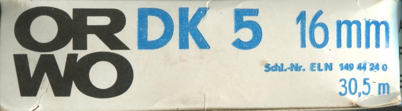
</a>


`UUID: 1c986802fc464163804128400195738e`↓

<a href="./archive/00658_001.jpg" target="_blank">
	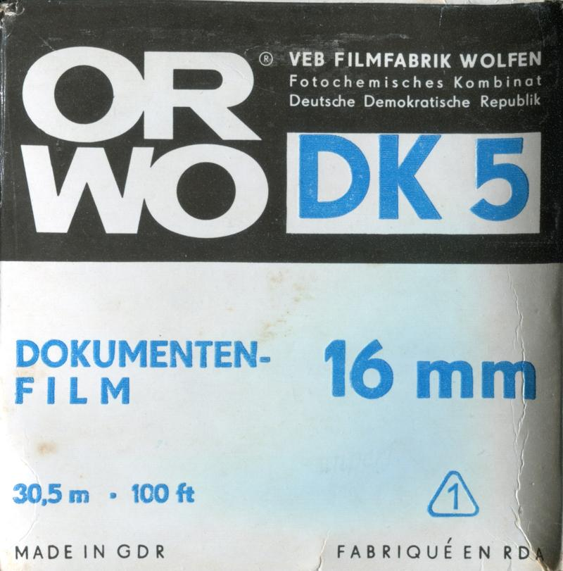
</a>


`UUID: 33ab1f5ae3984ff3b0a1593e23f4ac06`↓

<a href="./archive/00658_002.jpg" target="_blank">
	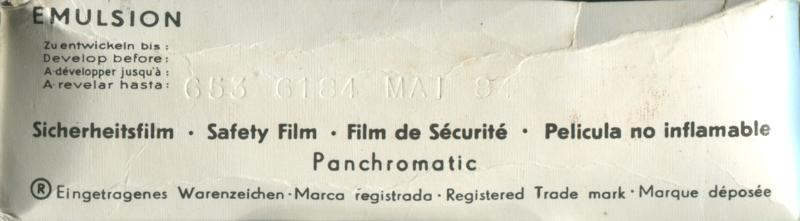
</a>


`UUID: 4cfed229ab4b4d82b3a97fadcaed5a9f`↓

<a href="./archive/00658_003.jpg" target="_blank">
	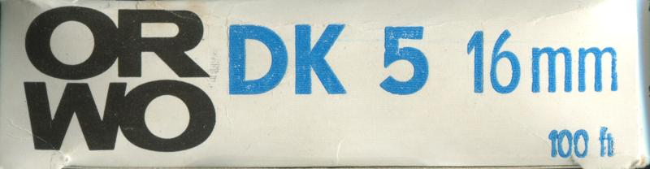
</a>


`UUID: 2015c96803d743838ac7ad1354443309`↓

<a href="./archive/00658_004.jpg" target="_blank">
	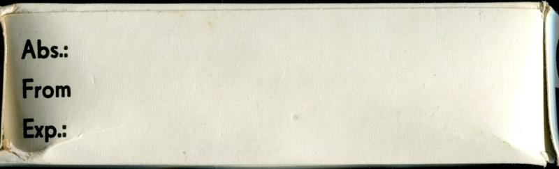
</a>


`UUID: 9790f346b50243b6b83c3e7f2773b441`↓

<a href="./archive/00658_005.jpg" target="_blank">
	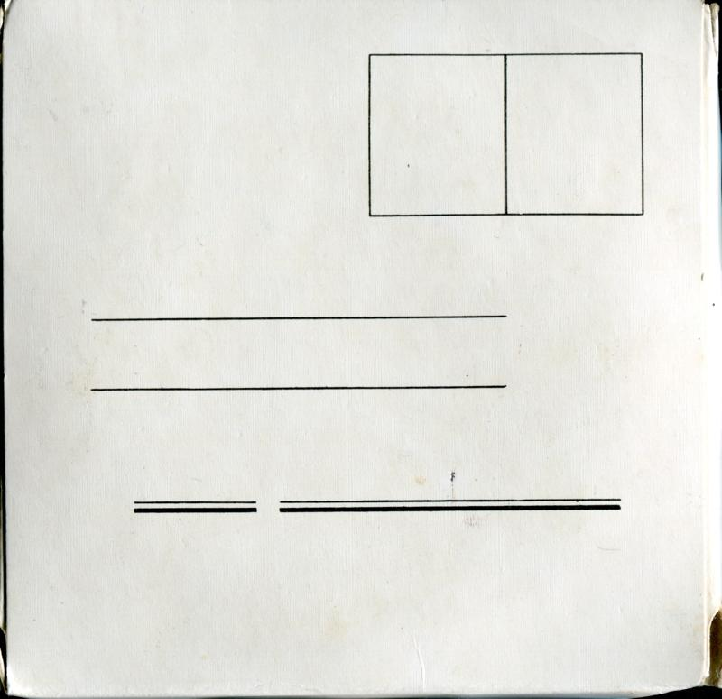
</a>

#### [BW] ORWO NP 20 SL (ref: b16c)

```
Format: 35mm         |  Process : BW      
ISO   : 80           |  Expiry  : 1992-12 
Type  : Single Pack  |  Quantity: 12exp   
Added : 2025-08-05   |  Author  : The Compartmentalist
UUID  : 9791c2074fdd4340a1463312ed77b16c
```

<a href="./archive/00163_000.jpg" target="_blank">
	
</a>

#### [BW] ORWO NP 22 (ref: 6b7f)

```
Format: 120          |  Process : BW      
ISO   : 125          |  Expiry  : 1990-08 
Type  : Single Pack  |  Quantity: N/A     
Added : 2026-03-02   |  Author  : Luci 101
UUID  : 3a26b6e03eec4c35accf4991a4cd6b7f
```

<a href="./archive/00534_000.jpg" target="_blank">
	
</a>


`UUID: 4558e00e75de4fe8b16b24422e65b281`↓

<a href="./archive/00534_001.jpg" target="_blank">
	
</a>


`UUID: 8aa249acb29b457fa7b9507963d568a9`↓

<a href="./archive/00534_002.jpg" target="_blank">
	
</a>


`UUID: 1370e15f3fdd45818d436bff362b934c`↓

<a href="./archive/00534_003.jpg" target="_blank">
	
</a>


`UUID: 5c792057ae00453fab2206dc24459024`↓

<a href="./archive/00534_004.jpg" target="_blank">
	
</a>


`UUID: 1e6b8d2a0fcb4803a1b4724a3c05d55e`↓

<a href="./archive/00534_005.jpg" target="_blank">
	
</a>

#### [BW] ORWO NP15 (ref: 9a20)

```
Format: 120          |  Process : BW      
ISO   : 25           |  Expiry  : 1992-08 
Type  : Single Pack  |  Quantity: N/A     
Added : 2025-10-13   |  Author  : @recycling.film
UUID  : 50956257d99f4f24a3ec712e77379a20
```

<a href="./archive/00394_000.jpg" target="_blank">
	
</a>


`UUID: 71624d5686d648ef9411cbed44ed3f49`↓

<a href="./archive/00394_001.jpg" target="_blank">
	
</a>


`UUID: 2528a0f231cf473597f3d594c67dc803`↓

<a href="./archive/00394_002.jpg" target="_blank">
	
</a>

#### [BW] ORWO NP22 (ref: 5437)

```
Format: 35mm         |  Process : BW      
ISO   : 125          |  Expiry  : 1992-06 
Type  : Single Pack  |  Quantity: 36exp   
Added : 2025-12-29   |  Author  : benikum 
UUID  : cfbdda5effec496ca0d9d91d29d65437
```

<a href="./archive/00504_000.jpg" target="_blank">
	
</a>


`UUID: e0f475a33cbc4eb985d8958d7cd7a505`↓

<a href="./archive/00504_001.jpg" target="_blank">
	
</a>


`UUID: 92ea3f721b484deba093c773a0c7ea18`↓

<a href="./archive/00504_002.jpg" target="_blank">
	
</a>

#### [BW] ORWO UK18 (ref: c92d)

```
Format: 35mm         |  Process : BW      
ISO   : 50           |  Expiry  : 1976-06 
Type  : Single Pack  |  Quantity: 36exp   
Added : 2026-03-02   |  Author  : Luci 101
UUID  : d3755977cc6f49dab6e0fc8197b3c92d
```

<a href="./archive/00535_000.jpg" target="_blank">
	
</a>


`UUID: 05670fe7dc444ef4afd5a9856620a6be`↓

<a href="./archive/00535_001.jpg" target="_blank">
	
</a>


`UUID: 0024791369a7416f81f5322942fb529f`↓

<a href="./archive/00535_002.jpg" target="_blank">
	
</a>


`UUID: 86f98dc2121d47caae546d61901425b9`↓

<a href="./archive/00535_003.jpg" target="_blank">
	
</a>


`UUID: 8c444d2a5b724d679e2cc5c6bf3c33ff`↓

<a href="./archive/00535_004.jpg" target="_blank">
	
</a>


`UUID: bf6040a757214fd5a3acc9ecefe96811`↓

<a href="./archive/00535_005.jpg" target="_blank">
	
</a>


`UUID: e466cea5b2be4f3a80367091c829202e`↓

<a href="./archive/00535_006.jpg" target="_blank">
	
</a>

#### [BW] Perfect Photo Inc. Perfect-Pan Film (ref: c214)

```
Format: 120          |  Process : BW      
ISO   : 125          |  Expiry  : 1964-10 
Type  : Single Pack  |  Quantity: N/A     
Added : 2025-10-17   |  Author  : @recycling.film
UUID  : 4eb2d274d28c41339ad3bd385476c214
```

<a href="./archive/00412_000.jpg" target="_blank">
	
</a>


`UUID: da91308a6c3a42d4b6665e82ee0ab24c`↓

<a href="./archive/00412_001.jpg" target="_blank">
	
</a>


`UUID: 8ceb71b4c7204eda9fe3eac689142058`↓

<a href="./archive/00412_002.jpg" target="_blank">
	
</a>

#### [BW] Perutz Peromnia 21 (ref: fa4a)

```
Format: 35mm         |  Process : BW      
ISO   : 100          |  Expiry  : 1961-03 
Type  : Single Pack  |  Quantity: 20exp   
Added : 2025-10-17   |  Author  : @recycling.film
UUID  : 05554da8891c470facbddfd5fe35fa4a
```

<a href="./archive/00419_000.jpg" target="_blank">
	
</a>

#### [BW] Perutz Peromnia 21 (ref: bf2a)

```
Format: 127          |  Process : BW      
ISO   : 100          |  Expiry  : 1963-09 
Type  : Single Pack  |  Quantity: N/A     
Added : 2025-10-25   |  Author  : dekuNukem
UUID  : 931cd13271f74ddf96233e783ea9bf2a
```

<a href="./archive/00451_000.jpg" target="_blank">
	
</a>

#### [BW] Perutz Perpantic Film (ref: 58b1)

```
Format: 120          |  Process : BW      
ISO   : 40           |  Expiry  : 1947-12 
Type  : Single Pack  |  Quantity: N/A     
Added : 2025-10-17   |  Author  : @recycling.film
UUID  : 795c66ef065f442ab27e4ffb9de758b1
```

<a href="./archive/00420_000.jpg" target="_blank">
	
</a>

#### [BW] Perutz Superomnia (ref: c90d)

```
Format: 9x12cm       |  Process : BW      
ISO   : 125          |  Expiry  : Unknown 
Type  : Single Pack  |  Quantity: 12 Sheets
Added : 2025-07-28   |  Author  : lilyu.xyz
UUID  : b220e7d5dbee49898fbd1d42ee67c90d
```

<a href="./archive/00096_000.jpg" target="_blank">
	
</a>

#### [BW] Phöbus-Platten Sheet Film (ref: d505)

```
Format: 12x16.5cm    |  Process : BW      
ISO   : Unknown      |  Expiry  : Unknown 
Type  : Single Pack  |  Quantity: 12 Sheets
Added : 2025-09-03   |  Author  : @ellafridalindblom
UUID  : d9b0fa92fbbb494085ce494cc407d505
```

<a href="./archive/00282_000.jpg" target="_blank">
	
</a>

#### [BW] Ricoh Golden "16" (ref: c02c)

```
Format: 16mm         |  Process : BW      
ISO   : 160          |  Expiry  : 1961-09 
Type  : Single Pack  |  Quantity: 20exp   
Added : 2025-10-12   |  Author  : dekuNukem
UUID  : c4263f60ad284b669f5db75e79d2c02c
```

<a href="./archive/00383_000.jpg" target="_blank">
	
</a>


`UUID: 0bd17a0f246c41b79322a478901003c5`↓

<a href="./archive/00383_001.jpg" target="_blank">
	
</a>


`UUID: d99990b484984277a0be54182937d422`↓

<a href="./archive/00383_002.jpg" target="_blank">
	
</a>


`UUID: 59c184351d13442dab4fb0f74ddd25ee`↓

<a href="./archive/00383_003.jpg" target="_blank">
	
</a>


`UUID: 0d69320f7ded493590d6abb0ea69f750`↓

<a href="./archive/00383_004.jpg" target="_blank">
	
</a>

#### [BW] Rollei Infrared (ref: eae2)

```
Format: 35mm         |  Process : BW      
ISO   : 200          |  Expiry  : 2027-04 
Type  : Single Pack  |  Quantity: 36exp   
Added : 2025-01-21   |  Author  : @ob.skura
UUID  : 9ef642a09d294cbfad7e040a701deae2
```

<a href="./archive/00047_000.jpg" target="_blank">
	
</a>


`UUID: 5bbaeaec47a046a683f87f266c73e71e`↓

<a href="./archive/00047_001.jpg" target="_blank">
	
</a>

#### [BW] Rollei Infrared (ref: 4f54)

```
Format: 120          |  Process : BW      
ISO   : 200          |  Expiry  : 2027-08 
Type  : Single Pack  |  Quantity: N/A     
Added : 2025-01-05   |  Author  : dekuNukem
UUID  : b7bb7d65979543d0a8e5c9179d734f54
```

<a href="./archive/00030_000.jpg" target="_blank">
	
</a>


`UUID: a950a24ab9da4b23b33e0b4b9d28d5d5`↓

<a href="./archive/00030_001.jpg" target="_blank">
	
</a>

#### [BW] Rollei RPX 100 (ref: 7cd1)

```
Format: 35mm         |  Process : BW      
ISO   : 100          |  Expiry  : 2021-11 
Type  : Single Pack  |  Quantity: 36exp   
Added : 2025-08-21   |  Author  : Pelicram
UUID  : 201ce1e1831a483ab7fd569cc50e7cd1
```

<a href="./archive/00258_000.jpg" target="_blank">
	
</a>


`UUID: f8b9f798c2d34459955fd96c84c414b3`↓

<a href="./archive/00258_001.jpg" target="_blank">
	
</a>

#### [BW] Rollei RPX 25 (ref: b14c)

```
Format: 35mm         |  Process : BW      
ISO   : 25           |  Expiry  : 2027-07 
Type  : Single Pack  |  Quantity: 36exp   
Added : 2025-10-16   |  Author  : nick    
UUID  : 38e7af3c3ff34abeb7ae0badd310b14c
```

<a href="./archive/00400_000.jpg" target="_blank">
	
</a>


`UUID: 60733808afbf441da74f97bdd47b9733`↓

<a href="./archive/00400_001.jpg" target="_blank">
	
</a>

#### [BW] Rollei RPX 400 (ref: c097)

```
Format: 35mm         |  Process : BW      
ISO   : 400          |  Expiry  : 2022-09 
Type  : Single Pack  |  Quantity: 36exp   
Added : 2025-08-21   |  Author  : Pelicram
UUID  : 1b741df3125e4a77bd28c50ce3dcc097
```

<a href="./archive/00259_000.jpg" target="_blank">
	
</a>


`UUID: 8fbb971a033b4a848831c97822b67601`↓

<a href="./archive/00259_001.jpg" target="_blank">
	
</a>

#### [BW] Rollei RPX 400 (ref: 2155)

```
Format: 35mm         |  Process : BW      
ISO   : 400          |  Expiry  : 2028-08 
Type  : Single Pack  |  Quantity: 36exp   
Added : 2025-07-31   |  Author  : Pelicram
UUID  : 19ef81d6d03844b088250c7b54032155
```

<a href="./archive/00136_000.jpg" target="_blank">
	
</a>


`UUID: 962831862dbc4da89c8b979e5fb6584b`↓

<a href="./archive/00136_001.jpg" target="_blank">
	
</a>

#### [BW] Rollei Retro 400S (ref: f2cf)

```
Format: 120          |  Process : BW      
ISO   : 400          |  Expiry  : 2028-03 
Type  : Single Pack  |  Quantity: N/A     
Added : 2026-01-26   |  Author  : @Hol.m35
UUID  : 17064b735c704134b793c63b583ef2cf
```

<a href="./archive/00508_000.jpg" target="_blank">
	
</a>


`UUID: 6f069574b62047eeafe63d911d3d20ea`↓

<a href="./archive/00508_001.jpg" target="_blank">
	
</a>

#### [BW] Rollei Retro 400S (ref: f345)

```
Format: 35mm         |  Process : BW      
ISO   : 400          |  Expiry  : 2028-09 
Type  : Single Pack  |  Quantity: 36exp   
Added : 2026-04-13   |  Author  : @Hol.m35
UUID  : 1a8dc35eb6684e78b2a15dbbe362f345
```

<a href="./archive/00559_000.jpg" target="_blank">
	
</a>


`UUID: a7b5c23d62b248df98ed3a4a4979afaf`↓

<a href="./archive/00559_001.jpg" target="_blank">
	
</a>

#### [BW] Rollei Retro 80S (ref: e23d)

```
Format: 35mm         |  Process : BW      
ISO   : 80           |  Expiry  : 2025-09 
Type  : Single Pack  |  Quantity: 36exp   
Added : 2025-08-08   |  Author  : Pelicram
UUID  : 406a06d6d4df49cfa27378242ef6e23d
```

<a href="./archive/00169_000.jpg" target="_blank">
	
</a>


`UUID: 1dea328c77d74bf19135dc04194df311`↓

<a href="./archive/00169_001.jpg" target="_blank">
	
</a>

#### [BW] Rollei Retro 80S (ref: e6c0)

```
Format: 120          |  Process : BW      
ISO   : 80           |  Expiry  : 2026-02 
Type  : Single Pack  |  Quantity: N/A     
Added : 2025-01-04   |  Author  : dekuNukem
UUID  : fb2ccfebcf2f4a17afe00acaaea5e6c0
```

<a href="./archive/00005_000.jpg" target="_blank">
	
</a>


`UUID: a57794309f6b44d784d9555b416a200c`↓

<a href="./archive/00005_001.jpg" target="_blank">
	
</a>

#### [BW] Rollei SUPERPAN 200 (ref: ee8f)

```
Format: 35mm         |  Process : BW      
ISO   : 200          |  Expiry  : 2028-01 
Type  : Single Pack  |  Quantity: 36exp   
Added : 2025-06-05   |  Author  : benikum 
UUID  : f22d3e1e2f70453f87aea4b67db3ee8f
```

<a href="./archive/00071_000.jpg" target="_blank">
	
</a>


`UUID: 7c96a37e3f0f4550876f507554b2a6dd`↓

<a href="./archive/00071_001.jpg" target="_blank">
	
</a>

#### [BW] Shanghai GP3 (ref: 52aa)

```
Format: 127          |  Process : BW      
ISO   : 100          |  Expiry  : 2024-07 
Type  : Single Pack  |  Quantity: N/A     
Added : 2025-01-21   |  Author  : @ob.skura
UUID  : 0e16f7ae50164c658acd22b8d62e52aa
```

<a href="./archive/00050_000.jpg" target="_blank">
	
</a>

#### [BW] Sharan Black-and-white Negative Film (ref: a884)

```
Format: 8x11mm       |  Process : BW      
ISO   : 100          |  Expiry  : Unknown 
Type  : Single Pack  |  Quantity: 30exp   
Added : 2025-10-14   |  Author  : dekuNukem
UUID  : f51e641835b543e592ea57ddb0c2a884
Notes : ACMEL embossed on box
```

<a href="./archive/00398_000.jpg" target="_blank">
	
</a>


`UUID: 863a7bdf1a704c8581b85715cfeaf4b6`↓

<a href="./archive/00398_001.jpg" target="_blank">
	
</a>


`UUID: 181802a92d784d7bb55da9b320456623`↓

<a href="./archive/00398_002.jpg" target="_blank">
	
</a>


`UUID: aff927d754b94e4a8e02b5db988feb9c`↓

<a href="./archive/00398_003.jpg" target="_blank">
	
</a>

#### [BW] Street Candy Film ATM400 (ref: 4380)

```
Format: 35mm         |  Process : BW      
ISO   : 400          |  Expiry  : Unknown 
Type  : Single Pack  |  Quantity: 36exp   
Added : 2025-11-20   |  Author  : @Hol.m35
UUID  : 1b198dd0d976444ab98109d0c37c4380
```

<a href="./archive/00480_000.jpg" target="_blank">
	
</a>

#### [BW] Svema FN 64 (ref: 600a)

```
Format: 35mm         |  Process : BW      
ISO   : 64           |  Expiry  : 1997-12 
Type  : Refill       |  Quantity: 36exp   
Added : 2025-11-25   |  Author  : waldoboro
UUID  : dd90580d0b034a42ab153ef89c82600a
```

<a href="./archive/00492_000.jpg" target="_blank">
	
</a>

#### [BW] Svema Foto 200 (ref: 6991)

```
Format: 35mm         |  Process : BW      
ISO   : 200          |  Expiry  : 2026-04 
Type  : Single Pack  |  Quantity: 36exp   
Added : 2025-09-07   |  Author  : @zruk_ts
UUID  : 031527052b0d4c4daf74708dde626991
```

<a href="./archive/00316_000.jpg" target="_blank">
	
</a>

#### [BW] Svema Foto 32 (ref: 8b44)

```
Format: 120          |  Process : BW      
ISO   : 32           |  Expiry  : 1992-06 
Type  : Single Pack  |  Quantity: N/A     
Added : 2025-10-13   |  Author  : @recycling.film
UUID  : 9205929c91ba4c3bbbfacb1b2e678b44
```

<a href="./archive/00393_000.jpg" target="_blank">
	
</a>

#### [BW] Svema Foto 32 (ref: d1fd)

```
Format: 35mm         |  Process : BW      
ISO   : 32           |  Expiry  : 1993-07 
Type  : Refill       |  Quantity: 36exp   
Added : 2025-10-17   |  Author  : @recycling.film
UUID  : 64289ff9fd4b4e589c5654a044dbd1fd
```

<a href="./archive/00405_000.jpg" target="_blank">
	
</a>

#### [BW] Svema Foto 400 (ref: 26ad)

```
Format: 35mm         |  Process : BW      
ISO   : 400          |  Expiry  : 2026-04 
Type  : Single Pack  |  Quantity: 36exp   
Added : 2025-07-31   |  Author  : Pelicram
UUID  : 6e9f27ffcfea4f298be7d33d7f3826ad
```

<a href="./archive/00130_000.jpg" target="_blank">
	
</a>

#### [BW] Svema Foto 64 (ref: 18f8)

```
Format: 16mm         |  Process : BW      
ISO   : 64           |  Expiry  : 1992-04 
Type  : Refill       |  Quantity: 20exp   
Added : 2025-10-12   |  Author  : dekuNukem
UUID  : 0c1f9c9669e6421a9d9ef9ac14b918f8
```

<a href="./archive/00387_000.jpg" target="_blank">
	
</a>

#### [BW] Svema Foto 64 (ref: 481f)

```
Format: 35mm         |  Process : BW      
ISO   : 64           |  Expiry  : 1993-03 
Type  : Single Pack  |  Quantity: 36exp   
Added : 2026-04-13   |  Author  : Luci 101
UUID  : dafc01117d5744b9a1591e4ad9ed481f
```

<a href="./archive/00545_000.jpg" target="_blank">
	
</a>


`UUID: 87f4697850314f529e3ebb3c0d41ce8b`↓

<a href="./archive/00545_001.jpg" target="_blank">
	
</a>


`UUID: a88be5144d414706a3b1faffb5489e51`↓

<a href="./archive/00545_002.jpg" target="_blank">
	
</a>


`UUID: c3a7565139c64afab94d5a16bf801bcf`↓

<a href="./archive/00545_003.jpg" target="_blank">
	
</a>


`UUID: e7373c8293d34a5dadc57a48f16748e9`↓

<a href="./archive/00545_004.jpg" target="_blank">
	
</a>

#### [BW] Svema Foto 64 (ref: 10cb)

```
Format: 35mm         |  Process : BW      
ISO   : 64           |  Expiry  : Unknown 
Type  : Single Pack  |  Quantity: 36exp   
Added : 2025-10-17   |  Author  : @recycling.film
UUID  : e783964d8b4f48e8bd12d7d2c3c510cb
```

<a href="./archive/00403_000.jpg" target="_blank">
	
</a>

#### [BW] Tasma OCh 50 (ref: 5c43)

```
Format: 35mm         |  Process : BW      
ISO   : 50           |  Expiry  : 1991-05 
Type  : Single Pack  |  Quantity: 36exp   
Added : 2025-07-29   |  Author  : Henry Gunn
UUID  : 58211887217046be9d2dfcce8d0c5c43
```

<a href="./archive/00108_000.jpg" target="_blank">
	
</a>

#### [BW] VEB Fotochemische Werke Berlin Dekopan Feinkorn (ref: dba0)

```
Format: 35mm         |  Process : BW      
ISO   : 32           |  Expiry  : 1961-08 
Type  : Single Pack  |  Quantity: 36exp   
Added : 2025-10-05   |  Author  : benikum 
UUID  : a26198b637074f36b099870688e7dba0
```

<a href="./archive/00368_000.jpg" target="_blank">
	
</a>

#### [BW] VEB Fotochemische Werke Berlin Dekopan Super S (ref: 1620)

```
Format: 35mm         |  Process : BW      
ISO   : 80           |  Expiry  : 1961-08 
Type  : Single Pack  |  Quantity: 36exp   
Added : 2025-10-05   |  Author  : benikum 
UUID  : da22aec5f8564cd8b34023047f511620
```

<a href="./archive/00369_000.jpg" target="_blank">
	
</a>


`UUID: 4220a86f04794b568159c0b119859985`↓

<a href="./archive/00369_001.jpg" target="_blank">
	
</a>

#### [BW] Walgreen All Purpose Film (ref: 541b)

```
Format: 620          |  Process : BW      
ISO   : 80           |  Expiry  : 1967-01 
Type  : Single Pack  |  Quantity: N/A     
Added : 2025-10-12   |  Author  : dekuNukem
UUID  : ed28012d8a77465898bf1bf978db541b
```

<a href="./archive/00388_000.jpg" target="_blank">
	
</a>


`UUID: 8bbe0c722eb84948bcdd35b683dca54a`↓

<a href="./archive/00388_001.jpg" target="_blank">
	
</a>


`UUID: b41e3644f2f6434c807ce95df8c37561`↓

<a href="./archive/00388_002.jpg" target="_blank">
	
</a>


`UUID: 5162cf96587443cead98bdbef85a229c`↓

<a href="./archive/00388_003.jpg" target="_blank">
	
</a>

#### [BW] Wolfen NP100 (ref: 71a6)

```
Format: 35mm         |  Process : BW      
ISO   : 100          |  Expiry  : 2027-12 
Type  : Single Pack  |  Quantity: 36exp   
Added : 2025-07-31   |  Author  : Pelicram
UUID  : 898148fa3a754866a407bbecec4a71a6
```

<a href="./archive/00131_000.jpg" target="_blank">
	
</a>

#### [BW] efke KB-25 (ref: 4d17)

```
Format: 35mm         |  Process : BW      
ISO   : 25           |  Expiry  : 2009-03 
Type  : Single Pack  |  Quantity: 36exp   
Added : 2026-03-02   |  Author  : Tobias  
UUID  : b41fb584f713486eb5a5da2fe16e4d17
```

<a href="./archive/00528_000.jpg" target="_blank">
	
</a>


`UUID: 98d3ecfcdc824e7bbaef2d5a1f52bd05`↓

<a href="./archive/00528_001.jpg" target="_blank">
	
</a>

#### [BW] efke R100 (ref: 10ad)

```
Format: 127          |  Process : BW      
ISO   : 100          |  Expiry  : 1996-01 
Type  : Single Pack  |  Quantity: N/A     
Added : 2025-10-21   |  Author  : dekuNukem
UUID  : 686490575de4412b9309d5d797af10ad
```

<a href="./archive/00426_000.jpg" target="_blank">
	
</a>


`UUID: 17e8ec86380144999ee0f93c6799030d`↓

<a href="./archive/00426_001.jpg" target="_blank">
	
</a>


`UUID: 77788e6b682e47e089804190aecc56b7`↓

<a href="./archive/00426_002.jpg" target="_blank">
	
</a>

#### [BW] efke R100 (ref: 100d)

```
Format: 127          |  Process : BW      
ISO   : 100          |  Expiry  : 1998-09 
Type  : Single Pack  |  Quantity: N/A     
Added : 2025-10-21   |  Author  : dekuNukem
UUID  : fc90db41b94d486491177a8407f1100d
```

<a href="./archive/00435_000.jpg" target="_blank">
	
</a>


`UUID: 877813b4c98d406b8739c4310f0116a8`↓

<a href="./archive/00435_001.jpg" target="_blank">
	
</a>


`UUID: fb3873078df9491491a4ff63374d80d2`↓

<a href="./archive/00435_002.jpg" target="_blank">
	
</a>

#### [C-22] Kodak Kodacolor (ref: 5d25)

```
Format: 35mm         |  Process : C-22    
ISO   : 32           |  Expiry  : 1959-10 
Type  : Single Pack  |  Quantity: 20exp   
Added : 2025-10-12   |  Author  : dekuNukem
UUID  : 1c8fa96c92974edaa7cbf69b3e535d25
```

<a href="./archive/00390_000.jpg" target="_blank">
	
</a>


`UUID: ce169d8c6e8c49b883bf3c1149128398`↓

<a href="./archive/00390_001.jpg" target="_blank">
	
</a>


`UUID: bf8091dc91444595bf58e0b11e2c051c`↓

<a href="./archive/00390_002.jpg" target="_blank">
	
</a>


`UUID: c84743c44edd485eb047e566a249609f`↓

<a href="./archive/00390_003.jpg" target="_blank">
	
</a>


`UUID: 8e3103da87194d3abc7e557078ad9130`↓

<a href="./archive/00390_004.jpg" target="_blank">
	
</a>

#### [C-22] Kodak Kodacolor II (ref: 4108)

```
Format: 120          |  Process : C-22    
ISO   : 80           |  Expiry  : 1978-03 
Type  : Single Pack  |  Quantity: N/A     
Added : 2025-09-13   |  Author  : dekuNukem
UUID  : 3bfb81116e54468fb296098a03ad4108
```

<a href="./archive/00325_000.jpg" target="_blank">
	
</a>


`UUID: cdd3df87cea649c7b8015b295520bd54`↓

<a href="./archive/00325_001.jpg" target="_blank">
	
</a>


`UUID: 5bb72bffd3224a279eb4b01c201a80f2`↓

<a href="./archive/00325_002.jpg" target="_blank">
	
</a>

#### [C-22] Kodak Kodacolor-X (ref: a4b1)

```
Format: 120          |  Process : C-22    
ISO   : 80           |  Expiry  : 1974-01 
Type  : Single Pack  |  Quantity: N/A     
Added : 2025-05-24   |  Author  : dekuNukem
UUID  : 01bfcffd1db54d6eadefbc1442f7a4b1
```

<a href="./archive/00064_000.jpg" target="_blank">
	
</a>


`UUID: 20e8ec19e41a4c1e99eac4cd7ce097fa`↓

<a href="./archive/00064_001.jpg" target="_blank">
	
</a>


`UUID: fc168256a6044253a1cf1c8362cf5c50`↓

<a href="./archive/00064_002.jpg" target="_blank">
	
</a>

#### [C-22] Kodak Kodacolor-X (ref: 0ce5)

```
Format: 126          |  Process : C-22    
ISO   : 80           |  Expiry  : 1974-09 
Type  : Single Pack  |  Quantity: 12exp   
Added : 2025-09-01   |  Author  : dekuNukem
UUID  : 818038affb2c4137a33e5de403510ce5
```

<a href="./archive/00280_000.jpg" target="_blank">
	
</a>

#### [C-22] Kodak Kodacolor-X (ref: 5302)

```
Format: 126          |  Process : C-22    
ISO   : 80           |  Expiry  : 1975-05 
Type  : Single Pack  |  Quantity: 20exp   
Added : 2025-01-04   |  Author  : dekuNukem
UUID  : 5a3d2ba8ff7649c9b3450d7069445302
```

<a href="./archive/00024_000.jpg" target="_blank">
	
</a>

#### [C-22] Porst Color N21 (ref: 494a)

```
Format: 35mm         |  Process : C-22    
ISO   : 100          |  Expiry  : 1974-01 
Type  : Single Pack  |  Quantity: 20exp   
Added : 2025-01-14   |  Author  : @ob.skura
UUID  : e08418889f714c9dbda0858718e0494a
```

<a href="./archive/00046_000.jpg" target="_blank">
	
</a>


`UUID: e9bc17db34fa4b779e283c96c92b2359`↓

<a href="./archive/00046_001.jpg" target="_blank">
	
</a>

#### [C-41] 1Shot Color Print Film (ref: 8cf0)

```
Format: 35mm         |  Process : C-41    
ISO   : 400          |  Expiry  : 2025-08 
Type  : Single Pack  |  Quantity: 24exp   
Added : 2026-04-13   |  Author  : Dialupdude
UUID  : 7e2a1df614294a7680f4b9478c578cf0
```

<a href="./archive/00561_000.jpg" target="_blank">
	
</a>

#### [C-41] A Girl Has Film Tetris 200 (ref: b309)

```
Format: 35mm         |  Process : C-41    
ISO   : 200          |  Expiry  : Unknown 
Type  : Single Pack  |  Quantity: Unknown 
Added : 2026-05-26   |  Author  : @Hol.m35
UUID  : 987a22c2477b44d2ab1b4c434b2db309
```

<a href="./archive/00578_000.jpg" target="_blank">
	
</a>

#### [C-41] Agfa AgfaColor HDC Plus (ref: 016b)

```
Format: 35mm         |  Process : C-41    
ISO   : 200          |  Expiry  : 2000-11 
Type  : Single Pack  |  Quantity: 36exp   
Added : 2025-11-11   |  Author  : Chrisbes
UUID  : 2dab58330f43463e9441b6777fce016b
```

<a href="./archive/00464_000.jpg" target="_blank">
	
</a>

#### [C-41] Agfa AgfaColor HDC Plus (ref: d22b)

```
Format: 110          |  Process : C-41    
ISO   : 200          |  Expiry  : 2001-07 
Type  : Single Pack  |  Quantity: 24exp   
Added : 2025-09-13   |  Author  : dekuNukem
UUID  : 9cec7faf26254e72bfb79611ea6ed22b
```

<a href="./archive/00328_000.jpg" target="_blank">
	
</a>

#### [C-41] Agfa AgfaColor Optima 200 (ref: 393d)

```
Format: 120          |  Process : C-41    
ISO   : 200          |  Expiry  : 2000-06 
Type  : Single Pack  |  Quantity: N/A     
Added : 2025-09-05   |  Author  : dekuNukem
UUID  : e8465f64b1f84f32900d92caa25e393d
```

<a href="./archive/00301_000.jpg" target="_blank">
	
</a>


`UUID: af2f0855d49849daa5b8fbde77c2ce5d`↓

<a href="./archive/00301_001.jpg" target="_blank">
	
</a>

#### [C-41] Agfa AgfaColor ULTRA 50 (ref: 4faa)

```
Format: 35mm         |  Process : C-41    
ISO   : 50           |  Expiry  : 2001-10 
Type  : Single Pack  |  Quantity: 36exp   
Added : 2025-01-04   |  Author  : dekuNukem
UUID  : d10e846ba5154f1d940ed7009a904faa
```

<a href="./archive/00010_000.jpg" target="_blank">
	
</a>


`UUID: 8594d11f816c45b6a18dd122f8e38fc0`↓

<a href="./archive/00010_001.jpg" target="_blank">
	
</a>

#### [C-41] Agfa AgfaColor Vista (ref: 2f14)

```
Format: 110          |  Process : C-41    
ISO   : 200          |  Expiry  : 2003-05 
Type  : Single Pack  |  Quantity: 24exp   
Added : 2025-09-13   |  Author  : dekuNukem
UUID  : 81e8726a7d3b45beb1f1bd6c1cbc2f14
```

<a href="./archive/00329_000.jpg" target="_blank">
	
</a>

#### [C-41] Agfa AgfaColor Vista (ref: d3af)

```
Format: 35mm         |  Process : C-41    
ISO   : 200          |  Expiry  : 2003-12 
Type  : Single Pack  |  Quantity: 24exp   
Added : 2025-01-04   |  Author  : dekuNukem
UUID  : f1e50745927f4b7cb16af36fd30dd3af
```

<a href="./archive/00014_000.jpg" target="_blank">
	
</a>


`UUID: 300a430fc19f4eeeb4892e58d3c3cd56`↓

<a href="./archive/00014_001.jpg" target="_blank">
	
</a>

#### [C-41] Agfa AgfaColor XRG 200 (ref: 689e)

```
Format: 35mm         |  Process : C-41    
ISO   : 200          |  Expiry  : 2005-03 
Type  : Single Pack  |  Quantity: 36exp   
Added : 2025-07-31   |  Author  : fine-seat
UUID  : 86136eea89d14e15b60dfcdf45b1689e
```

<a href="./archive/00152_000.jpg" target="_blank">
	
</a>


`UUID: 5598d8aac5844772a87d019a7d37e9f6`↓

<a href="./archive/00152_001.jpg" target="_blank">
	
</a>

#### [C-41] Agfa Optima II 400 (ref: fdf0)

```
Format: 120          |  Process : C-41    
ISO   : 400          |  Expiry  : 2002-02 
Type  : Single Pack  |  Quantity: N/A     
Added : 2025-09-05   |  Author  : dekuNukem
UUID  : 4ae0df57aeb24746a0a7854da202fdf0
```

<a href="./archive/00298_000.jpg" target="_blank">
	
</a>


`UUID: 14bad93245df4dbdbcdaacff90eafb1a`↓

<a href="./archive/00298_001.jpg" target="_blank">
	
</a>

#### [C-41] Agfa Vista Plus 200 (ref: f5f7)

```
Format: 35mm         |  Process : C-41    
ISO   : 200          |  Expiry  : 2018-08 
Type  : Single Pack  |  Quantity: 24exp   
Added : 2025-10-06   |  Author  : @Hol.m35
UUID  : ca7affc001374aa882b4c2edd3e8f5f7
```

<a href="./archive/00371_000.jpg" target="_blank">
	
</a>


`UUID: e3caf8b1d9ec4d0495a5908c202bca61`↓

<a href="./archive/00371_001.jpg" target="_blank">
	
</a>

#### [C-41] Agfa Vista Plus 200 (ref: f08a)

```
Format: 35mm         |  Process : C-41    
ISO   : 200          |  Expiry  : 2019-01 
Type  : Single Pack  |  Quantity: 36exp   
Added : 2025-08-20   |  Author  : @photos.by.qi
UUID  : b1c4d56515954c8d98bd0b8f9591f08a
```

<a href="./archive/00257_000.jpg" target="_blank">
	
</a>


`UUID: 0088411d14c547aa96ea5d28bf04d9ea`↓

<a href="./archive/00257_001.jpg" target="_blank">
	
</a>

#### [C-41] Agfa Vista Spider-Pack (ref: c0cc)

```
Format: 35mm         |  Process : C-41    
ISO   : 100          |  Expiry  : 2006-09 
Type  : Multi-Pack-3 |  Quantity: 36exp   
Added : 2026-06-24   |  Author  : Mauphoto
UUID  : 356cb49254644befb12eaa34c997c0cc
```

<a href="./archive/00627_000.jpg" target="_blank">
	
</a>

#### [C-41] Alfo ALFOcolor PR-G (ref: 94b9)

```
Format: 35mm         |  Process : C-41    
ISO   : 1600         |  Expiry  : 1993-08 
Type  : Single Pack  |  Quantity: 24exp   
Added : 2025-07-31   |  Author  : fine-seat
UUID  : cc723aa89e9e43ec8ac1ebd18efa94b9
```

<a href="./archive/00151_000.jpg" target="_blank">
	
</a>

#### [C-41] Alien Film Aeronega (ref: d1c5)

```
Format: 120          |  Process : C-41    
ISO   : 100          |  Expiry  : 2026-01 
Type  : Single Pack  |  Quantity: N/A     
Added : 2025-09-07   |  Author  : @zruk_ts
UUID  : 46e2cf3d6d78474ca55da2c510d0d1c5
```

<a href="./archive/00311_000.jpg" target="_blank">
	
</a>

#### [C-41] Boots Colour Print Film (ref: a30f)

```
Format: 35mm         |  Process : C-41    
ISO   : 200          |  Expiry  : 2013-02 
Type  : Single Pack  |  Quantity: 36exp   
Added : 2025-08-07   |  Author  : @Hol.m35
UUID  : bd601340027a4c9daa7e219b414fa30f
```

<a href="./archive/00166_000.jpg" target="_blank">
	
</a>

#### [C-41] Candido Colour Negative Film (ref: 6cd2)

```
Format: 35mm         |  Process : C-41    
ISO   : 800          |  Expiry  : 2026-10 
Type  : Single Pack  |  Quantity: 36exp   
Added : 2025-12-01   |  Author  : Pelicram
UUID  : 89e114393f3d49808e0a572e88406cd2
```

<a href="./archive/00493_000.jpg" target="_blank">
	
</a>

#### [C-41] CineStill 400Dynamic (ref: 88dc)

```
Format: 120          |  Process : C-41    
ISO   : 400          |  Expiry  : 2024-06 
Type  : Single Pack  |  Quantity: N/A     
Added : 2025-08-20   |  Author  : @photos.by.qi
UUID  : 9e2bc75381ca4ca68e59dbf6c3a388dc
```

<a href="./archive/00255_000.jpg" target="_blank">
	
</a>


`UUID: 42d565d0fdbc4e12bcc11d172b36f779`↓

<a href="./archive/00255_001.jpg" target="_blank">
	
</a>

#### [C-41] CineStill 400Dynamic (ref: fccd)

```
Format: 35mm         |  Process : C-41    
ISO   : 400          |  Expiry  : 2025-08 
Type  : Single Pack  |  Quantity: 36exp   
Added : 2025-09-13   |  Author  : @filmfotofella
UUID  : 587ac1b471994b54bb5f472d6975fccd
```

<a href="./archive/00330_000.jpg" target="_blank">
	
</a>


`UUID: 96209110f95e4744b78b1d31a44f73cf`↓

<a href="./archive/00330_001.jpg" target="_blank">
	
</a>

#### [C-41] CineStill 50D (ref: 3452)

```
Format: 35mm         |  Process : C-41    
ISO   : 50           |  Expiry  : 2023-05 
Type  : Single Pack  |  Quantity: 36exp   
Added : 2025-08-20   |  Author  : @photos.by.qi
UUID  : 9213a1fbffc44178878f7bd9c5d33452
```

<a href="./archive/00254_000.jpg" target="_blank">
	
</a>


`UUID: 219350408c3c45c7b9c23de73db1ed40`↓

<a href="./archive/00254_001.jpg" target="_blank">
	
</a>

#### [C-41] CineStill 800T (ref: c86a)

```
Format: 120          |  Process : C-41    
ISO   : 800          |  Expiry  : 2018-03 
Type  : Single Pack  |  Quantity: N/A     
Added : 2025-01-04   |  Author  : dekuNukem
UUID  : 53253eca96d841f5b98bfb3590fec86a
```

<a href="./archive/00006_000.jpg" target="_blank">
	
</a>


`UUID: 6576b3b48e8244469a692f2e0edcd1a6`↓

<a href="./archive/00006_001.jpg" target="_blank">
	
</a>

#### [C-41] CineStill 800T (ref: b3ff)

```
Format: 35mm         |  Process : C-41    
ISO   : 800          |  Expiry  : 2026-09 
Type  : Single Pack  |  Quantity: 36exp   
Added : 2025-07-22   |  Author  : @SirBrentsworth
UUID  : 81978ca6f6d048b3a759dffdb80fb3ff
```

<a href="./archive/00085_000.jpg" target="_blank">
	
</a>


`UUID: fbd9b946fd4d46f8a45a46112dcd16ae`↓

<a href="./archive/00085_001.jpg" target="_blank">
	
</a>

#### [C-41] CineStill 800T (ref: c96e)

```
Format: 35mm         |  Process : C-41    
ISO   : 800          |  Expiry  : 2027-04 
Type  : Single Pack  |  Quantity: 36exp   
Added : 2025-12-12   |  Author  : kaimon  
UUID  : 8b04191a9e994df4a219d5bfd9dfc96e
```

<a href="./archive/00500_000.jpg" target="_blank">
	
</a>

#### [C-41] CineStill 800T (ref: 44c4)

```
Format: 120          |  Process : C-41    
ISO   : 800          |  Expiry  : 2027-05 
Type  : Single Pack  |  Quantity: N/A     
Added : 2025-11-11   |  Author  : Chrisbes
UUID  : 5b72cfa7adb14d0f8aefaa083ee444c4
```

<a href="./archive/00478_000.jpg" target="_blank">
	
</a>


`UUID: 88c575769d28409a9796d3ecee41d014`↓

<a href="./archive/00478_001.jpg" target="_blank">
	
</a>

#### [C-41] Cinemot Lisboa 1999 (ref: 6a4f)

```
Format: 35mm         |  Process : C-41    
ISO   : 400          |  Expiry  : 2027-07 
Type  : Single Pack  |  Quantity: 36exp   
Added : 2026-06-26   |  Author  : Pelicram
UUID  : aff79fa9e25b4654826ed6443d266a4f
```

<a href="./archive/00657_000.jpg" target="_blank">
	
</a>

#### [C-41] Club Color Natural Color System (ref: 813a)

```
Format: 35mm         |  Process : C-41    
ISO   : 800          |  Expiry  : 2003-07 
Type  : Single Pack  |  Quantity: 24exp   
Added : 2025-09-28   |  Author  : lemoniter
UUID  : 88f5c251c21546fba06cd2943e55813a
```

<a href="./archive/00356_000.jpg" target="_blank">
	
</a>

#### [C-41] Efiniti UXi Super 200 (ref: 471a)

```
Format: 35mm         |  Process : C-41    
ISO   : 200          |  Expiry  : 2013-10 
Type  : Single Pack  |  Quantity: 36exp   
Added : 2025-01-04   |  Author  : dekuNukem
UUID  : cde1122dafbc47088a11d9ee12b6471a
```

<a href="./archive/00002_000.jpg" target="_blank">
	
</a>

#### [C-41] Escura EDO ukiyo-e (ref: 5faa)

```
Format: 35mm         |  Process : C-41    
ISO   : 400          |  Expiry  : 2028-06 
Type  : Single Pack  |  Quantity: 24exp   
Added : 2026-01-26   |  Author  : @shotbyliampewpew
UUID  : 758ee88b8edf42b492c8c240281d5faa
```

<a href="./archive/00511_000.jpg" target="_blank">
	
</a>

#### [C-41] Escura Showa Camera Film (ref: 826b)

```
Format: 35mm         |  Process : C-41    
ISO   : 400          |  Expiry  : 2026-08 
Type  : Single Pack  |  Quantity: 30exp   
Added : 2026-04-13   |  Author  : kaimon  
UUID  : a87bd544a56a4ee39a2fe6e2db3f826b
```

<a href="./archive/00555_000.jpg" target="_blank">
	
</a>

#### [C-41] Ferrania Solaris (ref: a929)

```
Format: 35mm         |  Process : C-41    
ISO   : 200          |  Expiry  : Unknown 
Type  : Single Pack  |  Quantity: 36exp   
Added : 2025-08-20   |  Author  : @photos.by.qi
UUID  : 37936bef9f314a45b9ed57f7091fa929
```

<a href="./archive/00214_000.jpg" target="_blank">
	
</a>

#### [C-41] Ferrania Solaris FG Plus (ref: 78b7)

```
Format: 35mm         |  Process : C-41    
ISO   : 800          |  Expiry  : Unknown 
Type  : Single Pack  |  Quantity: 36exp   
Added : 2026-03-02   |  Author  : @recycling.film
UUID  : a8aa315de3e54a68ae03d37f80d278b7
```

<a href="./archive/00514_000.jpg" target="_blank">
	
</a>

#### [C-41] Film Never Die IRO (ref: 2a22)

```
Format: 35mm         |  Process : C-41    
ISO   : 400          |  Expiry  : 2022-05 
Type  : Single Pack  |  Quantity: 27exp   
Added : 2025-08-20   |  Author  : @photos.by.qi
UUID  : 03b12b9d23dc4e059a9149ca4f682a22
```

<a href="./archive/00215_000.jpg" target="_blank">
	
</a>

#### [C-41] Film Never Die Kiro (ref: 796d)

```
Format: 35mm         |  Process : C-41    
ISO   : 400          |  Expiry  : 2022-05 
Type  : Single Pack  |  Quantity: 27exp   
Added : 2025-08-20   |  Author  : @photos.by.qi
UUID  : a6bb919bc40b4000a753bf9d3367796d
```

<a href="./archive/00216_000.jpg" target="_blank">
	
</a>

#### [C-41] Fujifilm 200 (ref: 5b41)

```
Format: 35mm         |  Process : C-41    
ISO   : 200          |  Expiry  : 2026-06 
Type  : Single Pack  |  Quantity: 36exp   
Added : 2025-06-05   |  Author  : Yrikonchik
UUID  : fe02d85cb9294ee2ba64e8543ce65b41
```

<a href="./archive/00073_000.jpg" target="_blank">
	
</a>

#### [C-41] Fujifilm 200 (ref: 6286)

```
Format: 35mm         |  Process : C-41    
ISO   : 200          |  Expiry  : 2026-10 
Type  : Multi-Pack-3 |  Quantity: 36exp   
Added : 2026-07-16   |  Author  : @gregrouxphotography
UUID  : 86c7f4981b304bd18ebeeb7c43836286
```

<a href="./archive/00665_000.jpg" target="_blank">
	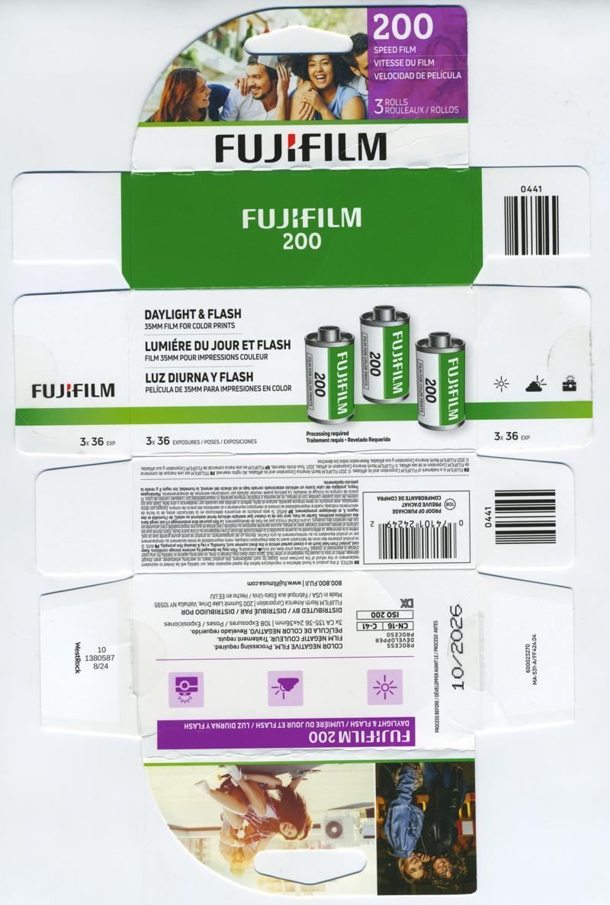
</a>

#### [C-41] Fujifilm 400 (ref: 82be)

```
Format: 35mm         |  Process : C-41    
ISO   : 400          |  Expiry  : 2025-08 
Type  : Single Pack  |  Quantity: 36exp   
Added : 2025-08-20   |  Author  : @photos.by.qi
UUID  : f3193ccd9b9d4a929904a6a2e8b682be
```

<a href="./archive/00222_000.jpg" target="_blank">
	
</a>

#### [C-41] Fujifilm 400 (ref: 1f1d)

```
Format: 35mm         |  Process : C-41    
ISO   : 400          |  Expiry  : 2026-09 
Type  : Single Pack  |  Quantity: 36exp   
Added : 2026-06-16   |  Author  : @Hol.m35
UUID  : 624c7d05c28a4bfb834ba537631e1f1d
```

<a href="./archive/00586_000.jpg" target="_blank">
	
</a>


`UUID: 1e7dab1f092343d4ba0295f2068dd5fd`↓

<a href="./archive/00586_001.jpg" target="_blank">
	
</a>

#### [C-41] Fujifilm 400 Speed Film (ref: 7f19)

```
Format: 35mm         |  Process : C-41    
ISO   : 400          |  Expiry  : 2027-08 
Type  : Single Pack  |  Quantity: 36exp   
Added : 2026-06-25   |  Author  : Dialupdude
UUID  : fbe4ce2683e744b1b2ffae6b1c767f19
```

<a href="./archive/00651_000.jpg" target="_blank">
	
</a>

#### [C-41] Fujifilm Fujichrome Sensia 100 (ref: a859)

```
Format: 35mm         |  Process : C-41    
ISO   : 100          |  Expiry  : 2004-06 
Type  : Multi-Pack-3 |  Quantity: 36exp   
Added : 2025-09-03   |  Author  : @ellafridalindblom
UUID  : ae2418a073074872aa2c46534649a859
```

<a href="./archive/00292_000.jpg" target="_blank">
	
</a>

#### [C-41] Fujifilm Fujicolor 100 (ref: 013b)

```
Format: 35mm         |  Process : C-41    
ISO   : 100          |  Expiry  : 2010-07 
Type  : Single Pack  |  Quantity: 12exp   
Added : 2025-01-12   |  Author  : b0baspace
UUID  : 27d88b35933b4ede958b5b5b5b42013b
```

<a href="./archive/00040_000.jpg" target="_blank">
	
</a>

#### [C-41] Fujifilm Fujicolor 100 (ref: b3c9)

```
Format: 35mm         |  Process : C-41    
ISO   : 100          |  Expiry  : 2025-09 
Type  : Single Pack  |  Quantity: 36exp   
Added : 2025-08-20   |  Author  : @photos.by.qi
UUID  : ac13f69474544179a4a2513e8641b3c9
```

<a href="./archive/00217_000.jpg" target="_blank">
	
</a>

#### [C-41] Fujifilm Fujicolor 100 (ref: ac71)

```
Format: 35mm         |  Process : C-41    
ISO   : 100          |  Expiry  : 2027-08 
Type  : Single Pack  |  Quantity: 36exp   
Added : 2026-03-02   |  Author  : @Hol.m35
UUID  : c04d5697e35c49049322ce823f32ac71
```

<a href="./archive/00526_000.jpg" target="_blank">
	
</a>

#### [C-41] Fujifilm Fujicolor C200 (ref: 2585)

```
Format: 35mm         |  Process : C-41    
ISO   : 200          |  Expiry  : 2016-08 
Type  : Multi-Pack-5 |  Quantity: 24exp   
Added : 2026-04-13   |  Author  : @Hol.m35
UUID  : 5f2a25eea5ed4846862cce7ae96c2585
```

<a href="./archive/00554_000.jpg" target="_blank">
	
</a>

#### [C-41] Fujifilm Fujicolor C200 (ref: 2ff8)

```
Format: 35mm         |  Process : C-41    
ISO   : 200          |  Expiry  : 2020-03 
Type  : Single Pack  |  Quantity: 36exp   
Added : 2025-08-18   |  Author  : @recycling.film
UUID  : 271054727291471392db72d5556f2ff8
```

<a href="./archive/00202_000.jpg" target="_blank">
	
</a>

#### [C-41] Fujifilm Fujicolor C200 (ref: a0de)

```
Format: 35mm         |  Process : C-41    
ISO   : 200          |  Expiry  : 2023-10 
Type  : Multi-Pack-2 |  Quantity: 36exp   
Added : 2025-08-20   |  Author  : @photos.by.qi
UUID  : b290e4b860364420924596fc3330a0de
```

<a href="./archive/00220_000.jpg" target="_blank">
	
</a>

#### [C-41] Fujifilm Fujicolor HR 1600 (ref: 1d39)

```
Format: 35mm         |  Process : C-41    
ISO   : 1600         |  Expiry  : 1987-08 
Type  : Single Pack  |  Quantity: 12exp   
Added : 2025-09-18   |  Author  : dekuNukem
UUID  : bbcc3da99c5c4734a5a8a985b9b31d39
```

<a href="./archive/00350_000.jpg" target="_blank">
	
</a>


`UUID: 911c893c07554c488c396cebc100e6b5`↓

<a href="./archive/00350_001.jpg" target="_blank">
	
</a>


`UUID: f5abcdb901ff4bae82a7b52a8d8dda5c`↓

<a href="./archive/00350_002.jpg" target="_blank">
	
</a>

#### [C-41] Fujifilm Fujicolor HR100 (ref: 23c5)

```
Format: 120          |  Process : C-41    
ISO   : 100          |  Expiry  : 1986-02 
Type  : Single Pack  |  Quantity: N/A     
Added : 2025-09-06   |  Author  : dekuNukem
UUID  : 934f2484197d41c7a5467b92a9ea23c5
```

<a href="./archive/00308_000.jpg" target="_blank">
	
</a>


`UUID: 172bc614704c4391bd34e58f0b27b279`↓

<a href="./archive/00308_001.jpg" target="_blank">
	
</a>


`UUID: 3e4277ca388248c5a4ea7d11988bf3a6`↓

<a href="./archive/00308_002.jpg" target="_blank">
	
</a>

#### [C-41] Fujifilm Fujicolor HR100 (ref: 2335)

```
Format: 35mm         |  Process : C-41    
ISO   : 100          |  Expiry  : 1986-05 
Type  : Single Pack  |  Quantity: 24exp   
Added : 2025-11-11   |  Author  : Chrisbes
UUID  : 8ef818ff997b43d3961092bd540a2335
```

<a href="./archive/00465_000.jpg" target="_blank">
	
</a>

#### [C-41] Fujifilm Fujicolor NPL 160 (ref: d10b)

```
Format: 120          |  Process : C-41    
ISO   : 160          |  Expiry  : 1998-07 
Type  : Single Pack  |  Quantity: N/A     
Added : 2025-01-05   |  Author  : dekuNukem
UUID  : ce40cc432d9e445b987fdd72fd88d10b
```

<a href="./archive/00034_000.jpg" target="_blank">
	
</a>


`UUID: 2e3f349e094b49d8ba6e026a98eb1455`↓

<a href="./archive/00034_001.jpg" target="_blank">
	
</a>


`UUID: 10efb3e22574460db3db552e55684945`↓

<a href="./archive/00034_002.jpg" target="_blank">
	
</a>

#### [C-41] Fujifilm Fujicolor NPS 160 (ref: 5e85)

```
Format: 35mm         |  Process : C-41    
ISO   : 160          |  Expiry  : 2003-08 
Type  : Single Pack  |  Quantity: 36exp   
Added : 2025-02-04   |  Author  : b0baspace
UUID  : 576142521c2f4fe5abc387032bcc5e85
```

<a href="./archive/00053_000.jpg" target="_blank">
	
</a>


`UUID: a11cf7e8abea41a8854da816157269c4`↓

<a href="./archive/00053_001.jpg" target="_blank">
	
</a>

#### [C-41] Fujifilm Fujicolor Natura 1600 (ref: 2e06)

```
Format: 35mm         |  Process : C-41    
ISO   : 1600         |  Expiry  : 2014-11 
Type  : Multi-Pack-3 |  Quantity: 36exp   
Added : 2025-08-14   |  Author  : Camera.Riley
UUID  : 8abda51b18d84ec4939df489457d2e06
```

<a href="./archive/00177_000.jpg" target="_blank">
	
</a>


`UUID: 85bc1b0ff9694798a9f92915ab267978`↓

<a href="./archive/00177_001.jpg" target="_blank">
	
</a>


`UUID: dd126451b04a42b19a705cec886addf0`↓

<a href="./archive/00177_002.jpg" target="_blank">
	
</a>

#### [C-41] Fujifilm Fujicolor Natura 1600 (ref: 52aa)

```
Format: 35mm         |  Process : C-41    
ISO   : 1600         |  Expiry  : 2016-04 
Type  : Multi-Pack-3 |  Quantity: 36exp   
Added : 2025-11-11   |  Author  : waldoboro
UUID  : a4f7e58b2cdf448d8a2e7781c26252aa
```

<a href="./archive/00461_000.jpg" target="_blank">
	
</a>

#### [C-41] Fujifilm Fujicolor Natura 1600 (ref: c8ed)

```
Format: 35mm         |  Process : C-41    
ISO   : 1600         |  Expiry  : 2019-12 
Type  : Single Pack  |  Quantity: 36exp   
Added : 2025-12-12   |  Author  : @recycling.film
UUID  : 70948fbe01434f64bf95c813e2c8c8ed
```

<a href="./archive/00497_000.jpg" target="_blank">
	
</a>

#### [C-41] Fujifilm Fujicolor Pro 400H (ref: 48ed)

```
Format: 220          |  Process : C-41    
ISO   : 400          |  Expiry  : 2007-10 
Type  : Multi-Pack-5 |  Quantity: N/A     
Added : 2025-08-20   |  Author  : @photos.by.qi
UUID  : fae60be8fc0745c3965f24b1778e48ed
```

<a href="./archive/00247_000.jpg" target="_blank">
	
</a>


`UUID: a305e39dc3f041d1bf59e7dc2504835c`↓

<a href="./archive/00247_001.jpg" target="_blank">
	
</a>


`UUID: a10a19f268084ce881ab55f247f1035f`↓

<a href="./archive/00247_002.jpg" target="_blank">
	
</a>

#### [C-41] Fujifilm Fujicolor Pro 400H (ref: dc37)

```
Format: 35mm         |  Process : C-41    
ISO   : 400          |  Expiry  : 2009-01 
Type  : Single Pack  |  Quantity: 36exp   
Added : 2025-08-20   |  Author  : @photos.by.qi
UUID  : 9934366ea7a04b65b3c300352fa8dc37
```

<a href="./archive/00249_000.jpg" target="_blank">
	
</a>


`UUID: df9f856987284644858ab4590872c133`↓

<a href="./archive/00249_001.jpg" target="_blank">
	
</a>

#### [C-41] Fujifilm Fujicolor Pro 400H (ref: 29e0)

```
Format: 35mm         |  Process : C-41    
ISO   : 400          |  Expiry  : 2012-09 
Type  : Single Pack  |  Quantity: 36exp   
Added : 2026-06-08   |  Author  : @recycling.film
UUID  : 27bbbeae605a4e1997859f2d3e6029e0
```

<a href="./archive/00582_000.jpg" target="_blank">
	
</a>

#### [C-41] Fujifilm Fujicolor Pro 400H (ref: fb3a)

```
Format: 120          |  Process : C-41    
ISO   : 400          |  Expiry  : 2014-01 
Type  : Multi-Pack-5 |  Quantity: N/A     
Added : 2026-03-02   |  Author  : @Hol.m35
UUID  : 8acc893c8082453a8f83a17f3780fb3a
```

<a href="./archive/00518_000.jpg" target="_blank">
	
</a>

#### [C-41] Fujifilm Fujicolor Pro 400H (ref: 4be2)

```
Format: 120          |  Process : C-41    
ISO   : 400          |  Expiry  : 2015-02 
Type  : Multi-Pack-5 |  Quantity: N/A     
Added : 2026-07-13   |  Author  : Chrisbes
UUID  : 5c7c873716ad4ae3abe59d1532e34be2
```

<a href="./archive/00663_000.jpg" target="_blank">
	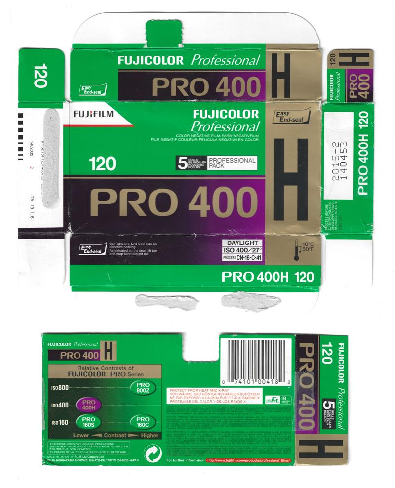
</a>

#### [C-41] Fujifilm Fujicolor Pro 400H (ref: 66e3)

```
Format: 120          |  Process : C-41    
ISO   : 400          |  Expiry  : 2018-09 
Type  : Multi-Pack-5 |  Quantity: N/A     
Added : 2025-01-04   |  Author  : dekuNukem
UUID  : 0d89ecf11f3c46deb52171aa909566e3
```

<a href="./archive/00022_000.jpg" target="_blank">
	
</a>

#### [C-41] Fujifilm Fujicolor Pro 400H (ref: ff20)

```
Format: 35mm         |  Process : C-41    
ISO   : 400          |  Expiry  : 2022-11 
Type  : Single Pack  |  Quantity: 36exp   
Added : 2025-08-20   |  Author  : @photos.by.qi
UUID  : 3167bab31b134176a6d637dc1491ff20
```

<a href="./archive/00250_000.jpg" target="_blank">
	
</a>

#### [C-41] Fujifilm Fujicolor Pro400 (ref: 1b8d)

```
Format: 120          |  Process : C-41    
ISO   : 400          |  Expiry  : 2003-06 
Type  : Single Pack  |  Quantity: N/A     
Added : 2025-08-20   |  Author  : @photos.by.qi
UUID  : 0b59ba932e214f03a5069488e9651b8d
```

<a href="./archive/00221_000.jpg" target="_blank">
	
</a>

#### [C-41] Fujifilm Fujicolor Professional (ref: 28da)

```
Format: 35mm         |  Process : C-41    
ISO   : 100          |  Expiry  : 2012-02 
Type  : Single Pack  |  Quantity: 24exp   
Added : 2025-07-31   |  Author  : The Compartmentalist
UUID  : cb85af928a7f454e9673960e22b428da
```

<a href="./archive/00117_000.jpg" target="_blank">
	
</a>

#### [C-41] Fujifilm Fujicolor Professional (ref: 02f7)

```
Format: 35mm         |  Process : C-41    
ISO   : 400          |  Expiry  : 2019-12 
Type  : Single Pack  |  Quantity: 36exp   
Added : 2025-08-20   |  Author  : @photos.by.qi
UUID  : 8f934c948478459386443596e74c02f7
```

<a href="./archive/00219_000.jpg" target="_blank">
	
</a>

#### [C-41] Fujifilm Fujicolor QuickSnap Jeans (ref: 081a)

```
Format: Disposable Camera|  Process : C-41    
ISO   : 400          |  Expiry  : 2008-08 
Type  : Single Pack  |  Quantity: 27exp   
Added : 2026-06-26   |  Author  : Pelicram
UUID  : a2fd70d8c82d42aa8db0f45ced94081a
```

<a href="./archive/00656_000.jpg" target="_blank">
	
</a>

#### [C-41] Fujifilm Fujicolor Super G (ref: 55ff)

```
Format: 120          |  Process : C-41    
ISO   : 100          |  Expiry  : 2003-05 
Type  : Single Pack  |  Quantity: N/A     
Added : 2025-08-20   |  Author  : @photos.by.qi
UUID  : 331bb2ddb04f4cd8ab637f79324e55ff
```

<a href="./archive/00218_000.jpg" target="_blank">
	
</a>

#### [C-41] Fujifilm Fujicolor Super HG (ref: 1b30)

```
Format: 35mm         |  Process : C-41    
ISO   : 100          |  Expiry  : 1990-02 
Type  : Single Pack  |  Quantity: 24exp   
Added : 2025-11-25   |  Author  : waldoboro
UUID  : 4ed0923440b44070b1da36f464f01b30
```

<a href="./archive/00488_000.jpg" target="_blank">
	
</a>


`UUID: 783e8248f4894bedbe3a0d85ce61abf1`↓

<a href="./archive/00488_001.jpg" target="_blank">
	
</a>

#### [C-41] Fujifilm Fujicolor Super HG (ref: feb7)

```
Format: 35mm         |  Process : C-41    
ISO   : 400          |  Expiry  : 1992-12 
Type  : Single Pack  |  Quantity: 24exp   
Added : 2025-10-17   |  Author  : @recycling.film
UUID  : 90ac1c8117ef41d291bedc89cc65feb7
```

<a href="./archive/00404_000.jpg" target="_blank">
	
</a>


`UUID: d40e2c7220b94e2988936a7b4137a6cf`↓

<a href="./archive/00404_001.jpg" target="_blank">
	
</a>

#### [C-41] Fujifilm Fujicolor Super HG (ref: 9942)

```
Format: 35mm         |  Process : C-41    
ISO   : 100          |  Expiry  : 1993-01 
Type  : Multi-Pack-3 |  Quantity: 24exp   
Added : 2026-01-26   |  Author  : Chrisbes
UUID  : bd59eca469724f71b8b6da2e89dd9942
```

<a href="./archive/00507_000.jpg" target="_blank">
	
</a>

#### [C-41] Fujifilm Fujicolor Super HG (ref: ee94)

```
Format: 35mm         |  Process : C-41    
ISO   : 100          |  Expiry  : 1994-07 
Type  : Single Pack  |  Quantity: 36exp   
Added : 2025-07-31   |  Author  : fine-seat
UUID  : 9233714654ff481089c2d4ff1334ee94
```

<a href="./archive/00150_000.jpg" target="_blank">
	
</a>


`UUID: 302969081f4442239212b8e123d38378`↓

<a href="./archive/00150_001.jpg" target="_blank">
	
</a>

#### [C-41] Fujifilm Fujicolor Super HR (ref: 7fd2)

```
Format: 35mm         |  Process : C-41    
ISO   : 100          |  Expiry  : 1989-11 
Type  : Single Pack  |  Quantity: 36exp   
Added : 2025-11-11   |  Author  : Chrisbes
UUID  : 9814bf1366f343ea940b7c709d107fd2
```

<a href="./archive/00466_000.jpg" target="_blank">
	
</a>

#### [C-41] Fujifilm Fujicolor Super HR (ref: aaa0)

```
Format: 35mm         |  Process : C-41    
ISO   : 200          |  Expiry  : 1990-02 
Type  : Single Pack  |  Quantity: 36exp   
Added : 2025-01-04   |  Author  : dekuNukem
UUID  : 2d27c9a865aa4de19ad8dc0bcdc8aaa0
```

<a href="./archive/00007_000.jpg" target="_blank">
	
</a>


`UUID: a179b7257aaf455fa69df546545457f6`↓

<a href="./archive/00007_001.jpg" target="_blank">
	
</a>


`UUID: e5688fcb7e8943a987ca6b882275ca7b`↓

<a href="./archive/00007_002.jpg" target="_blank">
	
</a>

#### [C-41] Fujifilm Fujicolor Superia (ref: d1b7)

```
Format: 35mm         |  Process : C-41    
ISO   : 200          |  Expiry  : 2000-07 
Type  : Multi-Pack-3 |  Quantity: 24exp   
Added : 2025-07-31   |  Author  : Pelicram
UUID  : 2b50b3d82a7340ffbe9bff871793d1b7
```

<a href="./archive/00139_000.jpg" target="_blank">
	
</a>


`UUID: a193a13c20a24dada68357552593974f`↓

<a href="./archive/00139_001.jpg" target="_blank">
	
</a>

#### [C-41] Fujifilm Fujicolor Superia (ref: 0683)

```
Format: 120          |  Process : C-41    
ISO   : 400          |  Expiry  : 2002-05 
Type  : Single Pack  |  Quantity: N/A     
Added : 2025-01-04   |  Author  : dekuNukem
UUID  : c3d9e51d22e241f69133be30d5a00683
```

<a href="./archive/00012_000.jpg" target="_blank">
	
</a>


`UUID: 5cd39510c35f4b9cbae3089311db118f`↓

<a href="./archive/00012_001.jpg" target="_blank">
	
</a>

#### [C-41] Fujifilm Fujicolor Superia (ref: 9272)

```
Format: 35mm         |  Process : C-41    
ISO   : 200          |  Expiry  : 2003-07 
Type  : Multi-Pack-2 |  Quantity: 36exp   
Added : 2025-08-20   |  Author  : @photos.by.qi
UUID  : 2acd2ce4aefb44b4a4c72b130edb9272
```

<a href="./archive/00229_000.jpg" target="_blank">
	
</a>

#### [C-41] Fujifilm Fujicolor Superia (ref: 0d8e)

```
Format: 35mm         |  Process : C-41    
ISO   : 200          |  Expiry  : 2009-06 
Type  : Single Pack  |  Quantity: 36exp   
Added : 2025-08-18   |  Author  : @recycling.film
UUID  : a57061210f17463fae293851f2130d8e
```

<a href="./archive/00199_000.jpg" target="_blank">
	
</a>

#### [C-41] Fujifilm Fujicolor Superia 100 (ref: 30bf)

```
Format: 35mm         |  Process : C-41    
ISO   : 100          |  Expiry  : 2003-03 
Type  : Single Pack  |  Quantity: 24exp   
Added : 2025-11-25   |  Author  : waldoboro
UUID  : 17d5e395c4d64dc2900c1ab54ffa30bf
Notes : Nueva!!
```

<a href="./archive/00490_000.jpg" target="_blank">
	
</a>


`UUID: 78927c2e729346c49a3d788cb89605be`↓

<a href="./archive/00490_001.jpg" target="_blank">
	
</a>

#### [C-41] Fujifilm Fujicolor Superia Multi400 (ref: 69f7)

```
Format: 35mm         |  Process : C-41    
ISO   : 400          |  Expiry  : 2002-04 
Type  : Single Pack  |  Quantity: 36exp   
Added : 2026-04-13   |  Author  : @Hol.m35
UUID  : 4b1ba64dcf86459eafd45ccd07c569f7
```

<a href="./archive/00551_000.jpg" target="_blank">
	
</a>


`UUID: 4f4492d0823945df8353a4e1bc2052ba`↓

<a href="./archive/00551_001.jpg" target="_blank">
	
</a>

#### [C-41] Fujifilm Fujicolor Superia Reala (ref: a7de)

```
Format: 35mm         |  Process : C-41    
ISO   : 100          |  Expiry  : 2007-04 
Type  : Single Pack  |  Quantity: 36exp   
Added : 2025-07-28   |  Author  : @recycling.film
UUID  : bab5fa204b25431a9872c4ce8e9aa7de
```

<a href="./archive/00087_000.jpg" target="_blank">
	
</a>

#### [C-41] Fujifilm Fujicolor Superia Reala (ref: a624)

```
Format: 35mm         |  Process : C-41    
ISO   : 100          |  Expiry  : 2010-04 
Type  : Single Pack  |  Quantity: 36exp   
Added : 2025-08-20   |  Author  : @photos.by.qi
UUID  : 47af4374c1474eb3b20cb1894b43a624
```

<a href="./archive/00230_000.jpg" target="_blank">
	
</a>

#### [C-41] Fujifilm Fujicolor Superia X-TRA (ref: 713b)

```
Format: 35mm         |  Process : C-41    
ISO   : 400          |  Expiry  : 2003-04 
Type  : Single Pack  |  Quantity: 24exp   
Added : 2025-08-18   |  Author  : @recycling.film
UUID  : 89750d8a18fe4e238c76b97b4578713b
```

<a href="./archive/00197_000.jpg" target="_blank">
	
</a>


`UUID: 560832b2cfff4e60930fd3116f1ccffc`↓

<a href="./archive/00197_001.jpg" target="_blank">
	
</a>

#### [C-41] Fujifilm Fujicolor Superia X-TRA (ref: 7980)

```
Format: 120          |  Process : C-41    
ISO   : 400          |  Expiry  : 2004-06 
Type  : Single Pack  |  Quantity: N/A     
Added : 2025-08-19   |  Author  : @ellafridalindblom
UUID  : 9e774f36e4d34b3c81a30a5b44da7980
```

<a href="./archive/00209_000.jpg" target="_blank">
	
</a>


`UUID: 434f763fea0d4c4c9dc5aeb2eb10e8aa`↓

<a href="./archive/00209_001.jpg" target="_blank">
	
</a>

#### [C-41] Fujifilm Fujicolor Superia X-TRA (ref: 0446)

```
Format: 35mm         |  Process : C-41    
ISO   : 400          |  Expiry  : 2005-02 
Type  : Multi-Pack-3 |  Quantity: 24exp   
Added : 2025-08-20   |  Author  : @photos.by.qi
UUID  : 16351828954846229e7a4ca1193d0446
```

<a href="./archive/00232_000.jpg" target="_blank">
	
</a>

#### [C-41] Fujifilm Fujicolor Superia X-TRA (ref: 8923)

```
Format: 35mm         |  Process : C-41    
ISO   : 400          |  Expiry  : 2024-08 
Type  : Multi-Pack-2 |  Quantity: 36exp   
Added : 2025-08-20   |  Author  : @photos.by.qi
UUID  : de6b17f5230e4052b6b166977a418923
```

<a href="./archive/00231_000.jpg" target="_blank">
	
</a>

#### [C-41] Fujifilm Fujicolor Superia X-TRA (ref: 6b8a)

```
Format: 35mm         |  Process : C-41    
ISO   : 400          |  Expiry  : 2026-01 
Type  : Single Pack  |  Quantity: 36exp   
Added : 2025-08-07   |  Author  : @Hol.m35
UUID  : 64b5e2e7f9a841d2a99c8f1bd8766b8a
```

<a href="./archive/00165_000.jpg" target="_blank">
	
</a>

#### [C-41] Fujifilm Fujicolor Superia X-TRA 400 (ref: da37)

```
Format: 120          |  Process : C-41    
ISO   : 400          |  Expiry  : 2006-07 
Type  : Single Pack  |  Quantity: N/A     
Added : 2025-09-07   |  Author  : @zruk_ts
UUID  : 905002d5cdc24e36b190fb04a38cda37
```

<a href="./archive/00315_000.jpg" target="_blank">
	
</a>


`UUID: 0e0ad3d8bf184fe4ba12b803f267b71e`↓

<a href="./archive/00315_001.jpg" target="_blank">
	
</a>

#### [C-41] Fujifilm Hi-Speed 1600 (ref: 8a6f)

```
Format: Disposable Camera|  Process : C-41    
ISO   : 1600         |  Expiry  : 2018-06 
Type  : Single Pack  |  Quantity: 27exp   
Added : 2026-03-02   |  Author  : @Hol.m35
UUID  : b25d00004e6f46699b06a4cf360f8a6f
```

<a href="./archive/00525_000.jpg" target="_blank">
	
</a>


`UUID: 67bd10dd07644db88eae7a01ab789970`↓

<a href="./archive/00525_001.jpg" target="_blank">
	
</a>

#### [C-41] Fujifilm Nexia A200 (ref: 43c0)

```
Format: APS          |  Process : C-41    
ISO   : 200          |  Expiry  : 2011-12 
Type  : Single Pack  |  Quantity: 25exp   
Added : 2026-06-24   |  Author  : Dialupdude
UUID  : 711fdcd259474949990498f964f443c0
```

<a href="./archive/00648_000.jpg" target="_blank">
	
</a>


`UUID: 3325f0ecfe9547a784fe0995fa87786d`↓

<a href="./archive/00648_001.jpg" target="_blank">
	
</a>

#### [C-41] Fujifilm Simple Ace (ref: 17e6)

```
Format: Disposable Camera|  Process : C-41    
ISO   : 400          |  Expiry  : 2027-03 
Type  : Single Pack  |  Quantity: 27exp   
Added : 2026-06-24   |  Author  : Dialupdude
UUID  : f2fbd963d7e0416398b986f9fe3e17e6
```

<a href="./archive/00646_000.jpg" target="_blank">
	
</a>


`UUID: 2cf26c089ea24fea95775f5be9229114`↓

<a href="./archive/00646_001.jpg" target="_blank">
	
</a>

#### [C-41] Fujifilm Superia 100 (ref: 0f0c)

```
Format: 35mm         |  Process : C-41    
ISO   : 100          |  Expiry  : 2011-12 
Type  : Single Pack  |  Quantity: 36exp   
Added : 2026-06-24   |  Author  : Mauphoto
UUID  : 29973b9ee68243218c8d30c3403a0f0c
```

<a href="./archive/00628_000.jpg" target="_blank">
	
</a>

#### [C-41] Fujifilm Superia 200 (ref: fd36)

```
Format: 35mm         |  Process : C-41    
ISO   : 200          |  Expiry  : 2008-09 
Type  : Multi-Pack-5 |  Quantity: 36exp   
Added : 2026-01-26   |  Author  : Chrisbes
UUID  : 94d1751b3c454ec590a5d79ee1f9fd36
```

<a href="./archive/00506_000.jpg" target="_blank">
	
</a>

#### [C-41] Fujifilm Superia Premium 400 (ref: ef1f)

```
Format: 35mm         |  Process : C-41    
ISO   : 400          |  Expiry  : 2027-05 
Type  : Single Pack  |  Quantity: 36exp   
Added : 2025-10-06   |  Author  : @Hol.m35
UUID  : 433055f5732e4d53b4245da4dfe0ef1f
```

<a href="./archive/00372_000.jpg" target="_blank">
	
</a>

#### [C-41] Fukkatsu Color Print Film (ref: 3213)

```
Format: 110          |  Process : C-41    
ISO   : 400          |  Expiry  : 2018-08 
Type  : Single Pack  |  Quantity: 24exp   
Added : 2025-11-11   |  Author  : waldoboro
UUID  : e5ed9275c4a34dbb8ab1a60c13ca3213
```

<a href="./archive/00460_000.jpg" target="_blank">
	
</a>

#### [C-41] GT Photo GT24 (ref: 92c2)

```
Format: 35mm         |  Process : C-41    
ISO   : 400          |  Expiry  : 2025-12 
Type  : Single Pack  |  Quantity: 24exp   
Added : 2025-11-11   |  Author  : dekuNukem
UUID  : 86ec0b0ed4b94390a23d2cb27e1792c2
```

<a href="./archive/00476_000.jpg" target="_blank">
	
</a>

#### [C-41] Hands On Film Midnight 1600 (ref: 4411)

```
Format: 35mm         |  Process : C-41    
ISO   : 1600         |  Expiry  : 2026-05 
Type  : Single Pack  |  Quantity: 36exp   
Added : 2025-08-19   |  Author  : @ellafridalindblom
UUID  : 515a9a246a8e4eed87d77142623a4411
```

<a href="./archive/00206_000.jpg" target="_blank">
	
</a>

#### [C-41] Harman Phoenix (ref: 8eb4)

```
Format: 35mm         |  Process : C-41    
ISO   : 200          |  Expiry  : 2025-12 
Type  : Single Pack  |  Quantity: 36exp   
Added : 2025-06-25   |  Author  : yc128   
UUID  : 2fe522ef01b84a9aa6263807135f8eb4
```

<a href="./archive/00076_000.jpg" target="_blank">
	
</a>


`UUID: a7a70b20b4224baeb85c732245eb31d1`↓

<a href="./archive/00076_001.jpg" target="_blank">
	
</a>

#### [C-41] Harman Phoenix (ref: 637f)

```
Format: 120          |  Process : C-41    
ISO   : 200          |  Expiry  : 2026-08 
Type  : Single Pack  |  Quantity: N/A     
Added : 2025-01-04   |  Author  : dekuNukem
UUID  : 0b11ba38c9a34f58a2f13d696b05637f
```

<a href="./archive/00004_000.jpg" target="_blank">
	
</a>


`UUID: c5a0132ac51a488ba35ebd6cc48911e7`↓

<a href="./archive/00004_001.jpg" target="_blank">
	
</a>

#### [C-41] Harman Phoenix II (ref: f686)

```
Format: 120          |  Process : C-41    
ISO   : 200          |  Expiry  : 2027-06 
Type  : Single Pack  |  Quantity: N/A     
Added : 2025-07-30   |  Author  : yc128   
UUID  : 42f9d40379814cf8b02c3f0daf74f686
```

<a href="./archive/00109_000.jpg" target="_blank">
	
</a>


`UUID: db80264f66ae451abd1b0cc6f34e3280`↓

<a href="./archive/00109_001.jpg" target="_blank">
	
</a>

#### [C-41] Harman Phoenix II (ref: 40df)

```
Format: 35mm         |  Process : C-41    
ISO   : 200          |  Expiry  : 2027-06 
Type  : Single Pack  |  Quantity: 36exp   
Added : 2025-07-30   |  Author  : yc128   
UUID  : f12ed23e31e14008a969fe05f29940df
```

<a href="./archive/00110_000.jpg" target="_blank">
	
</a>


`UUID: b6dcbe9ae6ea4aebabaf290f3160a553`↓

<a href="./archive/00110_001.jpg" target="_blank">
	
</a>

#### [C-41] Harman Phoenix II (ref: 37c7)

```
Format: 120          |  Process : C-41    
ISO   : 200          |  Expiry  : 2028-06 
Type  : Single Pack  |  Quantity: N/A     
Added : 2025-10-05   |  Author  : dekuNukem
UUID  : df238026e7c84a89961248cec20737c7
Notes : Chinese version
```

<a href="./archive/00366_000.jpg" target="_blank">
	
</a>


`UUID: fcc0cdbabdd246f7a2de58209827f9c3`↓

<a href="./archive/00366_001.jpg" target="_blank">
	
</a>

#### [C-41] Harman Phoenix II (ref: 41d4)

```
Format: 35mm         |  Process : C-41    
ISO   : 200          |  Expiry  : 2028-06 
Type  : Single Pack  |  Quantity: 36exp   
Added : 2025-10-05   |  Author  : dekuNukem
UUID  : 1989020e64ed45108cb6e45a389641d4
Notes : Chinese version
```

<a href="./archive/00367_000.jpg" target="_blank">
	
</a>


`UUID: 32693b43dc864734a3514bada3537ae3`↓

<a href="./archive/00367_001.jpg" target="_blank">
	
</a>

#### [C-41] Harman Red (ref: da3a)

```
Format: 35mm         |  Process : C-41    
ISO   : 125          |  Expiry  : 2026-07 
Type  : Single Pack  |  Quantity: 36exp   
Added : 2025-09-06   |  Author  : @toastergod101
UUID  : 3903165bcfbc43ad9a6ee42e7922da3a
```

<a href="./archive/00306_000.jpg" target="_blank">
	
</a>


`UUID: e4133b6a1709448dbe4efa97d028e25a`↓

<a href="./archive/00306_001.jpg" target="_blank">
	
</a>

#### [C-41] Harman Switch Azure (ref: df9c)

```
Format: 35mm         |  Process : C-41    
ISO   : 125          |  Expiry  : 2027-11 
Type  : Single Pack  |  Quantity: 36exp   
Added : 2026-04-13   |  Author  : @Hol.m35
UUID  : 85e5b83007814fbd8b1a0c4caaf9df9c
```

<a href="./archive/00553_000.jpg" target="_blank">
	
</a>


`UUID: f4b9bf30e757490087b895af7dfa3a8b`↓

<a href="./archive/00553_001.jpg" target="_blank">
	
</a>

#### [C-41] Harman Switch Azure (ref: 31bb)

```
Format: 120          |  Process : C-41    
ISO   : 125          |  Expiry  : 2027-12 
Type  : Single Pack  |  Quantity: N/A     
Added : 2026-04-13   |  Author  : @Hol.m35
UUID  : f81a19dc94ac47e99249911f97fe31bb
```

<a href="./archive/00552_000.jpg" target="_blank">
	
</a>


`UUID: 9f700cd952734d0c88e3c26e8525c2bd`↓

<a href="./archive/00552_001.jpg" target="_blank">
	
</a>

#### [C-41] Hope Film Bubble (ref: 41f4)

```
Format: 35mm         |  Process : C-41    
ISO   : 200          |  Expiry  : 2026-12 
Type  : Single Pack  |  Quantity: 24exp   
Added : 2025-08-06   |  Author  : @Hol.m35
UUID  : b09848420a1a4d76b099d82d76bc41f4
```

<a href="./archive/00164_000.jpg" target="_blank">
	
</a>

#### [C-41] Ificolor SHR 100 (ref: 0198)

```
Format: 126          |  Process : C-41    
ISO   : 100          |  Expiry  : 1992-05 
Type  : Single Pack  |  Quantity: 24exp   
Added : 2025-09-17   |  Author  : @ellafridalindblom
UUID  : b5dd426d99ad43e5b289be7acd9c0198
```

<a href="./archive/00342_000.jpg" target="_blank">
	
</a>

#### [C-41] Ificolor Super FG HQ 200 (ref: ff86)

```
Format: 35mm         |  Process : C-41    
ISO   : 200          |  Expiry  : 1993-03 
Type  : Single Pack  |  Quantity: 36exp   
Added : 2025-09-17   |  Author  : @ellafridalindblom
UUID  : 07d897691a00479584d29dbe8c05ff86
```

<a href="./archive/00344_000.jpg" target="_blank">
	
</a>

#### [C-41] Ilford Ilfocolor 400 Plus (ref: 3930)

```
Format: 35mm         |  Process : C-41    
ISO   : 400          |  Expiry  : 2026-04 
Type  : Single Pack  |  Quantity: 36exp   
Added : 2026-03-02   |  Author  : u/ReeeSchmidtyWerber
UUID  : 9fb74244831e4f8386240b2804a13930
Notes : Vintage Tone
```

<a href="./archive/00522_000.jpg" target="_blank">
	
</a>

#### [C-41] Ilford XP2 (ref: 7d94)

```
Format: 35mm         |  Process : C-41    
ISO   : 400          |  Expiry  : 1994-10 
Type  : Single Pack  |  Quantity: 20exp   
Added : 2025-10-17   |  Author  : @recycling.film
UUID  : bc6e58d62eb34ad6a54ea8d4ac877d94
```

<a href="./archive/00409_000.jpg" target="_blank">
	
</a>


`UUID: bdd3a188431042dabb560e85287b517a`↓

<a href="./archive/00409_001.jpg" target="_blank">
	
</a>


`UUID: 94aea5ecf4ab4e74b8e7205d7912c232`↓

<a href="./archive/00409_002.jpg" target="_blank">
	
</a>

#### [C-41] Ilford XP2 Super (ref: 484f)

```
Format: 120          |  Process : C-41    
ISO   : 400          |  Expiry  : 2026-11 
Type  : Single Pack  |  Quantity: N/A     
Added : 2025-10-12   |  Author  : kaimon  
UUID  : 08ab5616c0644099aceffb457b7e484f
```

<a href="./archive/00391_000.jpg" target="_blank">
	
</a>


`UUID: b1a79997109841788a563a01c59c6acc`↓

<a href="./archive/00391_001.jpg" target="_blank">
	
</a>

#### [C-41] Ilford XP2 Super (ref: 622a)

```
Format: 35mm         |  Process : C-41    
ISO   : 400          |  Expiry  : 2027-09 
Type  : Single Pack  |  Quantity: 36exp   
Added : 2025-08-08   |  Author  : TheSelousScout
UUID  : 5863564ab1ef43a4b41fb5312dd0622a
```

<a href="./archive/00170_000.jpg" target="_blank">
	
</a>


`UUID: 2e9c0e4f84414bb192512b4ce5b1e212`↓

<a href="./archive/00170_001.jpg" target="_blank">
	
</a>

#### [C-41] Jessops Diamond Everyday (ref: 6d5a)

```
Format: 35mm         |  Process : C-41    
ISO   : 200          |  Expiry  : 2005-12 
Type  : Single Pack  |  Quantity: 36exp   
Added : 2025-09-13   |  Author  : GreatGizmo74
UUID  : 44e526db85e94a63ac582d20a1cc6d5a
```

<a href="./archive/00335_000.jpg" target="_blank">
	
</a>


`UUID: 3e6eca45a0704e0da5c37631b1fd0b56`↓

<a href="./archive/00335_001.jpg" target="_blank">
	
</a>

#### [C-41] Jessops Diamond Everyday (ref: 67d3)

```
Format: APS          |  Process : C-41    
ISO   : 200          |  Expiry  : 2006-10 
Type  : Single Pack  |  Quantity: 40exp   
Added : 2025-01-05   |  Author  : dekuNukem
UUID  : b53e5c167866448d812a4dc8e85967d3
```

<a href="./archive/00033_000.jpg" target="_blank">
	
</a>

#### [C-41] Kirkland Signature Color Print Film (ref: 0441)

```
Format: 35mm         |  Process : C-41    
ISO   : 200          |  Expiry  : 2002-12 
Type  : Single Pack  |  Quantity: 24exp   
Added : 2025-08-15   |  Author  : @ad.astra.per.aspera.1894
UUID  : 7f4a0fbd6be7494ab097f7f816700441
```

<a href="./archive/00184_000.jpg" target="_blank">
	
</a>

#### [C-41] Klick 400ASA (ref: 8779)

```
Format: 35mm         |  Process : C-41    
ISO   : 400          |  Expiry  : 2007-02 
Type  : Single Pack  |  Quantity: 24exp   
Added : 2025-08-30   |  Author  : dekuNukem
UUID  : 42f73c1448634cdb856d014e59098779
```

<a href="./archive/00270_000.jpg" target="_blank">
	
</a>


`UUID: f65991d851c249318d64793e8e7defeb`↓

<a href="./archive/00270_001.jpg" target="_blank">
	
</a>

#### [C-41] Klick APS Film (ref: 4b88)

```
Format: APS          |  Process : C-41    
ISO   : 200          |  Expiry  : 2006-10 
Type  : Single Pack  |  Quantity: 25exp   
Added : 2025-05-24   |  Author  : dekuNukem
UUID  : 1dc3d9dbb8bb42b4acfbfbe0737a4b88
```

<a href="./archive/00063_000.jpg" target="_blank">
	
</a>


`UUID: dff53610cf16453fb97135efcc0eed86`↓

<a href="./archive/00063_001.jpg" target="_blank">
	
</a>

#### [C-41] Klick Max Extra Definition Multi Purpose Film (ref: 8ae4)

```
Format: 35mm         |  Process : C-41    
ISO   : 200          |  Expiry  : 2007-06 
Type  : Single Pack  |  Quantity: 36exp   
Added : 2025-09-28   |  Author  : dekuNukem
UUID  : b1affc3985b44a4781729ffa50908ae4
```

<a href="./archive/00351_000.jpg" target="_blank">
	
</a>

#### [C-41] Klick XD200 (ref: 44d7)

```
Format: 110          |  Process : C-41    
ISO   : 200          |  Expiry  : 1998-02 
Type  : Single Pack  |  Quantity: 24exp   
Added : 2025-05-24   |  Author  : dekuNukem
UUID  : 2276628aa2794442ae81221329fc44d7
```

<a href="./archive/00062_000.jpg" target="_blank">
	
</a>

#### [C-41] Kodak 110 Film (ref: 8cca)

```
Format: 110          |  Process : C-41    
ISO   : 400          |  Expiry  : 2007-02 
Type  : Single Pack  |  Quantity: 24exp   
Added : 2025-09-13   |  Author  : @filmfotofella
UUID  : 6c0cf01a1703494296ce60ad5dd28cca
```

<a href="./archive/00332_000.jpg" target="_blank">
	
</a>

#### [C-41] Kodak Advantix Ultra (ref: 030a)

```
Format: APS          |  Process : C-41    
ISO   : 200          |  Expiry  : 2003-07 
Type  : Single Pack  |  Quantity: 40exp   
Added : 2025-09-10   |  Author  : Aoi Yuki
UUID  : 59358e7096174d7f926ed0aab9fd030a
```

<a href="./archive/00320_000.jpg" target="_blank">
	
</a>

#### [C-41] Kodak Advantix Ultra (ref: 566b)

```
Format: APS          |  Process : C-41    
ISO   : 200          |  Expiry  : 2006-08 
Type  : Single Pack  |  Quantity: 25exp   
Added : 2025-05-24   |  Author  : dekuNukem
UUID  : 041622f239024ffb8b75c367619a566b
```

<a href="./archive/00066_000.jpg" target="_blank">
	
</a>

#### [C-41] Kodak Advantix Ultra Max (ref: 1ca2)

```
Format: APS          |  Process : C-41    
ISO   : 400          |  Expiry  : 2004-07 
Type  : Single Pack  |  Quantity: 25exp   
Added : 2025-09-13   |  Author  : dekuNukem
UUID  : 5b9792793fd94c9a9f9f776fe34e1ca2
```

<a href="./archive/00326_000.jpg" target="_blank">
	
</a>

#### [C-41] Kodak Black & White + (ref: 2ff3)

```
Format: 35mm         |  Process : C-41    
ISO   : 400          |  Expiry  : 2004-07 
Type  : Single Pack  |  Quantity: 24exp   
Added : 2025-08-16   |  Author  : Kraksen 
UUID  : 8ae6d75c042c48318fa711a412b72ff3
```

<a href="./archive/00189_000.jpg" target="_blank">
	
</a>

#### [C-41] Kodak ColorPlus (ref: 79ca)

```
Format: 35mm         |  Process : C-41    
ISO   : 200          |  Expiry  : 2025-08 
Type  : Single Pack  |  Quantity: 36exp   
Added : 2025-07-22   |  Author  : @SirBrentsworth
UUID  : 087223fc24654e3882a4596e3cea79ca
```

<a href="./archive/00084_000.jpg" target="_blank">
	
</a>

#### [C-41] Kodak ColorPlus (ref: 6637)

```
Format: 35mm         |  Process : C-41    
ISO   : 200          |  Expiry  : 2026-08 
Type  : Single Pack  |  Quantity: 36exp   
Added : 2025-07-28   |  Author  : @recycling.film
UUID  : bd00cd25958d4108a7501bf4be9d6637
```

<a href="./archive/00091_000.jpg" target="_blank">
	
</a>

#### [C-41] Kodak Ektacolor Pro Gold (ref: c3f8)

```
Format: 220          |  Process : C-41    
ISO   : 160          |  Expiry  : 2000-07 
Type  : Multi-Pack-5 |  Quantity: N/A     
Added : 2025-01-04   |  Author  : dekuNukem
UUID  : 7456456d09c844c8ab046abd9c17c3f8
```

<a href="./archive/00027_000.jpg" target="_blank">
	
</a>


`UUID: e9e4b4c649dc4b62aecc7bc004a1a6ff`↓

<a href="./archive/00027_001.jpg" target="_blank">
	
</a>


`UUID: c13296cf46f04c1dba4ef93110f3ca71`↓

<a href="./archive/00027_002.jpg" target="_blank">
	
</a>


`UUID: 53e024b9a272410888a6d44549f7ceb0`↓

<a href="./archive/00027_003.jpg" target="_blank">
	
</a>

#### [C-41] Kodak Ektar 100 (ref: 4631)

```
Format: 120          |  Process : C-41    
ISO   : 100          |  Expiry  : 2022-04 
Type  : Multi-Pack-5 |  Quantity: N/A     
Added : 2025-08-20   |  Author  : @photos.by.qi
UUID  : 22bb063ec2ca4f2ea5b9f4be4dce4631
```

<a href="./archive/00251_000.jpg" target="_blank">
	
</a>


`UUID: 5ee59977ab8f4902b82e22de1767d131`↓

<a href="./archive/00251_001.jpg" target="_blank">
	
</a>

#### [C-41] Kodak Ektar 100 (ref: 95ec)

```
Format: 35mm         |  Process : C-41    
ISO   : 100          |  Expiry  : 2024-01 
Type  : Single Pack  |  Quantity: 36exp   
Added : 2025-08-20   |  Author  : @photos.by.qi
UUID  : eef92f5fa5b244518890b1ba52b895ec
```

<a href="./archive/00224_000.jpg" target="_blank">
	
</a>

#### [C-41] Kodak Ektar 100 (ref: 3498)

```
Format: 35mm         |  Process : C-41    
ISO   : 100          |  Expiry  : 2026-09 
Type  : Single Pack  |  Quantity: 36exp   
Added : 2025-07-22   |  Author  : @SirBrentsworth
UUID  : 8552091a80a844a5aec3e9b8185e3498
```

<a href="./archive/00081_000.jpg" target="_blank">
	
</a>

#### [C-41] Kodak FarbWelt 400 (ref: e9b6)

```
Format: 35mm         |  Process : C-41    
ISO   : 400          |  Expiry  : 2009-09 
Type  : Multi-Pack-2 |  Quantity: 36exp   
Added : 2025-09-04   |  Author  : dekuNukem
UUID  : dc04ec32aeda4b9ba394437272fde9b6
```

<a href="./archive/00297_000.jpg" target="_blank">
	
</a>

#### [C-41] Kodak Gold (ref: 1962)

```
Format: 620          |  Process : C-41    
ISO   : 200          |  Expiry  : 1996-08 
Type  : Single Pack  |  Quantity: Unknown 
Added : 2025-10-21   |  Author  : dekuNukem
UUID  : 92c51161259045d5b726e32fa4ee1962
```

<a href="./archive/00442_000.jpg" target="_blank">
	
</a>


`UUID: 51e0c8950d164f8a985b46fe1b0e5f8b`↓

<a href="./archive/00442_001.jpg" target="_blank">
	
</a>

#### [C-41] Kodak Gold (ref: 2f8d)

```
Format: 35mm         |  Process : C-41    
ISO   : 100          |  Expiry  : 1999-05 
Type  : Single Pack  |  Quantity: 36exp   
Added : 2025-07-31   |  Author  : fine-seat
UUID  : c56f944bf87d40dcac75cf41aeb82f8d
```

<a href="./archive/00149_000.jpg" target="_blank">
	
</a>

#### [C-41] Kodak Gold (ref: ea58)

```
Format: 35mm         |  Process : C-41    
ISO   : 100          |  Expiry  : 2001-10 
Type  : Multi-Pack-3 |  Quantity: 36exp   
Added : 2025-07-28   |  Author  : lilyu.xyz
UUID  : e45118f7bd5e4ae682e5747a81f0ea58
```

<a href="./archive/00095_000.jpg" target="_blank">
	
</a>


`UUID: 86ebec2c1a1d41359d84654d24dbac69`↓

<a href="./archive/00095_001.jpg" target="_blank">
	
</a>

#### [C-41] Kodak Gold (ref: bdd5)

```
Format: 110          |  Process : C-41    
ISO   : 400          |  Expiry  : 2002-01 
Type  : Single Pack  |  Quantity: 12exp   
Added : 2025-10-21   |  Author  : dekuNukem
UUID  : f4719f9b5e534dbba19c194da39abdd5
```

<a href="./archive/00431_000.jpg" target="_blank">
	
</a>

#### [C-41] Kodak Gold (ref: d48d)

```
Format: 35mm         |  Process : C-41    
ISO   : 200          |  Expiry  : 2023-06 
Type  : Single Pack  |  Quantity: 36exp   
Added : 2025-08-20   |  Author  : @photos.by.qi
UUID  : e0db5edb5d3046e99d019b901088d48d
```

<a href="./archive/00233_000.jpg" target="_blank">
	
</a>

#### [C-41] Kodak Gold (ref: 6587)

```
Format: 35mm         |  Process : C-41    
ISO   : 200          |  Expiry  : 2024-09 
Type  : Single Pack  |  Quantity: 36exp   
Added : 2025-08-20   |  Author  : @photos.by.qi
UUID  : 99836199940848569bab40a438546587
```

<a href="./archive/00252_000.jpg" target="_blank">
	
</a>


`UUID: b9bddee9f550460c837c5489aff72400`↓

<a href="./archive/00252_001.jpg" target="_blank">
	
</a>

#### [C-41] Kodak Gold (ref: 3e7f)

```
Format: 35mm         |  Process : C-41    
ISO   : 200          |  Expiry  : 2026-06 
Type  : Single Pack  |  Quantity: 36exp   
Added : 2025-07-22   |  Author  : @SirBrentsworth
UUID  : d2e434e91001465dbea2d815d5e23e7f
```

<a href="./archive/00080_000.jpg" target="_blank">
	
</a>

#### [C-41] Kodak Gold (ref: 855e)

```
Format: 35mm         |  Process : C-41    
ISO   : 200          |  Expiry  : 2027-04 
Type  : Multi-Pack-3 |  Quantity: 36exp   
Added : 2025-07-22   |  Author  : @SirBrentsworth
UUID  : 856af2ca15fd4a0bad0df6eb29a2855e
```

<a href="./archive/00086_000.jpg" target="_blank">
	
</a>

#### [C-41] Kodak Gold 200 (ref: 442d)

```
Format: 35mm         |  Process : C-41    
ISO   : 200          |  Expiry  : 2002-12 
Type  : Single Pack  |  Quantity: 36exp   
Added : 2026-04-13   |  Author  : @Hol.m35
UUID  : e8e8fbafc8a64a19ad483dc1d7e3442d
```

<a href="./archive/00546_000.jpg" target="_blank">
	
</a>


`UUID: 5a268c9c5d684ad18cdc7650cf1c692d`↓

<a href="./archive/00546_001.jpg" target="_blank">
	
</a>

#### [C-41] Kodak Gold 200 (ref: 795c)

```
Format: 35mm         |  Process : C-41    
ISO   : 200          |  Expiry  : 2026-07 
Type  : Single Pack  |  Quantity: 24exp   
Added : 2026-06-24   |  Author  : Dialupdude
UUID  : 31931d00c51447a8a625da94ce34795c
```

<a href="./archive/00649_000.jpg" target="_blank">
	
</a>

#### [C-41] Kodak Gold 200 (ref: 933f)

```
Format: 120          |  Process : C-41    
ISO   : 200          |  Expiry  : 2026-11 
Type  : Multi-Pack-5 |  Quantity: N/A     
Added : 2025-01-04   |  Author  : dekuNukem
UUID  : e8aefc10fa0d43cebbac73bdcf10933f
```

<a href="./archive/00021_000.jpg" target="_blank">
	
</a>

#### [C-41] Kodak Gold 200 (ref: 7d4b)

```
Format: 35mm         |  Process : C-41    
ISO   : 200          |  Expiry  : 2028-02 
Type  : Single Pack  |  Quantity: 36exp   
Added : 2025-11-25   |  Author  : waldoboro
UUID  : e7fb9bd0f50c401dbf51f7c858167d4b
```

<a href="./archive/00489_000.jpg" target="_blank">
	
</a>

#### [C-41] Kodak Gold 200 (ref: 3e0b)

```
Format: 120          |  Process : C-41    
ISO   : 200          |  Expiry  : 2028-12 
Type  : Multi-Pack-5 |  Quantity: N/A     
Added : 2026-01-26   |  Author  : kaimon  
UUID  : 0e7da8b53783476da740ee07ca9a3e0b
```

<a href="./archive/00509_000.jpg" target="_blank">
	
</a>


`UUID: 83267ba97d474616b31a80a3a2b03493`↓

<a href="./archive/00509_001.jpg" target="_blank">
	
</a>

#### [C-41] Kodak Gold II (ref: 61d0)

```
Format: 35mm         |  Process : C-41    
ISO   : 200          |  Expiry  : 1993-11 
Type  : Single Pack  |  Quantity: 36exp   
Added : 2025-08-20   |  Author  : @photos.by.qi
UUID  : 63fd3851483d457d9fdc15b2d24461d0
```

<a href="./archive/00253_000.jpg" target="_blank">
	
</a>


`UUID: 49bb438bb4a94d07b07d1bd3178a38d8`↓

<a href="./archive/00253_001.jpg" target="_blank">
	
</a>

#### [C-41] Kodak Gold III (ref: cd39)

```
Format: 35mm         |  Process : C-41    
ISO   : 100          |  Expiry  : 1998-10 
Type  : Multi-Pack-3 |  Quantity: 30exp   
Added : 2026-06-25   |  Author  : Dialupdude
UUID  : f7c1098f0fe74126bf9cef9c261bcd39
```

<a href="./archive/00655_000.jpg" target="_blank">
	
</a>


`UUID: b13207a08b84442e941d7f514281bf7b`↓

<a href="./archive/00655_001.jpg" target="_blank">
	
</a>


`UUID: 249b3fd912e34d758f9548dc619e297f`↓

<a href="./archive/00655_002.jpg" target="_blank">
	
</a>


`UUID: e0fc0873b5984d59871410b4488f10b8`↓

<a href="./archive/00655_003.jpg" target="_blank">
	
</a>

#### [C-41] Kodak Gold Plus (ref: 114f)

```
Format: 35mm         |  Process : C-41    
ISO   : 100          |  Expiry  : 1994-10 
Type  : Single Pack  |  Quantity: 36exp   
Added : 2026-07-16   |  Author  : @gregrouxphotography
UUID  : 3bba5e916d5d4460a7c644296d22114f
```

<a href="./archive/00664_000.jpg" target="_blank">
	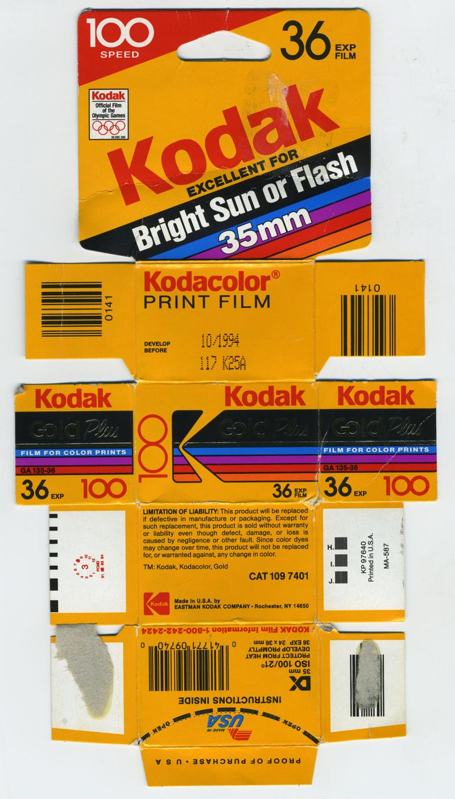
</a>


`UUID: 40b52c82185045d3ab35b798f0e7d875`↓

<a href="./archive/00664_001.jpg" target="_blank">
	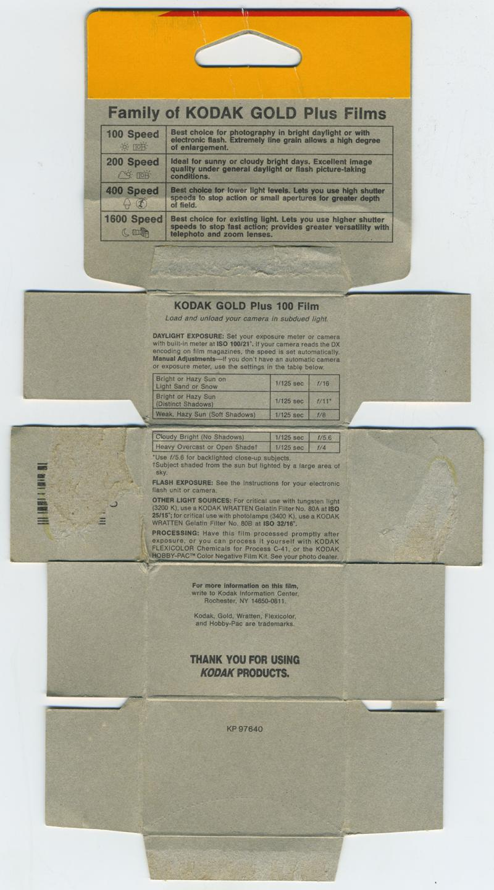
</a>

#### [C-41] Kodak Gold Ultra 400 (ref: 1358)

```
Format: 35mm         |  Process : C-41    
ISO   : 400          |  Expiry  : 2001-01 
Type  : Multi-Pack-2 |  Quantity: 24exp   
Added : 2025-07-28   |  Author  : lilyu.xyz
UUID  : c2dc7711cd38434da5cfea8750f61358
```

<a href="./archive/00094_000.jpg" target="_blank">
	
</a>


`UUID: 1501f7eec7f34d3788b6c7b94a4134df`↓

<a href="./archive/00094_001.jpg" target="_blank">
	
</a>

#### [C-41] Kodak Kodacolor 100 (ref: 73e0)

```
Format: 35mm         |  Process : C-41    
ISO   : 100          |  Expiry  : 2027-09 
Type  : Single Pack  |  Quantity: 36exp   
Added : 2025-10-25   |  Author  : minidiscus
UUID  : 930ee2c830af4f0a957649764d5873e0
```

<a href="./archive/00453_000.jpg" target="_blank">
	
</a>

#### [C-41] Kodak Kodacolor 200 (ref: ba30)

```
Format: 35mm         |  Process : C-41    
ISO   : 200          |  Expiry  : 2028-02 
Type  : Single Pack  |  Quantity: 36exp   
Added : 2026-03-02   |  Author  : TheSelousScout
UUID  : b33ca9b3d2e34544a264987426efba30
```

<a href="./archive/00519_000.jpg" target="_blank">
	
</a>

#### [C-41] Kodak Kodacolor 400 (ref: 9e4c)

```
Format: 110          |  Process : C-41    
ISO   : 400          |  Expiry  : 1981-04 
Type  : Single Pack  |  Quantity: 20exp   
Added : 2025-09-13   |  Author  : @filmfotofella
UUID  : 3ef3252141a64ffe9d7e3fad745b9e4c
```

<a href="./archive/00331_000.jpg" target="_blank">
	
</a>


`UUID: 2227688b4c8b4ef796fb75f487359f71`↓

<a href="./archive/00331_001.jpg" target="_blank">
	
</a>


`UUID: a87701598e4540da8804dd29aa0922f7`↓

<a href="./archive/00331_002.jpg" target="_blank">
	
</a>

#### [C-41] Kodak Kodacolor Gold (ref: 4ccd)

```
Format: Disc Film    |  Process : C-41    
ISO   : 400          |  Expiry  : Unknown 
Type  : Single Pack  |  Quantity: 15exp   
Added : 2026-06-16   |  Author  : nyctomanica
UUID  : 7f9897837fc645f5bbe5c6c18bb84ccd
```

<a href="./archive/00594_000.jpg" target="_blank">
	
</a>

#### [C-41] Kodak Kodacolor Gold 200 (ref: f368)

```
Format: 110          |  Process : C-41    
ISO   : 200          |  Expiry  : 1988-12 
Type  : Single Pack  |  Quantity: 24exp   
Added : 2025-05-24   |  Author  : dekuNukem
UUID  : 78bfeed667154d819902ec92d7dcf368
```

<a href="./archive/00068_000.jpg" target="_blank">
	
</a>

#### [C-41] Kodak Kodacolor Gold 400 (ref: 473d)

```
Format: 110          |  Process : C-41    
ISO   : 400          |  Expiry  : 1990-09 
Type  : Single Pack  |  Quantity: 24exp   
Added : 2025-10-21   |  Author  : dekuNukem
UUID  : 9d06405332c04b80b8b6ec709131473d
```

<a href="./archive/00440_000.jpg" target="_blank">
	
</a>

#### [C-41] Kodak Kodacolor II (ref: f435)

```
Format: 120          |  Process : C-41    
ISO   : 100          |  Expiry  : 1971-10 
Type  : Single Pack  |  Quantity: N/A     
Added : 2026-05-26   |  Author  : Greg    
UUID  : 8b179d290e4a462bb49bcec4f7c7f435
```

<a href="./archive/00572_000.jpg" target="_blank">
	
</a>

#### [C-41] Kodak Kodacolor II (ref: b19e)

```
Format: 620          |  Process : C-41    
ISO   : 100          |  Expiry  : 1979-08 
Type  : Single Pack  |  Quantity: Unknown 
Added : 2025-10-21   |  Author  : dekuNukem
UUID  : 251b2a7fd42343e6b655b100794bb19e
```

<a href="./archive/00446_000.jpg" target="_blank">
	
</a>


`UUID: 51b3490951d941be9922c1bf261a5551`↓

<a href="./archive/00446_001.jpg" target="_blank">
	
</a>


`UUID: 51a30e2c83294d4b858bef55f6a66d21`↓

<a href="./archive/00446_002.jpg" target="_blank">
	
</a>

#### [C-41] Kodak Kodacolor II (ref: 7310)

```
Format: 126          |  Process : C-41    
ISO   : 100          |  Expiry  : 1983-10 
Type  : Single Pack  |  Quantity: 24exp   
Added : 2025-08-28   |  Author  : The Compartmentalist
UUID  : 08c1609b39a64daf8be1373ea99c7310
```

<a href="./archive/00263_000.jpg" target="_blank">
	
</a>

#### [C-41] Kodak Kodacolor II (ref: 8dcf)

```
Format: 35mm         |  Process : C-41    
ISO   : 100          |  Expiry  : 1984-04 
Type  : Single Pack  |  Quantity: 24exp   
Added : 2026-03-02   |  Author  : Luci 101
UUID  : ab800ae503c34a0aa02671d6450e8dcf
```

<a href="./archive/00536_000.jpg" target="_blank">
	
</a>


`UUID: 3c11f8ae82214741a97acba512ffa0f2`↓

<a href="./archive/00536_001.jpg" target="_blank">
	
</a>


`UUID: 24569d9227db4530b89471f293852831`↓

<a href="./archive/00536_002.jpg" target="_blank">
	
</a>


`UUID: 8d2b565ef2c74110906f66356f164e90`↓

<a href="./archive/00536_003.jpg" target="_blank">
	
</a>


`UUID: f01dcebad7414ecbafe609411370df1e`↓

<a href="./archive/00536_004.jpg" target="_blank">
	
</a>


`UUID: 3a535cfbe2cf4290897513af040df7aa`↓

<a href="./archive/00536_005.jpg" target="_blank">
	
</a>


`UUID: 566378dad0954215a8976cc6cf6cf173`↓

<a href="./archive/00536_006.jpg" target="_blank">
	
</a>

#### [C-41] Kodak Kodacolor VR (ref: 035f)

```
Format: 35mm         |  Process : C-41    
ISO   : 200          |  Expiry  : 1987-06 
Type  : Single Pack  |  Quantity: 36exp   
Added : 2025-07-28   |  Author  : @ftfilmphotos
UUID  : a26daa2cb6e44957af3d978bc67e035f
```

<a href="./archive/00097_000.jpg" target="_blank">
	
</a>


`UUID: 185225c336bc491683c7a1806458c4e8`↓

<a href="./archive/00097_001.jpg" target="_blank">
	
</a>

#### [C-41] Kodak Kodacolor VR Plus (ref: f8bf)

```
Format: 35mm         |  Process : C-41    
ISO   : 400          |  Expiry  : 2012-03 
Type  : Multi-Pack-2 |  Quantity: 36exp   
Added : 2025-07-31   |  Author  : fine-seat
UUID  : faf0a44eece541a9b701feb772f4f8bf
```

<a href="./archive/00153_000.jpg" target="_blank">
	
</a>

#### [C-41] Kodak Kodacolor VR Plus 400 (ref: 5e5d)

```
Format: 35mm         |  Process : C-41    
ISO   : 400          |  Expiry  : 2009-04 
Type  : Single Pack  |  Quantity: 36exp   
Added : 2026-06-24   |  Author  : Mauphoto
UUID  : 2234581367c84a208c391ba92b3f5e5d
```

<a href="./archive/00630_000.jpg" target="_blank">
	
</a>

#### [C-41] Kodak MAX (ref: 2361)

```
Format: 35mm         |  Process : C-41    
ISO   : 400          |  Expiry  : 2007-03 
Type  : Multi-Pack-3 |  Quantity: 24exp   
Added : 2025-08-20   |  Author  : @photos.by.qi
UUID  : 5d0c054ebc17452397de86653bf42361
```

<a href="./archive/00234_000.jpg" target="_blank">
	
</a>

#### [C-41] Kodak Portra 160 (ref: ce56)

```
Format: 35mm         |  Process : C-41    
ISO   : 160          |  Expiry  : 2013-08 
Type  : Multi-Pack-5 |  Quantity: 36exp   
Added : 2025-07-28   |  Author  : @recycling.film
UUID  : 9131fb90db70475dbad5f63f1448ce56
```

<a href="./archive/00089_000.jpg" target="_blank">
	
</a>

#### [C-41] Kodak Portra 160 (ref: 6b0a)

```
Format: 35mm         |  Process : C-41    
ISO   : 160          |  Expiry  : 2026-01 
Type  : Multi-Pack-5 |  Quantity: 36exp   
Added : 2025-09-17   |  Author  : The Compartmentalist
UUID  : 404910cf04a14b8ab5116ec9c2f86b0a
```

<a href="./archive/00345_000.jpg" target="_blank">
	
</a>

#### [C-41] Kodak Portra 400 (ref: cf9c)

```
Format: 35mm         |  Process : C-41    
ISO   : 400          |  Expiry  : 2014-06 
Type  : Multi-Pack-5 |  Quantity: 36exp   
Added : 2025-08-18   |  Author  : @recycling.film
UUID  : 5bdddffe29bd464cab4630d85485cf9c
```

<a href="./archive/00200_000.jpg" target="_blank">
	
</a>

#### [C-41] Kodak Portra 400 (ref: f4af)

```
Format: 120          |  Process : C-41    
ISO   : 400          |  Expiry  : 2021-07 
Type  : Multi-Pack-5 |  Quantity: N/A     
Added : 2026-07-13   |  Author  : Chrisbes
UUID  : bd9d52c15a7b4d49b87ce856282cf4af
```

<a href="./archive/00662_000.jpg" target="_blank">
	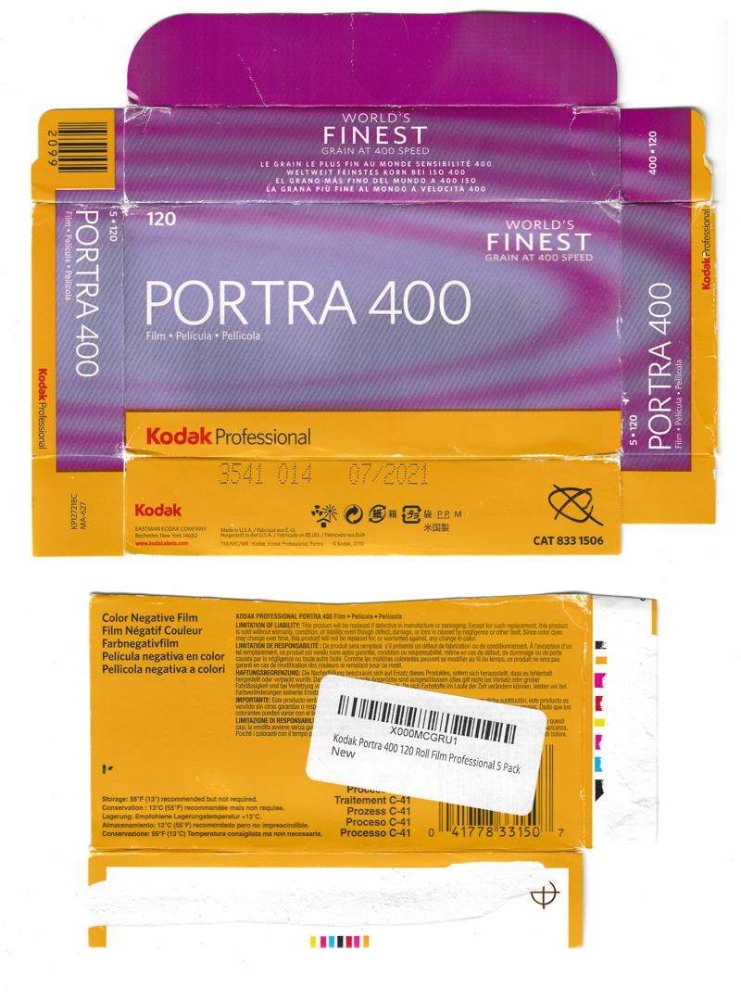
</a>

#### [C-41] Kodak Portra 400 (ref: 9f18)

```
Format: 120          |  Process : C-41    
ISO   : 400          |  Expiry  : 2024-08 
Type  : Multi-Pack-5 |  Quantity: N/A     
Added : 2025-08-20   |  Author  : @photos.by.qi
UUID  : 12ee41c6f8fe493fbda516802e039f18
```

<a href="./archive/00246_000.jpg" target="_blank">
	
</a>


`UUID: 6407fec85c4344a1bbc2ae930e51ae8e`↓

<a href="./archive/00246_001.jpg" target="_blank">
	
</a>

#### [C-41] Kodak Portra 400 (ref: 8b1c)

```
Format: 35mm         |  Process : C-41    
ISO   : 400          |  Expiry  : 2024-12 
Type  : Multi-Pack-5 |  Quantity: 36exp   
Added : 2025-08-20   |  Author  : @photos.by.qi
UUID  : 282ef0c08f374148afc8a5efaf5b8b1c
```

<a href="./archive/00244_000.jpg" target="_blank">
	
</a>

#### [C-41] Kodak Portra 400 (ref: c869)

```
Format: 35mm         |  Process : C-41    
ISO   : 400          |  Expiry  : 2026-10 
Type  : Multi-Pack-5 |  Quantity: 36exp   
Added : 2025-08-20   |  Author  : @photos.by.qi
UUID  : 848f67976c48465a8c245ba2a4d0c869
```

<a href="./archive/00245_000.jpg" target="_blank">
	
</a>

#### [C-41] Kodak Portra 400NC (ref: b8de)

```
Format: 70mm         |  Process : C-41    
ISO   : 400          |  Expiry  : 2006-08 
Type  : Bulk Roll    |  Quantity: 100ft   
Added : 2025-08-14   |  Author  : Camera.Riley
UUID  : 88ebc10c01ea46238c48e65157ddb8de
```

<a href="./archive/00175_000.jpg" target="_blank">
	
</a>

#### [C-41] Kodak Portra 400UC (ref: 5b9e)

```
Format: 120          |  Process : C-41    
ISO   : 400          |  Expiry  : 2004-09 
Type  : Single Pack  |  Quantity: N/A     
Added : 2025-09-05   |  Author  : dekuNukem
UUID  : 87e948a92b624ef996d2e1da3a7b5b9e
Notes : sample pack, not for resale.
```

<a href="./archive/00299_000.jpg" target="_blank">
	
</a>


`UUID: 4d0264c90bd7476099107ddfac1ec67f`↓

<a href="./archive/00299_001.jpg" target="_blank">
	
</a>

#### [C-41] Kodak Portra 400VC (ref: b67b)

```
Format: 120          |  Process : C-41    
ISO   : 400          |  Expiry  : 2004-12 
Type  : Multi-Pack-5 |  Quantity: N/A     
Added : 2025-08-20   |  Author  : @photos.by.qi
UUID  : 348bccb01edc4a6ea9a2f5c4d88cb67b
```

<a href="./archive/00243_000.jpg" target="_blank">
	
</a>


`UUID: 154cd3f3c85944ab87c33eaad232c3b6`↓

<a href="./archive/00243_001.jpg" target="_blank">
	
</a>


`UUID: de89359102c54df797bee4229920e191`↓

<a href="./archive/00243_002.jpg" target="_blank">
	
</a>


`UUID: c4a365adef6546cf945a04e9a6088a02`↓

<a href="./archive/00243_003.jpg" target="_blank">
	
</a>

#### [C-41] Kodak Portra 400VC (ref: 7669)

```
Format: 35mm         |  Process : C-41    
ISO   : 400          |  Expiry  : 2009-04 
Type  : Multi-Pack-5 |  Quantity: 36exp   
Added : 2025-08-20   |  Author  : @photos.by.qi
UUID  : 2152a58cb08c463ea298a61858ff7669
```

<a href="./archive/00242_000.jpg" target="_blank">
	
</a>

#### [C-41] Kodak Portra 800 (ref: 21f9)

```
Format: 120          |  Process : C-41    
ISO   : 800          |  Expiry  : 2022-10 
Type  : Multi-Pack-5 |  Quantity: N/A     
Added : 2025-08-20   |  Author  : @photos.by.qi
UUID  : 3663afb2b2d340d3a5c9e0d0e9f021f9
```

<a href="./archive/00240_000.jpg" target="_blank">
	
</a>


`UUID: 63ef586862154b94aeccdbdb4227ad5c`↓

<a href="./archive/00240_001.jpg" target="_blank">
	
</a>

#### [C-41] Kodak Portra 800 (ref: 7d65)

```
Format: 35mm         |  Process : C-41    
ISO   : 800          |  Expiry  : 2025-06 
Type  : Single Pack  |  Quantity: 36exp   
Added : 2025-07-28   |  Author  : @recycling.film
UUID  : 7ebac9d7fb8c4ff9b7fbabcaec1d7d65
```

<a href="./archive/00088_000.jpg" target="_blank">
	
</a>

#### [C-41] Kodak Portra 800 (ref: 3c94)

```
Format: 35mm         |  Process : C-41    
ISO   : 800          |  Expiry  : 2027-06 
Type  : Single Pack  |  Quantity: 36exp   
Added : 2025-12-12   |  Author  : kaimon  
UUID  : 9896161f6dd442ceaa89c6d209063c94
```

<a href="./archive/00501_000.jpg" target="_blank">
	
</a>

#### [C-41] Kodak ProImage 100 (ref: fe32)

```
Format: 35mm         |  Process : C-41    
ISO   : 100          |  Expiry  : 2023-01 
Type  : Multi-Pack-5 |  Quantity: 36exp   
Added : 2025-08-20   |  Author  : @photos.by.qi
UUID  : 76cf680b7e1a407f92eb84541d21fe32
```

<a href="./archive/00239_000.jpg" target="_blank">
	
</a>

#### [C-41] Kodak Sport Single Use Camera (ref: 4618)

```
Format: 35mm         |  Process : C-41    
ISO   : 800          |  Expiry  : 2026-05 
Type  : Single Pack  |  Quantity: 27exp   
Added : 2026-04-13   |  Author  : Dialupdude
UUID  : e9b9c65612ae498080917cde3fd94618
```

<a href="./archive/00562_000.jpg" target="_blank">
	
</a>

#### [C-41] Kodak Ultra (ref: 69a1)

```
Format: 35mm         |  Process : C-41    
ISO   : 400          |  Expiry  : 2005-12 
Type  : Single Pack  |  Quantity: 24exp   
Added : 2025-01-14   |  Author  : @ob.skura
UUID  : 77dfbdf80e3a4950b40c7ea8c1e369a1
```

<a href="./archive/00043_000.jpg" target="_blank">
	
</a>

#### [C-41] Kodak Ultra (ref: 5701)

```
Format: 110          |  Process : C-41    
ISO   : 400          |  Expiry  : 2007-11 
Type  : Single Pack  |  Quantity: 24exp   
Added : 2025-09-13   |  Author  : @filmfotofella
UUID  : d01783be3b70456095411ca387865701
```

<a href="./archive/00333_000.jpg" target="_blank">
	
</a>

#### [C-41] Kodak UltraMax (ref: 3b23)

```
Format: 35mm         |  Process : C-41    
ISO   : 400          |  Expiry  : 2023-03 
Type  : Multi-Pack-3 |  Quantity: 24exp   
Added : 2025-08-20   |  Author  : @photos.by.qi
UUID  : 1a68334cdfc146b98a7fa95672e33b23
```

<a href="./archive/00235_000.jpg" target="_blank">
	
</a>

#### [C-41] Kodak UltraMax (ref: 3c02)

```
Format: 35mm         |  Process : C-41    
ISO   : 400          |  Expiry  : 2024-12 
Type  : Single Pack  |  Quantity: 36exp   
Added : 2025-08-20   |  Author  : @photos.by.qi
UUID  : 05d59d140f584adcaf97f6acb69f3c02
```

<a href="./archive/00241_000.jpg" target="_blank">
	
</a>


`UUID: 6ed0486400df45eab9b7465642ecee9d`↓

<a href="./archive/00241_001.jpg" target="_blank">
	
</a>

#### [C-41] Kodak UltraMax (ref: e3ba)

```
Format: 35mm         |  Process : C-41    
ISO   : 400          |  Expiry  : 2026-01 
Type  : Multi-Pack-3 |  Quantity: 36exp   
Added : 2025-09-17   |  Author  : The Compartmentalist
UUID  : 7fc91e3ef9cf4519adde24e24938e3ba
```

<a href="./archive/00337_000.jpg" target="_blank">
	
</a>

#### [C-41] Kodak UltraMax (ref: e4ad)

```
Format: 35mm         |  Process : C-41    
ISO   : 400          |  Expiry  : 2026-07 
Type  : Single Pack  |  Quantity: 24exp   
Added : 2025-08-18   |  Author  : @recycling.film
UUID  : d14bbf440f3a4ac9aa4169c8bba7e4ad
```

<a href="./archive/00201_000.jpg" target="_blank">
	
</a>

#### [C-41] Kodak UltraMax (ref: aaa6)

```
Format: 35mm         |  Process : C-41    
ISO   : 400          |  Expiry  : 2027-03 
Type  : Single Pack  |  Quantity: 36exp   
Added : 2025-07-22   |  Author  : @SirBrentsworth
UUID  : 8b0e255948ad4bbc8689d371569caaa6
```

<a href="./archive/00079_000.jpg" target="_blank">
	
</a>

#### [C-41] Kodak Vericolor 400 (ref: d8e3)

```
Format: 35mm         |  Process : C-41    
ISO   : 400          |  Expiry  : 1994-08 
Type  : Bulk Roll    |  Quantity: 30.5m   
Added : 2026-06-18   |  Author  : nyctomanica
UUID  : 77390b1f4e8f4519817b767e55c1d8e3
```

<a href="./archive/00604_000.jpg" target="_blank">
	
</a>

#### [C-41] Kodak Vericolor 400 Plus (ref: bd88)

```
Format: 120          |  Process : C-41    
ISO   : 400          |  Expiry  : 1998-10 
Type  : Multi-Pack-5 |  Quantity: N/A     
Added : 2025-08-20   |  Author  : @photos.by.qi
UUID  : 8b882b8198ca4aeb8180b8743269bd88
```

<a href="./archive/00238_000.jpg" target="_blank">
	
</a>


`UUID: 07052f2a4fd8445aa344c21b79c06d9d`↓

<a href="./archive/00238_001.jpg" target="_blank">
	
</a>


`UUID: 8a605cec4f594f37823796472cfb7005`↓

<a href="./archive/00238_002.jpg" target="_blank">
	
</a>


`UUID: cb3839d18fe44552bb710d82020a7743`↓

<a href="./archive/00238_003.jpg" target="_blank">
	
</a>

#### [C-41] Kodak Vericolor III (ref: 4b3e)

```
Format: 120          |  Process : C-41    
ISO   : 160          |  Expiry  : 2000-09 
Type  : Multi-Pack-5 |  Quantity: N/A     
Added : 2025-08-20   |  Author  : @photos.by.qi
UUID  : bcb6ab106d2941429eaf1088c1194b3e
```

<a href="./archive/00237_000.jpg" target="_blank">
	
</a>


`UUID: e4c84e87bd66459cbea1954dc32b5920`↓

<a href="./archive/00237_001.jpg" target="_blank">
	
</a>


`UUID: 6cbb4abac86e407d99055015b4719e95`↓

<a href="./archive/00237_002.jpg" target="_blank">
	
</a>


`UUID: ed6cc093b4e44b8b81bb19f6d1e6a4f2`↓

<a href="./archive/00237_003.jpg" target="_blank">
	
</a>

#### [C-41] Kodak Värikuvafilmi (ref: f9ff)

```
Format: 35mm         |  Process : C-41    
ISO   : 200          |  Expiry  : 2001-12 
Type  : Multi-Pack-2 |  Quantity: 24exp   
Added : 2025-07-31   |  Author  : Pelicram
UUID  : b8795d19697a453c8f27fde773eaf9ff
```

<a href="./archive/00146_000.jpg" target="_blank">
	
</a>

#### [C-41] Konica Centuria 200 (ref: e155)

```
Format: 35mm         |  Process : C-41    
ISO   : 200          |  Expiry  : 2003-05 
Type  : Single Pack  |  Quantity: 24exp   
Added : 2025-08-30   |  Author  : dekuNukem
UUID  : 2f575e07049946ea981e1d53eb4ee155
```

<a href="./archive/00267_000.jpg" target="_blank">
	
</a>


`UUID: 037c5e1f5185418c96aae0a01cf726a3`↓

<a href="./archive/00267_001.jpg" target="_blank">
	
</a>

#### [C-41] Konica Konica Color II (ref: fb5b)

```
Format: 35mm         |  Process : C-41    
ISO   : 100          |  Expiry  : 1985-01 
Type  : Bulk Roll    |  Quantity: 110ft   
Added : 2025-08-14   |  Author  : Camera.Riley
UUID  : 34d91c79c1704ac49f5376ca6424fb5b
```

<a href="./archive/00173_000.jpg" target="_blank">
	
</a>

#### [C-41] Konica Konica Color SR-G 160 (ref: 64c5)

```
Format: 120          |  Process : C-41    
ISO   : 160          |  Expiry  : 1999-05 
Type  : Single Pack  |  Quantity: N/A     
Added : 2026-07-16   |  Author  : Chrisbes
UUID  : 5f88d84525c440fc8879978b1b2864c5
```

<a href="./archive/00666_000.jpg" target="_blank">
	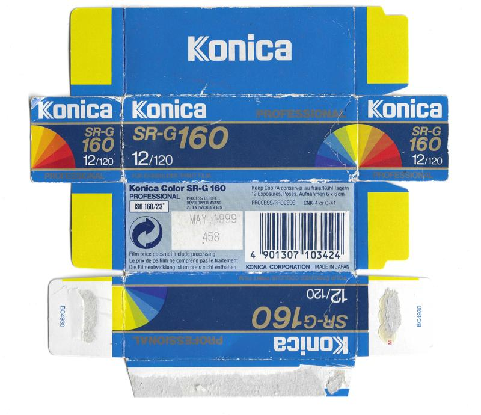
</a>


`UUID: d8b9395871644903b4e7251339cca0c8`↓

<a href="./archive/00666_001.jpg" target="_blank">
	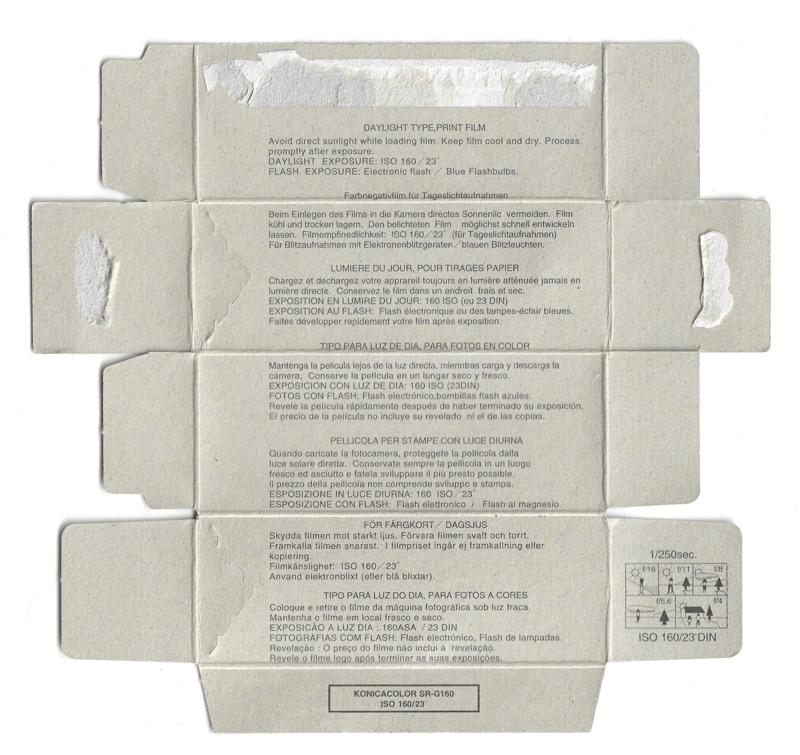
</a>

#### [C-41] Konica KonicaColor VX 100 (ref: 8350)

```
Format: 35mm         |  Process : C-41    
ISO   : 100          |  Expiry  : 1998-06 
Type  : Single Pack  |  Quantity: 24exp   
Added : 2025-08-30   |  Author  : dekuNukem
UUID  : daee9d73b6d14f768e414b87260c8350
```

<a href="./archive/00269_000.jpg" target="_blank">
	
</a>


`UUID: 2e481382168c430c8a923e5a2aa60e05`↓

<a href="./archive/00269_001.jpg" target="_blank">
	
</a>

#### [C-41] Konica KonicaColor VX 200 (ref: fe53)

```
Format: 35mm         |  Process : C-41    
ISO   : 200          |  Expiry  : 2003-03 
Type  : Multi-Pack-3 |  Quantity: 24exp   
Added : 2025-07-31   |  Author  : Pelicram
UUID  : dd3a6c347560484295ca09c86e3dfe53
```

<a href="./archive/00138_000.jpg" target="_blank">
	
</a>


`UUID: 9f45eb2e52134da79a732605103a6f39`↓

<a href="./archive/00138_001.jpg" target="_blank">
	
</a>

#### [C-41] Konica Sepia Professional (ref: 0b40)

```
Format: 120          |  Process : C-41    
ISO   : 400          |  Expiry  : 2002-05 
Type  : Single Pack  |  Quantity: N/A     
Added : 2025-09-17   |  Author  : @ellafridalindblom
UUID  : 83467c04e5254b4286b48e5a8e1b0b40
```

<a href="./archive/00340_000.jpg" target="_blank">
	
</a>

#### [C-41] Konica VX 100 Super (ref: 90b4)

```
Format: 35mm         |  Process : C-41    
ISO   : 100          |  Expiry  : 2005-11 
Type  : Single Pack  |  Quantity: 24exp   
Added : 2026-06-25   |  Author  : Dialupdude
UUID  : 39efe40e04c44643850d8442b4c490b4
```

<a href="./archive/00652_000.jpg" target="_blank">
	
</a>


`UUID: 4c99e38ae90f43e8baa4e0cd9b0a313b`↓

<a href="./archive/00652_001.jpg" target="_blank">
	
</a>

#### [C-41] Konica Minolta Commercial Color Film (ref: e903)

```
Format: 35mm         |  Process : C-41    
ISO   : 100          |  Expiry  : 2007-02 
Type  : Single Pack  |  Quantity: 24exp   
Added : 2025-09-03   |  Author  : @ellafridalindblom
UUID  : 0b703dc8e8c74e8b9dd3215fa370e903
```

<a href="./archive/00291_000.jpg" target="_blank">
	
</a>

#### [C-41] Lloyds Pharmacy APS Film (ref: c7cf)

```
Format: APS          |  Process : C-41    
ISO   : 200          |  Expiry  : 2007-08 
Type  : Single Pack  |  Quantity: 40exp   
Added : 2025-05-24   |  Author  : dekuNukem
UUID  : 44bd7d4688e04d19a958d961c2abc7cf
```

<a href="./archive/00067_000.jpg" target="_blank">
	
</a>

#### [C-41] Lloyds Pharmacy Colour Film (ref: 074c)

```
Format: 35mm         |  Process : C-41    
ISO   : 200          |  Expiry  : 2004-07 
Type  : Single Pack  |  Quantity: 36exp   
Added : 2025-08-30   |  Author  : dekuNukem
UUID  : c4d16975eee44b9185b17cf0c0e4074c
```

<a href="./archive/00266_000.jpg" target="_blank">
	
</a>

#### [C-41] Lloyds Pharmacy Colour Film (ref: 77d9)

```
Format: 35mm         |  Process : C-41    
ISO   : 200          |  Expiry  : 2009-07 
Type  : Single Pack  |  Quantity: 36exp   
Added : 2025-01-04   |  Author  : dekuNukem
UUID  : c58dda071d1741fda90e20b4252277d9
```

<a href="./archive/00013_000.jpg" target="_blank">
	
</a>

#### [C-41] Lomography Color Negative 120 Film 100 (ref: 42fc)

```
Format: 120          |  Process : C-41    
ISO   : 100          |  Expiry  : 2025-06 
Type  : Multi-Pack-3 |  Quantity: N/A     
Added : 2026-06-25   |  Author  : @Hol.m35
UUID  : 13977400bfd24db0bde214b6c6a342fc
```

<a href="./archive/00654_000.jpg" target="_blank">
	
</a>


`UUID: 6c0182aec6d945dd83da3c1714d68856`↓

<a href="./archive/00654_001.jpg" target="_blank">
	
</a>

#### [C-41] Lomography Color Negative 800 (ref: 7796)

```
Format: 35mm         |  Process : C-41    
ISO   : 800          |  Expiry  : 2026-06 
Type  : Multi-Pack-3 |  Quantity: 36exp   
Added : 2025-12-03   |  Author  : @Hol.m35
UUID  : 7daedd3c10164aa3a9ca3f7a9eae7796
```

<a href="./archive/00495_000.jpg" target="_blank">
	
</a>


`UUID: 598d18cdb1b94a4499a2cdd1383a4088`↓

<a href="./archive/00495_001.jpg" target="_blank">
	
</a>

#### [C-41] Lomography Color Negative Film (ref: d986)

```
Format: 120          |  Process : C-41    
ISO   : 400          |  Expiry  : 2012-12 
Type  : Multi-Pack-3 |  Quantity: 8exp    
Added : 2026-04-13   |  Author  : @Hol.m35
UUID  : 808ce640e530482f9016329c0eb2d986
```

<a href="./archive/00558_000.jpg" target="_blank">
	
</a>


`UUID: 44865d9f476846938a0d9986fd21c796`↓

<a href="./archive/00558_001.jpg" target="_blank">
	
</a>

#### [C-41] Lomography Color Negative Film (ref: 1529)

```
Format: 120          |  Process : C-41    
ISO   : 800          |  Expiry  : 2027-09 
Type  : Single Pack  |  Quantity: N/A     
Added : 2025-09-07   |  Author  : @zruk_ts
UUID  : e200ab98ca5746cbb6f3af1afb481529
```

<a href="./archive/00313_000.jpg" target="_blank">
	
</a>


`UUID: b59730221b5f438388c4a9cbcba44676`↓

<a href="./archive/00313_001.jpg" target="_blank">
	
</a>

#### [C-41] Lomography Lobster Redscale Negative (ref: 4dcd)

```
Format: 110          |  Process : C-41    
ISO   : 200          |  Expiry  : 2015-10 
Type  : Single Pack  |  Quantity: 24exp   
Added : 2025-10-21   |  Author  : dekuNukem
UUID  : bfb2bdd4749b474f8fe1f971f2a14dcd
```

<a href="./archive/00422_000.jpg" target="_blank">
	
</a>


`UUID: e5403e7603b24ed995890c4faa3ab25b`↓

<a href="./archive/00422_001.jpg" target="_blank">
	
</a>

#### [C-41] Lomography Lomochrome Color'92 (ref: 12b4)

```
Format: 35mm         |  Process : C-41    
ISO   : 400          |  Expiry  : 2026-04 
Type  : Single Pack  |  Quantity: 36exp   
Added : 2025-08-20   |  Author  : @photos.by.qi
UUID  : 81d185de4ddf494785362046cada12b4
```

<a href="./archive/00225_000.jpg" target="_blank">
	
</a>

#### [C-41] Lomography Lomochrome Color'92 (ref: 9fdb)

```
Format: 120          |  Process : C-41    
ISO   : 400          |  Expiry  : 2027-04 
Type  : Single Pack  |  Quantity: N/A     
Added : 2025-09-07   |  Author  : @zruk_ts
UUID  : 48a192dcc8f44c17a449dfccf8279fdb
```

<a href="./archive/00314_000.jpg" target="_blank">
	
</a>


`UUID: d7e77f89cf4549d383b81dad410adff4`↓

<a href="./archive/00314_001.jpg" target="_blank">
	
</a>

#### [C-41] Lomography Lomochrome Color’92 (ref: 0960)

```
Format: 120          |  Process : C-41    
ISO   : 400          |  Expiry  : 2026-07 
Type  : Single Pack  |  Quantity: N/A     
Added : 2025-09-17   |  Author  : The Compartmentalist
UUID  : e72a327c49d3440c85ab03647ff00960
```

<a href="./archive/00336_000.jpg" target="_blank">
	
</a>

#### [C-41] Lomography Lomochrome Metropolis (ref: 5546)

```
Format: 35mm         |  Process : C-41    
ISO   : 100          |  Expiry  : 2023-03 
Type  : Single Pack  |  Quantity: 36exp   
Added : 2025-08-20   |  Author  : @photos.by.qi
UUID  : eba9730505104dfd8c12254eeafd5546
```

<a href="./archive/00236_000.jpg" target="_blank">
	
</a>


`UUID: 415e6aeb12db4efbba5f290d09d7beba`↓

<a href="./archive/00236_001.jpg" target="_blank">
	
</a>

#### [C-41] Lomography Lomochrome Purple (ref: 8b00)

```
Format: 35mm         |  Process : C-41    
ISO   : 100          |  Expiry  : 2022-08 
Type  : Single Pack  |  Quantity: 36exp   
Added : 2025-08-20   |  Author  : @photos.by.qi
UUID  : 5589454d652e4771b024a9901acb8b00
```

<a href="./archive/00226_000.jpg" target="_blank">
	
</a>

#### [C-41] Lomography Lomochrome Purple (ref: 068f)

```
Format: 35mm         |  Process : C-41    
ISO   : 100-400      |  Expiry  : 2027-05 
Type  : Single Pack  |  Quantity: 36exp   
Added : 2025-07-22   |  Author  : @SirBrentsworth
UUID  : b02540ba4b454a639f8096f9474d068f
```

<a href="./archive/00078_000.jpg" target="_blank">
	
</a>


`UUID: bd02e2aa40df4da59c616139d8d06db6`↓

<a href="./archive/00078_001.jpg" target="_blank">
	
</a>

#### [C-41] Lomography Lomochrome Turquoise (ref: 0d90)

```
Format: 120          |  Process : C-41    
ISO   : 100-400      |  Expiry  : 2025-07 
Type  : Single Pack  |  Quantity: N/A     
Added : 2025-01-04   |  Author  : dekuNukem
UUID  : 99643a4fc27b4ff298e834fc72970d90
```

<a href="./archive/00008_000.jpg" target="_blank">
	
</a>


`UUID: adc4ed82e419439c8bec5348db4a1ca2`↓

<a href="./archive/00008_001.jpg" target="_blank">
	
</a>

#### [C-41] Lomography Tiger (ref: 5b62)

```
Format: 110          |  Process : C-41    
ISO   : 200          |  Expiry  : 2015-09 
Type  : Single Pack  |  Quantity: 24exp   
Added : 2025-10-14   |  Author  : dekuNukem
UUID  : 141712bb8988495d811441f1e5fb5b62
```

<a href="./archive/00396_000.jpg" target="_blank">
	
</a>


`UUID: 23cf98004a95479ebb6992d73ee36d36`↓

<a href="./archive/00396_001.jpg" target="_blank">
	
</a>


`UUID: 9275565ac1d046c5a72f553b7f73e124`↓

<a href="./archive/00396_002.jpg" target="_blank">
	
</a>

#### [C-41] Lomography Tiger (ref: 26dd)

```
Format: 110          |  Process : C-41    
ISO   : 200          |  Expiry  : 2026-09 
Type  : Single Pack  |  Quantity: 24exp   
Added : 2025-07-31   |  Author  : Pelicram
UUID  : e8a5b04ef68c43ae9e79df89123726dd
```

<a href="./archive/00143_000.jpg" target="_blank">
	
</a>

#### [C-41] Lucky C200 (ref: f727)

```
Format: 35mm         |  Process : C-41    
ISO   : 200          |  Expiry  : 2013-01 
Type  : Single Pack  |  Quantity: 36exp   
Added : 2026-04-13   |  Author  : Dialupdude
UUID  : 698e4d8dc2ef4a5d8ea7c8d0e0d9f727
```

<a href="./archive/00560_000.jpg" target="_blank">
	
</a>


`UUID: 59c76e90f1b947c28da172d2c7f5e2df`↓

<a href="./archive/00560_001.jpg" target="_blank">
	
</a>

#### [C-41] Lucky C200 (ref: e6f8)

```
Format: 120          |  Process : C-41    
ISO   : 200          |  Expiry  : 2027-09 
Type  : Single Pack  |  Quantity: N/A     
Added : 2025-11-11   |  Author  : @Hol.m35
UUID  : c6cdb442b65a4e83ac71331c8fffe6f8
```

<a href="./archive/00473_000.jpg" target="_blank">
	
</a>


`UUID: 4c246c1e545c4160b2d63db6025accfb`↓

<a href="./archive/00473_001.jpg" target="_blank">
	
</a>

#### [C-41] Lucky C200 (ref: 9c6c)

```
Format: 35mm         |  Process : C-41    
ISO   : 200          |  Expiry  : 2027-10 
Type  : Single Pack  |  Quantity: 36exp   
Added : 2025-11-19   |  Author  : kaimon  
UUID  : 4986ebbbced349e880b7dd92d9649c6c
```

<a href="./archive/00479_000.jpg" target="_blank">
	
</a>


`UUID: 865aa90f5fca4c34b283f866c10c6054`↓

<a href="./archive/00479_001.jpg" target="_blank">
	
</a>

#### [C-41] Lucky C200 (ref: b0cc)

```
Format: 35mm         |  Process : C-41    
ISO   : 200          |  Expiry  : 2028-02 
Type  : Single Pack  |  Quantity: 36exp   
Added : 2026-04-13   |  Author  : @Hol.m35
UUID  : 417dc63303e24ed58b36a4fbe55ab0cc
```

<a href="./archive/00550_000.jpg" target="_blank">
	
</a>


`UUID: 1d360d80e5b74366a57bb661651a0ea1`↓

<a href="./archive/00550_001.jpg" target="_blank">
	
</a>

#### [C-41] Lucky Super New 200 (ref: e0a7)

```
Format: 35mm         |  Process : C-41    
ISO   : 200          |  Expiry  : 2013-01 
Type  : Single Pack  |  Quantity: 36exp   
Added : 2026-06-24   |  Author  : Mauphoto
UUID  : 2510bd0dd10940e0888b722ec00de0a7
```

<a href="./archive/00641_000.jpg" target="_blank">
	
</a>


`UUID: 7da671d2345d450b88824b0bbb584b81`↓

<a href="./archive/00641_001.jpg" target="_blank">
	
</a>

#### [C-41] Marix Professional Negative Movie Color Film (ref: c457)

```
Format: 35mm         |  Process : C-41    
ISO   : 320          |  Expiry  : 2026-12 
Type  : Single Pack  |  Quantity: 36exp   
Added : 2025-08-16   |  Author  : Kraksen 
UUID  : 715e5119d4b941d98ce52bcd8596c457
```

<a href="./archive/00188_000.jpg" target="_blank">
	
</a>

#### [C-41] Max Spielmann Maxi Color (ref: bf60)

```
Format: 35mm         |  Process : C-41    
ISO   : 400          |  Expiry  : 1997-08 
Type  : Single Pack  |  Quantity: 24exp   
Added : 2025-08-30   |  Author  : dekuNukem
UUID  : 0953325be5e54102b7615a7a5f82bf60
```

<a href="./archive/00268_000.jpg" target="_blank">
	
</a>

#### [C-41] Max Spielmann Pro-Zoom MX 400 (ref: 38c5)

```
Format: 35mm         |  Process : C-41    
ISO   : 400          |  Expiry  : 2006-07 
Type  : Single Pack  |  Quantity: 24exp   
Added : 2025-12-29   |  Author  : @Hol.m35
UUID  : 881f46ac2824430cb12f79087a3338c5
```

<a href="./archive/00503_000.jpg" target="_blank">
	
</a>


`UUID: 5490de5951794c9a946af94766f90eff`↓

<a href="./archive/00503_001.jpg" target="_blank">
	
</a>

#### [C-41] Minolta Minolta 16 Color Film For Prints (ref: a2ff)

```
Format: 16mm         |  Process : C-41    
ISO   : 100          |  Expiry  : 1992-06 
Type  : Single Pack  |  Quantity: 20exp   
Added : 2025-08-05   |  Author  : The Compartmentalist
UUID  : a2cfc71ac0e24ea58f4e3350423aa2ff
```

<a href="./archive/00162_000.jpg" target="_blank">
	
</a>

#### [C-41] Minox MinoColor 100 Pro (ref: 5338)

```
Format: 8x11mm       |  Process : C-41    
ISO   : 100          |  Expiry  : Unknown 
Type  : Single Pack  |  Quantity: 30exp   
Added : 2025-10-14   |  Author  : dekuNukem
UUID  : 2b69cd822cf44b0a833b845e7b515338
```

<a href="./archive/00397_000.jpg" target="_blank">
	
</a>


`UUID: e73e0dd7193c4cfa9b8d4eed881bb328`↓

<a href="./archive/00397_001.jpg" target="_blank">
	
</a>

#### [C-41] Minox MinoColor 3 (ref: d209)

```
Format: 8x11mm       |  Process : C-41    
ISO   : 100          |  Expiry  : 1989-10 
Type  : Single Pack  |  Quantity: 36exp   
Added : 2025-10-05   |  Author  : Pelicram
UUID  : a54b7c329f26403d91ffa69325a1d209
```

<a href="./archive/00370_000.jpg" target="_blank">
	
</a>

#### [C-41] Minox Minocolor 2 (ref: fadd)

```
Format: 8x11mm       |  Process : C-41    
ISO   : 80           |  Expiry  : 1981-09 
Type  : Single Pack  |  Quantity: 15exp   
Added : 2025-10-21   |  Author  : dekuNukem
UUID  : 5ee281ded82c46e5b628a58b9f10fadd
```

<a href="./archive/00438_000.jpg" target="_blank">
	
</a>


`UUID: 1590803fe8d045a480338838a869647e`↓

<a href="./archive/00438_001.jpg" target="_blank">
	
</a>


`UUID: dc750856812b447eaa0debe4122808ac`↓

<a href="./archive/00438_002.jpg" target="_blank">
	
</a>

#### [C-41] Mira Films 800 Color Film (ref: 32e1)

```
Format: 35mm         |  Process : C-41    
ISO   : 800          |  Expiry  : 2027-12 
Type  : Single Pack  |  Quantity: 36exp   
Added : 2026-06-25   |  Author  : Dialupdude
UUID  : 89552dfaf57742d8b1aed15a511832e1
```

<a href="./archive/00653_000.jpg" target="_blank">
	
</a>

#### [C-41] Mr. Negative Arcade (ref: a6e5)

```
Format: 35mm         |  Process : C-41    
ISO   : 400          |  Expiry  : 2029-01 
Type  : Single Pack  |  Quantity: 36exp   
Added : 2026-05-26   |  Author  : @Hol.m35
UUID  : e71e488f0288481f906ccecdf054a6e5
```

<a href="./archive/00577_000.jpg" target="_blank">
	
</a>

#### [C-41] Nishika Color Print Film (ref: baeb)

```
Format: 35mm         |  Process : C-41    
ISO   : 100          |  Expiry  : 1993-12 
Type  : Single Pack  |  Quantity: 36exp   
Added : 2025-10-17   |  Author  : @recycling.film
UUID  : c8f31c7a1adf423bbc4d35eae399baeb
```

<a href="./archive/00406_000.jpg" target="_blank">
	
</a>

#### [C-41] Optik Oldschool OptiColour 200 (ref: 099e)

```
Format: 35mm         |  Process : C-41    
ISO   : 200          |  Expiry  : 2027-11 
Type  : Single Pack  |  Quantity: 36exp   
Added : 2026-03-02   |  Author  : @Hol.m35
UUID  : c72fdf2e60bf4d488f2ac0b2251d099e
```

<a href="./archive/00527_000.jpg" target="_blank">
	
</a>

#### [C-41] Optik Oldschool OptiColour 200 (ref: 3617)

```
Format: 120          |  Process : C-41    
ISO   : 200          |  Expiry  : 2028-05 
Type  : Single Pack  |  Quantity: N/A     
Added : 2026-07-13   |  Author  : Chrisbes
UUID  : 03e5b3b597e74b01b87a2d0f16623617
```

<a href="./archive/00661_000.jpg" target="_blank">
	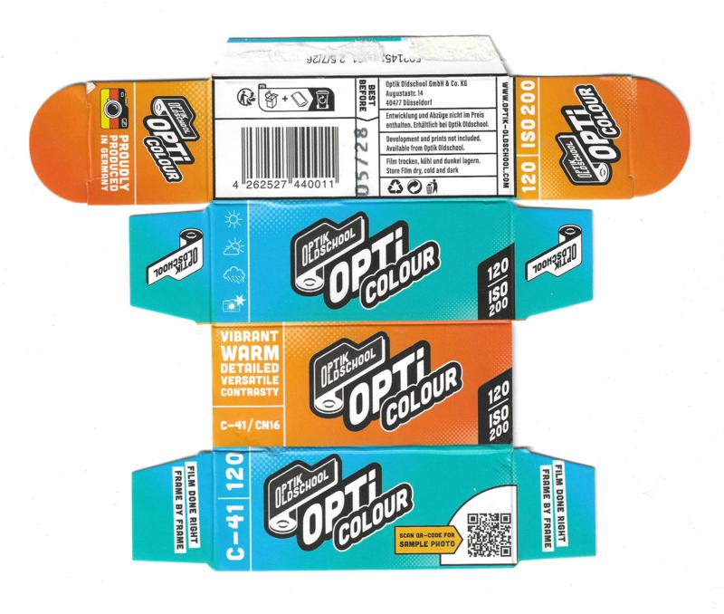
</a>

#### [C-41] Optik Oldschool OptiColour 200 (ref: 80d7)

```
Format: 120          |  Process : C-41    
ISO   : 200          |  Expiry  : Unknown 
Type  : Single Pack  |  Quantity: N/A     
Added : 2025-10-23   |  Author  : @Hol.m35
UUID  : f0bf478daf444011b6ee52954d9f80d7
Notes : preproduction package
```

<a href="./archive/00450_000.jpg" target="_blank">
	
</a>

#### [C-41] Optik Oldschool OptiColour 200 (ref: a7c9)

```
Format: 35mm         |  Process : C-41    
ISO   : 200          |  Expiry  : Unknown 
Type  : Single Pack  |  Quantity: 36exp   
Added : 2026-03-02   |  Author  : yc128   
UUID  : 187943e086e842469a7f19ddd0f8a7c9
```

<a href="./archive/00516_000.jpg" target="_blank">
	
</a>

#### [C-41] Optik Oldschool SantaColor (ref: dd85)

```
Format: 35mm         |  Process : C-41    
ISO   : 800          |  Expiry  : 2027-12 
Type  : Single Pack  |  Quantity: 36exp   
Added : 2026-01-26   |  Author  : @Hol.m35
UUID  : bc9726f8d278473591afb78fc49bdd85
```

<a href="./archive/00505_000.jpg" target="_blank">
	
</a>

#### [C-41] Perutz Primera (ref: cbfb)

```
Format: 35mm         |  Process : C-41    
ISO   : 100          |  Expiry  : 2004-12 
Type  : Single Pack  |  Quantity: 14exp   
Added : 2025-11-25   |  Author  : waldoboro
UUID  : 4e05e028af4c403786967ee168f3cbfb
```

<a href="./archive/00491_000.jpg" target="_blank">
	
</a>


`UUID: 879b36b05a2a48f9ac5c68f871c37e60`↓

<a href="./archive/00491_001.jpg" target="_blank">
	
</a>

#### [C-41] Photocité 400 ISO (ref: e370)

```
Format: 35mm         |  Process : C-41    
ISO   : 400          |  Expiry  : 2010-02 
Type  : Single Pack  |  Quantity: 36exp   
Added : 2025-11-25   |  Author  : @recycling.film
UUID  : eeccbc03ca25486db372e649d073e370
```

<a href="./archive/00486_000.jpg" target="_blank">
	
</a>

#### [C-41] Polaroid High Definition (ref: deb6)

```
Format: 110          |  Process : C-41    
ISO   : 200          |  Expiry  : 2002-01 
Type  : Single Pack  |  Quantity: 24exp   
Added : 2025-09-13   |  Author  : dekuNukem
UUID  : 6c15a39618164543bfc2ef7f54addeb6
```

<a href="./archive/00327_000.jpg" target="_blank">
	
</a>

#### [C-41] Polaroid High Definition (ref: ac7c)

```
Format: 35mm         |  Process : C-41    
ISO   : 100          |  Expiry  : 2006-03 
Type  : Single Pack  |  Quantity: 24exp   
Added : 2026-06-24   |  Author  : Mauphoto
UUID  : f55d7221fceb4391b83cac2360c5ac7c
```

<a href="./archive/00643_000.jpg" target="_blank">
	
</a>


`UUID: 666ac89d17504a12b4a11a3ebcc3b460`↓

<a href="./archive/00643_001.jpg" target="_blank">
	
</a>

#### [C-41] Premium Super XG (ref: 8ccd)

```
Format: 35mm         |  Process : C-41    
ISO   : 100          |  Expiry  : 1991-12 
Type  : Single Pack  |  Quantity: 36exp   
Added : 2025-08-30   |  Author  : dekuNukem
UUID  : 592592a0182a47dda6390cfc4fd18ccd
```

<a href="./archive/00265_000.jpg" target="_blank">
	
</a>


`UUID: 6a35a7c39a2e4083bc5faa53fb5abd4e`↓

<a href="./archive/00265_001.jpg" target="_blank">
	
</a>

#### [C-41] Reflx Lab 320D AHU (ref: 0bd5)

```
Format: 35mm         |  Process : C-41    
ISO   : 320          |  Expiry  : Unknown 
Type  : Single Pack  |  Quantity: 36exp   
Added : 2026-01-26   |  Author  : Chrisbes
UUID  : f6ddd372aaa0413a961691159ba30bd5
```

<a href="./archive/00512_000.jpg" target="_blank">
	
</a>

#### [C-41] Reflx Lab 400D (ref: 5801)

```
Format: 35mm         |  Process : C-41    
ISO   : 400          |  Expiry  : 2026-12 
Type  : Single Pack  |  Quantity: 36exp   
Added : 2025-11-11   |  Author  : Chrisbes
UUID  : 4c1b5d50ee594d5694e9a7b0a78c5801
```

<a href="./archive/00467_000.jpg" target="_blank">
	
</a>

#### [C-41] Reflx Lab 640T AHU (ref: 2ce9)

```
Format: 35mm         |  Process : C-41    
ISO   : 640          |  Expiry  : Unknown 
Type  : Single Pack  |  Quantity: 36exp   
Added : 2026-01-26   |  Author  : Chrisbes
UUID  : e546f5291c23497b9643b51318452ce9
```

<a href="./archive/00513_000.jpg" target="_blank">
	
</a>

#### [C-41] Reflx Lab 800T (ref: 6b6b)

```
Format: 35mm         |  Process : C-41    
ISO   : 800          |  Expiry  : 2026-12 
Type  : Single Pack  |  Quantity: 36exp   
Added : 2025-11-11   |  Author  : Chrisbes
UUID  : 7b18320ad3d04332afde69a847606b6b
```

<a href="./archive/00468_000.jpg" target="_blank">
	
</a>

#### [C-41] Reflx Lab Pro 100 (ref: 8bec)

```
Format: 127          |  Process : C-41    
ISO   : 100          |  Expiry  : 2027-05 
Type  : Single Pack  |  Quantity: N/A     
Added : 2025-08-28   |  Author  : The Compartmentalist
UUID  : a361e3b88dde4e0482027e58f12d8bec
```

<a href="./archive/00264_000.jpg" target="_blank">
	
</a>

#### [C-41] Reflx Lab Pro 100 (ref: 1311)

```
Format: 220          |  Process : C-41    
ISO   : 100          |  Expiry  : 2027-12 
Type  : Single Pack  |  Quantity: N/A     
Added : 2025-08-18   |  Author  : lt_col_tall
UUID  : f7bc85a093744f3084883876ecc51311
```

<a href="./archive/00195_000.jpg" target="_blank">
	
</a>

#### [C-41] Reto Amber D400 (ref: 08ad)

```
Format: 35mm         |  Process : C-41    
ISO   : 400          |  Expiry  : 2024-12 
Type  : Single Pack  |  Quantity: 27exp   
Added : 2025-08-07   |  Author  : TheSelousScout
UUID  : 075938ec54de4c4bbee63671e4c208ad
```

<a href="./archive/00168_000.jpg" target="_blank">
	
</a>

#### [C-41] Rossmann Jahreszeiten Pack (ref: 7670)

```
Format: 35mm         |  Process : C-41    
ISO   : 100          |  Expiry  : 2006-05 
Type  : Multi-Pack-3 |  Quantity: 36exp   
Added : 2025-06-05   |  Author  : benikum 
UUID  : b09413c4c1f44fceaa31ea8e50bf7670
```

<a href="./archive/00072_000.jpg" target="_blank">
	
</a>

#### [C-41] Sakura Sakuracolor II (ref: 4f7d)

```
Format: 35mm         |  Process : C-41    
ISO   : 100          |  Expiry  : 1978-02 
Type  : Single Pack  |  Quantity: 36exp   
Added : 2025-07-31   |  Author  : The Compartmentalist
UUID  : 0143ad8539d84710845f4d2dc82e4f7d
```

<a href="./archive/00122_000.jpg" target="_blank">
	
</a>

#### [C-41] SantaColor SantaColor (ref: cb58)

```
Format: 35mm         |  Process : C-41    
ISO   : 100          |  Expiry  : 2025-09 
Type  : Single Pack  |  Quantity: 36exp   
Added : 2025-07-30   |  Author  : yc128   
UUID  : e54ce68c797b4846b9aee3f5818ecb58
```

<a href="./archive/00112_000.jpg" target="_blank">
	
</a>

#### [C-41] SantaColor SantaColor (ref: f3a7)

```
Format: 35mm         |  Process : C-41    
ISO   : 100          |  Expiry  : 2025-09 
Type  : Multi-Pack-5 |  Quantity: 36exp   
Added : 2025-07-31   |  Author  : Pelicram
UUID  : 0a141b49a84a4b06a18355308940f3a7
```

<a href="./archive/00128_000.jpg" target="_blank">
	
</a>

#### [C-41] Schlecker Fotoland AS Color 200 (ref: 2bf6)

```
Format: 35mm         |  Process : C-41    
ISO   : 200          |  Expiry  : 2012-10 
Type  : Single Pack  |  Quantity: 12exp   
Added : 2026-06-24   |  Author  : Mauphoto
UUID  : 5a16cb60bf3d4de3bc16a789a1af2bf6
```

<a href="./archive/00632_000.jpg" target="_blank">
	
</a>

#### [C-41] Seagull Seagull Color IR100 (ref: e7cc)

```
Format: 35mm         |  Process : C-41    
ISO   : 100          |  Expiry  : 1990-01 
Type  : Single Pack  |  Quantity: 36exp   
Added : 2025-11-11   |  Author  : waldoboro
UUID  : 4696688cabf54eeb83cf66b2fb00e7cc
```

<a href="./archive/00463_000.jpg" target="_blank">
	
</a>


`UUID: 0f46125636f9490a92937c07595df7cb`↓

<a href="./archive/00463_001.jpg" target="_blank">
	
</a>


`UUID: 782baa96b77d424eb0dabc5f6d3b8c88`↓

<a href="./archive/00463_002.jpg" target="_blank">
	
</a>

#### [C-41] Seagull Seagull Color IR100 (ref: 8fd8)

```
Format: 35mm         |  Process : C-41    
ISO   : 100          |  Expiry  : 1990-01 
Type  : Single Pack  |  Quantity: 36exp   
Added : 2025-11-25   |  Author  : @recycling.film
UUID  : dc59644d2764497d985b1f24bd2c8fd8
```

<a href="./archive/00485_000.jpg" target="_blank">
	
</a>

#### [C-41] Sharan Color Negative Film (ref: 4913)

```
Format: 8x11mm       |  Process : C-41    
ISO   : 400          |  Expiry  : Unknown 
Type  : Single Pack  |  Quantity: 30exp   
Added : 2025-10-14   |  Author  : dekuNukem
UUID  : 52bf2ed6baac480dbc32d05e569f4913
```

<a href="./archive/00399_000.jpg" target="_blank">
	
</a>


`UUID: 9bbddf2ace8b430c87ae445ede2a99f1`↓

<a href="./archive/00399_001.jpg" target="_blank">
	
</a>


`UUID: b4abaf59baa1429c8085e9f20e115e73`↓

<a href="./archive/00399_002.jpg" target="_blank">
	
</a>


`UUID: e481850cf5ef471ca1c4d116ca79a5b8`↓

<a href="./archive/00399_003.jpg" target="_blank">
	
</a>

#### [C-41] Space Cat Film Mars 250D (ref: 5027)

```
Format: 35mm         |  Process : C-41    
ISO   : 250          |  Expiry  : Unknown 
Type  : Single Pack  |  Quantity: 36exp   
Added : 2025-08-20   |  Author  : @photos.by.qi
UUID  : 1595b93966854178a03bc6d0de705027
```

<a href="./archive/00227_000.jpg" target="_blank">
	
</a>

#### [C-41] SupaSnaps Snappit Film (ref: c41b)

```
Format: 126          |  Process : C-41    
ISO   : 100          |  Expiry  : 1993-05 
Type  : Single Pack  |  Quantity: 24exp   
Added : 2025-09-13   |  Author  : dekuNukem
UUID  : 1cf47ce82b58418f9e009b4f0121c41b
```

<a href="./archive/00324_000.jpg" target="_blank">
	
</a>


`UUID: 2406fd96271a4db4b946e0e17a503b1b`↓

<a href="./archive/00324_001.jpg" target="_blank">
	
</a>

#### [C-41] Walkens Speed 400 (ref: 740f)

```
Format: 35mm         |  Process : C-41    
ISO   : 400          |  Expiry  : Unknown 
Type  : Single Pack  |  Quantity: 36exp   
Added : 2025-08-20   |  Author  : @photos.by.qi
UUID  : 198465748a5e41f8ad634fffa08a740f
```

<a href="./archive/00228_000.jpg" target="_blank">
	
</a>

#### [C-41] Wolfen NC500 (ref: 91c1)

```
Format: 35mm         |  Process : C-41    
ISO   : 400          |  Expiry  : 2026-12 
Type  : Single Pack  |  Quantity: 36exp   
Added : 2025-01-21   |  Author  : @ob.skura
UUID  : 6e3408d7e97247e380ea52077a7491c1
```

<a href="./archive/00049_000.jpg" target="_blank">
	
</a>

#### [C-41] York Photo Labs DXG 200 (ref: 4bf8)

```
Format: 35mm         |  Process : C-41    
ISO   : 200          |  Expiry  : 1994-09 
Type  : Single Pack  |  Quantity: 36exp   
Added : 2025-02-04   |  Author  : b0baspace
UUID  : 46037fb6c55244b6ae47c55d0e454bf8
```

<a href="./archive/00051_000.jpg" target="_blank">
	
</a>

#### [CNS] Agfa Agfacolor CNS (ref: 0d8a)

```
Format: 620          |  Process : CNS     
ISO   : 80           |  Expiry  : 1981-01 
Type  : Single Pack  |  Quantity: N/A     
Added : 2026-06-16   |  Author  : nyctomanica
UUID  : c5ed76a41fde41e1b07d83ed38800d8a
```

<a href="./archive/00588_000.jpg" target="_blank">
	
</a>

#### [CNS] Agfa Agfacolor Negative Film Special CNS (ref: 9b03)

```
Format: 35mm         |  Process : CNS     
ISO   : 80           |  Expiry  : 1976-09 
Type  : Single Pack  |  Quantity: 20exp   
Added : 2025-10-17   |  Author  : @recycling.film
UUID  : 1cf0e26c5894469ebdbd94e104c89b03
```

<a href="./archive/00418_000.jpg" target="_blank">
	
</a>


`UUID: 75c37ed61c3d4b04be3c432a2a80c21e`↓

<a href="./archive/00418_001.jpg" target="_blank">
	
</a>


`UUID: 47363e4b17894d5d99a8c39dfdf981db`↓

<a href="./archive/00418_002.jpg" target="_blank">
	
</a>

#### [CNS2] Agfa Agfacolor CNS2 (ref: d515)

```
Format: 120          |  Process : CNS2    
ISO   : 80           |  Expiry  : 1980-03 
Type  : Single Pack  |  Quantity: N/A     
Added : 2026-04-13   |  Author  : @Hol.m35
UUID  : db108d3120e04e4987e0c94174e0d515
```

<a href="./archive/00547_000.jpg" target="_blank">
	
</a>

#### [D-97] Kodak Eastman High Contrast Panchromatic 7369 (ref: faec)

```
Format: 16mm         |  Process : D-97    
ISO   : Unknown      |  Expiry  : Unknown 
Type  : Single Pack  |  Quantity: 100ft   
Added : 2025-07-29   |  Author  : Nano_Burger
UUID  : 46cc0a179fc34cb4832e1d3336bafaec
```

<a href="./archive/00099_000.jpg" target="_blank">
	
</a>

#### [D96] CineStill BWXX (ref: 66eb)

```
Format: 120          |  Process : D96     
ISO   : 200-400      |  Expiry  : 2023-10 
Type  : Single Pack  |  Quantity: N/A     
Added : 2025-08-20   |  Author  : @photos.by.qi
UUID  : e4493fbb55e044edaaca55ecd22366eb
```

<a href="./archive/00256_000.jpg" target="_blank">
	
</a>


`UUID: 6e4b285456d1438ab0cdad81440b9761`↓

<a href="./archive/00256_001.jpg" target="_blank">
	
</a>

#### [E-2] Kodak High Speed Ektachrome (ref: ce7f)

```
Format: 120          |  Process : E-2     
ISO   : 160          |  Expiry  : 1963-01 
Type  : Single Pack  |  Quantity: N/A     
Added : 2025-01-04   |  Author  : dekuNukem
UUID  : ec7cf78858fc48c59e5a0875ec74ce7f
```

<a href="./archive/00017_000.jpg" target="_blank">
	
</a>

#### [E-3] Kodak Ektachrome Professional (ref: 02a1)

```
Format: 120          |  Process : E-3     
ISO   : 50           |  Expiry  : 1977-12 
Type  : Single Pack  |  Quantity: N/A     
Added : 2025-09-03   |  Author  : dekuNukem
UUID  : aa971cf96ee94671899aff23564902a1
```

<a href="./archive/00295_000.jpg" target="_blank">
	
</a>


`UUID: 39df14e1dcee4f79bf2cb7ddb03265a8`↓

<a href="./archive/00295_001.jpg" target="_blank">
	
</a>


`UUID: fc04a897f24546cc9a6751b83c8e93ff`↓

<a href="./archive/00295_002.jpg" target="_blank">
	
</a>


`UUID: 3dd8f1463a874d57bc90793c0245a9f4`↓

<a href="./archive/00295_003.jpg" target="_blank">
	
</a>


`UUID: 2d2b3b0808304c8fa9c8810ea8dcc6e4`↓

<a href="./archive/00295_004.jpg" target="_blank">
	
</a>

#### [E-3] Kodak Ektachrome Professional Type B (ref: 1d9d)

```
Format: 120          |  Process : E-3     
ISO   : 32           |  Expiry  : 1974-11 
Type  : Single Pack  |  Quantity: N/A     
Added : 2025-09-03   |  Author  : dekuNukem
UUID  : 666d8c45723a458199b88976a68e1d9d
```

<a href="./archive/00296_000.jpg" target="_blank">
	
</a>


`UUID: f334a74bb5b94b8f9b24bda99e8ef2ab`↓

<a href="./archive/00296_001.jpg" target="_blank">
	
</a>


`UUID: 5b61ba8200934d8b8f89c63c03d389f1`↓

<a href="./archive/00296_002.jpg" target="_blank">
	
</a>


`UUID: 349ef3a2ea8244f78955530ca905e8c9`↓

<a href="./archive/00296_003.jpg" target="_blank">
	
</a>


`UUID: b7c2b191e72e4ae297c4c78d98585957`↓

<a href="./archive/00296_004.jpg" target="_blank">
	
</a>

#### [E-4] Kodak Ektachrome-X (ref: c057)

```
Format: 620          |  Process : E-4     
ISO   : 64           |  Expiry  : 1971-02 
Type  : Single Pack  |  Quantity: N/A     
Added : 2025-10-21   |  Author  : dekuNukem
UUID  : 769ecaf549984530942ed4b96e1dc057
```

<a href="./archive/00423_000.jpg" target="_blank">
	
</a>


`UUID: 2708b5dd22794189a31d5bf789bd32be`↓

<a href="./archive/00423_001.jpg" target="_blank">
	
</a>


`UUID: 9fef42045e314c30a39c59e90b9e457e`↓

<a href="./archive/00423_002.jpg" target="_blank">
	
</a>

#### [E-4] Kodak Ektachrome-X (ref: ae7e)

```
Format: 828          |  Process : E-4     
ISO   : 64           |  Expiry  : 1972-03 
Type  : Single Pack  |  Quantity: 8exp    
Added : 2025-07-31   |  Author  : The Compartmentalist
UUID  : 4ee1eec740dd4838a83384cc19c6ae7e
```

<a href="./archive/00120_000.jpg" target="_blank">
	
</a>

#### [E-4] Kodak Ektachrome-X (ref: aec5)

```
Format: 35mm         |  Process : E-4     
ISO   : 64           |  Expiry  : 1973-06 
Type  : Single Pack  |  Quantity: 20exp   
Added : 2025-07-31   |  Author  : The Compartmentalist
UUID  : 6a81b1428cfe46c8b9cf187fb672aec5
```

<a href="./archive/00119_000.jpg" target="_blank">
	
</a>

#### [E-4] Kodak High Speed Ektachrome (ref: ec3d)

```
Format: 35mm         |  Process : E-4     
ISO   : 160          |  Expiry  : 1970-06 
Type  : Single Pack  |  Quantity: 36exp   
Added : 2025-01-14   |  Author  : @ob.skura
UUID  : 9702189f65de43c59fce151094a7ec3d
```

<a href="./archive/00045_000.jpg" target="_blank">
	
</a>


`UUID: 1fc1082f5b524367820b31b7669e86cd`↓

<a href="./archive/00045_001.jpg" target="_blank">
	
</a>


`UUID: 6b248d300438476aa38c9b6bce04fc87`↓

<a href="./archive/00045_002.jpg" target="_blank">
	
</a>

#### [E-4] Kodak High Speed Ektachrome (ref: be8f)

```
Format: 120          |  Process : E-4     
ISO   : 160          |  Expiry  : 1974-12 
Type  : Single Pack  |  Quantity: N/A     
Added : 2025-08-28   |  Author  : The Compartmentalist
UUID  : 221130722e5d4ecfb94b4c1326dcbe8f
```

<a href="./archive/00262_000.jpg" target="_blank">
	
</a>


`UUID: 92d31dfc11894fdbbaa954ad3a06fdec`↓

<a href="./archive/00262_001.jpg" target="_blank">
	
</a>


`UUID: 240477250c92463e90e7887b069dcb03`↓

<a href="./archive/00262_002.jpg" target="_blank">
	
</a>

#### [E-4] Kodak High Speed Ektachrome (ref: b8f8)

```
Format: 35mm         |  Process : E-4     
ISO   : 125          |  Expiry  : 1977-01 
Type  : Single Pack  |  Quantity: 36exp   
Added : 2025-07-29   |  Author  : Henry Gunn
UUID  : 86470a73e4b5436b97ffb272be6bb8f8
```

<a href="./archive/00107_000.jpg" target="_blank">
	
</a>


`UUID: 6d7d9f75f74b4caebbb7a7c6e27c663b`↓

<a href="./archive/00107_001.jpg" target="_blank">
	
</a>


`UUID: e582ca2ca6ec44e49e9d9e96a56b930e`↓

<a href="./archive/00107_002.jpg" target="_blank">
	
</a>

#### [E-6] Agfa AgfaChrome 100RS (ref: 2c42)

```
Format: 120          |  Process : E-6     
ISO   : 100          |  Expiry  : 1988-01 
Type  : Single Pack  |  Quantity: N/A     
Added : 2026-04-13   |  Author  : Luci 101
UUID  : 06b483aba54b4ce5929a53b74c7d2c42
```

<a href="./archive/00538_000.jpg" target="_blank">
	
</a>


`UUID: fddb3bf2c2384ede9010c5a601dca722`↓

<a href="./archive/00538_001.jpg" target="_blank">
	
</a>


`UUID: 8ef09b75e4fe4f88a8cd05d71b562d95`↓

<a href="./archive/00538_002.jpg" target="_blank">
	
</a>


`UUID: 5330ba90ecc04adfb0a6c681bf1983ba`↓

<a href="./archive/00538_003.jpg" target="_blank">
	
</a>


`UUID: 37ca2a55104e4f03b4bdc483a1a9d14e`↓

<a href="./archive/00538_004.jpg" target="_blank">
	
</a>


`UUID: cff1f06d7a2244599bac9cea8bd5d014`↓

<a href="./archive/00538_005.jpg" target="_blank">
	
</a>


`UUID: 31be2de2870945cc88fb17d6c916cc0e`↓

<a href="./archive/00538_006.jpg" target="_blank">
	
</a>

#### [E-6] Agfa CT Precisa (ref: ca9c)

```
Format: 35mm         |  Process : E-6     
ISO   : 100          |  Expiry  : 2002-03 
Type  : Single Pack  |  Quantity: 27exp   
Added : 2026-06-24   |  Author  : Mauphoto
UUID  : 4816ed9ade314598a0c96412b06dca9c
```

<a href="./archive/00637_000.jpg" target="_blank">
	
</a>


`UUID: b3d44227f6b04bb3b248247daa95619c`↓

<a href="./archive/00637_001.jpg" target="_blank">
	
</a>

#### [E-6] Agfa CT Precisa 100 (ref: bc36)

```
Format: 35mm         |  Process : E-6     
ISO   : 100          |  Expiry  : 2008-09 
Type  : Single Pack  |  Quantity: 36exp   
Added : 2025-10-21   |  Author  : dekuNukem
UUID  : 087e9a1b5cc7447dbd0b7d5b81c9bc36
```

<a href="./archive/00428_000.jpg" target="_blank">
	
</a>


`UUID: ae783a67ce214185b13ee707c56dad58`↓

<a href="./archive/00428_001.jpg" target="_blank">
	
</a>

#### [E-6] Fujifilm Fujichrome 64T (ref: 311b)

```
Format: 120          |  Process : E-6     
ISO   : 64           |  Expiry  : 1999-04 
Type  : Multi-Pack-5 |  Quantity: N/A     
Added : 2025-09-17   |  Author  : @ellafridalindblom
UUID  : 5bfbb5140c7943fcb52950d4db4c311b
```

<a href="./archive/00339_000.jpg" target="_blank">
	
</a>


`UUID: be884dd0a48d4d35b510d4bfbf61bcd5`↓

<a href="./archive/00339_001.jpg" target="_blank">
	
</a>


`UUID: 0532cf90dadd4f8a9d5b2e6654989bbb`↓

<a href="./archive/00339_002.jpg" target="_blank">
	
</a>

#### [E-6] Fujifilm Fujichrome 64T Type II Professional (ref: 74a1)

```
Format: 35mm         |  Process : E-6     
ISO   : 64           |  Expiry  : 2001-10 
Type  : Bulk Roll    |  Quantity: 100ft   
Added : 2025-08-14   |  Author  : Camera.Riley
UUID  : f3d8be37c34a4055823836987a0a74a1
```

<a href="./archive/00171_000.jpg" target="_blank">
	
</a>

#### [E-6] Fujifilm Fujichrome Professional 100D (ref: 439d)

```
Format: 120          |  Process : E-6     
ISO   : 100          |  Expiry  : 1992-12 
Type  : Single Pack  |  Quantity: N/A     
Added : 2025-01-05   |  Author  : dekuNukem
UUID  : 5dcdd19ddf654415b7eac69183e7439d
```

<a href="./archive/00032_000.jpg" target="_blank">
	
</a>


`UUID: 2e00754170744438a318b7f71da1c977`↓

<a href="./archive/00032_001.jpg" target="_blank">
	
</a>


`UUID: 2d0ef64e672342509bad0f88d7908974`↓

<a href="./archive/00032_002.jpg" target="_blank">
	
</a>

#### [E-6] Fujifilm Fujichrome Provia 100F (ref: 1b4b)

```
Format: 120          |  Process : E-6     
ISO   : 100          |  Expiry  : 2006-12 
Type  : Multi-Pack-5 |  Quantity: N/A     
Added : 2025-09-01   |  Author  : dekuNukem
UUID  : c7a59b3560b04f3a93f2ee26d1b21b4b
Notes : Japanese version?
```

<a href="./archive/00281_000.jpg" target="_blank">
	
</a>

#### [E-6] Fujifilm Fujichrome Provia 100F (ref: 356d)

```
Format: 35mm         |  Process : E-6     
ISO   : 100          |  Expiry  : 2020-09 
Type  : Single Pack  |  Quantity: 36exp   
Added : 2025-02-21   |  Author  : @seklerek
UUID  : a3603dbdd8ca49b893c8ce2bc76f356d
```

<a href="./archive/00055_000.jpg" target="_blank">
	
</a>

#### [E-6] Fujifilm Fujichrome Provia 100F (ref: df27)

```
Format: 35mm         |  Process : E-6     
ISO   : 100          |  Expiry  : 2026-10 
Type  : Single Pack  |  Quantity: 36exp   
Added : 2025-08-07   |  Author  : The Compartmentalist
UUID  : 480a75f9978b4fba84c81a8a9e95df27
```

<a href="./archive/00167_000.jpg" target="_blank">
	
</a>

#### [E-6] Fujifilm Fujichrome Provia 400 Professional (ref: b7b2)

```
Format: 120          |  Process : E-6     
ISO   : 400          |  Expiry  : 1997-08 
Type  : Single Pack  |  Quantity: N/A     
Added : 2025-09-10   |  Author  : dekuNukem
UUID  : eb3d804130c64e0f9486b1134bc7b7b2
Notes : RHP
```

<a href="./archive/00318_000.jpg" target="_blank">
	
</a>


`UUID: 022093eba4ed4f8fa2875519ad245735`↓

<a href="./archive/00318_001.jpg" target="_blank">
	
</a>


`UUID: 16af66bb84f245a89c2bdb1c2d548ce2`↓

<a href="./archive/00318_002.jpg" target="_blank">
	
</a>

#### [E-6] Fujifilm Fujichrome Provia 400F Professional (ref: 4591)

```
Format: 120          |  Process : E-6     
ISO   : 400          |  Expiry  : 2003-05 
Type  : Single Pack  |  Quantity: N/A     
Added : 2025-09-10   |  Author  : dekuNukem
UUID  : 41ebc0cc4fb746288adb198f58a84591
Notes : RHP III
```

<a href="./archive/00319_000.jpg" target="_blank">
	
</a>


`UUID: af8da0bc734f498f80c6423b2d78667b`↓

<a href="./archive/00319_001.jpg" target="_blank">
	
</a>

#### [E-6] Fujifilm Fujichrome Provia 400X (ref: 3c08)

```
Format: 120          |  Process : E-6     
ISO   : 400          |  Expiry  : 2014-12 
Type  : Multi-Pack-5 |  Quantity: N/A     
Added : 2025-08-20   |  Author  : @photos.by.qi
UUID  : 3a84e3b505004d069104ff0042d03c08
```

<a href="./archive/00248_000.jpg" target="_blank">
	
</a>


`UUID: db24477938104d81beddac492c8d637e`↓

<a href="./archive/00248_001.jpg" target="_blank">
	
</a>

#### [E-6] Fujifilm Fujichrome Sensia 100 (ref: a59b)

```
Format: 35mm         |  Process : E-6     
ISO   : 100          |  Expiry  : 1998-01 
Type  : Single Pack  |  Quantity: 36exp   
Added : 2025-07-31   |  Author  : The Compartmentalist
UUID  : d4fdfa0d829f4fcab984381a31f2a59b
```

<a href="./archive/00116_000.jpg" target="_blank">
	
</a>


`UUID: 4f21cef93ed3401caed74619ffa2b595`↓

<a href="./archive/00116_001.jpg" target="_blank">
	
</a>

#### [E-6] Fujifilm Fujichrome Sensia 200 (ref: 3a01)

```
Format: 35mm         |  Process : E-6     
ISO   : 200          |  Expiry  : 2004-05 
Type  : Single Pack  |  Quantity: 36exp   
Added : 2025-09-03   |  Author  : @ellafridalindblom
UUID  : 50c87b98fb1245c189e746556f6b3a01
```

<a href="./archive/00290_000.jpg" target="_blank">
	
</a>


`UUID: 5ea770cbc81f42758f9e01cf960f01b3`↓

<a href="./archive/00290_001.jpg" target="_blank">
	
</a>

#### [E-6] Fujifilm Fujichrome Velvia (ref: 3182)

```
Format: 35mm         |  Process : E-6     
ISO   : 50           |  Expiry  : 2001-01 
Type  : Single Pack  |  Quantity: 36exp   
Added : 2025-01-14   |  Author  : @ob.skura
UUID  : 9b9ee1c1c0e94d968674987799d33182
```

<a href="./archive/00044_000.jpg" target="_blank">
	
</a>


`UUID: 2e2e20a0b57542e4908ad9fc825e7e76`↓

<a href="./archive/00044_001.jpg" target="_blank">
	
</a>


`UUID: 03951cb49c8a44229aa4b5760744fc6f`↓

<a href="./archive/00044_002.jpg" target="_blank">
	
</a>

#### [E-6] Fujifilm Fujichrome Velvia (ref: 1ba8)

```
Format: 35mm         |  Process : E-6     
ISO   : 100          |  Expiry  : 2027-04 
Type  : Single Pack  |  Quantity: 36exp   
Added : 2026-01-26   |  Author  : u/ReeeSchmidtyWerber
UUID  : 8513abf4476f41c880303c3116ee1ba8
```

<a href="./archive/00510_000.jpg" target="_blank">
	
</a>

#### [E-6] Fujifilm Fujichrome Velvia 100F (ref: f7fb)

```
Format: 120          |  Process : E-6     
ISO   : 100          |  Expiry  : 2006-04 
Type  : Multi-Pack-5 |  Quantity: N/A     
Added : 2025-01-04   |  Author  : dekuNukem
UUID  : 0fef128c3b17437eb25d5c4f0520f7fb
```

<a href="./archive/00023_000.jpg" target="_blank">
	
</a>

#### [E-6] Fujifilm Fujichrome Velvia 100F (ref: 32d4)

```
Format: 35mm         |  Process : E-6     
ISO   : 100          |  Expiry  : 2007-03 
Type  : Single Pack  |  Quantity: 36exp   
Added : 2025-02-21   |  Author  : @seklerek
UUID  : ce5c1d786286427ba5633091b06432d4
```

<a href="./archive/00056_000.jpg" target="_blank">
	
</a>

#### [E-6] Fujifilm Provia 100F (ref: 5c1e)

```
Format: 120          |  Process : E-6     
ISO   : 100          |  Expiry  : 2021-02 
Type  : Multi-Pack-5 |  Quantity: N/A     
Added : 2026-07-13   |  Author  : nyctomanica
UUID  : 9735f17239144e8a9ed11a5a0bac5c1e
```

<a href="./archive/00659_000.jpg" target="_blank">
	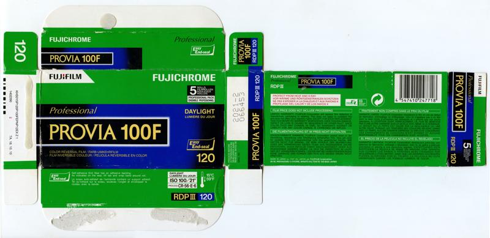
</a>

#### [E-6] Fujifilm Velvia 50 (ref: 9678)

```
Format: 35mm         |  Process : E-6     
ISO   : 50           |  Expiry  : 2012-12 
Type  : Single Pack  |  Quantity: 36exp   
Added : 2026-06-24   |  Author  : Mauphoto
UUID  : ee425a725d52448b95cb0664aabf9678
```

<a href="./archive/00629_000.jpg" target="_blank">
	
</a>


`UUID: a332a7492f2b4a708c8a0ead5b9af986`↓

<a href="./archive/00054_003.jpg" target="_blank">
	
</a>


`UUID: dd9347600c9a47299504239d1038f0dd`↓

<a href="./archive/00054_004.jpg" target="_blank">
	
</a>


`UUID: 90cc6194552d42dd873d9af54a9bc283`↓

<a href="./archive/00054_005.jpg" target="_blank">
	
</a>

#### [E-6] Hazenfilm Sorolla Chrome (ref: 889f)

```
Format: 35mm         |  Process : E-6     
ISO   : 100          |  Expiry  : 2026-08 
Type  : Single Pack  |  Quantity: 36exp   
Added : 2025-07-31   |  Author  : Pelicram
UUID  : 462e32d45cd740cf866732a73a00889f
```

<a href="./archive/00137_000.jpg" target="_blank">
	
</a>

#### [E-6] Ilford Ilfochrome (ref: ac24)

```
Format: 35mm         |  Process : E-6     
ISO   : 100          |  Expiry  : 2026-05 
Type  : Single Pack  |  Quantity: 36exp   
Added : 2025-09-06   |  Author  : kaimon  
UUID  : e7713fa57cac41e3ae3f416f3ea5ac24
```

<a href="./archive/00302_000.jpg" target="_blank">
	
</a>

#### [E-6] Jessops CS100 (ref: 4288)

```
Format: 35mm         |  Process : E-6     
ISO   : 100          |  Expiry  : 2003-09 
Type  : Single Pack  |  Quantity: 36exp   
Added : 2025-09-13   |  Author  : GreatGizmo74
UUID  : 6e2123fd1134408789902c16b3764288
```

<a href="./archive/00334_000.jpg" target="_blank">
	
</a>


`UUID: 488ad47450f348a898c909433e87172f`↓

<a href="./archive/00334_001.jpg" target="_blank">
	
</a>


`UUID: 460cbe6f0af64e2d9a648dc1795c4605`↓

<a href="./archive/00334_002.jpg" target="_blank">
	
</a>


`UUID: c41e2cc23bee49768e995b15393af204`↓

<a href="./archive/00334_003.jpg" target="_blank">
	
</a>

#### [E-6] Kodak Ektachrome 100 Plus (ref: 5d9f)

```
Format: 35mm         |  Process : E-6     
ISO   : 100          |  Expiry  : 2002-08 
Type  : Single Pack  |  Quantity: 36exp   
Added : 2025-07-31   |  Author  : toader  
UUID  : b17b7b46926e49ae88a7b74904245d9f
```

<a href="./archive/00113_000.jpg" target="_blank">
	
</a>


`UUID: 1ac536af04e3459fa3389050a3c93bee`↓

<a href="./archive/00113_001.jpg" target="_blank">
	
</a>

#### [E-6] Kodak Ektachrome 100 Plus (ref: 0183)

```
Format: 220          |  Process : E-6     
ISO   : 100          |  Expiry  : 2005-08 
Type  : Multi-Pack-5 |  Quantity: N/A     
Added : 2025-09-01   |  Author  : dekuNukem
UUID  : 389f8e8d270647eda7b0b7d2ab060183
```

<a href="./archive/00279_000.jpg" target="_blank">
	
</a>


`UUID: 8a7459e9d8894fa8872872fea7032a9d`↓

<a href="./archive/00279_001.jpg" target="_blank">
	
</a>

#### [E-6] Kodak Ektachrome 100HC (ref: 3ab9)

```
Format: 35mm         |  Process : E-6     
ISO   : 100          |  Expiry  : 1994-11 
Type  : Single Pack  |  Quantity: 36exp   
Added : 2025-08-30   |  Author  : dekuNukem
UUID  : c7c26bb546634d47ae7fc5aa68b33ab9
```

<a href="./archive/00275_000.jpg" target="_blank">
	
</a>


`UUID: de18a3dd00a744a3973965244938320f`↓

<a href="./archive/00275_001.jpg" target="_blank">
	
</a>

#### [E-6] Kodak Ektachrome 100HC (ref: 775a)

```
Format: 35mm         |  Process : E-6     
ISO   : 100          |  Expiry  : 1994-11 
Type  : Single Pack  |  Quantity: 36exp   
Added : 2025-08-30   |  Author  : dekuNukem
UUID  : 064dbfe80ca84ac99329c252bce0775a
```

<a href="./archive/00276_000.jpg" target="_blank">
	
</a>


`UUID: 3c397dbea68649edb38d6464d6516746`↓

<a href="./archive/00276_001.jpg" target="_blank">
	
</a>

#### [E-6] Kodak Ektachrome 160T (ref: 7b64)

```
Format: 35mm         |  Process : E-6     
ISO   : 160          |  Expiry  : 1993-09 
Type  : Single Pack  |  Quantity: 24exp   
Added : 2026-04-13   |  Author  : @tylerdrey
UUID  : dae0e4a473644444817e010eeb3d7b64
```

<a href="./archive/00542_000.jpg" target="_blank">
	
</a>


`UUID: d55ee26a62134eabb2784c27adc0c895`↓

<a href="./archive/00542_001.jpg" target="_blank">
	
</a>

#### [E-6] Kodak Ektachrome 160T (ref: f21a)

```
Format: 35mm         |  Process : E-6     
ISO   : 160          |  Expiry  : 2003-02 
Type  : Bulk Roll    |  Quantity: 30.5m   
Added : 2026-06-10   |  Author  : nyctomanica
UUID  : 308fb333b27a4dab9072d131425ef21a
```

<a href="./archive/00584_000.jpg" target="_blank">
	
</a>

#### [E-6] Kodak Ektachrome 200 (ref: f372)

```
Format: 126          |  Process : E-6     
ISO   : 200          |  Expiry  : 1978-11 
Type  : Single Pack  |  Quantity: 20exp   
Added : 2025-08-28   |  Author  : The Compartmentalist
UUID  : fef4be09ea484eecb10a13282d18f372
```

<a href="./archive/00261_000.jpg" target="_blank">
	
</a>


`UUID: 201fc821d3354cd7a82b0e1554ac06e4`↓

<a href="./archive/00261_001.jpg" target="_blank">
	
</a>


`UUID: 8a9d6009b1724610bbea230b5b2bdc73`↓

<a href="./archive/00261_002.jpg" target="_blank">
	
</a>

#### [E-6] Kodak Ektachrome 200 (ref: b21e)

```
Format: 35mm         |  Process : E-6     
ISO   : 200          |  Expiry  : 1992-10 
Type  : Single Pack  |  Quantity: 36exp   
Added : 2025-02-04   |  Author  : b0baspace
UUID  : 7d8346073bbe4d6a84e57cc2bb28b21e
```

<a href="./archive/00052_000.jpg" target="_blank">
	
</a>


`UUID: cbae471aa4184cbeabc5b1f8b49f8943`↓

<a href="./archive/00052_001.jpg" target="_blank">
	
</a>


`UUID: c6c1d49626e14661a700da5b26e07ca8`↓

<a href="./archive/00052_002.jpg" target="_blank">
	
</a>

#### [E-6] Kodak Ektachrome 320T (ref: 0e11)

```
Format: 35mm         |  Process : E-6     
ISO   : 320          |  Expiry  : 2007-02 
Type  : Single Pack  |  Quantity: 36exp   
Added : 2026-06-16   |  Author  : nyctomanica
UUID  : 39eee484e9cf4b8aaade4a1092010e11
```

<a href="./archive/00590_000.jpg" target="_blank">
	
</a>

#### [E-6] Kodak Ektachrome 400 (ref: 2b94)

```
Format: 120          |  Process : E-6     
ISO   : 400          |  Expiry  : 1980-10 
Type  : Single Pack  |  Quantity: N/A     
Added : 2025-09-03   |  Author  : dekuNukem
UUID  : 7c96865a4b554505b46710b016fd2b94
```

<a href="./archive/00294_000.jpg" target="_blank">
	
</a>


`UUID: 53dbbb4bb5fe48e88ed62f5f595f7bab`↓

<a href="./archive/00294_001.jpg" target="_blank">
	
</a>


`UUID: 8d4656fd04a842ddafb29997f55ccb69`↓

<a href="./archive/00294_002.jpg" target="_blank">
	
</a>

#### [E-6] Kodak Ektachrome 400 (ref: 3c96)

```
Format: 35mm         |  Process : E-6     
ISO   : 400          |  Expiry  : 1990-11 
Type  : Single Pack  |  Quantity: 24exp   
Added : 2025-07-29   |  Author  : Nano_Burger
UUID  : 2330da9237ad4dbaac0028199f363c96
```

<a href="./archive/00100_000.jpg" target="_blank">
	
</a>


`UUID: c8ecef6f805d4a7eab60f82855687e17`↓

<a href="./archive/00100_001.jpg" target="_blank">
	
</a>

#### [E-6] Kodak Ektachrome 400X (ref: 5b82)

```
Format: 120          |  Process : E-6     
ISO   : 400          |  Expiry  : 2001-11 
Type  : Multi-Pack-5 |  Quantity: N/A     
Added : 2025-09-01   |  Author  : dekuNukem
UUID  : 877e28be6f7240898a95616c39a95b82
```

<a href="./archive/00278_000.jpg" target="_blank">
	
</a>


`UUID: b17891fbab094a19b7da26c8ac2b40b4`↓

<a href="./archive/00278_001.jpg" target="_blank">
	
</a>

#### [E-6] Kodak Ektachrome 64 (ref: 02cc)

```
Format: 35mm         |  Process : E-6     
ISO   : 64           |  Expiry  : 1986-07 
Type  : Single Pack  |  Quantity: 36exp   
Added : 2025-10-17   |  Author  : @recycling.film
UUID  : 61a248ee92404ad7bcf1a19adbf102cc
Notes : EPR
```

<a href="./archive/00414_000.jpg" target="_blank">
	
</a>


`UUID: 66aac838de9b4f4091acb02215e8b890`↓

<a href="./archive/00414_001.jpg" target="_blank">
	
</a>


`UUID: ee61648a19bd4eaea584f3931618f488`↓

<a href="./archive/00414_002.jpg" target="_blank">
	
</a>

#### [E-6] Kodak Ektachrome 64T (ref: 8f4f)

```
Format: 35mm         |  Process : E-6     
ISO   : 64           |  Expiry  : 1998-10 
Type  : Bulk Roll    |  Quantity: 100ft   
Added : 2025-08-14   |  Author  : Camera.Riley
UUID  : 25961b13fd6943a9b7dd77b2eba18f4f
```

<a href="./archive/00180_000.jpg" target="_blank">
	
</a>


`UUID: 78441115e27d4fe8a442ce240ec160ef`↓

<a href="./archive/00180_001.jpg" target="_blank">
	
</a>

#### [E-6] Kodak Ektachrome 64T (ref: 4b11)

```
Format: 35mm         |  Process : E-6     
ISO   : 64           |  Expiry  : 2004-03 
Type  : Bulk Roll    |  Quantity: 30.5m   
Added : 2026-06-18   |  Author  : nyctomanica
UUID  : ae1e47c3a7ce4d399556eba279964b11
```

<a href="./archive/00606_000.jpg" target="_blank">
	
</a>


`UUID: 51e54b2648a04424b6cd438fa9c24ce6`↓

<a href="./archive/00606_001.jpg" target="_blank">
	
</a>

#### [E-6] Kodak Ektachrome E100 (ref: 94ff)

```
Format: 35mm         |  Process : E-6     
ISO   : 100          |  Expiry  : 2024-12 
Type  : Single Pack  |  Quantity: 36exp   
Added : 2025-08-20   |  Author  : @photos.by.qi
UUID  : 1d1d6ca155874b6dba4333cf6f6194ff
```

<a href="./archive/00223_000.jpg" target="_blank">
	
</a>

#### [E-6] Kodak Ektachrome E100 (ref: ae10)

```
Format: 35mm         |  Process : E-6     
ISO   : 100          |  Expiry  : 2027-02 
Type  : Single Pack  |  Quantity: 36exp   
Added : 2025-08-02   |  Author  : toader  
UUID  : 829cd9dd98cd489f8bff71e403c1ae10
```

<a href="./archive/00155_000.jpg" target="_blank">
	
</a>

#### [E-6] Kodak Ektachrome E100VS (ref: a8d3)

```
Format: 120          |  Process : E-6     
ISO   : 100          |  Expiry  : 2010-04 
Type  : Multi-Pack-5 |  Quantity: N/A     
Added : 2025-08-03   |  Author  : dekuNukem
UUID  : e8673d04cee440bd9c065a37a485a8d3
```

<a href="./archive/00160_000.jpg" target="_blank">
	
</a>

#### [E-6] Kodak Ektachrome E200 (ref: 9879)

```
Format: 35mm         |  Process : E-6     
ISO   : 200          |  Expiry  : 2003-10 
Type  : Bulk Roll    |  Quantity: 30.5m   
Added : 2026-06-10   |  Author  : nyctomanica
UUID  : c8b4e91fe2e34428a095ae48184f9879
```

<a href="./archive/00583_000.jpg" target="_blank">
	
</a>

#### [E-6] Kodak Ektachrome Elite 100 (ref: 26ef)

```
Format: 35mm         |  Process : E-6     
ISO   : 100          |  Expiry  : 1995-11 
Type  : Single Pack  |  Quantity: 24exp   
Added : 2025-07-31   |  Author  : toader  
UUID  : 175cf2b69fe3413093d9d7f9ea0d26ef
```

<a href="./archive/00114_000.jpg" target="_blank">
	
</a>


`UUID: 89d1b19f3e364f55adc2523a07ed9ddb`↓

<a href="./archive/00114_001.jpg" target="_blank">
	
</a>

#### [E-6] Kodak Ektachrome Elite 200 (ref: b736)

```
Format: 35mm         |  Process : E-6     
ISO   : 200          |  Expiry  : 1997-07 
Type  : Single Pack  |  Quantity: 36exp   
Added : 2025-11-25   |  Author  : @recycling.film
UUID  : 19e57cb4060b4782955a5a5667fdb736
```

<a href="./archive/00484_000.jpg" target="_blank">
	
</a>


`UUID: d71ecd2dd0d14c0f9c86aea0d8be963f`↓

<a href="./archive/00484_001.jpg" target="_blank">
	
</a>

#### [E-6] Kodak Ektachrome Elite 200 (ref: a391)

```
Format: 35mm         |  Process : E-6     
ISO   : 200          |  Expiry  : 1997-08 
Type  : Single Pack  |  Quantity: 36exp   
Added : 2025-08-30   |  Author  : dekuNukem
UUID  : 5f3a81c10cdb46baa28b1b1fbc56a391
```

<a href="./archive/00274_000.jpg" target="_blank">
	
</a>


`UUID: 4c120316ad9f4fedb57d57138d37d0e1`↓

<a href="./archive/00274_001.jpg" target="_blank">
	
</a>

#### [E-6] Kodak Ektachrome Professional Film 5018 (ref: 6ace)

```
Format: 35mm         |  Process : E-6     
ISO   : 50           |  Expiry  : 1985-01 
Type  : Single Pack  |  Quantity: 30m     
Added : 2026-06-16   |  Author  : nyctomanica
UUID  : 83f596535e834c1a941be969aab46ace
```

<a href="./archive/00600_000.jpg" target="_blank">
	
</a>

#### [E-6] Kodak Ektachrome Slide Duplicating Film (ref: 596a)

```
Format: 35mm         |  Process : E-6     
ISO   : Unknown      |  Expiry  : 1998-04 
Type  : Bulk Roll    |  Quantity: 100ft   
Added : 2025-08-28   |  Author  : The Compartmentalist
UUID  : 82095e23320f4581be4672fd5559596a
```

<a href="./archive/00260_000.jpg" target="_blank">
	
</a>

#### [E-6] Kodak Ektachrome Slide Duplicating Film (ref: d53a)

```
Format: 35mm         |  Process : E-6     
ISO   : Unknown      |  Expiry  : 1999-12 
Type  : Single Pack  |  Quantity: 36exp   
Added : 2025-08-19   |  Author  : @ellafridalindblom
UUID  : 59aa1c52cf434a60976debe684a3d53a
```

<a href="./archive/00203_000.jpg" target="_blank">
	
</a>


`UUID: a15217b7a9c34d25a71276e952a8dce0`↓

<a href="./archive/00203_001.jpg" target="_blank">
	
</a>


`UUID: 70ffb21210374c97a9fa3b819e9b3a1a`↓

<a href="./archive/00203_002.jpg" target="_blank">
	
</a>

#### [E-6] Kodak Elite Chrome (ref: 523c)

```
Format: 35mm         |  Process : E-6     
ISO   : 100          |  Expiry  : 2001-08 
Type  : Single Pack  |  Quantity: 36exp   
Added : 2025-01-14   |  Author  : @ob.skura
UUID  : e0b3ec957ade47a99d5cd5abe2a4523c
```

<a href="./archive/00042_000.jpg" target="_blank">
	
</a>

#### [E-6] Kodak Elite Chrome (ref: 3943)

```
Format: 35mm         |  Process : E-6     
ISO   : 400          |  Expiry  : 2007-10 
Type  : Single Pack  |  Quantity: 24exp   
Added : 2025-08-14   |  Author  : Camera.Riley
UUID  : c9ba81252c5f438ca70922a2b5703943
```

<a href="./archive/00178_000.jpg" target="_blank">
	
</a>


`UUID: 7c1650085c4146e0bec821475e25219f`↓

<a href="./archive/00178_001.jpg" target="_blank">
	
</a>

#### [E-6] Kodak Elite Chrome Extra Color (ref: 71f9)

```
Format: 35mm         |  Process : E-6     
ISO   : 100          |  Expiry  : 2009-12 
Type  : Single Pack  |  Quantity: 36exp   
Added : 2026-06-24   |  Author  : Mauphoto
UUID  : b15598742abf4dada03cecd44e4071f9
```

<a href="./archive/00631_000.jpg" target="_blank">
	
</a>

#### [E-6] Konica Minolta Centuria 100 (ref: 00ae)

```
Format: 35mm         |  Process : E-6     
ISO   : 100          |  Expiry  : 2008-02 
Type  : Single Pack  |  Quantity: 36exp   
Added : 2026-06-24   |  Author  : Mauphoto
UUID  : c93974535a3441acb0edbbd16b0f00ae
```

<a href="./archive/00640_000.jpg" target="_blank">
	
</a>


`UUID: cd9c544f57314e79b7c1cbc0cc74bedc`↓

<a href="./archive/00640_001.jpg" target="_blank">
	
</a>

#### [E-6] Lomography Color Slide / X-Pro 200 (ref: 22bc)

```
Format: 35mm         |  Process : E-6     
ISO   : 200          |  Expiry  : 2018-06 
Type  : Multi-Pack-3 |  Quantity: 36exp   
Added : 2026-06-18   |  Author  : nyctomanica
UUID  : fa1a525240b548f599483ad50ba122bc
Notes : aka Rollei Crossbird, AGFA Aviphot Chrome 200?
```

<a href="./archive/00616_000.jpg" target="_blank">
	
</a>

#### [E-6] ORWO OrwoChrome RC100 (ref: a9b6)

```
Format: 35mm         |  Process : E-6     
ISO   : 100          |  Expiry  : 1995-09 
Type  : Single Pack  |  Quantity: 36exp   
Added : 2026-03-02   |  Author  : Luci 101
UUID  : 2ba82c28507045deadcde0588535a9b6
```

<a href="./archive/00530_000.jpg" target="_blank">
	
</a>


`UUID: 427907b346804a719d109c5c7d407e84`↓

<a href="./archive/00530_001.jpg" target="_blank">
	
</a>

#### [E-6] ORWO OrwoChrome UT18 (ref: f2ce)

```
Format: 35mm         |  Process : E-6     
ISO   : 50           |  Expiry  : 1992-01 
Type  : Single Pack  |  Quantity: 36exp   
Added : 2026-04-13   |  Author  : Luci 101
UUID  : ee69ebd9b18946a2b81e5369f74ff2ce
```

<a href="./archive/00544_000.jpg" target="_blank">
	
</a>


`UUID: 57b927e054184769b5ae8313c7d5d9e3`↓

<a href="./archive/00544_001.jpg" target="_blank">
	
</a>


`UUID: c034fd63fef94771a456a85502c95560`↓

<a href="./archive/00544_002.jpg" target="_blank">
	
</a>


`UUID: fbb516474ad04dc1a9432b4540028826`↓

<a href="./archive/00544_003.jpg" target="_blank">
	
</a>


`UUID: 071fb5a273094f789e73ff7263d24747`↓

<a href="./archive/00544_004.jpg" target="_blank">
	
</a>


`UUID: 456bc06ad0d5476aa82f4e4d4dd74027`↓

<a href="./archive/00544_005.jpg" target="_blank">
	
</a>

#### [E-6] Perutz CR 100 (ref: b5df)

```
Format: 35mm         |  Process : E-6     
ISO   : 100          |  Expiry  : 2006-03 
Type  : Single Pack  |  Quantity: 36exp   
Added : 2026-06-24   |  Author  : Mauphoto
UUID  : 8952a19caaea4975a38cd877ca5ab5df
```

<a href="./archive/00642_000.jpg" target="_blank">
	
</a>


`UUID: 87e07caa491d425390bf58ed01117d2b`↓

<a href="./archive/00642_001.jpg" target="_blank">
	
</a>

#### [ECN-2] Alien Film 5207/250D (ref: 8820)

```
Format: 120          |  Process : ECN-2   
ISO   : 250          |  Expiry  : 2026-06 
Type  : Single Pack  |  Quantity: N/A     
Added : 2025-01-04   |  Author  : dekuNukem
UUID  : aedc4b00bd174e0baf7c744ed21d8820
```

<a href="./archive/00001_000.jpg" target="_blank">
	
</a>

#### [ECN-2] Building 2 200T (ref: c025)

```
Format: 35mm         |  Process : ECN-2   
ISO   : 200          |  Expiry  : 2021-06 
Type  : Single Pack  |  Quantity: 36exp   
Added : 2025-08-20   |  Author  : @photos.by.qi
UUID  : 4e05091526684626b09f6f957dd9c025
```

<a href="./archive/00210_000.jpg" target="_blank">
	
</a>

#### [ECN-2] Building 2 250D (ref: 7d4f)

```
Format: 35mm         |  Process : ECN-2   
ISO   : 250          |  Expiry  : 2020-12 
Type  : Single Pack  |  Quantity: 36exp   
Added : 2025-08-20   |  Author  : @photos.by.qi
UUID  : 693d77ba06bc4823bd4f43112d957d4f
```

<a href="./archive/00211_000.jpg" target="_blank">
	
</a>

#### [ECN-2] Building 2 500T (ref: 70d9)

```
Format: 35mm         |  Process : ECN-2   
ISO   : 500          |  Expiry  : 2021-06 
Type  : Single Pack  |  Quantity: 36exp   
Added : 2025-08-20   |  Author  : @photos.by.qi
UUID  : 2e9e8e40ac154f4f9ac497837e2470d9
```

<a href="./archive/00212_000.jpg" target="_blank">
	
</a>

#### [ECN-2] Building 2 50D (ref: e548)

```
Format: 35mm         |  Process : ECN-2   
ISO   : 50           |  Expiry  : 2021-06 
Type  : Single Pack  |  Quantity: 36exp   
Added : 2025-08-20   |  Author  : @photos.by.qi
UUID  : f0c8cbdc08d146ba8690d19a70dbe548
```

<a href="./archive/00213_000.jpg" target="_blank">
	
</a>

#### [ECN-2] Freestyle 500T (ref: 8073)

```
Format: 35mm         |  Process : ECN-2   
ISO   : 400          |  Expiry  : Unknown 
Type  : Single Pack  |  Quantity: 36exp   
Added : 2026-05-26   |  Author  : @Hol.m35
UUID  : b7110d960d454ac484eafe3b650c8073
```

<a href="./archive/00579_000.jpg" target="_blank">
	
</a>

#### [ECN-2] Mr. Negative 250D (ref: 3574)

```
Format: 35mm         |  Process : ECN-2   
ISO   : 250          |  Expiry  : 2024-01 
Type  : Single Pack  |  Quantity: 36exp   
Added : 2025-09-11   |  Author  : @sachynmital
UUID  : e5b29575691e43d8bc17578978083574
```

<a href="./archive/00321_000.jpg" target="_blank">
	
</a>

#### [ECN-2] Mr. Negative Eterna 250D (ref: 6d6e)

```
Format: 35mm         |  Process : ECN-2   
ISO   : 250          |  Expiry  : 2013-01 
Type  : Single Pack  |  Quantity: 36exp   
Added : 2025-09-11   |  Author  : @sachynmital
UUID  : 955fbe87cb4c45dfb7f198cc638d6d6e
```

<a href="./archive/00322_000.jpg" target="_blank">
	
</a>

#### [ECN-2] Mr. Negative Silver Screen Negative (ref: c968)

```
Format: 35mm         |  Process : ECN-2   
ISO   : 200          |  Expiry  : 2024-01 
Type  : Single Pack  |  Quantity: 36exp   
Added : 2025-09-11   |  Author  : @sachynmital
UUID  : 4acd5aeda3a34bc89b646a14bb4dc968
```

<a href="./archive/00323_000.jpg" target="_blank">
	
</a>

#### [ECN-2] Mutascan Kodak Vision3 500T/5219 (ref: 5150)

```
Format: 35mm         |  Process : ECN-2   
ISO   : 500          |  Expiry  : Unknown 
Type  : Bulk Roll    |  Quantity: 100ft   
Added : 2025-08-15   |  Author  : Pelicram
UUID  : e4d2af3a69704509a07e108fcb4b5150
```

<a href="./archive/00185_000.jpg" target="_blank">
	
</a>

#### [ECN-2] Optik Oldschool Motion 200T (ref: 0d90)

```
Format: 35mm         |  Process : ECN-2   
ISO   : 200          |  Expiry  : 2028-04 
Type  : Single Pack  |  Quantity: 36exp   
Added : 2026-05-26   |  Author  : @Hol.m35
UUID  : b389844cc8c04ab8b936315354330d90
```

<a href="./archive/00568_000.jpg" target="_blank">
	
</a>

#### [ECN-2] Optik Oldschool Motion 500T (ref: bd42)

```
Format: 35mm         |  Process : ECN-2   
ISO   : 500          |  Expiry  : 2028-04 
Type  : Single Pack  |  Quantity: 36exp   
Added : 2026-05-26   |  Author  : @Hol.m35
UUID  : f437c859b1564324968e289acecfbd42
```

<a href="./archive/00569_000.jpg" target="_blank">
	
</a>

#### [ECN-2] Reflx Lab 250D (ref: 1a3e)

```
Format: 120          |  Process : ECN-2   
ISO   : 250          |  Expiry  : 2027-12 
Type  : Single Pack  |  Quantity: N/A     
Added : 2025-08-18   |  Author  : lt_col_tall
UUID  : ce8b081c148f43f7921e2fb4d7aa1a3e
```

<a href="./archive/00194_000.jpg" target="_blank">
	
</a>

#### [ECN-2] Three Film Rolls 5207 (ref: 0292)

```
Format: 35mm         |  Process : ECN-2   
ISO   : 250          |  Expiry  : 2025-12 
Type  : Single Pack  |  Quantity: 36exp   
Added : 2025-05-24   |  Author  : dekuNukem
UUID  : 4de0f5e76dd748c488fa81be23340292
```

<a href="./archive/00059_000.jpg" target="_blank">
	
</a>

#### [Instant] Fujifilm FP-100B (ref: f3dd)

```
Format: Instant Pack Film|  Process : Instant 
ISO   : 100          |  Expiry  : 2010-05 
Type  : Single Pack  |  Quantity: 10exp   
Added : 2026-06-16   |  Author  : nyctomanica
UUID  : ea6ab39216914f77b0ca7ed0f243f3dd
```

<a href="./archive/00602_000.jpg" target="_blank">
	
</a>

#### [Instant] Fujifilm FP-100C (ref: 5cda)

```
Format: Instant Pack Film|  Process : Instant 
ISO   : 100          |  Expiry  : 2015-01 
Type  : Single Pack  |  Quantity: 10exp   
Added : 2025-09-01   |  Author  : @recycling.film
UUID  : 9bf3702e732a42adb54727a565645cda
```

<a href="./archive/00277_000.jpg" target="_blank">
	
</a>


`UUID: bfb832790e754aa0ba98a030969ab95d`↓

<a href="./archive/00277_001.jpg" target="_blank">
	
</a>

#### [Instant] Fujifilm FP-100C Silk (ref: b7aa)

```
Format: Instant Pack Film|  Process : Instant 
ISO   : 100          |  Expiry  : 2015-01 
Type  : Single Pack  |  Quantity: 10exp   
Added : 2026-06-18   |  Author  : nyctomanica
UUID  : 38650eb6e4cc42f8bd6b7875dcc5b7aa
```

<a href="./archive/00618_000.jpg" target="_blank">
	
</a>

#### [Instant] Fujifilm FP-3000B (ref: 9d7e)

```
Format: Instant Pack Film|  Process : Instant 
ISO   : 3200         |  Expiry  : 2015-06 
Type  : Single Pack  |  Quantity: 10exp   
Added : 2026-06-18   |  Author  : nyctomanica
UUID  : 8382f7e52acc4167bd2aaae4ec319d7e
```

<a href="./archive/00617_000.jpg" target="_blank">
	
</a>


`UUID: 487b8dd980bd49e9b21c32a2a72657d1`↓

<a href="./archive/00617_001.jpg" target="_blank">
	
</a>

#### [Instant] Fujifilm Instax Mini (ref: e5e7)

```
Format: Instant Integral Film|  Process : Instant 
ISO   : 800          |  Expiry  : 2027-04 
Type  : Multi-Pack-2 |  Quantity: 10exp   
Added : 2025-09-06   |  Author  : @toastergod101
UUID  : b8ea314888b244f8ab8ace49c734e5e7
```

<a href="./archive/00307_000.jpg" target="_blank">
	
</a>

#### [Instant] Fujifilm Instax Wide (ref: 51ce)

```
Format: Instant Integral Film|  Process : Instant 
ISO   : 800          |  Expiry  : 2021-05 
Type  : Multi-Pack-2 |  Quantity: 10exp   
Added : 2026-06-18   |  Author  : nyctomanica
UUID  : 6fd9245fee514c42b71121e489f051ce
```

<a href="./archive/00622_000.jpg" target="_blank">
	
</a>

#### [Instant] Fujifilm Instax Wide Monochrome (ref: 58d8)

```
Format: Instant Integral Film|  Process : Instant 
ISO   : 800          |  Expiry  : 2020-09 
Type  : Single Pack  |  Quantity: 10exp   
Added : 2026-06-18   |  Author  : nyctomanica
UUID  : 48b08b5b3a8a4edc98fd29e6fd1c58d8
```

<a href="./archive/00620_000.jpg" target="_blank">
	
</a>

#### [Instant] Impossible Project Color 600 (ref: 55a1)

```
Format: Instant Integral Film|  Process : Instant 
ISO   : 640          |  Expiry  : 2014-01 
Type  : Single Pack  |  Quantity: 8exp    
Added : 2026-06-18   |  Author  : nyctomanica
UUID  : 9ee1d3c8eb704994866eb1c5c22855a1
```

<a href="./archive/00610_000.jpg" target="_blank">
	
</a>

#### [Instant] Impossible Project Color 600 (ref: b84c)

```
Format: Instant Integral Film|  Process : Instant 
ISO   : 640          |  Expiry  : 2016-01 
Type  : Single Pack  |  Quantity: 8exp    
Added : 2026-06-18   |  Author  : nyctomanica
UUID  : dfb73aa922ec405b8fd100ed1785b84c
```

<a href="./archive/00611_000.jpg" target="_blank">
	
</a>

#### [Instant] Impossible Project Color Instant Film for Polaroid SX-70 Type Cameras (ref: 861c)

```
Format: Instant Integral Film|  Process : Instant 
ISO   : 160          |  Expiry  : 2013-11 
Type  : Single Pack  |  Quantity: 8exp    
Added : 2025-10-14   |  Author  : dekuNukem
UUID  : 0543dd31cf204c8499f5f1e51a9b861c
```

<a href="./archive/00395_000.jpg" target="_blank">
	
</a>


`UUID: c8261d3d4696463091c1e946521ba6b8`↓

<a href="./archive/00395_001.jpg" target="_blank">
	
</a>


`UUID: f6f40232e62741eb8bbc5f22f9e38dc8`↓

<a href="./archive/00395_002.jpg" target="_blank">
	
</a>


`UUID: e0caa1919c6d4af3a5478f7e16c3664d`↓

<a href="./archive/00395_003.jpg" target="_blank">
	
</a>


`UUID: 771ae62e2ca14e40a13c15c815d42ff0`↓

<a href="./archive/00395_004.jpg" target="_blank">
	
</a>


`UUID: fe686e709acd4d8eb81aa903bc07d146`↓

<a href="./archive/00395_005.jpg" target="_blank">
	
</a>


`UUID: 1bb9712c568140bd86d5d2ba361b85c9`↓

<a href="./archive/00395_006.jpg" target="_blank">
	
</a>

#### [Instant] Impossible Project PX 600 Silver Shade / First Flush (ref: 8636)

```
Format: Instant Integral Film|  Process : Instant 
ISO   : 600          |  Expiry  : 2010-04 
Type  : Single Pack  |  Quantity: 8exp    
Added : 2026-06-16   |  Author  : nyctomanica
UUID  : d77ac027dc34418082f8f65887ca8636
```

<a href="./archive/00598_000.jpg" target="_blank">
	
</a>


`UUID: a1e2cdb1abb74300a8387b69c97a4f4b`↓

<a href="./archive/00598_001.jpg" target="_blank">
	
</a>


`UUID: f95f44f60de24d11b8140ecd0493b540`↓

<a href="./archive/00598_002.jpg" target="_blank">
	
</a>

#### [Instant] Impossible Project PX 600 Silver Shade UV+ (ref: 20f3)

```
Format: Instant Integral Film|  Process : Instant 
ISO   : 600          |  Expiry  : Unknown 
Type  : Single Pack  |  Quantity: 8exp    
Added : 2025-09-28   |  Author  : @ellafridalindblom
UUID  : 28ed6948476d4d7baeb8e7fd7c3520f3
```

<a href="./archive/00354_000.jpg" target="_blank">
	
</a>

#### [Instant] Impossible Project PX 680 Color Shade / First Flush (ref: 580b)

```
Format: Instant Integral Film|  Process : Instant 
ISO   : 600          |  Expiry  : 2011-07 
Type  : Single Pack  |  Quantity: 8exp    
Added : 2026-06-16   |  Author  : nyctomanica
UUID  : 21d81b0f422340189e48c53b02b8580b
```

<a href="./archive/00592_000.jpg" target="_blank">
	
</a>

#### [Instant] Impossible Project PX 70 Color Shade / First Flush (ref: 1ad9)

```
Format: Instant Integral Film|  Process : Instant 
ISO   : 125          |  Expiry  : 2010-07 
Type  : Single Pack  |  Quantity: 8exp    
Added : 2026-06-16   |  Author  : nyctomanica
UUID  : 690311c1402d40eca1ced80f9af11ad9
```

<a href="./archive/00597_000.jpg" target="_blank">
	
</a>


`UUID: d0c2a5e34bb54cedad81a49f4c338f7a`↓

<a href="./archive/00597_001.jpg" target="_blank">
	
</a>

#### [Instant] Impossible Project Polaroid Type 100 Chocolate Paul Giambarba Edition (ref: 6028)

```
Format: Instant Pack Film|  Process : Instant 
ISO   : 80           |  Expiry  : 2010-12 
Type  : Single Pack  |  Quantity: Unknown 
Added : 2026-06-18   |  Author  : nyctomanica
UUID  : 9b939ce0c8d7401c936cfcbc85c76028
```

<a href="./archive/00613_000.jpg" target="_blank">
	
</a>

#### [Instant] One Instant Type 100 Peel-Apart Colorfilm (ref: ff2c)

```
Format: Instant Pack Film|  Process : Instant 
ISO   : 100          |  Expiry  : 2019-09 
Type  : Multi-Pack-3 |  Quantity: 1exp    
Added : 2026-06-18   |  Author  : nyctomanica
UUID  : 20749de9fbb140d88baffc08facbff2c
```

<a href="./archive/00619_000.jpg" target="_blank">
	
</a>

#### [Instant] Polaroid 100 Blue Film (ref: 93b8)

```
Format: Instant Pack Film|  Process : Instant 
ISO   : 80           |  Expiry  : 2009-04 
Type  : Single Pack  |  Quantity: 10exp   
Added : 2026-06-16   |  Author  : nyctomanica
UUID  : 5efc4291de384f9fa47153d007d293b8
```

<a href="./archive/00593_000.jpg" target="_blank">
	
</a>

#### [Instant] Polaroid 100 Chocolate Film (ref: a70f)

```
Format: Instant Pack Film|  Process : Instant 
ISO   : 80           |  Expiry  : 2009-10 
Type  : Single Pack  |  Quantity: 10exp   
Added : 2026-06-18   |  Author  : nyctomanica
UUID  : d8e74033014e4db9af13c8b1aac4a70f
```

<a href="./archive/00614_000.jpg" target="_blank">
	
</a>

#### [Instant] Polaroid 100 Sepia Film (ref: 9893)

```
Format: Instant Pack Film|  Process : Instant 
ISO   : 1500         |  Expiry  : 2009-10 
Type  : Single Pack  |  Quantity: 10exp   
Added : 2026-06-16   |  Author  : nyctomanica
UUID  : 3dc991e05c9b43cdbb85b18aabc29893
```

<a href="./archive/00599_000.jpg" target="_blank">
	
</a>

#### [Instant] Polaroid 1200 (ref: a657)

```
Format: Instant Integral Film|  Process : Instant 
ISO   : 640          |  Expiry  : 2007-01 
Type  : Single Pack  |  Quantity: 12exp   
Added : 2026-06-18   |  Author  : nyctomanica
UUID  : 19b92b8aeb2b4e82b1ca2efa19eda657
Notes : Polaroid 1200 2x 12 photos (thinner Image/Spectra with 12 shots instead of 10)
```

<a href="./archive/00605_000.jpg" target="_blank">
	
</a>

#### [Instant] Polaroid 125i Gloss (ref: 7dd1)

```
Format: Instant Pack Film|  Process : Instant 
ISO   : 125          |  Expiry  : 2008-02 
Type  : Single Pack  |  Quantity: 22exp   
Added : 2026-06-18   |  Author  : nyctomanica
UUID  : 1a7ddb61af5a486d85577e89cf317dd1
```

<a href="./archive/00608_000.jpg" target="_blank">
	
</a>

#### [Instant] Polaroid 664 (ref: 4c40)

```
Format: Instant Pack Film|  Process : Instant 
ISO   : 100          |  Expiry  : 2009-10 
Type  : Single Pack  |  Quantity: 20exp   
Added : 2026-06-18   |  Author  : nyctomanica
UUID  : cb070eea20764039a6b29ad007c54c40
Notes : Also called Polapan Pro 100?
```

<a href="./archive/00609_000.jpg" target="_blank">
	
</a>

#### [Instant] Polaroid 664 (ref: 4f1a)

```
Format: Instant Pack Film|  Process : Instant 
ISO   : 100          |  Expiry  : 2009-10 
Type  : Single Pack  |  Quantity: 20exp   
Added : 2026-06-18   |  Author  : nyctomanica
UUID  : c2158d300cde448bb229862cfa014f1a
```

<a href="./archive/00612_000.jpg" target="_blank">
	
</a>

#### [Instant] Polaroid 665 (ref: e054)

```
Format: Instant Pack Film|  Process : Instant 
ISO   : 80           |  Expiry  : 1996-08 
Type  : Single Pack  |  Quantity: 8exp    
Added : 2025-01-04   |  Author  : dekuNukem
UUID  : 311d896d68b74b1193afcfa129c5e054
```

<a href="./archive/00018_000.jpg" target="_blank">
	
</a>

#### [Instant] Polaroid 669 (ref: 3566)

```
Format: Instant Pack Film|  Process : Instant 
ISO   : 80           |  Expiry  : 2006-03 
Type  : Single Pack  |  Quantity: 20exp   
Added : 2025-01-04   |  Author  : dekuNukem
UUID  : bb62de3a22c04f699c780aeae7c83566
```

<a href="./archive/00020_000.jpg" target="_blank">
	
</a>

#### [Instant] Polaroid 669 (ref: 2e70)

```
Format: Instant Pack Film|  Process : Instant 
ISO   : 80           |  Expiry  : 2008-10 
Type  : Single Pack  |  Quantity: 10exp   
Added : 2026-07-13   |  Author  : nyctomanica
UUID  : e879c9f5665f4692a40ab8d839412e70
```

<a href="./archive/00660_000.jpg" target="_blank">
	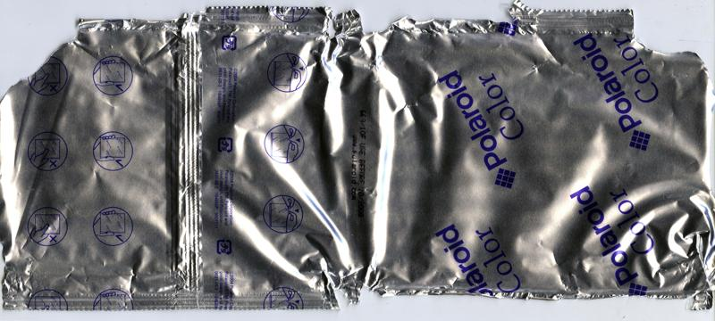
</a>


`UUID: 2e5f63ccf4454fad8c3deadb0c7ff0a6`↓

<a href="./archive/00660_001.jpg" target="_blank">
	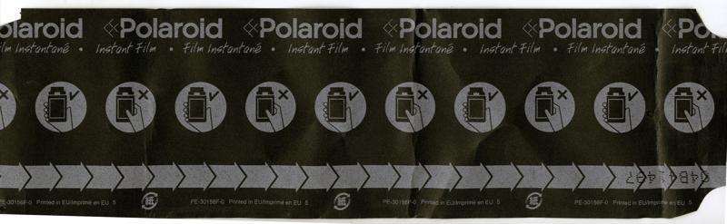
</a>

#### [Instant] Polaroid 669 (ref: 2c27)

```
Format: Instant Pack Film|  Process : Instant 
ISO   : 80           |  Expiry  : 2009-03 
Type  : Single Pack  |  Quantity: 20exp   
Added : 2026-06-18   |  Author  : nyctomanica
UUID  : 20659b99ecfa48af97cdfca3d1dc2c27
```

<a href="./archive/00607_000.jpg" target="_blank">
	
</a>


`UUID: 8a98a85e7a474b69bdcb6ab34cf07935`↓

<a href="./archive/00607_001.jpg" target="_blank">
	
</a>

#### [Instant] Polaroid 672 (ref: b335)

```
Format: Instant Pack Film|  Process : Instant 
ISO   : 400          |  Expiry  : 2004-01 
Type  : Single Pack  |  Quantity: 20exp   
Added : 2026-06-16   |  Author  : nyctomanica
UUID  : a2615a83b6774edda1567fe0e8deb335
```

<a href="./archive/00601_000.jpg" target="_blank">
	
</a>

#### [Instant] Polaroid 690 (ref: bd98)

```
Format: Instant Pack Film|  Process : Instant 
ISO   : 100          |  Expiry  : 2009-10 
Type  : Single Pack  |  Quantity: 10exp   
Added : 2026-06-18   |  Author  : nyctomanica
UUID  : 4624d642b93d4c75a7a2d53a4a33bd98
```

<a href="./archive/00615_000.jpg" target="_blank">
	
</a>

#### [Instant] Polaroid 87 (ref: 62ef)

```
Format: Instant Pack Film|  Process : Instant 
ISO   : 3000         |  Expiry  : 2006-07 
Type  : Single Pack  |  Quantity: 10exp   
Added : 2025-08-03   |  Author  : dekuNukem
UUID  : 5a63521777ca4f788d01aac5f94862ef
```

<a href="./archive/00158_000.jpg" target="_blank">
	
</a>


`UUID: 55178f72127944e898f8804ac2663c79`↓

<a href="./archive/00158_001.jpg" target="_blank">
	
</a>

#### [Instant] Polaroid 990 (ref: e3bc)

```
Format: Instant Integral Film|  Process : Instant 
ISO   : 640          |  Expiry  : 2008-10 
Type  : Multi-Pack-2 |  Quantity: 10exp   
Added : 2025-09-18   |  Author  : dekuNukem
UUID  : 79f8183905d443aaaab84c6f0944e3bc
```

<a href="./archive/00349_000.jpg" target="_blank">
	
</a>


`UUID: 6e2ec8c800b140baaf1a2438e722931c`↓

<a href="./archive/00349_001.jpg" target="_blank">
	
</a>


`UUID: d4caa7bc6e1a46e1a5712fccfe5003e0`↓

<a href="./archive/00349_002.jpg" target="_blank">
	
</a>


`UUID: 99e7ca19be7b412ba276d45c7a09369f`↓

<a href="./archive/00349_003.jpg" target="_blank">
	
</a>

#### [Instant] Polaroid B&W i-Type Film (ref: 963a)

```
Format: Instant Integral Film|  Process : Instant 
ISO   : 640          |  Expiry  : 2025-07 
Type  : Single Pack  |  Quantity: 8exp    
Added : 2026-04-13   |  Author  : Dialupdude
UUID  : d0c5d59f8d974c83b651e1b9e8f7963a
```

<a href="./archive/00565_000.jpg" target="_blank">
	
</a>


`UUID: 77ff51132ecc4e08b3c3e93abebe4af8`↓

<a href="./archive/00565_001.jpg" target="_blank">
	
</a>

#### [Instant] Polaroid Color 600 Film (ref: e12f)

```
Format: Instant Integral Film|  Process : Instant 
ISO   : 640          |  Expiry  : 2026-09 
Type  : Single Pack  |  Quantity: 16exp   
Added : 2025-12-12   |  Author  : toader  
UUID  : 51d75e2058564d668402d5f1bf3fe12f
```

<a href="./archive/00498_000.jpg" target="_blank">
	
</a>


`UUID: f6c79651a4c147e0b902c3e8c4db52e3`↓

<a href="./archive/00498_001.jpg" target="_blank">
	
</a>


`UUID: 52079bbae4d8474da690f4f6da194578`↓

<a href="./archive/00498_002.jpg" target="_blank">
	
</a>


`UUID: d3ee36b0442241e78e56a0b9910e24a9`↓

<a href="./archive/00498_003.jpg" target="_blank">
	
</a>

#### [Instant] Polaroid Color 600 Film Round Frame (ref: d985)

```
Format: Instant Integral Film|  Process : Instant 
ISO   : 640          |  Expiry  : 2024-12 
Type  : Single Pack  |  Quantity: 8exp    
Added : 2025-08-02   |  Author  : toader  
UUID  : e798fdd114be4a018cb7651bba94d985
```

<a href="./archive/00157_000.jpg" target="_blank">
	
</a>


`UUID: b9ec4052b0d548ef90f77d7fc99d0ccb`↓

<a href="./archive/00157_001.jpg" target="_blank">
	
</a>


`UUID: 95b81cc72d3646d6966a2341510333aa`↓

<a href="./archive/00157_002.jpg" target="_blank">
	
</a>


`UUID: 038f964e849d4fd1a0c6f1aeb6dd4b0e`↓

<a href="./archive/00157_003.jpg" target="_blank">
	
</a>

#### [Instant] Polaroid Color SX-70 Film (ref: dc7f)

```
Format: Instant Integral Film|  Process : Instant 
ISO   : 160          |  Expiry  : 2025-04 
Type  : Single Pack  |  Quantity: 8exp    
Added : 2025-08-02   |  Author  : toader  
UUID  : b4af154cea6f40c0aa1d4154d0c2dc7f
```

<a href="./archive/00156_000.jpg" target="_blank">
	
</a>


`UUID: 5ce2d6b8b1894bf7b67c5a9fdd635a6e`↓

<a href="./archive/00156_001.jpg" target="_blank">
	
</a>


`UUID: 170151c0a84e459db08a9b3718b67743`↓

<a href="./archive/00156_002.jpg" target="_blank">
	
</a>


`UUID: 3c3020e2767a48b88a7dd8662a0ec06d`↓

<a href="./archive/00156_003.jpg" target="_blank">
	
</a>

#### [Instant] Polaroid Color i-Type Film (ref: 47a7)

```
Format: Instant Integral Film|  Process : Instant 
ISO   : 640          |  Expiry  : 2023-07 
Type  : Single Pack  |  Quantity: 16exp   
Added : 2026-04-13   |  Author  : Dialupdude
UUID  : a0f16870196d400eb47971a65ab747a7
```

<a href="./archive/00563_000.jpg" target="_blank">
	
</a>


`UUID: 0c52f0b46fc847ce8dba3f2f22609100`↓

<a href="./archive/00563_001.jpg" target="_blank">
	
</a>

#### [Instant] Polaroid Color i-Type Film (ref: 32e9)

```
Format: Instant Integral Film|  Process : Instant 
ISO   : 640          |  Expiry  : 2024-03 
Type  : Single Pack  |  Quantity: 8exp    
Added : 2026-04-13   |  Author  : Dialupdude
UUID  : a66f7c510e5e49e0b14a1165b59d32e9
```

<a href="./archive/00564_000.jpg" target="_blank">
	
</a>


`UUID: 7cb12adb23de4c09ae158c3f290de943`↓

<a href="./archive/00564_001.jpg" target="_blank">
	
</a>

#### [Instant] Polaroid Green 600 Film Reclaimed Series (ref: 0180)

```
Format: Instant Integral Film|  Process : Instant 
ISO   : 640          |  Expiry  : 2025-07 
Type  : Single Pack  |  Quantity: 8exp    
Added : 2025-11-11   |  Author  : @ellafridalindblom
UUID  : 613f5e7014704b5bbe28565cfe290180
```

<a href="./archive/00477_000.jpg" target="_blank">
	
</a>


`UUID: c92f5c416c764c83845e115db6e90106`↓

<a href="./archive/00477_001.jpg" target="_blank">
	
</a>

#### [Instant] Polaroid GridFilm (ref: 8deb)

```
Format: Instant Integral Film|  Process : Instant 
ISO   : 640          |  Expiry  : 2006-10 
Type  : Multi-Pack-2 |  Quantity: 10exp   
Added : 2025-01-05   |  Author  : dekuNukem
UUID  : 4f1aabf29f724c9ea3b2bee414b08deb
```

<a href="./archive/00031_000.jpg" target="_blank">
	
</a>


`UUID: 1dda008c9a844e1b9b64527511fdc282`↓

<a href="./archive/00031_001.jpg" target="_blank">
	
</a>


`UUID: 727d6925fdca4834bd96d71c32f40077`↓

<a href="./archive/00031_002.jpg" target="_blank">
	
</a>


`UUID: aa6fba27f7c9484291dbf8279a8e3d18`↓

<a href="./archive/00031_003.jpg" target="_blank">
	
</a>

#### [Instant] Polaroid High Contrast PolaChrome (ref: c984)

```
Format: 35mm         |  Process : Instant 
ISO   : 40           |  Expiry  : 1995-12 
Type  : Single Pack  |  Quantity: 12exp   
Added : 2026-06-16   |  Author  : nyctomanica
UUID  : 65ce4d13cc6142b69fc5d1bea401c984
```

<a href="./archive/00603_000.jpg" target="_blank">
	
</a>

#### [Instant] Polaroid Image Instant Film (ref: ee6d)

```
Format: Instant Integral Film|  Process : Instant 
ISO   : 640          |  Expiry  : 2007-07 
Type  : Single Pack  |  Quantity: 10exp   
Added : 2025-10-03   |  Author  : @ellafridalindblom
UUID  : 6a3ab27a3a964d7c9ecc38dbce2fee6d
```

<a href="./archive/00364_000.jpg" target="_blank">
	
</a>


`UUID: c2742bb793f34d90a0365bb82e0160df`↓

<a href="./archive/00364_001.jpg" target="_blank">
	
</a>

#### [Instant] Polaroid Land Pack Film Type 107 (ref: 1b9a)

```
Format: Instant Pack Film|  Process : Instant 
ISO   : 3000         |  Expiry  : 1973-06 
Type  : Single Pack  |  Quantity: 8exp    
Added : 2026-06-18   |  Author  : nyctomanica
UUID  : e8d583d1b8a346cb95ae1cd69bb71b9a
```

<a href="./archive/00621_000.jpg" target="_blank">
	
</a>

#### [Instant] Polaroid PolaBlue 35mm (ref: df66)

```
Format: 35mm         |  Process : Instant 
ISO   : 8            |  Expiry  : 1992-08 
Type  : Single Pack  |  Quantity: 12exp   
Added : 2025-01-04   |  Author  : dekuNukem
UUID  : 8236180d686f4e9ca4aa8e6fc397df66
```

<a href="./archive/00019_000.jpg" target="_blank">
	
</a>


`UUID: 6f0d7187f2aa4396ab9879964db7a22a`↓

<a href="./archive/00019_001.jpg" target="_blank">
	
</a>


`UUID: 69c6bc7256f542acadde9fa0441c8c8f`↓

<a href="./archive/00019_002.jpg" target="_blank">
	
</a>


`UUID: 6a168a96e48f45c5b2e4e730e1644fb4`↓

<a href="./archive/00019_003.jpg" target="_blank">
	
</a>


`UUID: 21253e4311ae4a25b46ba931aa78f266`↓

<a href="./archive/00019_004.jpg" target="_blank">
	
</a>


`UUID: de72b5b522a749fbb6aa280253eea1bd`↓

<a href="./archive/00019_005.jpg" target="_blank">
	
</a>


`UUID: e48473352ab04761b968bdcae19a1ab5`↓

<a href="./archive/00019_006.jpg" target="_blank">
	
</a>

#### [Instant] Polaroid PolaChrome 35mm (ref: 3b60)

```
Format: 35mm         |  Process : Instant 
ISO   : 40           |  Expiry  : 1992-09 
Type  : Single Pack  |  Quantity: 36exp   
Added : 2025-01-05   |  Author  : dekuNukem
UUID  : b0041b1e44a64f6591d49e918e033b60
```

<a href="./archive/00029_000.jpg" target="_blank">
	
</a>


`UUID: 1d0b621cf6f44481b941423f04103243`↓

<a href="./archive/00029_001.jpg" target="_blank">
	
</a>


`UUID: ca6b169f6ec949a4a77874ccee054951`↓

<a href="./archive/00029_002.jpg" target="_blank">
	
</a>


`UUID: 705197bbfdc24b92a581a8070d4ee0d2`↓

<a href="./archive/00029_003.jpg" target="_blank">
	
</a>


`UUID: 67abf5aa56574fafab78e2ade2112475`↓

<a href="./archive/00029_004.jpg" target="_blank">
	
</a>

#### [Instant] Polaroid PolaChrome 35mm (ref: b202)

```
Format: 35mm         |  Process : Instant 
ISO   : 40           |  Expiry  : 1993-08 
Type  : Single Pack  |  Quantity: 12exp   
Added : 2025-08-14   |  Author  : Camera.Riley
UUID  : 30947745f405445e88808deab9a4b202
```

<a href="./archive/00174_000.jpg" target="_blank">
	
</a>

#### [Instant] Polaroid PolaPan 35mm (ref: 9825)

```
Format: 35mm         |  Process : Instant 
ISO   : 125          |  Expiry  : 1988-04 
Type  : Single Pack  |  Quantity: 12exp   
Added : 2025-08-03   |  Author  : dekuNukem
UUID  : 24a8ae46c50049afb35fc44e956a9825
```

<a href="./archive/00159_000.jpg" target="_blank">
	
</a>


`UUID: a650b451e12b4e1fabb05b4f1f23fb29`↓

<a href="./archive/00159_001.jpg" target="_blank">
	
</a>


`UUID: 30abcb19f7ce46d39021fb057efb95f6`↓

<a href="./archive/00159_002.jpg" target="_blank">
	
</a>


`UUID: 61e5cb43037441ca9a06dd2a4883833c`↓

<a href="./archive/00159_003.jpg" target="_blank">
	
</a>


`UUID: d4369d4ac7bc432cb5bf9acdb0d835d7`↓

<a href="./archive/00159_004.jpg" target="_blank">
	
</a>

#### [Instant] Polaroid Polacolor 679 (ref: 625c)

```
Format: Instant Pack Film|  Process : Instant 
ISO   : 100          |  Expiry  : 1998-06 
Type  : Multi-Pack-2 |  Quantity: 10exp   
Added : 2025-08-03   |  Author  : dekuNukem
UUID  : 5844215c1fc74612b6118648b845625c
```

<a href="./archive/00161_000.jpg" target="_blank">
	
</a>


`UUID: cca2cc887edb44adb3b00fc9b6cb0dfd`↓

<a href="./archive/00161_001.jpg" target="_blank">
	
</a>


`UUID: 35d7f44a3b59463fabb387917d8f4808`↓

<a href="./archive/00161_002.jpg" target="_blank">
	
</a>


`UUID: cc5370f8b582460ebd5a9e27380bd3d2`↓

<a href="./archive/00161_003.jpg" target="_blank">
	
</a>

#### [Instant] Polaroid Polavision Phototape Land Cassette Type 608 (ref: 90b9)

```
Format: Polavision   |  Process : Instant 
ISO   : 40           |  Expiry  : 1980-08 
Type  : Single Pack  |  Quantity: 38.5ft  
Added : 2025-09-18   |  Author  : dekuNukem
UUID  : 010a03a196a543beb83906a352d490b9
```

<a href="./archive/00346_000.jpg" target="_blank">
	
</a>

#### [Instant] Polaroid Purple 600 Film Reclaimed Series (ref: aad6)

```
Format: Instant Integral Film|  Process : Instant 
ISO   : 640          |  Expiry  : 2027-03 
Type  : Single Pack  |  Quantity: 8exp    
Added : 2026-06-19   |  Author  : nyctomanica
UUID  : caa728e6906b495b93d68895585eaad6
```

<a href="./archive/00625_000.jpg" target="_blank">
	
</a>


`UUID: fbc0c57441fc4f109bdeb5a574a71fac`↓

<a href="./archive/00625_001.jpg" target="_blank">
	
</a>

#### [Instant] Polaroid Spectra Film (ref: 7a94)

```
Format: Instant Integral Film|  Process : Instant 
ISO   : 600          |  Expiry  : 2002-11 
Type  : Single Pack  |  Quantity: 10exp   
Added : 2025-09-28   |  Author  : @ellafridalindblom
UUID  : 2ec40bee5af2471cad92278123ba7a94
```

<a href="./archive/00352_000.jpg" target="_blank">
	
</a>

#### [Instant] Polaroid TZ Artistic Fade to Black (ref: de21)

```
Format: Instant Integral Film|  Process : Instant 
ISO   : 125          |  Expiry  : 2009-10 
Type  : Single Pack  |  Quantity: 8exp    
Added : 2026-06-16   |  Author  : nyctomanica
UUID  : 1db6d025cc904e11858f76ce0053de21
```

<a href="./archive/00591_000.jpg" target="_blank">
	
</a>


`UUID: 307ef2f11d7f4a3cb540da795f1b3d5a`↓

<a href="./archive/00591_001.jpg" target="_blank">
	
</a>

#### [Instant] Polaroid Type 42 (ref: f92c)

```
Format: Instant Roll Film|  Process : Instant 
ISO   : 200          |  Expiry  : Unknown 
Type  : Single Pack  |  Quantity: 8exp    
Added : 2025-12-03   |  Author  : @recycling.film
UUID  : ce5edab694b4467aa9b3e1d81d8bf92c
```

<a href="./archive/00496_000.jpg" target="_blank">
	
</a>

#### [Instant] Polaroid Originals B&W Spectra Film (ref: 7f24)

```
Format: Instant Integral Film|  Process : Instant 
ISO   : 640          |  Expiry  : 2019-06 
Type  : Single Pack  |  Quantity: 8exp    
Added : 2026-06-18   |  Author  : nyctomanica
UUID  : 109eaba178c64f64a473ccce42f77f24
```

<a href="./archive/00624_000.jpg" target="_blank">
	
</a>


`UUID: bab1df5b180e4f69aa79689d243ae87b`↓

<a href="./archive/00624_001.jpg" target="_blank">
	
</a>

#### [Instant] Polaroid Originals Color Spectra Film (ref: 7d0a)

```
Format: Instant Integral Film|  Process : Instant 
ISO   : 640          |  Expiry  : 2019-05 
Type  : Single Pack  |  Quantity: 8exp    
Added : 2026-06-18   |  Author  : nyctomanica
UUID  : 1761ed58b3bc423cb93dcf6fa3e77d0a
```

<a href="./archive/00623_000.jpg" target="_blank">
	
</a>


`UUID: 538e8ad4aa6648ffbcf9f98f7848f3e1`↓

<a href="./archive/00623_001.jpg" target="_blank">
	
</a>


`UUID: b8809a0a73bc4c719d575231bdca4fc5`↓

<a href="./archive/00623_002.jpg" target="_blank">
	
</a>

#### [K-11] Kodak Kodachrome (ref: e19e)

```
Format: 828          |  Process : K-11    
ISO   : 12           |  Expiry  : 1961-09 
Type  : Single Pack  |  Quantity: 8exp    
Added : 2026-05-26   |  Author  : Greg    
UUID  : aa76bcdbe2fe48fab10e56e1bd84e19e
```

<a href="./archive/00575_000.jpg" target="_blank">
	
</a>

#### [K-14] Great Films Processing Kodachrome (ref: c012)

```
Format: 35mm         |  Process : K-14    
ISO   : Unknown      |  Expiry  : Unknown 
Type  : Single Pack  |  Quantity: 20exp   
Added : 2025-10-21   |  Author  : dekuNukem
UUID  : 0f14cf86439a4009a252f730c308c012
```

<a href="./archive/00445_000.jpg" target="_blank">
	
</a>


`UUID: 4080798f7349471c9bc69513abf6b36e`↓

<a href="./archive/00445_001.jpg" target="_blank">
	
</a>


`UUID: 3d6c1f5381464108a2758a210b1223f5`↓

<a href="./archive/00445_002.jpg" target="_blank">
	
</a>


`UUID: f8c3bdcd064b46b6b5cf8d32372e6e6f`↓

<a href="./archive/00445_003.jpg" target="_blank">
	
</a>

#### [K-14] Kodak Kodachrome (ref: 3d0a)

```
Format: 35mm         |  Process : K-14    
ISO   : 10           |  Expiry  : 1962-09 
Type  : Single Pack  |  Quantity: 36exp   
Added : 2025-11-11   |  Author  : waldoboro
UUID  : 21c4ce1f9fb54086bb13435778243d0a
```

<a href="./archive/00462_000.jpg" target="_blank">
	
</a>


`UUID: eb2f8ddacbcf4b3087e1fea3117fb683`↓

<a href="./archive/00462_001.jpg" target="_blank">
	
</a>


`UUID: e61ab90af79a4d558efcaed30d78978a`↓

<a href="./archive/00462_002.jpg" target="_blank">
	
</a>

#### [K-14] Kodak Kodachrome 25 (ref: 6477)

```
Format: 35mm         |  Process : K-14    
ISO   : 25           |  Expiry  : 1978-01 
Type  : Single Pack  |  Quantity: 20exp   
Added : 2025-01-05   |  Author  : dekuNukem
UUID  : 483191da2aa742bba3343cbe9f296477
```

<a href="./archive/00035_000.jpg" target="_blank">
	
</a>


`UUID: 71a9b098894d4f00a8006ba4b37783b8`↓

<a href="./archive/00035_001.jpg" target="_blank">
	
</a>


`UUID: 547384566f7d4aff89c18059a11e7f0b`↓

<a href="./archive/00035_002.jpg" target="_blank">
	
</a>


`UUID: a64a927ad3a348ae9eeb445a9725acfa`↓

<a href="./archive/00035_003.jpg" target="_blank">
	
</a>


`UUID: 754d321490a3453981be592ac6221b8d`↓

<a href="./archive/00035_004.jpg" target="_blank">
	
</a>

#### [K-14] Kodak Kodachrome 25 (ref: 8833)

```
Format: 35mm         |  Process : K-14    
ISO   : 25           |  Expiry  : 1983-03 
Type  : Single Pack  |  Quantity: 36exp   
Added : 2025-07-31   |  Author  : The Compartmentalist
UUID  : 6239a04366d74208a9010cd231688833
```

<a href="./archive/00121_000.jpg" target="_blank">
	
</a>

#### [K-14] Kodak Kodachrome 40 (ref: 2a3e)

```
Format: Super 8      |  Process : K-14    
ISO   : 40           |  Expiry  : Unknown 
Type  : Single Pack  |  Quantity: Unknown 
Added : 2026-06-24   |  Author  : Dialupdude
UUID  : 1d9c43a04f37409ab0699ff47af92a3e
```

<a href="./archive/00650_000.jpg" target="_blank">
	
</a>

#### [K-14] Kodak Kodachrome 40 Movie Film (Type A) for Post-process Sound Striping (ref: c143)

```
Format: Super 8      |  Process : K-14    
ISO   : 40           |  Expiry  : 1981-11 
Type  : Single Pack  |  Quantity: 15m     
Added : 2025-10-07   |  Author  : Pelicram
UUID  : 4f8758001bd74040b9e5a4bc6506c143
```

<a href="./archive/00381_000.jpg" target="_blank">
	
</a>


`UUID: 8364bd18c8c14b8b88fad55c8e0f6c48`↓

<a href="./archive/00381_001.jpg" target="_blank">
	
</a>


`UUID: afeea97aac0f462b845ed530d90edf14`↓

<a href="./archive/00381_002.jpg" target="_blank">
	
</a>


`UUID: d5614e94dc2b4dfb89e64a7f4e6f369a`↓

<a href="./archive/00381_003.jpg" target="_blank">
	
</a>


`UUID: cce11076e2304cd1881905d67a8eb7f5`↓

<a href="./archive/00381_004.jpg" target="_blank">
	
</a>


`UUID: 3d8c3f8d64e6401793eaea69cf7319da`↓

<a href="./archive/00381_005.jpg" target="_blank">
	
</a>

#### [K-14] Kodak Kodachrome 64 (ref: 3145)

```
Format: 110          |  Process : K-14    
ISO   : 64           |  Expiry  : 1979-10 
Type  : Single Pack  |  Quantity: 20exp   
Added : 2025-01-04   |  Author  : dekuNukem
UUID  : 68c945b76fc14ab699b944a3c7b93145
```

<a href="./archive/00026_000.jpg" target="_blank">
	
</a>


`UUID: 54ea8372830b463391dec9cc43789bdf`↓

<a href="./archive/00026_001.jpg" target="_blank">
	
</a>


`UUID: 045746d5a421440487c431bf74ad0091`↓

<a href="./archive/00026_002.jpg" target="_blank">
	
</a>

#### [K-14] Kodak Kodachrome 64 (ref: 3206)

```
Format: 35mm         |  Process : K-14    
ISO   : 64           |  Expiry  : 2007-05 
Type  : Single Pack  |  Quantity: 36exp   
Added : 2025-05-24   |  Author  : dekuNukem
UUID  : dc9c151b87de48339e564e6692663206
```

<a href="./archive/00060_000.jpg" target="_blank">
	
</a>

#### [K-14] Kodak Kodachrome 64 (ref: b007)

```
Format: 220          |  Process : K-14    
ISO   : 64           |  Expiry  : 2010-11 
Type  : Single Pack  |  Quantity: 36exp   
Added : 2026-06-16   |  Author  : nyctomanica
UUID  : 36d1da1ac9804ac39bd98ab19d4db007
```

<a href="./archive/00587_000.jpg" target="_blank">
	
</a>


`UUID: 95f0416b8f6d40cfb3a8e15892c5f2ae`↓

<a href="./archive/00587_001.jpg" target="_blank">
	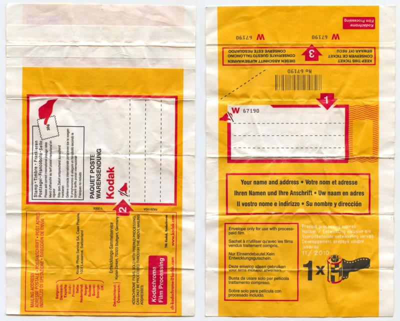
</a>

#### [K-14] Kodak Kodachrome II (ref: 2caa)

```
Format: 828          |  Process : K-14    
ISO   : 25           |  Expiry  : 1965-11 
Type  : Single Pack  |  Quantity: N/A     
Added : 2026-04-07   |  Author  : Tallbird Cowboy
UUID  : 9f12faa621fe4c06919086dcec7c2caa
```

<a href="./archive/00537_000.jpg" target="_blank">
	
</a>


`UUID: 77473d75388148a2a9d3d4cf881d7047`↓

<a href="./archive/00537_001.jpg" target="_blank">
	
</a>


`UUID: fe93855a558c4a649fc6c953e1e5c221`↓

<a href="./archive/00537_002.jpg" target="_blank">
	
</a>

#### [K-14] Kodak Kodachrome II (ref: 0982)

```
Format: 828          |  Process : K-14    
ISO   : 25           |  Expiry  : 1968-01 
Type  : Single Pack  |  Quantity: 12exp   
Added : 2025-10-21   |  Author  : dekuNukem
UUID  : b9c0bacb3ac64fc6bb46b1e728710982
```

<a href="./archive/00441_000.jpg" target="_blank">
	
</a>


`UUID: 9f37569423ef4a36aa7a1c15976f0b2e`↓

<a href="./archive/00441_001.jpg" target="_blank">
	
</a>


`UUID: 54a70d5cac414623925c05d402aa1df7`↓

<a href="./archive/00441_002.jpg" target="_blank">
	
</a>


`UUID: 60d2979073e4417c9511260b6d004d8c`↓

<a href="./archive/00441_003.jpg" target="_blank">
	
</a>


`UUID: b776358cf6654afc867da7efc26e681b`↓

<a href="./archive/00441_004.jpg" target="_blank">
	
</a>

#### [Unknown] Agfa AgfaColor CT 18 (ref: 1fef)

```
Format: 35mm         |  Process : Unknown 
ISO   : 50           |  Expiry  : 1967-07 
Type  : Single Pack  |  Quantity: 20exp   
Added : 2025-08-30   |  Author  : dekuNukem
UUID  : 0e445a9b612a487b90df4e94a3831fef
```

<a href="./archive/00272_000.jpg" target="_blank">
	
</a>


`UUID: a873cb888fb747898307b01aefc735f5`↓

<a href="./archive/00272_001.jpg" target="_blank">
	
</a>


`UUID: 9b5f0876d6bb4d049b1a352116b1edfa`↓

<a href="./archive/00272_002.jpg" target="_blank">
	
</a>


`UUID: 60fd9b682b714bda937f1489895e3f04`↓

<a href="./archive/00272_003.jpg" target="_blank">
	
</a>


`UUID: b2c42b0d1fca464e8813d18e3e709abe`↓

<a href="./archive/00272_004.jpg" target="_blank">
	
</a>


`UUID: 92d1c329ca9c4714bfe7ae4ccca5cc86`↓

<a href="./archive/00272_005.jpg" target="_blank">
	
</a>


`UUID: bb549196d49a4992afdb1a15e70f51b8`↓

<a href="./archive/00272_006.jpg" target="_blank">
	
</a>

#### [Unknown] Agfa Agfacolor Reversal Film CK (ref: 3502)

```
Format: 35mm         |  Process : Unknown 
ISO   : 80           |  Expiry  : 1969-03 
Type  : Single Pack  |  Quantity: 36exp   
Added : 2025-10-21   |  Author  : dekuNukem
UUID  : 9129d9db8e114656a58fd2a422b43502
```

<a href="./archive/00444_000.jpg" target="_blank">
	
</a>


`UUID: 5d631a69e3e048208c70ec8f859c6045`↓

<a href="./archive/00444_001.jpg" target="_blank">
	
</a>


`UUID: 68d8ba930ba94a23bcc2c63cd9eb85d0`↓

<a href="./archive/00444_002.jpg" target="_blank">
	
</a>


`UUID: 704456920a9943f6bb8a6527d730503c`↓

<a href="./archive/00444_003.jpg" target="_blank">
	
</a>


`UUID: d777eafbaf03482ca3766210fa8d0e47`↓

<a href="./archive/00444_004.jpg" target="_blank">
	
</a>


`UUID: 38c2b3a21696430db60ee99a8c55eb0b`↓

<a href="./archive/00444_005.jpg" target="_blank">
	
</a>


`UUID: accd90cdf18945939b51da0450c76fa7`↓

<a href="./archive/00444_006.jpg" target="_blank">
	
</a>


`UUID: c4b98fe88f5144df9629f289423fe72e`↓

<a href="./archive/00444_007.jpg" target="_blank">
	
</a>

#### [Unknown] Agfa Agfacolor Special Negative Film CN S (ref: 1e83)

```
Format: 120          |  Process : Unknown 
ISO   : 80           |  Expiry  : 1971-01 
Type  : Single Pack  |  Quantity: Unknown 
Added : 2025-10-21   |  Author  : dekuNukem
UUID  : 2e99ee5a9888408093d6983ed9871e83
```

<a href="./archive/00439_000.jpg" target="_blank">
	
</a>


`UUID: 019691600c184b2e8e1128dc6207790f`↓

<a href="./archive/00439_001.jpg" target="_blank">
	
</a>


`UUID: 7950cdc041654b77a36cee356ebc02b8`↓

<a href="./archive/00439_002.jpg" target="_blank">
	
</a>

#### [Unknown] Agfa Agfacolor Umkehr-Ultra T (ref: 01db)

```
Format: 35mm         |  Process : Unknown 
ISO   : Unknown      |  Expiry  : Unknown 
Type  : Single Pack  |  Quantity: 20exp   
Added : 2025-10-07   |  Author  : Pelicram
UUID  : b79dcd08bc514df3982630e3401f01db
```

<a href="./archive/00380_000.jpg" target="_blank">
	
</a>

#### [Unknown] Famous Brand Labs Color Negative Film (ref: b271)

```
Format: 127          |  Process : Unknown 
ISO   : 80           |  Expiry  : 1970-08 
Type  : Single Pack  |  Quantity: N/A     
Added : 2025-10-25   |  Author  : dekuNukem
UUID  : 60accb18d36a4358b857d58e5f91b271
Notes : Made in Belgium
```

<a href="./archive/00452_000.jpg" target="_blank">
	
</a>


`UUID: 446f576effb34b8c9697e27a7dcbd109`↓

<a href="./archive/00452_001.jpg" target="_blank">
	
</a>


`UUID: 853499e631474d46b5d2d65e937f6ebd`↓

<a href="./archive/00452_002.jpg" target="_blank">
	
</a>

#### [Unknown] Famous Brand Labs Color Negative Film (ref: 0cd6)

```
Format: 127          |  Process : Unknown 
ISO   : 64           |  Expiry  : 1971-06 
Type  : Single Pack  |  Quantity: N/A     
Added : 2025-10-21   |  Author  : dekuNukem
UUID  : 1c73b3f95ae14be5ab9a506ac83a0cd6
```

<a href="./archive/00434_000.jpg" target="_blank">
	
</a>


`UUID: c36b6fd7f2b84c8c804db6b318563ece`↓

<a href="./archive/00434_001.jpg" target="_blank">
	
</a>


`UUID: f1b06cc535f346edbc6c46be4b11c79a`↓

<a href="./archive/00434_002.jpg" target="_blank">
	
</a>

#### [Unknown] Film Corporation of America TriFCA 120 (ref: d024)

```
Format: 120          |  Process : Unknown 
ISO   : 80           |  Expiry  : 1976-10 
Type  : Single Pack  |  Quantity: N/A     
Added : 2025-09-18   |  Author  : dekuNukem
UUID  : 6041b4bb7a8149ee98f4b7e3b80ad024
```

<a href="./archive/00347_000.jpg" target="_blank">
	
</a>


`UUID: d82edd4e175246df8a163421cbf276fe`↓

<a href="./archive/00347_001.jpg" target="_blank">
	
</a>


`UUID: f59f27c936cf4c98bfd8fb480a56f858`↓

<a href="./archive/00347_002.jpg" target="_blank">
	
</a>


`UUID: 9d3c5d4e5a1948cc86a38226b1a51dc4`↓

<a href="./archive/00347_003.jpg" target="_blank">
	
</a>


`UUID: 42849bf6f7684843ab2f412fadcd58e8`↓

<a href="./archive/00347_004.jpg" target="_blank">
	
</a>

#### [Unknown] Film Corporation of America TriFCA 120 (ref: 9937)

```
Format: 120          |  Process : Unknown 
ISO   : 80           |  Expiry  : Unknown 
Type  : Single Pack  |  Quantity: N/A     
Added : 2025-09-18   |  Author  : dekuNukem
UUID  : 49fdf7859f354d85933ce875998c9937
Notes : Expiry is probably later than the other one, due to the increase of the processing cost.
```

<a href="./archive/00348_000.jpg" target="_blank">
	
</a>


`UUID: 6ecc1d182bf8420d9d0c02e83bda565d`↓

<a href="./archive/00348_001.jpg" target="_blank">
	
</a>


`UUID: 273677a3c51140c781c4f2bcc7da1ce3`↓

<a href="./archive/00348_002.jpg" target="_blank">
	
</a>


`UUID: 98f8c5fced3c41198779e0bc6342b785`↓

<a href="./archive/00348_003.jpg" target="_blank">
	
</a>


`UUID: 1ea1b9e629554579aa058a12e7d4c721`↓

<a href="./archive/00348_004.jpg" target="_blank">
	
</a>


`UUID: 1d879777e90646b7958f04a7b03c4569`↓

<a href="./archive/00348_005.jpg" target="_blank">
	
</a>

#### [Unknown] Film Corporation of America TriFCA 35 (ref: 8f0a)

```
Format: 35mm         |  Process : Unknown 
ISO   : 80           |  Expiry  : 1976-08 
Type  : Single Pack  |  Quantity: 20exp   
Added : 2025-10-02   |  Author  : dekuNukem
UUID  : a3346f80db3b4032a2c69665f7448f0a
```

<a href="./archive/00362_000.jpg" target="_blank">
	
</a>


`UUID: fc5bf25a0e624483a581e4171fb368e1`↓

<a href="./archive/00362_001.jpg" target="_blank">
	
</a>


`UUID: ced4b9758b32450183e2359abbb2dd8a`↓

<a href="./archive/00362_002.jpg" target="_blank">
	
</a>


`UUID: 7527ca56668c467386813a8357601289`↓

<a href="./archive/00362_003.jpg" target="_blank">
	
</a>


`UUID: 8c332dbe2d0f4a6389bbcbc8eb93e0aa`↓

<a href="./archive/00362_004.jpg" target="_blank">
	
</a>


`UUID: c893ed2ea45f4220b7e8c463a3621b6d`↓

<a href="./archive/00362_005.jpg" target="_blank">
	
</a>

#### [Unknown] GAF Color Slide Film (ref: 6815)

```
Format: 35mm         |  Process : Unknown 
ISO   : 500          |  Expiry  : 1979-01 
Type  : Single Pack  |  Quantity: 20exp   
Added : 2025-10-17   |  Author  : @recycling.film
UUID  : b57e8c465ff94e02afa31d267b846815
```

<a href="./archive/00407_000.jpg" target="_blank">
	
</a>

#### [Unknown] Kodak Ektachrome 160 Movie Film Type A (ref: 8f62)

```
Format: Super 8      |  Process : Unknown 
ISO   : 160          |  Expiry  : 1980-11 
Type  : Single Pack  |  Quantity: 50ft    
Added : 2025-07-31   |  Author  : fine-seat
UUID  : 6032680a3aba41b39c600d7e23998f62
```

<a href="./archive/00154_000.jpg" target="_blank">
	
</a>


`UUID: 28c6f19bd37e4199a072687d11b19961`↓

<a href="./archive/00154_001.jpg" target="_blank">
	
</a>


`UUID: 5d06a8833e0e44e8ab8d53bc0ce11095`↓

<a href="./archive/00154_002.jpg" target="_blank">
	
</a>


`UUID: 870ff01807e949a7b361cdad01dddf7f`↓

<a href="./archive/00154_003.jpg" target="_blank">
	
</a>


`UUID: 31df442b386446679540b0cf52c92fd7`↓

<a href="./archive/00154_004.jpg" target="_blank">
	
</a>

#### [Unknown] Kodak Ektachrome 64 (ref: 07c0)

```
Format: 110          |  Process : Unknown 
ISO   : 64           |  Expiry  : 1979-10 
Type  : Single Pack  |  Quantity: 20exp   
Added : 2025-01-04   |  Author  : dekuNukem
UUID  : 8131d8c6fbf14016be9c17a2586b07c0
```

<a href="./archive/00025_000.jpg" target="_blank">
	
</a>

#### [Unknown] Kodak Ektachrome-X (ref: cca3)

```
Format: 120          |  Process : Unknown 
ISO   : 64           |  Expiry  : 1974-03 
Type  : Single Pack  |  Quantity: N/A     
Added : 2026-05-26   |  Author  : Greg    
UUID  : 109f05cb335c476a8b019d13347ccca3
```

<a href="./archive/00574_000.jpg" target="_blank">
	
</a>

#### [Unknown] Kodak High Speed Ektachrome (ref: fe39)

```
Format: 120          |  Process : Unknown 
ISO   : 160          |  Expiry  : 1973-09 
Type  : Single Pack  |  Quantity: N/A     
Added : 2026-04-13   |  Author  : @ob.skura
UUID  : d6df7ff94eb54de292068cb45080fe39
```

<a href="./archive/00543_000.jpg" target="_blank">
	
</a>


`UUID: af73630d2fa7497bb84299a4706ed0da`↓

<a href="./archive/00543_001.jpg" target="_blank">
	
</a>


`UUID: f4278cfd7eea4c7a8f07251385bf4745`↓

<a href="./archive/00543_002.jpg" target="_blank">
	
</a>

#### [Unknown] Kodak High Speed Ektachrome (ref: c335)

```
Format: 120          |  Process : Unknown 
ISO   : 160          |  Expiry  : 1974-10 
Type  : Single Pack  |  Quantity: N/A     
Added : 2026-05-26   |  Author  : Greg    
UUID  : 4dc3f1e6a10842dbb0b1ac038b5ac335
```

<a href="./archive/00573_000.jpg" target="_blank">
	
</a>

#### [Unknown] Kodak High Speed Ektachrome (ref: 7533)

```
Format: 120          |  Process : Unknown 
ISO   : 125          |  Expiry  : 1977-01 
Type  : Single Pack  |  Quantity: N/A     
Added : 2025-09-06   |  Author  : kaimon  
UUID  : ac9eab85f0874cf7aa5c67f0458e7533
Notes : Tungsten (3200K) EHB 120
```

<a href="./archive/00303_000.jpg" target="_blank">
	
</a>


`UUID: 304a86e18bd841ee86c30538fe4e1940`↓

<a href="./archive/00303_001.jpg" target="_blank">
	
</a>


`UUID: 00e9096cb514470d8c00d2f66a652286`↓

<a href="./archive/00303_002.jpg" target="_blank">
	
</a>

#### [Unknown] Northwest Custom Film Processing Ultra Minituature Film (ref: 70b1)

```
Format: Unknown      |  Process : Unknown 
ISO   : 64           |  Expiry  : Unknown 
Type  : Single Pack  |  Quantity: 20exp   
Added : 2025-10-21   |  Author  : dekuNukem
UUID  : e01d49f304864a7d95976d57624370b1
Notes : There was a roll of 127 ekfe R100 inside, not sure if it's the original, or someone put it there afterwards.
```

<a href="./archive/00425_000.jpg" target="_blank">
	
</a>


`UUID: 273b6c40428c40acb9fee444125a0426`↓

<a href="./archive/00425_001.jpg" target="_blank">
	
</a>


`UUID: adc9a88efca146d687fba7dcb75501f0`↓

<a href="./archive/00425_002.jpg" target="_blank">
	
</a>

#### [Unknown] ORWO Chrom UT18 (ref: 81b7)

```
Format: 35mm         |  Process : Unknown 
ISO   : 50           |  Expiry  : Unknown 
Type  : Single Pack  |  Quantity: 36exp   
Added : 2025-10-17   |  Author  : @recycling.film
UUID  : d82a8047531f4e4bbdfe4c0bb95c81b7
```

<a href="./archive/00408_000.jpg" target="_blank">
	
</a>


`UUID: 1515034bddc345419da08ea6a497ee34`↓

<a href="./archive/00408_001.jpg" target="_blank">
	
</a>


`UUID: 062fdd558f6c48fda2979f72c7443cad`↓

<a href="./archive/00408_002.jpg" target="_blank">
	
</a>


`UUID: acc4b02a5b2d422ebda7149636e817b3`↓

<a href="./archive/00408_003.jpg" target="_blank">
	
</a>


`UUID: 437046f79d2141bfb2af8247bc1a6ba3`↓

<a href="./archive/00408_004.jpg" target="_blank">
	
</a>

#### [Unknown] ORWO Chrom UT21 (ref: 3fd5)

```
Format: 35mm         |  Process : Unknown 
ISO   : 100          |  Expiry  : 1991-05 
Type  : Single Pack  |  Quantity: 24exp   
Added : 2025-09-28   |  Author  : fine-seat
UUID  : e3f739b7106044949b4f101684ad3fd5
```

<a href="./archive/00359_000.jpg" target="_blank">
	
</a>


`UUID: a9dd1ce04a364ba9bf0610b68b3d3b89`↓

<a href="./archive/00359_001.jpg" target="_blank">
	
</a>


`UUID: 357b9379dea24d16b611aaf25ccdcd04`↓

<a href="./archive/00359_002.jpg" target="_blank">
	
</a>


`UUID: 27c54d7248cb4d858c6773bc29ec69a3`↓

<a href="./archive/00359_003.jpg" target="_blank">
	
</a>


`UUID: 1340536f2f4b408a9129dea625da8168`↓

<a href="./archive/00359_004.jpg" target="_blank">
	
</a>

#### [Unknown] ORWO NC 19 (ref: dca5)

```
Format: 120          |  Process : Unknown 
ISO   : 64           |  Expiry  : 1978-11 
Type  : Single Pack  |  Quantity: N/A     
Added : 2026-03-02   |  Author  : Luci 101
UUID  : a1dea49e29ae412596b2b691ac3bdca5
```

<a href="./archive/00533_000.jpg" target="_blank">
	
</a>


`UUID: bea59b338851477b94e939e80f50b2f2`↓

<a href="./archive/00533_001.jpg" target="_blank">
	
</a>


`UUID: bc8f4df82be8463eb5744d8728eb967b`↓

<a href="./archive/00533_002.jpg" target="_blank">
	
</a>


`UUID: 40cf1acc36ad41898c60646b8c61b855`↓

<a href="./archive/00533_003.jpg" target="_blank">
	
</a>


`UUID: f7a0a295907541368829aa36192b0ede`↓

<a href="./archive/00533_004.jpg" target="_blank">
	
</a>

#### [Unknown] ORWO OrwoColor UT13 (ref: a05d)

```
Format: 8mm          |  Process : Unknown 
ISO   : 16           |  Expiry  : 1971-10 
Type  : Single Pack  |  Quantity: 7.5m    
Added : 2026-05-26   |  Author  : Luci 101
UUID  : e7ff421fe76940efb7c727d4ffa6a05d
```

<a href="./archive/00567_000.jpg" target="_blank">
	
</a>


`UUID: 256ee695209049f9ac2dc59ca5050d62`↓

<a href="./archive/00567_001.jpg" target="_blank">
	
</a>


`UUID: b2db8d01c3814c3fbba583de1dd4c40b`↓

<a href="./archive/00567_002.jpg" target="_blank">
	
</a>


`UUID: 58998f5a2b9b4a6c858dd018ff39d2cb`↓

<a href="./archive/00567_003.jpg" target="_blank">
	
</a>


`UUID: bbe200fbd9b043a6824d899f556e2651`↓

<a href="./archive/00567_004.jpg" target="_blank">
	
</a>


`UUID: f8414c9045084fed9143b5ed262db46f`↓

<a href="./archive/00567_005.jpg" target="_blank">
	
</a>


`UUID: d1620311aaa6413cbdd0fe506f38e8cd`↓

<a href="./archive/00567_006.jpg" target="_blank">
	
</a>


`UUID: 5acaacb7d6f44b8db4833f94fc496345`↓

<a href="./archive/00567_007.jpg" target="_blank">
	
</a>


`UUID: 243bdcfc9037400a841215bde0e5f5c1`↓

<a href="./archive/00567_008.jpg" target="_blank">
	
</a>


`UUID: 87a8af10c93a4dbba9accf8bf7c5413e`↓

<a href="./archive/00567_009.jpg" target="_blank">
	
</a>


`UUID: 3cdf8b9ef19541dca4ac9161ec1a4332`↓

<a href="./archive/00567_010.jpg" target="_blank">
	
</a>


`UUID: 09e49f5c233746daba9dfc6a30560007`↓

<a href="./archive/00567_011.jpg" target="_blank">
	
</a>

#### [Unknown] ORWO UK 17 (ref: 19a0)

```
Format: 8mm          |  Process : Unknown 
ISO   : 40           |  Expiry  : 1989-05 
Type  : Single Pack  |  Quantity: 7.5m    
Added : 2026-06-24   |  Author  : Luci 101
UUID  : cba0bd2a5ffd43c38164a5e9a2f719a0
```

<a href="./archive/00644_000.jpg" target="_blank">
	
</a>


`UUID: deb198cc152945e6bbae1b7744b025e1`↓

<a href="./archive/00644_001.jpg" target="_blank">
	
</a>


`UUID: 6b199b64e4254322be23a8f8fa6c0431`↓

<a href="./archive/00644_002.jpg" target="_blank">
	
</a>


`UUID: d2e91c708e4b4238a14592852d6efddf`↓

<a href="./archive/00644_003.jpg" target="_blank">
	
</a>


`UUID: f013eceab9d04aadaf18c831d872c365`↓

<a href="./archive/00644_004.jpg" target="_blank">
	
</a>


`UUID: f6f02f751669490c950960c0320f9166`↓

<a href="./archive/00644_005.jpg" target="_blank">
	
</a>


`UUID: 5a476f294a8248f4b9b7b30c8eea9de9`↓

<a href="./archive/00644_006.jpg" target="_blank">
	
</a>


`UUID: 48fccd412b844d60b070182826cdaeb8`↓

<a href="./archive/00644_007.jpg" target="_blank">
	
</a>

#### [Unknown] ORWO UP 27 DS 8 (ref: 4d5a)

```
Format: 8mm          |  Process : Unknown 
ISO   : 400          |  Expiry  : 1983-11 
Type  : Single Pack  |  Quantity: 10m     
Added : 2026-06-24   |  Author  : Luci 101
UUID  : b009e5b8edc4410da0efdcc563624d5a
```

<a href="./archive/00645_000.jpg" target="_blank">
	
</a>


`UUID: 83c559fc31a54302abdca7e453c2c199`↓

<a href="./archive/00645_001.jpg" target="_blank">
	
</a>


`UUID: 12b9144a733040cd98b4bc777edb8ada`↓

<a href="./archive/00645_002.jpg" target="_blank">
	
</a>


`UUID: 7159606d395544acaf3c2165bff483bb`↓

<a href="./archive/00645_003.jpg" target="_blank">
	
</a>


`UUID: cd691432ee7647dc957113b53761fc22`↓

<a href="./archive/00645_004.jpg" target="_blank">
	
</a>


`UUID: 40a58b7e988545bf92632d63444d5882`↓

<a href="./archive/00645_005.jpg" target="_blank">
	
</a>

#### [Unknown] PrinzColor Colour Negative Film (ref: 448c)

```
Format: 35mm         |  Process : Unknown 
ISO   : 80           |  Expiry  : 1975-10 
Type  : Single Pack  |  Quantity: 20exp   
Added : 2025-10-02   |  Author  : dekuNukem
UUID  : 1d1377fcb4fa495e9f3009a4c69b448c
```

<a href="./archive/00363_000.jpg" target="_blank">
	
</a>


`UUID: 95f013bdd442471d9258bb0cc8eb77fc`↓

<a href="./archive/00363_001.jpg" target="_blank">
	
</a>


`UUID: a29f494b970044eab313b00b12096cf3`↓

<a href="./archive/00363_002.jpg" target="_blank">
	
</a>


`UUID: 2672ff6891f14e44b7f3077a501ae234`↓

<a href="./archive/00363_003.jpg" target="_blank">
	
</a>


`UUID: 4e513a5356fb4b3e8bbc3b0d6ae62543`↓

<a href="./archive/00363_004.jpg" target="_blank">
	
</a>

#### [Unknown] Robot NR-Cassette (ref: bc7a)

```
Format: 35mm         |  Process : Unknown 
ISO   : Unknown      |  Expiry  : Unknown 
Type  : Single Pack  |  Quantity: N/A     
Added : 2025-10-12   |  Author  : dekuNukem
UUID  : 55a2616da3a9456a90f763ed8ac5bc7a
```

<a href="./archive/00384_000.jpg" target="_blank">
	
</a>

#### [Unknown] Triple-Print Film Labs Color Negative Film (ref: 88e6)

```
Format: 127          |  Process : Unknown 
ISO   : 80           |  Expiry  : 1976-02 
Type  : Single Pack  |  Quantity: N/A     
Added : 2025-10-21   |  Author  : dekuNukem
UUID  : 25dfa3f80baf4a72ac548c507f8088e6
Notes : Division of Film Corporation of America
```

<a href="./archive/00427_000.jpg" target="_blank">
	
</a>


`UUID: 9047ef27d1be40198e23acb1b7adba39`↓

<a href="./archive/00427_001.jpg" target="_blank">
	
</a>


`UUID: e76e6347947f40ba97b0e11522ce7144`↓

<a href="./archive/00427_002.jpg" target="_blank">
	
</a>

## Want to Contribute?

[Check out the guidelines!](../contribution_guide.md)

## Contributor List

```
Rank  Username                      Contributions
--------------------------------------------------
1     dekuNukem                     339   
2     Luci 101                      100   
3     @photos.by.qi                 72    
4     Pelicram                      71    
5     @ellafridalindblom            67    
6     @recycling.film               66    
7     @Hol.m35                      62    
8     nyctomanica                   57    
9     Mauphoto                      28    
10    Dialupdude                    27    
11    The Compartmentalist          25    
12    @ob.skura                     19    
13    fine-seat                     19    
14    Camera.Riley                  19    
15    kaimon                        19    
16    Nano_Burger                   18    
17    toader                        17    
18    waldoboro                     16    
19    Chrisbes                      16    
20    yc128                         14    
21    b0baspace                     14    
22    @SirBrentsworth               13    
23    benikum                       12    
24    u/ReeeSchmidtyWerber          11    
25    @zruk_ts                      10    
26    minidiscus                    10    
27    lilyu.xyz                     9     
28    lt_col_tall                   9     
29    @toastergod101                7     
30    @filmfotofella                7     
31    GreatGizmo74                  6     
32    nick                          6     
33    Greg                          6     
34    Kraksen                       5     
35    @gregrouxphotography          5     
36    Henry Gunn                    4     
37    TheSelousScout                4     
38    @sachynmital                  3     
39    Tallbird Cowboy               3     
40    robo-tobo                     3     
41    @seklerek                     2     
42    @ftfilmphotos                 2     
43    Tobias                        2     
44    @tylerdrey                    2     
45    Yrikonchik                    1     
46    @ad.astra.per.aspera.1894     1     
47    Aoi Yuki                      1     
48    lemoniter                     1     
49    @shotbyliampewpew             1     
```

## Questions or Comments?

Get in touch by joining [the Discord chatroom](https://discord.gg/yvBx7dVG4B), or `email skate.huddle-6r@icloud.com` !

## Back to Home Page

[Click me](../README.md)

